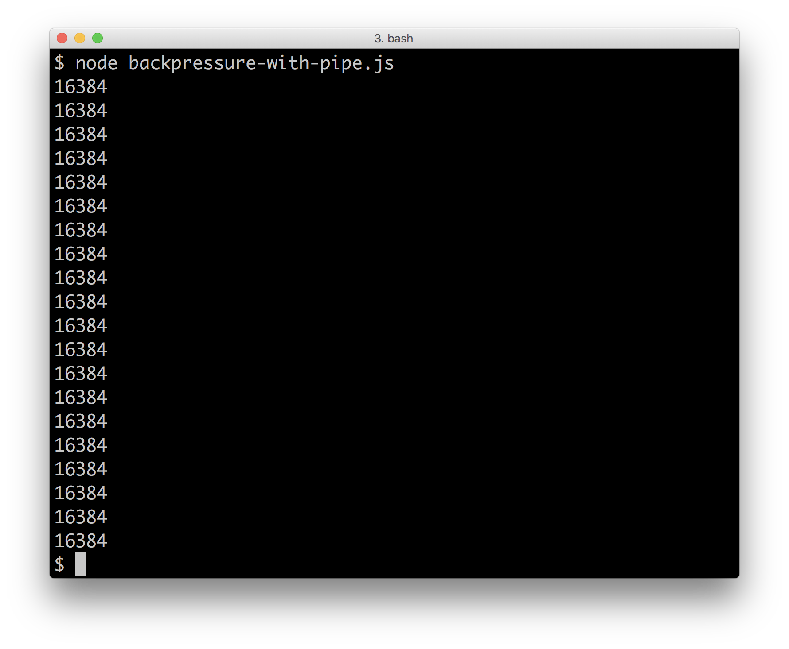

# 4 Using Streams

This chapter covers the following topics

* Processing big data
* Using the pipe method
* Piping streams in production
* Creating transform streams
* Creating Readable and Writable Streams
* Decoupling I/O

## Introduction

Streams are one of the best features in Node. They have been a big part of the ecosystem since the early days of Node and today thousands of modules exists on npm that help us compose all kinds of great stream based apps. They allow us to work with large volumes of data in environments with limited resources. In addition to that they help us decouple our applications by supplying a generic abstraction that most I/O patterns work with.

In this chapter we're going to explore why streams are such a valuable abstraction, how to safely compose streams together in a production environment, and convenient utilities to stream creation and management.

While this chapter is somewhat theoretical, the recipes contained are foundational to the rest of the book, throughout proceeding chapters streams are used regularly in practical examples. 

## Processing big data

Let's dive right into it by looking at a classic Node problem, counting all Node modules available on npm. The npm registry exposes an HTTP endpoint where we can get the entire contents of the npm registry content as JSON. 

Using the command line tool `curl` which is included (or at least installable) on most operating systems we can try it out.

```sh
$ curl https://skimdb.npmjs.com/registry/_changes?include_docs=true
```

This will print a new line delimited JSON stream of all modules.

The JSON stream returned by the registry contains a JSON object for each module stored on npm followed by a new line character.

A simple Node program that counts all modules could look like this:

``` js
var request = require('request')
var registryUrl = 'https://skimdb.npmjs.com/registry/_changes?include_docs=true'

request(registryUrl, function (err, data) {
  if (err) throw err
  var numberOfLines = data.split('\n').length + 1
  console.log('Total modules on npm: ' + numberOfLines)
})
```

If we try and run the above program we'll notice a couple of things.

First of all this program takes quite a long time to run. Second, depending on the machine we are using, there is a very good chance the program will crash with an "out of memory" error.

Why is this happening?

The npm registry stores a very large amount of JSON data, and it takes quite a bit of memory to buffer it all. 

In this recipe, we'll investigate how we can use streams to improve our program.

### Getting Ready

Let's create a folder called `self-read` with an `index.js` file. 

### How to do it

A good way to start understanding how streams work is to look at how Node core uses them.

The core `fs` module has a `createReadStream` method, let's use that to make
a read stream:

``` js
const fs = require('fs')
const rs = fs.createReadStream(__filename)
```

The `__filename` variable is provided by Node. It holds the absolute path
of the file currently being executed (in our case it will point to the `index.js` file in the `self-read` folder).

The first thing to notice is that this method appears to be synchronous.

Normally when we work with I/O in Node we have to provide a callback. 

Streams abstract this away by returning an object instance that represents the entire contents of the file. 

How do we get the file data out of this abstraction?

One way to extract data from a stream is by listening to the `data` event.
 
Let's attach a data listener that will be called every time a new small chunk of the file has been read.

``` js
rs.on('data', (data) => {
  console.log('Read chunk:', data)
})

rs.on('end', () => {
  console.log('No more data')
})
```

When we are done reading the file the stream will emit an `end` event. 

Let's try this out

```sh
$ node index.js
```

### How it works

Streams are bundled with Node core as a core module (the `stream`) module. Other parts of core such as `fs` rely on the `stream` module for their higher level interfaces. 

The two main stream abstractions are a readable stream and a writable stream.

In our case we use a readable stream (as provided by the `fs` module), to read our source file (`index.js`) a chunk at a time. Since our file is smaller than the maximum size per chunk (16KB), only one chunk is read. 

The `data` event is therefore only emitted once, and then the `end` event is emitted.

While the contents of `self-read/index.js` isn't considered
"big data", this data processing approach can scale 
potentially infinitely because the amount of memory used
by the process stays constant.

> #### Never use the core `stream` module directly
> As a rule, when we create streams we should avoid using
> the internal `stream` module directly. This is because
> the behavior (more so than the API) of streams can (and has) 
> changed between Node versions. While this is expected to occur
> less, or in a less impacting way in future, it's still safer to
> always use the `readable-stream` module instead. 
> The `readable-stream` module (for historical reasons) is very poorly name, it's the latest core `stream` module exposed as an npm
> module and it's compatible with all Node versions. This still doesn't quite cater to core module (like `fs`) that rely on the core `stream` module, nevertheless it's a best-effort practice to
avoid maintenance pain in the future.

> #### Streams Documentation 
> For more information about the different stream base classes checkout the Node stream documentation 
> at <https://nodejs.org/dist/latest-v8.x/docs/api/stream.html>

### There's more 

Let's take a look at different types of stream, the two modes that streams may operate under 
and the various streams events. We'll also see how Node streams are perfect for processing infinite data sets. 

#### Types of Stream

If we want to make a stream that provides data for other users to read we need to make a *Readable stream*. An example of a readable stream could be a stream that reads data from a file stored on disk.

If we want to make a stream that other users can write data to, we need to make a *Writable stream*. An example of a writable stream could be a stream that writes data to a file stored on disk.

> ##### Inspecting all core stream interfaces 
> Node core provides base implementations of all these variations of streams that we can extend to support various use cases. We can use the `node -p "require('stream')"` as a convenient way to take look at available stream implementations.

Sometimes you want to make a stream that is both readable and writable at the same time. We call these *Duplex streams*. An example of a duplex stream could be a TCP network stream that both allows us to read data from the network and write data back at the same time.

A special case of a duplex stream is a stream that transforms the data being written to it and makes the transformed data available to read out of the stream. We call these *Transform streams*. An example of a transform stream could be a gzip stream that compresses the input data written to it.

#### Processing infinite amounts of data

Using the `data` event we can process the file a small chunk of the time instead without using a lot of memory. For example, we may wish to count the number of bytes in a file.

Let's create a new folder called `infinite-read` with a `index.js`.

Assuming we are using a Unix-like machine we can try to tweak this example to count the number of bytes in `/dev/urandom`. This is an infinite file that contains random data.

Let's write the following into `index.js`:

```js
const rs = fs.createReadStream('/dev/urandom')
var size = 0

rs.on('data', (data) => {
  size += data.length
  console.log('File size:', size)
})
```

Now we can run our program:

```sh
$ node index.js
``` 

Notice that the program does not crash even though the file is infinite. It just keeps counting bytes!

Scalability is one of the best features about streams in general as most of the programs written using streams will scale well with any input size. 

#### Flow mode vs pull-based streaming

A Node stream can be in either non-flowing (pulling)
or flowing (pushing) mode. When we attach a `data` event
to a stream it enters flowing mode, which means as long 
as there is data, the `data` event will be called. 

```js
myStream.on('data', handlerFunction) 
```

In the prior example snippet, if `myStream` was just created 
(and therefore a non-flowing stream by default) it would have
been put into flowing mode via the act of attaching the `data`
event.

If we want to stop data flowing through the stream we can call the Readable streams `pause`
method, and when we want to start again we can call the `resume`
method.

```js
myStream.pause()
setTimeout(() => myStream.resume(), 1000)
```

In the previous example, if `myStream` was already in flowing mode, 
it would attempt to prevent incoming data when `pause` was called. 
A second later `myStream` would notify incoming streams that it can 
receive data again.  

See the **There's More** section of the **Decoupling I/O** 
recipe for a full example and in depth explanation.

Flowing-mode can be problematic, since there are scenarios where
the stream may be overwhelmed by incoming data - even if the
stream is paused incoming streams may disrespect the paused status.

An alternative way to extract data from a stream is to 
wait for a `readable` event and then continually call the
streams `read` method until it returns `null` (which is
the stream terminator entity). In this way we *pull* data
from the stream, and can simply stop pulling if necessary. 

In other words, we don't need to instruct the stream to pause
and then resume, we can simply stop and start pulling as required.

Let's copy the `self-read` folder from the main recipe to 
`self-read-pull`:

```sh
$ cp -fr self-read self-read-pull
```

Now we'll modify `index.js to look like so:

```js
const fs = require('fs')
const rs = fs.createReadStream(__filename)

rs.on('readable', () => {
  var data = rs.read()
  while (data !== null) {
    console.log('Read chunk:', data)
    data = rs.read()
  }
})

rs.on('end', () => {
  console.log('No more data')
})
```

Now we're pulling data from the stream instead of it 
being pushed to an event handler. The `readable` event 
may trigger multiple times, as data becomes available,
and once there's no data available the `read` method 
returns `null`.

The better way to extract data from a stream is to pipe
(or as we'll see in later recipes, `pump`) the data into 
a stream which we've created. This way the problems
with managing memory are managed internally. We'll cover 
using `pipe` in the next recipe.

#### Understanding stream events

All streams inherit from EventEmitter and emit a series of different events. When working with streams it is a good idea to understand some of the more important events being emitted. Knowing what each event means will make debugging streams a lot easier.

* `data` Emitted when new data is read from a readable stream. The data is provided as the first argument to the event handler. Beware that unlike other event handlers attaching a data listener has side effects. When the first data listener is attached our stream will be unpaused. We should never emit `data` ourselves. Instead, we should always use the `push` function instead.

* `end` Emitted when a readable stream has no more data available AND all available data has been read. We should never emit `end` ourselves, instead we should pass `null` to `push` to signifiy
end of data.

* `finish` Emitted when a writable stream has been ended AND all pending writes has been completed. Similar to the above events you should never emit `finish` yourself. Use `end()` to trigger finish manually pipe a readable stream to it.

* `close` Loosely defined in the stream docs, `close` is usually emitted when the stream is fully closed. Contrary to `end` and `finish` a stream is *not* guaranteed to emit this event. It is fully up to the implementer to do this.

* `error` Emitted when a stream has experienced an error. Tends to followed by a `close` event although, again, no guarantees that this will happen.

* `pause` Emitted when a readable stream has been paused. Pausing will happen when either backpressure happens or if the `pause` method is explicitly called. For most use cases you can just ignore this event although it is useful to listen for, for debugging purposes sometimes. See the **There's More** section of the **Decoupling I/O** recipe for an example of backpressure and
pause usage.

* `resume` Emitted when a readable stream goes from being paused to being resumed again. Will happen when the writable stream you are piping to has been drained or if `resume` has been explicitly called. See the **There's More** section of the **Decoupling I/O** recipe for an example of resume usage.

### See also

* *Using the pipe method* in this chapter
* *Piping streams in production* in this chapter
* *Decoupling I/O* in this chapter
* *Receiving POST Data* in **Chapter 5 Wielding Web Protocols**

## Using the pipe method

A pipe is used to connect streams together. DOS and Unix-like shells use the vertical bar (|) to pipe the output of one program to another; we can chain several pipes together to process and massage data in number of ways. 

Likewise, the Streams API affords us the `pipe` method to channel data through multiple streams. Every readable stream has a pipe method that expects a writable stream (the destination) as its first parameter.

In this recipe we're going to pipe several streams together.

### Getting Ready

Let's create a folder called `piper`, initialize it as a package,
and install `tar-map-stream`, and create an `index.js` file: 

```sh
$ mkdir piper
$ cd piper
$ npm init -y
$ npm install tar-map-stream
$ touch index.js
```

### How to do it

In our `index.js` file let's begin by requiring 
the dependencies we'll be using to create various streams:

```js
const zlib = require('zlib')
const map = require('tar-map-stream')
```

Let's imagine we want to take the gzipped tarball of the very first available
version of Node, and change all the file paths in that tarball, as well 
as altering the `uname` (owner user) and `mtime` (modified time) fields
of each file.

Let's create some streams we'll be using to do that:


```js
const decompress = zlib.createGunzip()
const whoami = process.env.USER || process.env.USERNAME
const convert = map((header) => {
  header.uname = whoami
  header.mtime = new Date()
  header.name = header.name.replace('node-v0.1.100', 'edon-v0.0.0')
  return header
})
const compress = zlib.createGzip()
```

Finally we'll set up the pipeline:

```js
process.stdin
  .pipe(decompress)
  .pipe(convert)
  .pipe(compress)
  .pipe(process.stdout)
```

> #### Don't use `pipe` in production! 
> For most cases, `pipe` should be avoided in a production
> server context. Instead we recommend `pump`, see the next
> recipe in this chapter for more. 

We can use our program like so:

```sh
$ curl https://nodejs.org/dist/v0.1.100/node-v0.1.100.tar.gz | node index.js > edon.tar.gz
```

We can list the contents of the tar archive to ensure the paths 
and stats are updated like so:

```sh
$ tar -tvf edon.tar.gz
```

### How it works

The `pipe` method attaches a `data` event listener to 
the source stream (the stream on which `pipe` is called),
which writes incoming data to the destination stream 
(the stream that was passed into `pipe`).

When we string several streams together with the `pipe` method
we're essentially instructing Node to shuffle data through
those streams.  

Using `pipe` is safer than using `data` events and then 
writing to another stream directly, because it also handles
backpressure for free. Backpressure has to be applied to 
source streams that process data faster than destination 
streams, so that the destination streams memory doesn't 
grow out of control due to a data back log.

> #### Backpressure 
> Backpressure is an opposition to flow to some incoming feed
> (of gas, liquid, or in our case data). It occurs (or should occur) 
> when a systems limitations are exceeded by the input. In the case of streams
> we're referring to a memory management capability, where the amount of in-process
> memory is kept at a constant by holding data in the external pipeline. For instance,
> if we're reading from disk we simply keep that data on disk until we need read an
> individual chunk. In this case backpressure is trivial. However there are other cases,
> say a stream which rapidly generates data which may overwhelm a slower write stream. 
> In these cases a backpressure strategy is required to prevent memory from filling up 
> and the process from crashing. The `pipe` method provides this backpressure. 

Our recipe uses five streams, and creates three of them.
The `process.stdin` and `process.stdout` streams connect
with the terminal STDIN and STDOUT interfaces respectively.
This is what allows us to pipe from the `curl` command to our 
program and the redirect output to the `edon.tar.gz` file. 

The `compress` and `decompress` streams are created with the 
core `zlib` module, using the `createGunzip` and `createGzip`
methods, which return transform streams. A transform stream has
both readable and writable interfaces, and will mutate the data
in some way as it flows through the pipeline.

The final `convert` stream is also a transform stream that's
generated by the `tar-map-stream` module - which we assigned to
`map`. When we call `map` it returns a stream that can parse
a tar archive and call a function with the header 
information of each file in the archive. Whatever we return 
from from the function supplied to `map` will become the new
header information for the tar archive. 

So when we use  `curl` to fetch the first available version 
of Node, we use a Unix pipe (`|`) to shuffle the data from 
`curl` into our program. This data comes in through the `process.stdin`
stream, and is passed on to the `decompress` stream. The `decompress` stream
understands the GZIP format and deflates the content accordingly. It propagates each decompressed chunk to the next stream: our `convert` stream.

The following illustrates the data flow between processes and disk, 
as well as the internal data flow within our Node process:


The `convert` stream incrementally parses the `tar` archive, calling 
our function every time a header is encountered, and then outputs content
in the same tar format with our modified headers. The `compress` stream 
gzips our new tar and then passes the data through the `process.stdout`
stream. Back on the command line we've used the IO redirect syntax (`>`)
to write the data into the `edon.tar.gz` file. 

### There's more

Let's take a look at the one option which can be passed to the 
`pipe` method. 

#### Keeping Piped Streams Alive

By default, when one stream is piped to another, the 
stream being piped to (the destination), is ended 
when the stream being piped from (the source) has ended.

Sometimes, we may want to make additional writes to a stream
when a source stream is complete. 

Let's create a folder called `pipe-without-end`, with two files,
`broken.js` and `index.js`:

```sh
$ mkdir pipe-without-end
$ cd pipe-without-end
$ touch broken.js
$ touch index.js
```

Let's put the following in `broken.js`:

```js
const net = require('net')
const fs = require('fs')

net.createServer((socket) => {
  const content = fs.createReadStream(__filename)
  content.pipe(socket)
  content.on('end', () => {
    socket.end('\n======= Footer =======\n')
  })
}).listen(3000)
```

Now let's start our broken server:

```sh
$ node broken.js
```

We can try out the TCP server in several ways, such as `telnet localhost 3000`
or with netcat `nc localhost 3000`, but even navigating a browser to
`http://localhost:3000`, or using `curl` will work. Let's use `curl`:

```sh
$ curl http://localhost:3000
```

This will cause our `broken.js` server to crash, with the error 
"Error: write after end". This is because when the `content` stream
ended, it also ended the `socket` stream. But we want to append a footer 
to the content when the `content` stream is ended.

Let's make our `index.js` look like this:

```js
const net = require('net')
const fs = require('fs')

net.createServer((socket) => {
  const content = fs.createReadStream(__filename)
  content.pipe(socket, {end: false})
  content.on('end', () => {
    socket.end('\n======= Footer =======\n')
  })
}).listen(3000)
```

Notice the second argument passed to pipe is an object with
`end` set to `false`. This instructs the `pipe` method to avoid 
ending the destination stream when a source stream ends. 

If we start our fixed server:

```sh
$ node index.js
```

And hit it with `curl`:

```sh
$ curl http://localhost:3000
```

We'll see our content, along with the footer, and the server stays alive.

### See also

* *Piping streams in production* in this chapter
* *Creating transform streams* in this chapter
* *Interfacing with standard I/O* in **Chapter 3 Coordinating I/O**
* *Making an HTTP POST request** in **Chapter 5 Wielding Web Protocols**
* *Creating an SMTP server* in **Chapter 5 Wielding Web Protocols**
* *Embedded Persistance with LevelDB * in **Chapter 6 Persisting to Databases**


## Piping streams in production

The `pipe` method is one of the most well known features of streams, it allows us to compose advanced streaming pipelines as a single line of code. 

As a part of Node core, we discussed the `pipe` method in the previous
recipe, and it can be useful for cases where process uptime isn't 
important (such as CLI tools).

Unfortunately, however, it lacks a very important feature: error handling. 

If one of the streams in a pipeline composed with `pipe` fails, the pipeline is simply "unpiped". It is up to us to detect the error and then afterwards destroy the remaining streams so they do not leak any resources. This can easily lead to memory leaks.

Let's consider the following example:

``` js
const http = require('http')
const fs = require('fs')

const server = http.createServer((req, res) => {
  fs.createReadStream('big.file').pipe(res)
})

server.listen(8080)
```

A simple, straight forward, HTTP server that serves a big file to its users. 

Since this server is using `pipe` to send back the file there is a big chance that this server will produce memory and file descriptor leaks while running. 

If the HTTP response were to close before the file has been fully streamed to the user (for instance, when the user closes their browser), we will leak a file descriptor and a piece of memory used by the file stream. The file stream stays in memory because it's never closed. 

We have to handle `error` and `close` events, and destroy other streams 
in the pipeline. This adds a lot of boilerplate, and can be difficult to 
cover all cases.  

In this recipe we're going to explore the `pump` module, which is built 
specifically to solve this problem.

### Getting Ready

Let's create a folder called `big-file-server`, with an `index.js`. 

We'll need to initialize the folder as a package, install the `pump`
module and create and `index.js` file: 

```sh
$ mkdir big-file-server
$ cd big-file-server
$ npm init -y 
$ npm install --save pump
$ touch index.js
```

We'll also need a big file, so let's create that quickly: 

```sh
$ node -e "process.stdout.write(crypto.randomBytes(1e9))" > big.file
```

### How to do it

We'll begin, in our `index.js` file, 
by requiring the `fs`, `http` and `pump` modules:

```js
const fs = require('fs')
const http = require('http')
const pump = require('pump')
```

Now let's create our HTTP server and `pump` instead of `pipe` our
big file stream to our response stream:

```js
const server = http.createServer((req, res) => {
  const stream = fs.createReadStream('big.file')
  pump(stream, res, done)
})

function done (err) {
  if (err) {
    return console.error('File was not fully streamed to the user', err)
  }
  console.log('File was fully streamed to the user')
}

server.listen(3000)
```

> #### Piping many streams with `pump` 
> If our pipeline has more than two streams 
we simply pass all of them to `pump`: `pump(stream1, stream2, stream3, ...)`.

Now let's run our server

```sh
$ node index.js
```

If we use `curl` and hit Ctrl+C before finishing the download,
we should be able to trigger the error state, with the server 
logging that the file was not fully streamed to the user. 

```sh
$ curl http://localhost:8080 # hit Ctrl + C before finish
```

### How it works

Every stream we pass into the `pump` function will be piped to the 
next (as per order of arguments passed into `pump`). If the last 
argument passed to `pump` is a function the `pump` module will call
that function when all streams have finished (or one has errored). 

Internally, `pump` attaches `close` and `error` handlers, and also
covers other esoteric cases where a stream in a pipeline may close 
without notifying other streams.

If one of the streams close, the other streams are destroyed and the 
callback passed to `pump` is called.

It is possible to handle this manually, but the boilerplate overhead
and potential for missed cases is generally unacceptable for production
code. 

For instance, here's our specific case from the recipe 
altered to handle the response closing:

```js
const server = http.createServer((req, res) => {
  const stream = fs.createReadStream('big.file')
  stream.pipe(res)
  res.on('close', () => {
    stream.destroy()
  })
})
```

If we multiply that by every stream in a pipeline, and then multiply it again
by every possible case (mostly `close` and `error` but also esoteric cases)
we end up with an extraordinary amount of boilerplate.

There are very few use cases where we want to use `pipe` 
(sometimes we want to apply manual error handling) instead 
of `pump` but generally for production purposes it's a lot safer to 
use `pump` instead `pipe`.

### There's more

Here's some other common things we can do with `pump`. 

#### Use `pumpify` to expose pipelines

When writing pipelines, especially as part of module, we might want to expose these pipelines to a user as a single entity.

So how do we do that? As described in the main recipe a pipeline consists of a series of transform streams. We write data to the first stream in the pipeline and the data flows through it until it is written to the final stream.

Let's consider the following:

```js
  pump(stream1, stream2, stream3)
```

If we were to expose the above pipeline to a user we would need to both return `stream1` and `stream3`. `stream1` is the stream a user should write the pipeline data to and `stream3` is the stream the user should read the pipeline results from. 

Since we only need to write to `stream1` and only read from `stream3` we could just combine to two streams into a new duplex stream that would then represent the entire pipeline.

The npm module `pumpify` does *exactly* this.

Let's create a folder called `pumpified-pipeline`, initialize it as a package,
install `pumpify`, `base64-encode-stream` and create an `index.js`:

```sh
$ mkdir pumpified-pipeline
$ cd pumpified-pipeline
$ npm init -y
$ npm install --save pumpify base64-encode-stream
$ touch index.js
```

At the top of `index.js` we'll write: 

```js
const { createGzip } = require('zlib')
const { createCipher } = require('crypto')
const pumpify = require('pumpify')
const base64 = require('base64-encode-stream')

function pipeline () {
  const stream1 = createGzip()
  const stream2 = createCipher('aes192', 'secretz')
  const stream3 = base64()
  return pumpify(stream1, stream2, stream3)
}
```

Now we'll use our pipeline, at the end of `index.js` we add:


``` js
const pipe = pipeline()

pipe.end('written to stream1')

pipe.on('data', (data) => {
  console.log('stream3 says: ', data.toString())
})

pipe.on('finish', () => {
  console.log('all data was successfully flushed to stream3')
})
```

### See also

* *Using the pipe method* in this chapter
* *Creating transform streams* in this chapter
* *Handling File Uploads* in **Chapter 5 Wielding Web Protocols**
* *Pattern Routing* in the *There's More* section of *Standardizing service boilerplate* in **Chapter 10 Building Microservice Systems**


## Creating transform streams

Streams allow for asynchronous functional programming, 
The most common stream is the transform stream,
it's a black box that takes input and
produce output asynchronously.

In this recipe, we'll look at creating a transform 
stream with the `through2` module, in the **There's More**
section we'll look at how to create streams with the core
`stream` module.

### Getting Ready

Let's create a folder called `through-streams`
with an `index.js`, initialize the folder as a package
and install `through2`:

```sh
$ mkdir through-streams
$ cd through-streams
$ npm init -y
$ npm install through2
$ touch index.js
```

> #### Why the 2? 
> The `through2` module is a successor to the `through` module.
> The `through` module was built against an earlier Node core
> streams API (retrospectively called Streams 1 API). Later versions
> of Node introduced Streams 2 (and indeed 3). The `through2` module
> was written to use the superior Streams 2 API (and is still relevant
> for the Streams 3 API, there's no need for a `through3`!). In fact,
> any streams utility module on npm suffixed with the number 2 is named
> as such for the same reasons (such as `from2`, `to2`, `split2` and so forth).

### How to do it

First we'll require `through2`:

```js
const through = require('through2')
```

Next we'll use it to create a stream that upper cases incoming data:

```js
const upper = through((chunk, enc, cb) => {
  cb(null, chunk.toString().toUpperCase())
})
```

Finally we'll create a pipeline from the terminals
STDIN through our `upper` stream to the terminals STDOUT:

```js
process.stdin.pipe(upper).pipe(process.stdout)
```

Now if we start our program:

```js
$ node index.js
```

Each line we type into the terminal will be uppercased, 
as demonstrated in the following image:

 

### How it works

The `through2` module provides a thin layer over the 
core streams `Transform` constructor. It ultimately
attaches the function we provide to as the 
`_transform` method of a stream instance which inherits 
from the `Transform` constructor.

When we create our `upper` stream, we call `through` and
pass it a function. This is called the transform function.
Each piece of data that the stream recieves will be passed
to this function. The first `chunk` is the data being received,
the `enc` parameter indicates the encoding of the data, and the `cb`
parameter is a callback function which we call to indicate we've
finished processing the data, and pass our transformed data through.

There are a couple of benefits of using the `through2` module
over core primitives. Primarily, it's typically less noisy,
easier for human reading and uses the `readable-stream` module.
The `readable-stream` module is the core stream module, but published
to npm as the latest streams implementation. This keeps behavior 
consistent across Node versions, using `through2` implicitly grants
this advantage and we don't have to think about it.  

### There's more

How would we go about creating core transform streams,
also let's explore object streams.

#### Transform streams with Node's core `stream` module

Let's create a folder called `core-transform-streams`,
intialize it as a package, install the `readable-stream` module
and create `prototypal.js`, `classical`, and `modern.js` files:

```sh
$ mkdir core-transform-streams
$ cd core-transform-streams
$ npm init -y
$ npm install readable-stream
$ touch prototypal.js classical.js modern.js
```

We'll use these files to explore the evolution of stream creation.

Mostly when we use a core module, we use it directly.
For instance, to work with streams we would do `require('stream')`.

However, the rule of thumb is: never use the core `stream` module
directly. While the name is a complete misnomer, we recommend 
always using the `readable-stream` module instead of the packaged
core `stream` module, this will ensure any streams we create will
be consistent across Node versions. So instead of `require('stream')`
we'll be using `require('readable-stream')` which is the exact same
thing, only with the behavior of most recent Node versions.

Let's write the following in `prototypal.js`:

```js
const stream = require('readable-stream')
const util = require('util')

function MyTransform(opts) {
  stream.Transform.call(this, opts)
}

util.inherits(MyTransform, stream.Transform)

MyTransform.prototype._transform = function (chunk, enc, cb) {
  cb(null, chunk.toString().toUpperCase())
}

const upper = new MyTransform()

process.stdin.pipe(upper).pipe(process.stdout)
```

In earlier version of Node this was the canonical way to create streams,
with the advent of EcmaScript 2015 (ES6) classes, there's a slightly
less noisy approach.

Let's make the `classical.js` file look as follows:

```js
const { Transform } = require('readable-stream')

class MyTransform extends Transform {
  _transform (chunk, enc, cb) {
    cb(null, chunk.toString().toUpperCase())
  }
}

const upper = new MyTransform()

process.stdin.pipe(upper).pipe(process.stdout)
```  

Still applying the abstract method paradigm with an underscored
namespace is esoteric for JavaScript, and the use of classes 
is generally discouraged by the authors since, to be clear,
ES6 classes are not classes - which leads to confusion.

In Node 4, support for the `transform` option was added, 
this allows for a more functional approach (similar to `through2`),
let's make `modern.js` look as follows:

```js
const { Transform } = require('readable-stream')

const upper = Transform({
  transform: (chunk, enc, cb) => {
    cb(null, chunk.toString().toUpperCase())
  }
})

process.stdin.pipe(upper).pipe(process.stdout)
```

The `Transform` constructor doesn't require `new` invocation, 
so we can call it as a function. We can pass our transform function
as the `transform` property on the options object passed to the
`Transform` function.

This of course limits us to using Node 4 or above, so isn't
a recommended pattern for public modules, the prototypal approach
is still most appropriate for modules we intend to publish to npm.

#### Creating Object mode transform streams

If our stream is not returning serializable data (a Buffer or a string) we need to make it use "object mode". Object mode just means that the values returned are generic objects and the only different is how much data is buffered. Per default when not using object mode the stream will buffer around 16kb of data before pausing. When using object mode it will start pausing when 16 objects have been buffered.

Let's create folder called `object-streams`, initialize it
as a package, install `through2` and `ndjson`
and create an `index.js` file:

```sh
$ mkdir object-streams
$ cd object-streams
$ npm init -y 
$ npm install through2 ndjson
$ touch index.js
```

Let's make `index.js` look like this:

```js
const through = require('through2')
const { serialize } = require('ndjson')

const xyz = through.obj(({x, y}, enc, cb) => {
  cb(null, {z: x + y})
})

xyz.pipe(serialize()).pipe(process.stdout)

xyz.write({x: 199, y: 3})

xyz.write({x: 10, y: 12})
```

This will output the following:

```sh
{"z":202}
{"z":22}
```

We can create an object stream with `through2` using the 
`obj` method. The behavior of `through.obj` is the same as `through`,
except instead of data chunks our transform function receives 
and responds with objects.

We use the `ndjson` module's `serialize` function to create a 
serializer stream which converts streamed objects into newline delimited JSON. The serializer stream is a hybrid stream where the writable
side is in object mode, but the readable side isn't. Objects 
go in, buffers come out.

With core streams we pass an `objectMode` option to create an 
object stream instead. 

Let's create a `core.js` file in the same folder, and install
the `readable-stream` module: 

```sh
$ touch core.js
$ npm install --save readable-stream
```

Now we'll fill it with the following code:

```js
const { Transform } = require('readable-stream')
const { serialize } = require('ndjson')

const xyz = Transform({
  objectMode: true,
  transform: ({x, y}, enc, cb) => { cb(null, {z: x + y}) } 
})

xyz.pipe(serialize()).pipe(process.stdout)

xyz.write({x: 199, y: 3})

xyz.write({x: 10, y: 12})
```

As before we'll see the following output:

```sh
{"z":202}
{"z":22}
```

### See also

* *Using the pipe method* in this chapter
* *Creating Readable and Writable Streams* in this chapter
* *Embedded Persistance with LevelDB * in **Chapter 6 Persisting to Databases**
* *Uploading files via PUT* in the *There's More* section of *Handling File Uploads* in **Chapter 5 Wielding Web Protocols** 
* *Pattern Routing* in the *There's More* section of *Standardizing service boilerplate* in **Chapter 10 Building Microservice Systems**

## Creating Readable and Writable Streams

Readable streams allow us to do things like representing infinite data series and reading out data that does not necessarily fit in memory, and much more. Writable streams can be created to connect with outputs that 
operate at the C level to control hardware (such as sockets), to wrap 
around other objects that aren't streams but nevertheless have a some
form of API to where data is pushed to them, or to collect chunks together
and potentially process them in batch.

In this recipe we're going create Readable and Writable streams
using the `from2` and `to2` modules, in the **There's More** section
we'll discover how to do the equivalent with Node's core `stream` module.

### Getting Ready

Let's create a folder called `from2-to2-streams`, initialize it as a
package, install the `from2` and `to2` modules and create an `index.js` file:

```sh
$ mkdir from2-to2-streams
$ cd from2-to2-streams
$ npm init -y
$ npm install --save from2 to2
$ touch index.js
```

### How to do it

We'll start of by requiring `from2` and `to2`:

```js
const from = require('from2')
const to = require('to2')
```

Next let's create our read stream:

```js
const rs = from(() => {
  rs.push(Buffer.from('Hello, World!'))
  rs.push(null) 
})
```

To consume data from the stream we either need to attach a `data` listener or pipe the stream to a writable stream.

As an intermediate step to check our stream, we can add a data listener like so:

``` js
rs.on('data', (data) => {
  console.log(data.toString()) 
})
```

Now let's try running our program:

```sh
$ node index.js
```

We should see the readable stream print out the `Hello, World!` message, 
via the data event listener. 

But we're not done! Let's comment out the `data` handler, like so: 

```js
// rs.on('data', (data) => {
//   console.log(data.toString()) 
// })
```

We're going to create a writable stream that can we can pipe our 
read stream to.

```js
const ws = to((data, enc, cb) => {
  console.log(`Data written: ${data.toString()}`)
  cb()
})
```

Finally we add the following line to our `index.js` file:

``` js
rs.pipe(ws)
```

Now if we run our program, again:

```sh
$ node index.js
```

We should see "Data written: Hello, World!"

### How it works

The `from2` module wraps the `stream.Readable` base constructor
and creates the stream for us. It also adds some extra benefits,
such as a `destroy` function to cleanly free up stream resources (across all Node versions)
and the ability to perform asynchronous pushing (see the **There's More** 
section for more).

> #### Object Mode 
> Like `through2`, both the `from2` and `to2` modules have `obj` methods which allow for convenient creation of object streams. See the **There's More** section of the **Creating transform streams** recipe for more.

The `to2` module is actually an alias for the `flush-write-stream` 
module, which similarly supplies a `destroy` function (for all Node versions), and the
ability to supply a function (the flush function) which supplies
final writes to the stream before it finishes.

When we `pipe` the `rs` stream to the `ws` stream, the "Hello World"
string pushed (with `rs.push`) inside the read function passed to `from2`
is emitted as a `data` event which the `pipe` method has hooked into
so that the event causes a write to our `ws` stream. The write function
(as supplied to the `to` call), dutifully logs out the 
"Data written: Hello World" message, and then calls `cb` to indicate it's
ready for the next piece of data.  The `null` primitive is supplied to the second call to `rs.push` inside the function supplied to the `from` invocation. This indicates that the stream has finished, and it triggers
it's own `end` event. Internally, an `end` event listener calls the `end` method on the destination stream (the stream passed to `pipe`, in our case `ws`). 

At this point our process has nothing left to do, and the program finishes. 


### There's more

How do we achieve with just the core stream module? Does using
core have any drawbacks (other than the additional syntax?)

#### Readable and Writable streams with Node's core `stream` module

If we wanted our own readable stream we would need the `stream.Readable` base constructor.

This base class will call a special method called `_read`. It's up to us to implement the `_read` method. Since Node 4, we can also supply a `read`
property to an options object which will the supplied function to be added as the `_read` method of the returned instance.

Whenever this method is called the stream expects us to provide more data available that can be consumed by the stream. We can add data to the stream by calling the `push` method with a new chunk of data.

> #### Using `readable-stream` instead of `stream` 
> To allow universal behavior across Node modules, if we ever use the 
> core `stream` module to create streams, we should actually use the 
> `readable-stream` module available on npm. This an up to date
> and multi-version compatible representation of the core streams module
> and ensures consistency.

Let's create a folder called `core-streams`, initialize it as a package
install `readable-stream` and and create an `index.js`
file inside:

```sh
$ mkdir core-streams
$ cd core-streams
$ npm init -y
$ npm install readable-stream
$ touch index.js
```

At the top of `index.js` we write: 

``` js
const { Readable, Writable } = require('readable-stream')

const rs = Readable({
  read: () => {
    rs.push(Buffer.from('Hello, World!'))
    rs.push(null) 
  }
})
```

Each call to `push` sends data through the stream. When we pass `null` to 
`push` we're informing the `stream.Readable` interface that there is no more data available.

The use of the `read` option instead of attaching a `_read` method is
only appropriate for scenarios where our code is expected to be used
by Node 4 and above (the same goes for the use of destructing context and
fat arrow lambda functions).

To create a writable stream we need the `stream.Writable` base class. When data is written to the stream the writable base class will buffer the data internally and call the `_write` method that it expects us to implement. Likewise from Node 4 we can use the `write` option for a nicer syntax.
Again this approach isn't appropriate for modules which are intended to
be made publicly available, since it doesn't cater to legacy Node users.

Now to the bottom of our `index.js` file let's add the following:

``` js
const ws = Writable({
  write: (data, enc, cb) => {
    console.log(`Data written: ${data.toString()}`)
    cb()
  }
})
```

To write data to the stream we can either do it manually using the `write` method or we can pipe a readable stream to it.

If we want to move the data from a readable to a writable stream the `pipe` method available on readable streams is a much more elegant solution than using the `data` event on the readable stream and calling `write` on the writable stream (but remember we should use `pump` in production).

Let's add this final line to our `index.js` file:

``` js
rs.pipe(ws)
```

Now we can run our program:

```sh
$ node index.js 
```

This should print out "Data written: Hello, World!". 

#### Core Readable Streams flow control issue

The `_read` method on readable streams does not accept a callback. Since a stream usually contains more than just a single buffer of data the stream needs to call the `_read` method more than once. 

The way it does this is by waiting for us to call `push` and then calling `_read` again if the internal buffer of the stream has available space.

 A problem with this approach is that if we want to call `push` more than once, in an asynchronous way this becomes problematic.

 Let's create a folder called `readable-flow-control`, 
 initialize it as a package and install `readable-stream` and create a file
 called `undefined-behavior.js`:

 ```sh
 $ mkdir readable-flow-control
 $ cd readable-flow-control
 $ npm init -y
 $ npm install --save readable-stream
 $ touch undefined-behavior.js
 ```
 
 The `undefined-behavior.js` file should contain the following:

```js
// WARNING: DOES NOT WORK AS EXPECTED
const { Readable } = require('readable-stream')
const rs = Readable({
  read: () => {
    setTimeout(() => {
      rs.push('Data 0')
      setTimeout(() => {
        rs.push('Data 1')
      }, 50)
    }, 100)
  }
})

rs.on('data', (data) => {
  console.log(data.toString())
})
```

If we run that:

```sh
$ node undefined-behavior.js
```

We might expect it to produce a stream of alternating `Data 0`, `Data 1` buffers but in reality it has undefined behavior.

Luckily as we show in this recipe, there are more user friendly modules available (such as as `from2`) to make all of this easier.

Let's install `from2` into our folder and create a file called `expected-behavior.js`:

```sh
$ npm install --save from2
$ touch expected-behavior.js
```

We make the `expected-behavior.js` contain the following content:

```js
const from = require('from2')
const rs = from((size, cb) => {
  setTimeout(() => {
    rs.push('Data 0')
    setTimeout(() => {
      rs.push('Data 1')
      cb()
    }, 50)
  }, 100)
})

rs.on('data', (data) => {
  console.log(data.toString())
})
```

Now if we run that

```sh
$ node expected-behavior.js
```

We'll see alternating messages, as expected.

#### Composing duplex streams

A duplex stream is a stream with a readable and writable 
interface. We can take a readable stream and a writeable
stream and join them as a duplex stream using the `duplexify` 
module. 

Let's create a folder called `composing-duplex-streams`,
initialize as a package, install `from2`, `to2` and `duplexify`
and create an  an `index.js` file:

```sh
$ mkdir composing-duplex-streams
$ cd composing-duplex-streams
$ npm init -y
$ npm install --save from2 to2 duplexify
$ touch index.js
```

Then in our `index.js` file we'll write:

```js
const from = require('from2')
const to = require('to2')
const duplexify = require('duplexify')

const rs = from(() => {
  rs.push(Buffer.from('Hello, World!'))
  rs.push(null)
})

const ws = to((data, enc, cb) => {
  console.log(`Data written: ${data.toString()}`)
  cb()
})

const stream = duplexify(ws, rs)

stream.pipe(stream)
```

We're using the same readable and writable streams
from the main recipe (`rs` and `ws`), however we create
the `stream` assignment by passing `ws` and `rs` to `duplexify`. 
Now instead of piping `rs` to `ws` we can pipe `stream` to itself.

This can be a very useful API pattern, when we want to return or export
two streams that are interrelated in some way. 

### See also

* *Creating transform streams* in this chapter
* *Decoupling I/O* in this chapter
* *Using the pipe method* in this chapter

## Decoupling I/O

Streams offer two major benefits, the first being fine grained
control of memory and CPU resources via incremental processing.

The second is a terse yet powerful common interface, that when
used as a pattern can provide a clean separation between source
inputs, transformation layers and target outputs.

For instance, imagine we're implementing a protocol layer,
that's most likely going to be used with a TCP server.

We could add a layer of abstraction on top of the `net` module's
TCP server, or we could provide a stream that can be piped
to it from a `net` socket.

In the latter case, our protocol implementation is decoupled
from the source, allowing alternative (potentially unforeseen uses).
For instance, it may become useful to use with WebSockets, or
over UDP, perhaps it could be used in a tool that takes input
from STDIN. 

This recipe rounds off our **Using Streams** chapter by
demonstrating a way to keep I/O decoupled allowing for more
flexible re-use when it comes to data processing.

### Getting Ready

We're going to create two folders, one representing a protocol
parsing library, the other will be a consumer of the library.

First let's create the `tcp-server` folder, place an `index.js`
file inside, initialize it as a package and install the `pump` module:

```sh
$ mkdir tcp-server
$ touch tcp-server/index.js
$ cd tcp-server 
$ npm init -y
$ npm install --save pump
```

Next we'll create the `ping-protocol-stream` folder, initialize
it as a package, install `split2`, `through2`and `pumpify` and add an `index.js` file:

```sh
$ mkdir ping-protocol-stream
$ cd ping-protocol-stream
$ npm init -y
$ npm install --save split2 through2 pumpify
$ touch index.js
```

The `tcp-server` and `ping-protocol-stream` folder should be siblings.

### How to do it

Let's begin with the `ping-protocol-stream/index.js` file.

We'll start by requiring our dependencies:

```js
const through = require('through2')
const split = require('split2')
const pumpify = require('pumpify')
```

Now we'll write the `pingProtocol` function, and export it:

```js
function pingProtocol() {
  const ping = /Ping:\s+(.*)/
  const protocol = through(each)

  function each (line, enc, cb) {
    if (ping.test(line)) {
      cb(null, `Pong: ${line.toString().match(ping)[1]}\n`)
      return
    }
    cb(null, 'Not Implemented\n')
  }

  return pumpify(split(), protocol)
}

module.exports = pingProtocol
```

Now we'll write the `tcp-server/index.js` file which
is going to consume our `ping-protocol-stream` module.

Our `tcp-server/index.js` should look like so:

```js
const net = require('net')
const pump = require('pump')
const ping = require('../ping-protocol-stream')

const server = net.createServer((socket) => {
  const protocol = ping()
  pump(socket, protocol, socket, closed)
})

function closed (err) {
  if (err) console.error('connection closed with error', err)
  else console.log('connection closed')
}
```

Now if we start our TCP server (assuming our current working directory on the command line is the parent of the `tcp-server` folder):

```sh
$ node tcp-server
```

We can (in another terminal window) connect the server with Netcat or Telnet,
or even Node. 

Let's connect to our server using a quick `node` command:

```sh
$ node -e "process.stdin.pipe(net.connect(3000)).pipe(process.stdout)"
```

This will allow us to interact with our server, for instance
we can type "Ping: Hi" and our server will reply "Pong: Hi". 
If we type "Something else" our server will respond "Not Implemented", as shown in the image below:


When we press Ctrl+C to exit our makeshift TCP client the terminal where our
server is running should output "connection closed".

### How it works

The point of this recipe is to demonstrate input source
independence and to champion a decoupled approach to 
I/O handling which ties together nicely with the small
modules approach.

Decoupling I/O with streams often allows us to avoid
adding extra layers of abstraction, making it easy
for consumers to connect pieces together, like
garden pipe hoses!

Our `ping-protocol-stream` module uses the `through2` module
to create a stream that expects each data chunks to come 
through as separate lines. We check the line to see if it
matches our protocols commands, if it does we respond, 
if it doesn't we output a generic "Not Implemented" message.

We use the `split2` module to ensure that input data is split
by line, then using `pumpify` to create a single pipeline 
duplex stream, combing the line splitting functionality
with our protocol functionality.

All our `tcp-server` has to do is require the module,
call it as a function to create a stream and then 
pipe from an incoming socket, through the protocol stream
back out to the socket.

This allows for a great deal of flexibility. 

For instance, imagine we wanted I/O to be compressed 
or encrypted? We can simply add other transform streams 
into the pipeline. If our protocol implementation had instead wrapped the TCP server, we would have to add functionality to the TCP to allow for encryption, compression, and so forth. 

Additionally, what if we wanted our protocol to work across 
UDP? We can simply pipe to a UDP socket instead. If we had 
implemented our protocol on top of a TCP server, we would have
to create a separate implementation for UDP, or any other
applicable type of channel.

### There's more

When using Streams to decouple I/O, what is ultimately the best way
to create streams, core or modules like `through2`? Also it's important to understand backpressure before we use or create 
streams in anger.

#### Stream destruction

When creating stream modules for external consumption, we want to make sure the user of our module can clean up any left over resources our stream has held.

Ecosystem modules like `from2`, `through2` and `to2` added an essential feature to streams: a way to stop or destroy the stream prematurely. Thanks to these modules showcasing the clear advantages of a `destroy` this ability has been included as standard in Node core since Node 8. However in Node 6 and below the stream factory methods (`Readable`, `Writable` and so forth) do not supply a `destroy` method (this is another reason to always use the `readable-stream` module).

By default the `destroy` method (whether in Node 8 or a popular ecosystem module like `from2`) will cause the stream to cease from emitting data and then emit a `close`. It won't necessarily emit an `end` in this case.

To showcase the `destroy` method, we'll create an infinite stream (a fun
sub-genre of readable streams, that allow for infinite data with finite memory) using the `from2` to 
module.

Let's create a folder called `stream-destruction`, initialize it as a package, install `from2` and create an `index.js` file:

```sh
$ mkdir stream-destruction
$ cd stream-destruction
$ npm init -y
$ npm install --save from2
$ touch index.js
```

At the top of `index.js` we write:

```js
const from = require('from2')

function createInfiniteTickStream () {
  var tick = 0
  return from.obj((size, cb) => {
    setImmediate(() => cb(null, {tick: tick++}))
  })
}
```

Let's create the stream and log each `data` event:

``` js
const stream = createInfiniteTickStream()

stream.on('data', (data) => {
  console.log(data)
})
```

Let's run our program so far:

```sh
$ node index.js
```

We'll notice that it just floods the console as it never ends.

Since an infinite stream won't end by itself we need to have a mechanism for which we can tell it from the outside that it should stop.
We need this incase we are consuming the stream and one of the downstream dependents experiences an error which makes us wanting to shutdown the pipeline.

Now let's add the following to our `index.js` file:

```js
stream.on('close', () => {
  console.log('(stream destroyed)')
})

setTimeout(() => {
  stream.destroy()
}, 1000)
```

Running the above code will make the tick stream flood the console for about 2s and then stop, while a final message "(stream destroyed)" is printed
to the console before the program exits.

The `destroy` method is extremely useful in many applications and more or less essential when doing any kind of stream error handling.

For this reason using `from2` (and other stream modules described in this book) is highly recommended over using the core stream module.

#### Handling backpressure

By default writable streams have a high water mark of 16384
bytes (16KB). If the limit is met, the writable stream will indicate that this is the case and it's up to the stream consumer to stop writing until the streams buffer has cleared. However,
even if the high water mark is exceeded a stream can still be written to. This is how memory leaks can form.   

When a writable (or transform) stream is receiving more data
than it's able to process in a given time frame, a backpressure
strategy is required to prevent the memory from continually growing until the process begins to slow down and eventually crash.

When we use the `pipe` method (including when used indirectly
via `pump`), the backpressure is respected by default.

Let's create a folder called `backpressure`, initialize it as a package and install `readable-stream`. 

```sh
$ mkdir backpressure
$ cd backpressure
$ npm init -y
$ npm install readable-stream --save
```

Now we'll create a file called `backpressure-with-pipe.js`,
with the following contents:

```js
const { Readable, Writable } = require('readable-stream')

var i = 20

const rs = Readable({
  read: (size) => {
    setImmediate(function () {
      rs.push(i-- ? Buffer.alloc(size) : null)
    })
  }
})

const ws = Writable({
  write: (chunk, enc, cb) => {
    console.log(ws._writableState.length)
    setTimeout(cb, 1)
  }
})

rs.pipe(ws)
```

We have a write stream the takes 1ms to process each
chunk, and a read stream that pushes 16KB chunks (the `size` parameter will be 16KB). We use `setImmediate` in the 
read stream to simulate asynchronous behavior, as read streams
tend to (and should generally be) asynchronous.

In our write stream we're logging out the size of the 
stream buffer on each write.

We can definitely (as we'll soon see) write more than 
one 16KB chunk to a stream before the 1ms timeout occurs.

However if we run our `backpressure-with-pipe.js` program:

```sh
$ node backpressure-with-pipe.js
```

We should see results as shown in the following image:



We'll see that the write stream's buffer never exceeds 16KB,
this is because the `pipe` method is managing the backpressure.

However, if we write directly to the stream, we can 
push the stream far above its watermark.

Let's copy the `backpressure-with-pipe.js` to 
`direct-write-no-backpressure.js`, and alter the 
very last which states `rs.pipe(ws)` to:

```js
rs.on('data', (chunk) => ws.write(chunk))
```

If we run our new program:

```sh
$ node direct-write-no-backpressure.js
```

We should see (as shown in the following image) the size of the write streams buffer grow almost
to 300KB before it falls back to 16KB as the stream attempts to
free up the buffer.


If we want to manage backpressure without pipe, we have
to check the return value of our call to write. If the 
return value is `true` then the stream can be written to,
if the value if `false` then we need to wait for the `drain`
event to begin writing again. 

Let's copy `direct-write-no-backpressure.js` to 
`direct-write-with-backpressure.js` and alter 
the final line (`rs.on('data', (chunk) => ws.write(chunk))`)
to:

```js
rs.on('data', (chunk) => {
  const writable = ws.write(chunk)
  if writable === false) { 
    rs.pause()
    ws.once('drain', () => rs.resume())
  }
})
```

We check the return value of `ws.write` to determine
whether the stream is still writable (in the advisable sense).

If it isn't writable we have to pause the incoming readable stream,since once we listen to a `data` event the mode of the stream
changes from to non-flowing mode (where data is pulled from it) to
flowing mode (where data is pushed).

If we run `direct-write-with-backpressure.js`:

```sh
$ node direct-write-with-backpressure.js
```

We should see, as with our piping example, that the writable
streams buffer does not exceed 16KB.

### See also

* *Communicating over sockets* in **Chapter 3 Coordinating I/O**
* *Piping streams in production* in this chapter
* *Pattern Routing* in the *There's More* section of *Standardizing service boilerplate* in **Chapter 10 Building Microservice Systems**