# 11 Optimizing Performance

This chapter covers the following topics

* The performance optimization workflow
* Measuring a web applications performance
* Identifying hot code paths using flamegraphs
* Measuring the performance of a synchronous function
* Optimizing a synchronous function
* Measuring the performance of an asynchronous application
* Optimizing asynchronous callbacks
* Profiling memory

## Introduction

JavaScript runs in a single threaded event-loop. Node.js is a runtime built for evented I/O where multiple execution
flows are processed concurrently but not in parallel. An example of this could be an HTTP server, tens of thousands of requests can be processed per second but only one instruction is being executed at any given time.

The performance of our application is tied to how fast we can
process an individual execution flow prior to performing the next I/O operation.

Through several recipes, this chapter demonstrates the Optimization Workflow as shown here:


*Optimization Workflow*

We'll be referencing the workflow throughout this chapter.

This chapter is about making our JavaScript code as fast as possible in order to increase I/O handling capacity, thus decreasing costs and increasing user experience.

## Benchmarking HTTP

Optimizing performance can be an endless activity. Our application can always be faster, more responsive and cheaper to run. However there's a trade off between developer time and compute time. 

We can address the rabbit-hole nature of performance work in two steps. First we assess the current performance of an application, this is known as finding the baseline. Once the baseline is established we can set realistic goals based on our findings in the context of business requirements. 

For instance, we find we can handle 200 requests per second but we wish to reduce server costs by one third. So we set a goal to reach 600 requests per second.

In this recipe, we'll be applying the first step in the optimization work-flow "Establish a baseline" to an HTTP server.

### Getting Ready

We will need the [`autocannon`][autocannon] load testing tool.

So let's run the following command in our terminal:

```sh
$ npm install -g autocannon`
```

> #### About Autocannon 
> Autocannon is superior to other load testing tools in two main ways. Firstly it's cross-platform (macOS, Windows and Linux) whereas alternatives (such as `wrk` and `ab`) either do not run on Windows or are non-trivial to setup. Secondly, autocannon supports pipelining which allows for around 10% higher saturation than common alternatives


### How to do it

Let's create a small [express][express] application with a `/hello` endpoint.

First we'll create a folder with a `package.json` file and install Express:

```sh
$ mkdir http-bench
$ cd http-bench
$ npm init -y
$ npm install express --save
```

Now we'll create a `server.js` file with following content:

```js
const express = require('express')
const app = express()

app.get('/hello', (req, res) => {
  res.send('hello world')
})

app.listen(3000)
```

We've created a server listening on port 3000, that exposes a `/hello` endpoint.

Now we'll launch it. On the command line we run:

```sh
$ node server
```

Next, if we open another terminal we can run a load test
against our server and obtain a benchmark:

```sh
$ autocannon -c 100 http://localhost:3000/hello
Running 10s test @ http://localhost:3000/hello
100 connections

Stat         Avg    Stdev  Max
Latency (ms) 16.74  3.55   125
Req/Sec      5802.4 335.44 6083
Bytes/Sec    1.2 MB 73 kB  1.31 MB

58k requests in 10s, 12.19 MB read
```

Our results show an average of 5800 requests per second, with throughput of 1.2MB per second.

> #### The Optimization Workflow 
> When it comes to HTTP servers we should now know how to **establish a baseline**: by executing `autocannon` and generating a number in the form of req/sec (request per second).


The `-c 100` flag instructs `autocannon` to open 100 sockets and connect them to our server.

We can alter this number to whatever suits, but it's imperative that the connection count remains constant throughout an optimization cycle to avoid confounding comparisons between data sets.

> #### Load test duration 
> Duration defaults to 10 seconds but can be specified with the `-d` flag, followed by a number representing the amount of seconds to run the load test for. For instance `-d 20` will load the server for 20 seconds.

### How it works

The `autocannon` tool allocates a pool of connections (as per the `-c 100` setting), issuing a request on each socket immediately after the previous has completed.

This techniques emulates a steady concurrency level whilst
driving the target to maximum resource utilization without
over saturating.

> #### Apache Benchmark 
> Apache Benchmark (`ab`) is another tool for load testing HTTP servers. However `ab` adopts a different paradigm, executes a specific amount of requests per second, regardless of whether prior requests have completed. Apache Benchmark can be used to saturate an HTTP endpoint to the point where some requests start to timeout, this can be useful for finding the saturation limit of a server but can also be problematic when it comes to troubleshooting a problem.


### There's more

Let's take a look at a common profiling pitfall, and learn how to benchmark POST requests.

#### Profiling for Production

When measuring performance, we want the measurement to be relative to a production system. Modules may behave differently in development for convenience reasons, so being aware that this behavior can confound our results can prevent hours of wasted developer time.

Let's see how environment disparity can affect profiling output.

First we'll install Jade:

```sh
$ npm install -g jade
```

> 
> We cover Jade in detail in Chapter 6 Wielding Express

Next we'll update our `server.js` code

```js
const express = require('express')
const path = require('path')
const app = express()

app.set('views', path.join(__dirname, 'views'));
app.set('view engine', 'jade');

app.get('/hello', (req, res) => {
  res.render('hello', { title: 'Express' });
})

app.listen(3000)
```

We've setup Express to use the `views` folder for templates and use Jade to render them.

Let's create the views folder:

```sh
$ mkdir views
```

Finally we'll create a `views/hello.jade` file, with the following content:

```
doctype html
html
  head
    title= title
    link(rel='stylesheet', href='/stylesheets/style.css')
  body
    h1= title
```

Now we're ready to profile, first in one terminal we run the server:

```sh
node server.js
```

Now in another terminal window, we'll use `autocannon` to obtain a benchmark:

```
$ autocannon -c 100 http://localhost:3000/hello
Running 10s test @ http://localhost:3000/hello
100 connections

Stat         Avg       Stdev    Max
Latency (ms) 188.24    51.06    644
Req/Sec      526       80.76    583
Bytes/Sec    181.25 kB 28.34 kB 204.8 kB

5k requests in 10s, 1.82 MB read
```

That's a significant decrease in requests per second, only 10% of the prior rate in the main recipe. Are Jade templates really that expensive?

Not in production.

If we run our Express application in __production mode__, by setting the `NODE_ENV` environment variable to "production" we'll see results much closer to reasonable expectations.

Let's kill our server, then spin it up again like so:

```sh
NODE_ENV=production node server.js
```

Again, in a second terminal window we use `autocannon` to benchmark:

```
$ autocannon -c 100 http://localhost:3000/hello
Running 10s test @ http://localhost:3000/hello
100 connections

Stat         Avg     Stdev     Max
Latency (ms) 18.17   14.07     369
Req/Sec      5362.3  773.26    5867
Bytes/Sec    1.85 MB 260.17 kB 2.03 MB

54k requests in 10s, 18.55 MB read
```

Now results are much closer to those of our main recipe, around 90% of the performance of the `hello` route.

Running the application in production mode causes Express to make several production relevant optimizations. 

In this case the increase in throughput is due to template caching.

In development mode (when `NODE_ENV` isn't explicitly set to production), Express will reload the template for every request which allows template changes without reloading the server.

> ##### Express Production Performance 
> Find out more about the production performance of Express at http://expressjs.com/en/advanced/best-practice-performance.html#env

#### Measuring POST performance

The `autocannon` load tester can also profile POST request, we simply have to add a few flags.

Let's modify our `server.js` file so it can handle POST request at an endpoint we'll call `/echo`.

We change our `server.js` file to the following:

```js
const express = require('express')
const bodyParser = require('body-parser')
const app = express()

app.use(bodyParser.json());
app.use(bodyParser.urlencoded({extended: false}));

app.post('/echo', (req, res) => {
  res.send(req.body)
})

app.listen(3000)
```

We've removed our previous route, added in request body parser middleware and created an `/echo` route which mirrors the request body back to the client.

Now we can profile our `/echo` endpoint, using the `-m`, `-H` and `-b` flags:

```
$ autocannon -c 100 -m POST -H 'content-type=application/json' -b '{ "hello": "world"}' http://localhost:3000/echo
Running 10s test @ http://localhost:3000/echo
100 connections with 1 pipelining factor

Stat         Avg       Stdev    Max
Latency (ms) 25.77     4.8      156
Req/Sec      3796.1    268.95   3991
Bytes/Sec    850.48 kB 58.22 kB 917.5 kB

420k requests in 10s, 9.35 MB read
```

POST requests have roughly 65% the performance of GET requests when compared to the results from the main recipe.

> #### Loading the body from a file 
> If we wish to get our POST body from a file, `autocannon` supports this via the `-i` flag.

### See also

* TBD

## Finding Bottlenecks with Flamegraphs

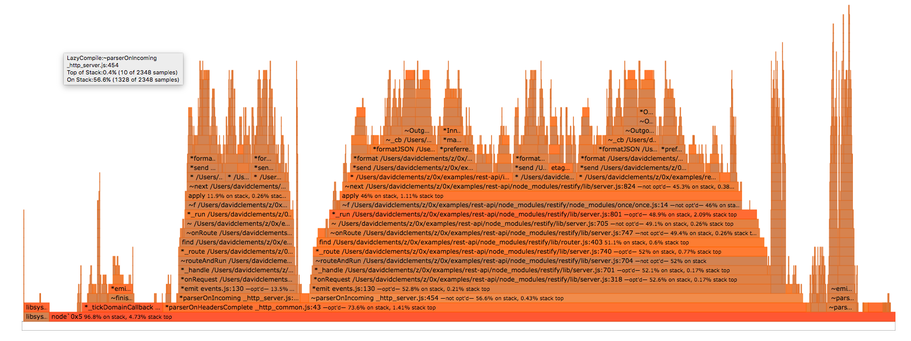

A flamegraph is an extremely powerful visual tool. It helps us to identify hot code paths in our application, and solve performance issues around those hot paths.

Flamegraphs compile stacks capturing during CPU profiling into a graphical representation thats abstracts away the concept of time allowing us to analyze how our application works at a holistic level.

To put it another way, flamegraphs allow us to quickly determine how long each function (from C to JavaScript) has spent on the CPU, and which functions are causing the rest of the stack to be on CPU longer than it should be. 

We're going to load-test a single route of an Express server, and use the [`0x`][0x] flamegraphing tool to capture stacks and convert them into a flamegraph.

This recipe explores the second and third steps of the optimization workflow: "Generate a flamegraph" and "Identify the bottleneck". 

### Getting Ready

In order to generate a flamegraph, we need Mac OS X (10.8 -
10.10)/macOS, a recent Linux distribution, or SmartOS. 

> Windows 
> If we're using Windows, flamegraph tooling is limited,
> the best option is to install a virtual machine with 
> Linux. See <http://www.storagecraft.com/blog/the-dead-simple-guide-to-installing-a-linux-virtual-machine-on-windows/> for details.

We'll also need to install [`0x`][0x], the flamegraph tool that can be installed as a global module:

```sh
$ npm install -g 0x
```

### How to do it

Let's create a folder called `hello-server`, 
initialize a `package.json` and install `Express` and Jade:

```sh
$ mkdir hello-server
$ cd hello-server
$ npm init -y
$ npm install --save express jade
```

Now we'll create our `server.js` file

```js
const express = require('express')
const path = require('path')
const app = express()

app.set('views', path.join(__dirname, 'views'));
app.set('view engine', 'jade');

app.get('/hello', (req, res) => {
  res.render('hello', { title: 'Express' });
})

app.listen(3000)
```

Next, we'll create the views folder

```sh
$ mkdir views
```

Now we create a file in `views/hello.jade`, with the following content:

```
doctype html
html
  head
    title= title
    link(rel='stylesheet', href='/stylesheets/style.css')
  body
    h1= title
```

Okay, now we're ready to profile the server and generate a flamegraph.

Instead of starting our server with the `node` binary, we use the globally installed `0x` executable. 

We start our server with the following command:

```
0x server.js
```

Now we can use the `autocannon` benchmarking tool to generate some server activity.

> #### Autocannon 
> We explored `autocannon` in the previous recipe, **Benchmarking HTTP**

In another terminal window we use `autocannon` to generate load:

```
$ autocannon -c 100 http://localhost:3000/hello
Running 10s test @ http://localhost:3000/hello
100 connections with 1 pipelining factor

Stat         Avg      Stdev    Max
Latency (ms) 259.62   122.24   1267
Req/Sec      380.37   104.36   448
Bytes/Sec    131.4 kB 35.84 kB 155.65 kB

40k requests in 10s, 1.45 MB read
```

When the benchmark finishes, we hit CTRL-C in the server terminal.
This will cause `0x` to begin converting captured stacks into a flamegraph. 

When the flamegraph has been generated a long URL will be printed to the terminal:

```
$ 0x server.js
file://path/to/profile-86501/flamegraph.html
```

The `0x` tool has created a folder named `profile-XXXX`, where `XXXX`
is the PID of the server process.

If we open the `flamegraph.html` file with Google Chrome we'll be presented with some controls, and a flamegraph resembling the following:


*A flamegraph representing our `/hello` route under load*

> #### `0x` Theme 
> By default `0x` presents flamegraphs with a black background, the flamegraph displayed here has a white background (for practical purposes). We can hit the "Theme" button (bottom left) to switch between black and white `0x` themes.

> #### The Optimization Workflow 
> We should know now how to conduct step 2 of the Optimization Workflow laid in the introduction to this chapter: We launch the application with [`0x`](0x) to generate a flamegraph. 

Functions that may be bottlenecks are displayed in darker shades of orange and red.

Hot spots at the bottom of the chart are usually less relevant to application and module developers, since they tend to relate to the inner workings of Node core. So if we ignore those, we can see that most of the hot areas appear within the two macro flames in the middle of the chart. A quick study of these show that many of the same functions appear within each - which means overall both stacks represent very similar logical paths.

> #### Graphical Reproducibility 
> We may find that our particular flamegraph doesn't exactly match the one included here. This is because of the non-deterministic nature of the profiling process. Further, the text on each frame will almost certainly differ, since its based on the location of files on your system. Overall however the general meaning of the flamegraph should be the same.

The right hand stack has a cluster of hot stacks some way up the main stack in the horizontal center of other diverging stacks.


*A hot function*

Let's click near the illustrated frame (or the equivalent identified stack if our current flamegraph is slightly different). Upon clicking the frame, `0x` allows us to delve deeper by unfolding the parent and child stacks to fill the screen, like so:


*Unfolded stacks*

We should be able to see a pattern of darker orange stack frames, 
in each case the function is the same function appearing on line
48 of a `walk.js` file in one of our sub-dependencies. 

We have located our bottleneck!

> #### The Optimization Workflow 
> We've now covered step 3 of the Optimization Workflow: Find the bottleneck. We've used the flamegraph structure and color coding to  quickly understand where the slowest part of our server is.

> #### What's the cause? 
> Figured out what the root cause is? Check the There's more section of this recipe to find out!

### How it works

A flamegraph is generated by sampling the execution stack of our application during a benchmark. 

A sample is a snapshot of all the functions being executed (nested) at the time it was taken.

It records the function that were currently executed by the CPU at that time, plus all the others that called it.

The sampled stacks are collected, and grouped together based on the functions called in them. 

Each of those group is a "flame".

Flames have common function calls at various level of the stack.

Each line (Y axis) in a flame is a function call - known as a frame.

The width of each frame corresponds to the amount of time it was observed on the CPU. The time representation is an aggregate of all nested function calls. 

For instance if function `A` calls function `B` the width of function `A` in the flamegraph will represent the time it took to execute both `A` and `B`.

If the frame is a darker shade of orange or red, then this particular function call was seen at the top of a stack more often than others. 

If a stack frame is frequently observed at the top of the stack, 
it means that the function is preventing other instructions and I/O events from being processed.

In other words, it's blocking the event loop.

Each block representing a function call also contains other useful information, such as where the function is located in the code base, and if the function has been optimized or not by Node's JavaScript engine ([V8][V8]).


### There's more

What's the underlying cause of our bottleneck, how does 0x actually profile our code, and what about Chrome Devtools?

#### Finding a solution

In this case Node.js is spending most of the execution
time in the [`acorn`](https://www.npmjs.com/package/acorn) dependency, 
which is  a dependency of [`jade`](https://www.npmjs.com/package/jade).

So we can conclude that template rendering is the bottleneck, 
our application is spending most of its time in parsing `.jade` files (through
`acorn`).

In the previous recipe's **There's More** section we talked about **Profiling for Production**.
Essentially if the server is in development mode templates are rendered each time whereas
in production mode templates are cached. Our flamegraph has just made this abundantly clear.

Let's take a look at the resulting flamegraph generating from running the same benchmark on the same server running in production mode. 

This time when we use `0x` to spin up our server we ensure `NODE_ENV` is set to production:

```sh
$ NODE_ENV=production `0x` server
```

Now bench it with `autocannon` in another terminal window:

```
$ autocannon -c 100 http://localhost:3000/hello
Running 10s test @ http://localhost:3000/hello
100 connections

Stat         Avg     Stdev     Max
Latency (ms) 18.17   14.07     369
Req/Sec      5362.3  773.26    5867
Bytes/Sec    1.85 MB 260.17 kB 2.03 MB

54k requests in 10s, 18.55 MB read
```

Note the difference in requests per second. 

Now we hit CTRL-C on our server, once the flamegraph is generated it should look something like the following


This flamegraph has different shape it's much simpler. It has fewer functions and the hottest areas are where data is being written to a socket, this is the ideal since that's the exit point - that **should** be hot.

#### How `0x` works

When we use `0x` to start our server, two processes are started. The first is `node` binary, `0x` simply passes all non-0x arguments to `node` so our code is executed.

The second process is a system stack tracing tool (`perf` in the case of Linux and `dtrace` in the case of macOS and SmartOS) to capture every function call in the C layer. 

When `0x` starts the node process, it adds a flag named `--perf-basic-prof` which is a V8 option (the JavaScript engine) which essentially enables the mapping of C++ V8 function calls to the corresponding JavaScript function calls. 

The stacks are output to a folder, and in the case of macOS further mapping is applied. The stack output contains snapshots of the callstack for each 1 millisecond period the CPU was sampled. If a function is observed at the top of the stack for a particular snapshot (and it's not the ultimate parent of the stack) then it's taken a full millisecond on stack. If this happens multiple times, that's a strong indicator that it's a bottleneck.

To generate the flamegraph `0x` processes these stacks into a JSON tree of parent and child stacks, then creates an HTML file containing the JSON plus a script that uses D3.js to visualize the parent child relationships and other meta-data in a flamegraph format.

#### CPU Profiling with Chrome Devtools

From Node version 6.3.x it's possible to use the `--inspect` flag to allow a Node process to be debugged and profiled with Chrome Devtools. 

Let's try it:

```sh
$ node --inspect server.js
Debugger listening on port 9229.
Warning: This is an experimental feature and could change at any time.
To start debugging, open the following URL in Chrome:
    chrome-devtools://devtools/remote/serve_file/@60cd6e859b9f557d2312f5bf532f6aec5f284980/inspector.html?experiments=true&v8only=true&ws=localhost:9229/node
```

If we copy and paste the entire `chrome-devtools://` URI into Chrome we should get an instance of Chrome Devtools connected to our process. 

Now we can select the profile tab, select the "Record JavaScript CPU profile"
and hit Start to begin profile. 

The next figure illustrates the UI interactions described:


Now we use `autocannon` to load the server: 

```sh
$ autocannon -c 100 http://localhost:3000/hello
```

Once the `autocannon` has completed, we hit the "Stop" button in Devtools (located in the same place as the Start button before it was clicked).

This should result in the following screen:


The table is sorted by "self-time" - the amount of time a particular instance of the function was observed on CPU. We can see that the `c` function in `walk.js` is located fifth from the top (the other functions above it are related to the same bottleneck, the `c` function also has a higher total time than the anonymous functions).

In the top right corner of the profiling panel there's a drop down menu currently labelled with "Heavy (Bottom Up)"

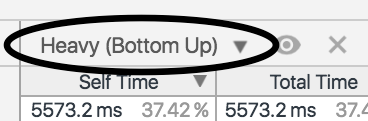

If we click this and select "Chart" we'll see a visualization of the captured stacks, that looks something like this:


This is known as a Flamechart (as opposed to a Flamegraph). Flamecharts are conceptually similar Flamegraphs in that stacks are represented by visual blocks atop one another. However in a Flamechart stacks are repeated on the X-axis as a function of time, instead of aggregated into one block. Stacks also aren't colored according to time at the top of stack on CPU. This can be useful in some situations where we want dissect exact formations of stacks calls over a time period. But, as we can see, for complex applications (like our current case), this can be quite difficult to read. 

The devtools Flamechart is shown in two ways, first as overview the top chart, the general shape of the stacks captured of time can be seen. This can be useful for gauging general complexity. The bottom graph is "upside down", in that the first function call is at the top (instead of the bottom) and the last function call is at the bottom.

If we take a very small time slice and look around we'll eventually be able to locate the `c` function, and see something like the following:

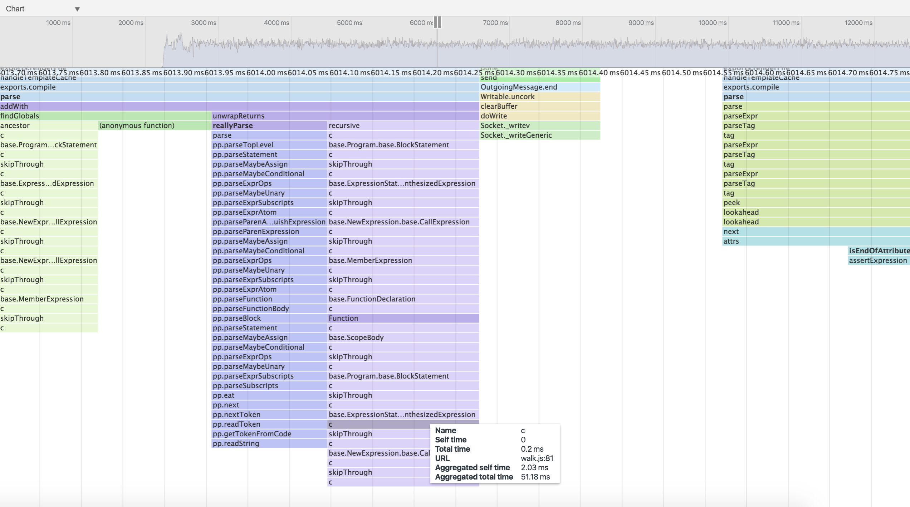

We can see the `c` function repeatedly being called, when we hover over it can see the time of the individual time plus the aggregate time **for that instance** of `c` (as opposed to the aggregate time for all calls of the same function).

A useful feature of Devtools CPU profiling is we can click a particular frame and it will reveal it in the Source view:

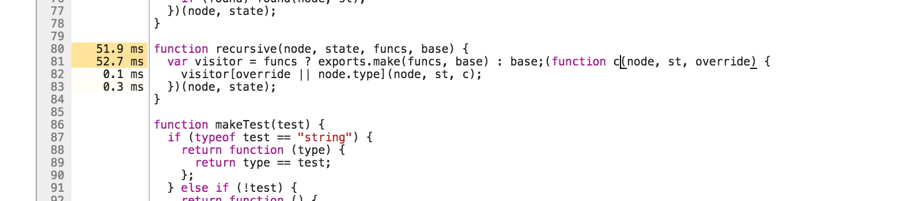

Devtools also shows the time-on-cpu of each function (again only for that particular instance, related to the function block we clicked) next to relevant lines of code. 

In our particular case, the Flamegraph was more suitable than the Flamechart provided by Chrome Devtools, on the other hand Chrome Devtools can allow us greater inspection capabilities when required.

### See also

TBD

## Optimizing a synchronous function call

Node.js is an evented I/O platform built on top of [V8][V8], Google Chrome's Javascript VM.

Node applications receive I/O events (file read, data available on
a socket, write completed) and then execute a Javascript callback (a function).

The next I/O event is processed after the Javascript function (the callback) terminates.

In order to write fast Node.js applications, our Javascript functions (particularly callbacks) need to terminate as fast as possible.

Any function that takes a long time to process prevents all other I/O and other functions from executing.

HTTP benchmarking and flamegraphs help us to understand our applications logical flow and rapidly pinpoint the areas which require optimization (the functions that prevent I/O and other instructions from executing).

[V8][V8] uses two Just-In-Time (JIT) compilers. The Full-codegen compiler and the 
Optimizing compiler which is used for hot functions. Hot functions are functions that are either executed often or they take a long time to complete.  

The Full-codegen compiler is used when a function is loaded. If that function becomes hot the Optimizing compiler will attempt apply relevant optimizations (inlining being one such possible optimization). When V8 fails to optimize a hot function, this can become a bottleneck for an application.

Having covered Steps 1-3 of the Optimization Workflow (Establish a baseline, Generate a flamegraph, Identify the bottleneck) we will now venture into one permutation of Step 4: Solve the performance issue. 

In this recipe we show how to isolate, profile and solve a synchronous function bottleneck.

### Getting Ready

Having understood the portion of our code that needs work, our next step is to isolate the problem area and put together a micro-benchmark around it.

We'll be using [benchmark.js][benchmark] to create micro-benchmarks for single functions. 

Let's create a new folder called `sync-opt`, initialize a `package.json` file and install the `benchmark` module as a development dependency:


```sh
$ mkdir sync-opt
$ npm init -y
$ npm install --save-dev benchmark
```

### How to do it

Let's assume that we've identified a bottleneck in our code base, and it happens to be a function called `divideByAndSum`. A hypothetical flamegraph has revealed this function is appearing over 10% of time at stack-top over multiple samples.

The function looks like this:

```js
function divideByAndSum (num, array) {
  try {
    array.map(function (item) {
      return item / num
    }).reduce(function (acc, item) {
      return acc + item
    }, 0)
  } catch (err) {
    // to guard for division by zero
    return 0
  }
}
```

Our task now is to make this function faster.

The first step is to extract that function into its own module. 

Let's create a file called `slow.js`:

```js
function divideByAndSum (num, array) {
  try {
    array.map(function (item) {
      return item / num
    }).reduce(function (acc, item) {
      return acc + item
    }, 0)
  } catch (err) {
    // to guard for division by zero
    return 0
  }
}

module.exports = divideByAndSum
```

This is what an optimization candidate should look like. The idea is that we take the function from the code base and place it in its own file, exposing the function with `module.exports`.

The goal is to have an independent module, that we can benchmark in isolation. 

We can now write a simple benchmark for it:

```js
const benchmark = require('benchmark')
const slow = require('./slow')
const suite = new benchmark.Suite()

const numbers = []

for (let i = 0; i < 1000; i++) {
  numbers.push(Math.random() * i)
}

suite.add('slow', function () {
  slow(12, numbers)
})

suite.on('complete', print)

suite.run()

function print () {
  for (var i = 0; i < this.length; i++) {
    console.log(this[i].toString())
  }

  console.log('Fastest is', this.filter('fastest').map('name')[0])
}
```

Let's save this as `initial-bench.js` and run our micro-benchmark to get a baseline:

```sh
$ node initial-bench.js
slow x 11,014 ops/sec ±1.12% (87 runs sampled)
Fastest is slow
```

One the most powerful optimizations that the V8 JavaScript engine can make is function inlining. Let's run our benchmark again with a special flag that shows V8's inlining activity:

```sh
$ node --trace-inlining initial-bench.js
```

This will produce lots of output, but if we look for our `dividByAndSum` function we should see something like the following:

```
Did not inline divideByAndSum called from  (target not inlineable).
Did not inline Array called from ArraySpeciesCreate (Dont inline [new] Array(n) where n isn't constant.).
Inlined baseToString called from toString.
Inlined isObject called from isIterateeCall.
Did not inline Array called from arrayMap (Dont inline [new] Array(n) where n isn't constant.).
```

We can see our `divideAndSum` function isn't being inlined. The other functions that aren't inlined supply a clue. Is `arrayMap` related to the fact we're using `map` in our function? What about `ArraySpeciesCreate`. 

Let's follow that lead by seeing if a flamegraph can help at all:

```sh
$ 0x initial-bench.js
```


*flamegraph of our initial benchmark*

Again we can see that several pieces of code in `array.js` (the internal V8 array library), seems very hot, both in relation to `map` and `reduce` functionality. Note also how hot the internal `DefineIndexProperty` call is.

Let's confirm our suspicions by looking directly at the internal code for the native `map` function. 

```sh
$ node --allow-natives-syntax -p "%FunctionGetSourceCode([].map)"
(br,bs){
if((%IS_VAR(this)===null)||(this===(void 0)))throw k(18,"Array.prototype.map");
var w=(%_ToObject(this));
var x=(%_ToLength(w.length));
if(!(typeof(br)==='function'))throw k(15,br);
var B=ArraySpeciesCreate(w,x);
var U=(%_IsArray(w));
for(var z=0;z<x;z++){
if(((U&&%_HasFastPackedElements(%IS_VAR(w)))?(z<w.length):(z in w))){
var aN=w[z];
DefineIndexedProperty(B,z,%_Call(br,bs,aN,z,w));
}
}
return B;
}
```

Well now, there's the `ArraySpeciesCreate` function noted in our traced inlining output, and the very hot `DefineIndexedProperty`.

The evidence is suggesting that the use of `map` and `reduce` is slowing our function down.

Let's rewrite it with procedural code, like so:

```js
function divideByAndSum (num, array) {
  var result = 0
  try {
    for (var i = 0; i < array.length; i++) {
      result += array[i] / num
    }
  } catch (err) {
    // to guard for division by zero
    return 0
  }
}

module.exports = divideByAndSum
```

We'll save that as `no-collections.js` and add it to our benchmark suite:

```js
const benchmark = require('benchmark')
const slow = require('./slow')
const noCollection = require('./no-collections')
const suite = new benchmark.Suite()

const numbers = []

for (let i = 0; i < 1000; i++) {
  numbers.push(Math.random() * i)
}

suite.add('slow', function () {
  slow(12, numbers)
})

suite.add('no-collections', function () {
  noCollection(12, numbers)
})

suite.on('complete', print)

suite.run()

function print () {
  for (var i = 0; i < this.length; i++) {
    console.log(this[i].toString())
  }

  console.log('Fastest is', this.filter('fastest').map('name')[0])
}
```

We'll save this as `bench.js`.

Finally let's run our benchmarks to see if we made any progress:

```sh
$ node bench.js
slow x 6,320 ops/sec ±0.93% (91 runs sampled)
no-collections x 66,293 ops/sec ±0.79% (91 runs sampled)
Fastest is no-collections
```

Wow! More than a ten-fold improvement.

### How it works

Our workflow in this recipe is investigatory in nature. We discover interesting clues, follow leads and attempt to confirm our working hypotheses until we establish evidence that allows us to define a concrete plan of action. Basically, we poke around until we get an idea. In this case we found that the use of `map` and `reduce` in our hot function (`divideByAndSum`) seem to prime culprits.

We discovered this by using several techniques. 

First we checked which functions were being inlined by V8 and found that our function was not being inlined (and still isn't, we'll find out how to successfully inline it in the **There's More** section). We also saw what that on two occasions a call to `Array` wasn't being inlined, what was more interesting here was where `Array` was being called from `ArraySpeciesCreate` and `arrayMap`. Neither of these functions are defined in our code or in Benchmark.js, so they must be internal.

> ##### Advanced Optimizations 
> See the There's More section for more advanced techniques such as inlining and optimization tracing. 

Next we decided to cross-check our findings by generating a flamegraph. It showed a lot of heat around the internal V8 `array.js` file, with function names that seemed to be related to internal `map` and `reduce` code. We also saw a very hot `DefineIndexedProperty` function which seemed of interest.

Finally our third strategy was to dig even deeper by picking the internal code for the `map` method apart by using a special "Native Syntax" function. The `allow-natives-syntax` flag allows for a host of internal V8 helper functions which are always prefixed by the percent sign (`%`). The one we used is `%FunctionGetSourceCode` to print out the internal "native" Arrays `map` method. Had we used `console.log([].map + '')` we would have only seen `function map() { [native code] }`. The special `%FunctionGetSourceCode` gives us the native code. We saw this code correlated to our earlier findings, namely we could see `ArraySpeciesCreate` and the hot `DefineIndexedProperty` function. At this point it was time to test the hypothesis that `map` (and by inference, `reduce`) was slowing our code down.

We converted our function to use a plain old `for` loop, and set up a benchmark to compare the two approaches. This revealed more than a ten-fold speed increase.

> # Best Practices vs Performance 
> This recipe has shown the functional programming in JavaScript (e.g. use of `map`, `reduce` and others) can cause bottlnecks. Does this mean we should use a procedural approach everywhere? We think not. The highest priority should be code that's easy to maintain, collaborate on, and debug. Functional programming is a powerful paradigm for these goals, and great for rapid prototyping. Not every function will be a bottleneck, for these functions use of `map`, `reduce` or any such methods is perfectly fine. Only after profiling should we revert to a procedural approach, and in these cases reasons for doing so should be clearly commented. 


### There's more

Let's look at some more advanced optimization techniques around tracing V8 performance activities.

#### Function inlining

In the main recipe we learned where our logic was spending a lot of time,
and solved the problem by removing the overhead of one approach by replacing
code with a lower impact alternative (the `for` loop).

Let's see if we can make the function faster.

We'll start by creating a new folder called `function-inlining`, then copy
our `no-collections.js` and `bench.js` files into it.

```sh
$ mkdir function-inlining
$ cp no-collection.js function-inlining
$ cp bench.js function-inlining/initial-bench.js
```

As we copied our `bench.js` file into `function-inlining` we also renamed it to `initial-bench` since we're starting a new optimization cycle. 

We need to modify `function-inlining/initial-bench.js` by removing the `slow` benchmarks, leaving only our latest version of `divideByAndSum`.

Let's alter `function-inlining/initial-bench.js` to the following:

```js
const benchmark = require('benchmark')
const noCollection = require('./no-collections')

const suite = new benchmark.Suite()

const numbers = []

for (let i = 0; i < 1000; i++) {
  numbers.push(Math.random() * i)
}

suite.add('no-collections', function () {
  noCollection(12, numbers)
})

suite.on('complete', print)

suite.run()

function print () {
  for (var i = 0; i < this.length; i++) {
    console.log(this[i].toString())
  }

  console.log('Fastest is', this.filter('fastest').map('name')[0])
}
```

Now, from the `function-inlining` folder let's run the benchmark with the `--trace-inlining` flag to see if our function is being inlined by V8:

```sh
$ node --trace-inlining initial-bench | grep divideByAndSum
Did not inline divideByAndSum called from  (target not inlineable).
```

We used `grep` here to limit output to the function we're interested in. 

The trace output shows that our function is not being inlined by V8,
and the reason given is ambiguous: `(target not inlineable)`. 

At this point we must rely on trial and error, experience and general knowledge of "optimization killers"  to figure out how to inline our function.

> # Optimization Killers 
> While we advocate an evidence-based approach to performance analysis, there is a list of identified rules that prevent function optimization compiled by those who have gone before us. We call these [V8 Optimization Killers](https://github.com/petkaantonov/bluebird/wiki/Optimization-killers). Knowledge of these can enhance our investigations, but at the same time we should resist confirmation bias.

There are a limited amount of occasions where a try-catch block is unavoidable (such as when attempting to `JSON.parse`) however in the case of `divideByAndSum` using try-catch is completely unnecessary. Let's see if removing the try-catch from our function helps. 

We'll create a new file called `no-try-catch.js` where our `divideByAndSum` function looks like the following:

```js
function divideByAndSum (num, array) {
  var result = 0

  if (num === 0) {
    return 0
  }

  for (var i = 0; i < array.length; i++) {
    result += array[i] / num
  }

  return result
}

module.exports = divideByAndSum
```

We'll copy `initial-bench.js` to `no-try-catch-bench.js` and 
convert it to testing our `no-try-catch.js` file:

```sh
$ cp initial-bench.js no-try-catch-bench.js
```

The `no-try-catch-bench.js` file should look like this:

```js
const benchmark = require('benchmark')
const noTryCatch = require('./no-try-catch')

const suite = new benchmark.Suite()

const numbers = []

for (let i = 0; i < 1000; i++) {
  numbers.push(Math.random() * i)
}

suite.add('no-try-catch', function () {
  noTryCatch(12, numbers)
})

suite.on('complete', print)

suite.run()

function print () {
  for (var i = 0; i < this.length; i++) {
    console.log(this[i].toString())
  }

  console.log('Fastest is', this.filter('fastest').map('name')[0])
}
```

Now let's see if our new `divideByAndSum` is being inlined:

```sh
$ node --trace-inlining no-try-catch-bench | grep divideByAndSum
Inlined divideByAndSum called from .
```

Hooray it's being inlined! 

Ok let's compare approaches in a single `bench.js` file.

Let's copy `slow.js` into the `function-inlining` folder:

```sh
$ cp ../slow.js .
```

Now we'll benchmark all three approaches.

We need to make `bench.js` look like the following:

```js
const benchmark = require('benchmark')
const slow = require('./slow')
const noCollection = require('./no-collections')
const noTryCatch = require('./no-try-catch')

const suite = new benchmark.Suite()

const numbers = []

for (let i = 0; i < 1000; i++) {
  numbers.push(Math.random() * i)
}

suite.add('slow', function () {
  slow(12, numbers)
})

suite.add('no-collections', function () {
  noCollection(12, numbers)
})

suite.add('no-try-catch', function () {
  noTryCatch(12, numbers)
})

suite.on('complete', print)

suite.run()

function print () {
  for (var i = 0; i < this.length; i++) {
    console.log(this[i].toString())
  }

  console.log('Fastest is', this.filter('fastest').map('name')[0])
}
```

Finally let's compare the approaches:

```
$ node bench.js 
slow x 6,206 ops/sec ±0.81% (90 runs sampled)
no-collections x 65,088 ops/sec ±0.93% (90 runs sampled)
no-try-catch x 255,860 ops/sec ±0.87% (91 runs sampled)
Fastest is no-try-catch
```

Wow! The no-try-catch version of `divideByAndSum` is nearly four times faster than the no-collections version, and it's 40 times faster than our original function.

Allowing V8 to inline our functions can be very powerful indeed.

#### Checking the optimization status

We can check if a function is optimized or optimizable by using the "V8
natives syntax", which we can turn on by executing our applications with
`node --allow-natives-syntax app.js`.

We can then instrument the code like the following:

```js
%GetOptimizationStatus(fn)
```

We can even write a little module to help us debugging these conditions:

```
function printStatus (name, fn) {
  switch(%GetOptimizationStatus(fn)) {
    case 1: console.log(`${name} function is optimized`); break;
    case 2: console.log(`${name} function is not optimized`); break;
    case 3: console.log(`${name} function is always optimized`); break;
    case 4: console.log(`${name} function is never optimized`); break;
    case 6: console.log(`${name} function is maybe deoptimized`); break;
    case 7: console.log(`${name} function is optimized by TurboFan`); break;
    default: console.log(`${name} function optimization status unknown`); break;
  }
}

module.exports = printStatus
```

We'll save this a `func-status.js`.

We can then modify our `bench.js` file (from the previous function inlining section, `function-inlining/bench.js` in code samples) to check the optimization status of each version of the `divideByAndSum` function.

Let's make sure `func-status.js` is in the same folder as `bench.js` and then modify bench.js in two ways. First at the top we'll add our `func-status` module:

```js
const benchmark = require('benchmark')
const slow = require('./slow')
const noCollection = require('./no-collections')
const noTryCatch = require('./no-try-catch')
const funcStatus = require('./func-status')
```

At the bottom of `bench.js` we alter the `print` function like so:

```js
function print () {
  for (var i = 0; i < this.length; i++) {
    console.log(this[i].toString())
  }
  funcStatus('slow', slow)
  funcStatus('noCollection', noCollection)
  funcStatus('noTryCatch', noTryCatch)

  console.log('Fastest is', this.filter('fastest').map('name')[0])
}
```

Now we must run our bench.js file like so:

```sh
node --allow-natives-syntax bench.js
```

Whic should output something like:

```sh
slow x 2,742 ops/sec ±0.60% (94 runs sampled)
no-collections x 63,821 ops/sec ±1.36% (87 runs sampled)
no-try-catch x 241,958 ops/sec ±2.17% (84 runs sampled)
slow function is not optimized
noCollection function is not optimized
noTryCatch function is optimized
Fastest is no-try-catch
```


> #### Getting Optimization Status with 0x 
> For a holistic view of the optimization status of an entire app, the flamegraph generated by 0x has "+Optimized" and "+Not Optimized" control buttons. 0x will highlight optimized functions in yellow and non-optimized functions in salmon pink.
>
> 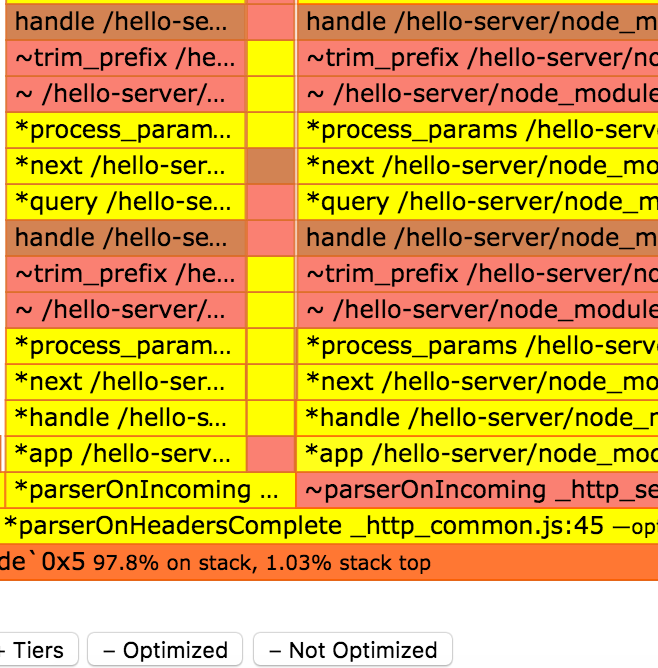
> *Optimized (yellow) and Non-Optimized (salmon) stacks*

#### Tracing optimization and deoptimization events

We can tap into the V8 decision process regarding when to optimize a
function using the `--trace-opt` and `trace-deopt` flags. 

Imagine we had an application with an entry point of `app.js`, we could watch optimization events with the following

 ```sh
 $ node --trace-opt --trace-deopt app.js
 ```

This would yield output resembling the following:

```
[marking 0x21e29c142521 <JS Function varOf (SharedFunctionInfo 0x1031e5bfa4b9)> for recompilation, reason: hot and stable, ICs with typeinfo: 3/3 (100%), generic ICs: 0/3 (0%)]
[compiling method 0x21e29c142521 <JS Function varOf (SharedFunctionInfo 0x1031e5bfa4b9)> using Crankshaft]
[optimizing 0x21e29c142521 <JS Function varOf (SharedFunctionInfo 0x1031e5bfa4b9)> - took 0.019, 0.106, 0.033 ms]
[completed optimizing 0x21e29c142521 <JS Function varOf (SharedFunctionInfo 0x1031e5bfa4b9)>]
```

Here we see a a function named `varOf` is marked for optimization and
then optimized shortly after.

We may also observe the following output:

```
[marking 0x21e29d33b401 <JS Function (SharedFunctionInfo 0x363485de4f69)> for recompilation, reason: small function, ICs with typeinfo: 1/1 (100%), generic ICs: 0/1 (0%)]
[compiling method 0x21e29d33b401 <JS Function (SharedFunctionInfo 0x363485de4f69)> using Crankshaft]
[optimizing 0x21e29d33b401 <JS Function (SharedFunctionInfo 0x363485de4f69)> - took 0.012, 0.072, 0.021 ms]
```

In this case an anonymous function is being marked for recompilation. It can be very difficult to know where this function is defined. Naming functions is highly important in profiling situations.

From time to time, we can also see a deoptimizatition happening:

```
[deoptimizing (DEOPT eager): begin 0x1f5a5b1fd601 <JS Function forOwn (SharedFunctionInfo 0x1f5a5b161259)> (opt #125) @55, FP to SP delta:
376]
            ;;; deoptimize at 109463: not a Smi
  reading input frame forOwn => node=3, args=13, height=2; inputs:
      0: 0x1f5a5b1fd601 ; (frame function) 0x1f5a5b1fd601 <JS Function
forOwn (SharedFunctionInfo 0x1f5a5b161259)>
      1: 0x1f5a5b1fa7d9 ; [fp + 32] 0x1f5a5b1fa7d9 <JS Function lodash
(SharedFunctionInfo 0x1f5a5b153b19)>
      2: 0x2e17991e6409 ; [fp + 24] 0x2e17991e6409 <an Object with map
0x366bf3f38b89>
      3: 0x2e17991ebb41 ; [fp + 16] 0x2e17991ebb41 <JS Function
(SharedFunctionInfo 0x1f5a5b1ca9e1)>
      4: 0x1f5a5b1eaed1 ; [fp - 24] 0x1f5a5b1eaed1 <FixedArray[272]>
      5: 0x1f5a5b1ee239 ; [fp - 32] 0x1f5a5b1ee239 <JS Function
baseForOwn (SharedFunctionInfo 0x1f5a5b155d39)>
...
```

The reason for the deoptimization is "not a SMI", which means that the
function was expecting a 32-bit fixed integer and it got something else
instead.

### See also

TBD

## Optimizing asynchronous callbacks

Node.js is an asynchronous runtime built for I/O heavy applications,
and much of our code will involve asynchronous callbacks.

In the previous recipes in this chapter we've explored how to determine a performance issue, locate the issue to single synchronous Javascript function and optimize that function.

Sometimes, however, a performance bottleneck can be part of an asynchronous flow, in these scenarios it can be difficult to pinpoint where the performance issue is. 

In this recipe, we'll cover profiling and optimizing an asynchronous performance problem in depth. 

### Getting Ready

In this recipe, we will optimize an HTTP API built on [Express][express] and [MongoDB][mongo].


We'll be using MongoDB version 3.2, which we will need to install from the
MongoDB [https://www.mongodb.com][mongo] website or via our systems package manager. 

> #### MongoDB 
> For more on MongoDB (and on installing it) see Chapter 5: Working with Databases

Once MongoDB is installed we can make a data directory for it and  start it like so:

```sh
$ mkdir data
$ mongod --port 27017 --dbpath data
```

Next let's initialize our project and install relevant dependencies:

```sh
$ mkdir async-opt
$ cd async-opt
$ npm init -y
$ npm install mongodb express  --save
```

Now we need to pre-populate our database with some data. 

Let's create a population script, saving it as `load.js`:

```js
const MongoClient = require('mongodb').MongoClient
const url = 'mongodb://localhost:27017/test';
var count = 0
var max = 1000

MongoClient.connect(url, function(err, db) {
  if (err) { throw err }
  const collection = db.collection('data')

  function insert (err) {
    if (err) throw err

    if (count++ === max) {
      return db.close()
    }

    collection.insert({
      value: Math.random() * 1000000
    }, insert)
  }

  insert()
})

```

Great! Let's populate our database:

```sh
$ node load.js
```

This will load 1000 entries into our MongoDB database.

### How to do it

Our under-performing server is a very simple HTTP application that calculates the average of all the data points we have inserted. 

Let's take the following code and save it as `server.js`:

```js
const MongoClient = require('mongodb').MongoClient
const express = require('express')
const app = express()

var url = 'mongodb://localhost:27017/test';

MongoClient.connect(url, function(err, db) {
  if (err) { throw err }
  const collection = db.collection('data')
  app.get('/hello', (req, res) => {
    collection.find({}).toArray(function sum (err, data) {
      if (err) {
        res.send(err)
        return
      }
      const total = data.reduce((acc, d) => acc + d.value, 0)
      const result = total / data.length
      res.send('' + result)
    })
  })

  app.listen(3000)
})
```

Now we'll run it:

```sh
$ node server.js
```

And in second terminal, generate a benchmark:

```sh
$ autocannon -c 1000 -d 5 http://localhost:3000/hello
Running 5s test @ http://localhost:3000/hello
1000 connections

Stat         Avg      Stdev    Max
Latency (ms) 2373.5   573.86   3352
Req/Sec      315.8    154.76   433
Bytes/Sec    68.02 kB 33.03 kB 94.21 kB

2k requests in 5s, 342.64 kB read
2 errors
```

Ok we have our baseline, now let's kill our server (Ctrl-C) and run the benchmark again with `0x` to get a flamegraph:

```sh
$ 0x server.js
```

```sh
$ autocannon -c 1000 -d 5 http://localhost:3000/hello
```

Of course the benchmark results aren't important here (they're skewed by profiling), we're just trying to simulate load in order to diagnose the bottleneck.

This should generate a flamegraph that looks something like the figure below:


*Flamegraph of our server*

The flamegraph shows some dark red areas related to two functions, `deserializeObject` and `slowToString`.

These particular bottlenecks are typical to MongoDB applications, and are related to the amount of data being received from MongoDB. The only way to optimize this (other than somehow making MongoDB entity deserialization faster), is to change the data flow.

The _best_ way to fix this issue is to avoid the computation on the server at all. Instead we could store (and update) the computed value whenever it changes.

But what if our use case doesn't allow for pre-computation? The next best option is to ignore that parts we don't have control over (due to architectural, technical and business constraints) and see if we can squeeze out extra performance around the edges.

Our flamegraph has a small "tower" stack, reminiscent of a sky-scraper.

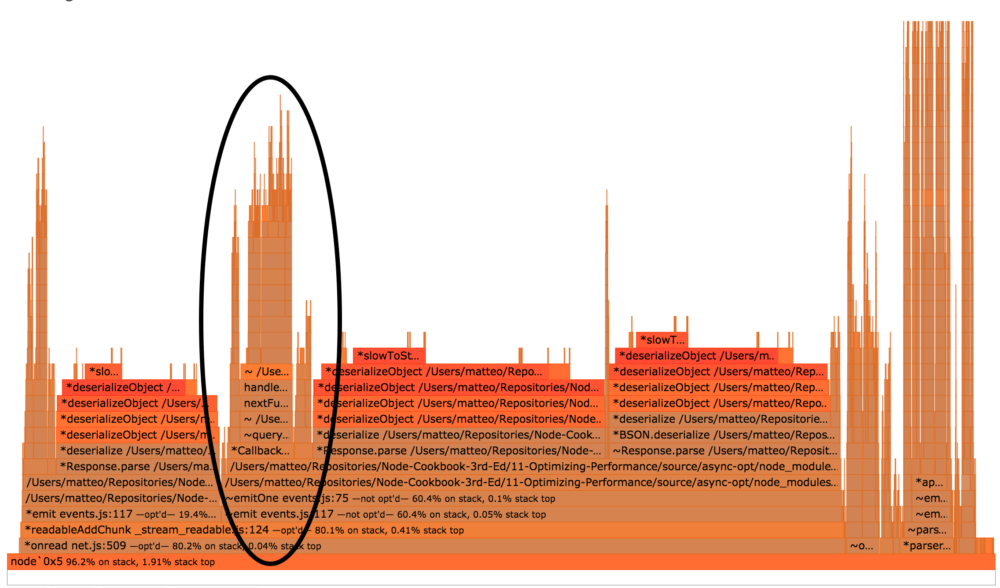
*The towering stack*

We can click one of the lower frames in the stack to "zoom-in", doing so should so something like the following:

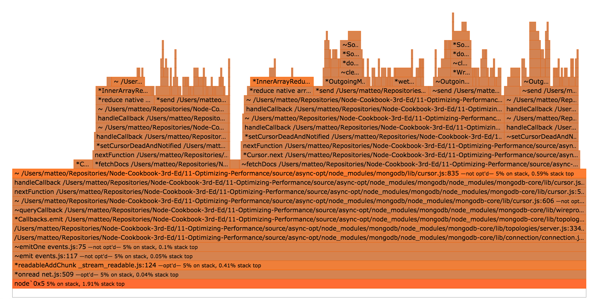
*Zoomed in flamegraph* 

At the top of our zoomed in view, we can see two hot frames, both representing time spent in the native `reduce` method. 

As we know from the recipe **Optimizing a synchronous function call**, using ES5
collection methods in the wrong place can cause bottlenecks.

So let's rewrite our server like so:

```js
const MongoClient = require('mongodb').MongoClient
const express = require('express')
const app = express()

var url = 'mongodb://localhost:27017/test'

MongoClient.connect(url, function(err, db) {
  if (err) { throw err }
  const collection = db.collection('data')
  app.get('/hello', (req, res) => {
    collection.find({}).toArray(function sum (err, data) {
      if (err) {
        res.send(err)
        return
      }
      var sum = 0
      const l = data.length
      for (var i = 0; i < l; i++) {
        sum += data[i].value
      }
      const result = sum / data.length
      res.send('' + result)
    })
  })

  app.listen(3000)
})
```

We'll save this as `server-no-reduce.js`.

We can then run it:

```sh
$ node server-no-reduce.js
```

And benchmark with `autocannon` to see how it performs:

```
$ autocannon -c 1000 -d 5 http://localhost:3000/hello
Running 5s test @ http://localhost:3000/hello
1000 connections

Stat         Avg      Stdev    Max
Latency (ms) 2293.1   569.38   3244
Req/Sec      331.8    142.23   456
Bytes/Sec    71.53 kB 30.94 kB 102.4 kB

2k requests in 5s, 360 kB read
5 errors
```

We had a very small increase in throughput (5%), it's something but we can do better.

What else do we have control over, which also sits in the hotpath for the `/hello` route? The `sum` function that we're passing to `toArray`.

Let's see if the `sum` function is being optimized by V8. 

For ease, we'll use `0x` to determine if it's being optimized.

Let's create a new flamegraph:

```
$ 0x server-no-reduce.js
```

```
$ autocannon -c 1000 -d 5 http://localhost:3000/hello
```

Once we have generated a flamegraph with `0x`, we can use the `search`
box in the top-right corner to locate `sum` function calls, we can see them in the following figure, highlighted purple:


If we click on one of functions, we get:

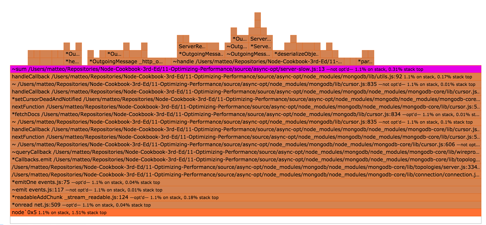

In the above detail of  the flamegraph, we can see that the `sum` function was not optimized (at the end of the text for the `sum` frame we can see the words `not opt'd`).

The `sum` function was not optimized because it is instantiated for
every request. Each instantiation of the function is only executed once, which means it will never be "hot" enough for V8 to mark it for optimization.

We can work around this problem by moving the sum function outside the hotpath, thus instantiating it only once, like so:

```js
const MongoClient = require('mongodb').MongoClient
const express = require('express')
const app = express()

var url = 'mongodb://localhost:27017/test';

function sum (data) {
  var sum = 0
  const l = data.length
  for (var i = 0; i < l; i++) {
    sum += data[i].value
  }
  return sum
}

MongoClient.connect(url, function(err, db) {
  if (err) { throw err }
  const collection = db.collection('data')
  app.get('/hello', (req, res) => {
    collection.find({}).toArray(function (err, data) {
      if (err) {
        res.send(err)
        return
      }
      const result = sum(data) / data.length
      res.send('' + result)
    })
  })

  app.listen(3000)
})
```

We have extracted the expensive piece (the iteration of the array) into a top-level function that can be optimized by V8 and reused throughout the life of
our process.

Let's save this as `server-one-sum-fn.js` and see how it performs:

```sh
$ node server-one-sum-fn.js
```

```sh
$ autocannon -c 1000 -d 5 http://localhost:3000/hello
Running 5s test @ http://localhost:3000/hello
1000 connections

Stat         Avg      Stdev    Max
Latency (ms) 2164.37  526.15   2960
Req/Sec      359.4    138.31   457
Bytes/Sec    77.93 kB 29.74 kB 102.4 kB

2k requests in 5s, 389.95 kB read
```

From our starting point of 315 request per second, we have achieved a
14% performance improvement just by optimizing a very hot for loop.

### How it works

We know from the "Optimizing a synchronous function call" recipe that `reduce` is potentially expensive, this was proved again by profiling and flamegraph visualisation. 

Once that was removed the only remaining user-land code (code we have direct control over) was the sum function. So we checked to see whether it was being optimized. We could have checked this using `--trace-opt`, `trace-deopt` and maybe `--trace-inlining` or using the native syntax `%GetOptimizationStatus` function, but in this case we used flamegraphs to quickly locate and check the optimization status of our `sum` function.

Whenever we allocate a new function that's going to be called many times, we ideally want it to be optimized by V8.

The soonest V8 can optimize a new function, is after its first
invocation.

Node.js is built around callbacks and functions, the prevailing pattern for asynchronous interaction (when we need to wait for some I/O), is to allocate new function thereby wrapping the state in a closure.

However by identifying areas of of CPU-intensive behavior within an asynchonrous context and ensuring that such logic is instantiated in a function once only at the top-level, we can assure we deliver the best possible performance for our users.

> #### Reusify 
> For an advanced function-reuse method to trigger V8 optimizations check out the [reusify](http://npm.im/reusify) utility module


### There's more

Let's explore ways to make our server even faster

#### A database solution

Sometimes we cannot change how the data is stored in our database easily, which is why our main recipe focuses on alternative optimizations. 

However, in cases where we can we can simply pre-compute our data and serve it verbatim.

Let's write another Node.js script to calculate our average, to be run
each time a data point changes:

```js
const MongoClient = require('mongodb').MongoClient
const url = 'mongodb://localhost:27017/test';
var count = 0
var max = 1000

MongoClient.connect(url, function(err, db) {
  if (err) { throw err }
  const collection = db.collection('data')
  const average = db.collection('averages')

  collection.find({}).toArray(function (err, data) {
    if (err) { throw err }
    average.insert({
      value: data.reduce((acc, v) => acc + v, 0) / data.length
    }, function (err) {
      if (err) { throw err }
      db.close()
    })
  })
})
```

Then, we can rewrite our server as:

```js
const MongoClient = require('mongodb').MongoClient
const express = require('express')
const app = express()

var url = 'mongodb://localhost:27017/test';

MongoClient.connect(url, function(err, db) {
  if (err) { throw err }
  const collection = db.collection('data')
  app.get('/hello', (req, res) => {
    collection.findOne({}, function sum (err, data) {
      res.send('' + data.value)
    })
  })

  app.listen(3000)
})
```

We'll save this as `calcute-average.js` and run it

```sh
$ node calculate-average
```

Now averages are also stored in MongoDB.

Let's see how this affects the throughput of our (`server-one-sum-fn.js`) app:

```sh
$ node server-one-sum-fn
```

```sh
$ autocannon -c 1000 -d 5 http://localhost:3000/hello
Running 5s test @ http://localhost:3000/hello
1000 connections

Stat         Avg      Stdev    Max
Latency (ms) 391.47   66.91    746
Req/Sec      2473.2   385.05   2849
Bytes/Sec    537.4 kB 82.99 kB 622.59 kB

12k requests in 5s, 2.68 MB read
```

Avoiding computation in a live server is the first solution for any performance issue.

#### A caching solution

For high-performance applications, we might want to leverage
in-process caching to save time for repeated CPU-bound tasks.

We will use two modules for this: [`lru-cache`][lru-cache] and [`fastq`][fastq].

```sh
npm install --save lru-cache fastq
```

`lru-cache` implements an performant _least recently used_
cache, where values are stored with a time to live. `fastq` is a
performant queue implementation, which we need to control the asynchronous flow 

We want to fetch the data and compute the result once. 

Here is `server-cache.js` implementing this behavior:

```js
const MongoClient = require('mongodb').MongoClient
const express = require('express')
const LRU = require('lru-cache')
const fastq = require('fastq')
const app = express()

var url = 'mongodb://localhost:27017/test';

function sum (data) {
  var sum = 0
  const l = data.length
  for (var i = 0; i < l; i++) {
    sum += data[i].value
  }
  return sum
}

MongoClient.connect(url, function(err, db) {
  if (err) { throw err }
  const collection = db.collection('data')
  const queue = fastq(work)
  const cache = LRU({
    maxAge: 1000 * 5 // 5 seconds
  })

  function work (req, done) {
    const elem = cache.get('average')
    if (elem) {
      done(null, elem)
      return
    }
    collection.find({}).toArray(function (err, data) {
      if (err) {
        done(err)
        return
      }
      const result = sum(data) / data.length
      cache.set('average', result)
      done(null, result)
    })
  }

  app.get('/hello', (req, res) => {
    queue.push(req, function (err, result) {
      if (err) {
        res.send(err.message)
        return
      }
      res.send('' + result)
    })
  })

  app.listen(3000)
})
```

Th queue ensures the responses are sent out in the correct order and, importantly, prevents subsequent requests from triggering additional database lookups before the first lookup is resolved. 

The cache holds results in memory and simply replays them out, which cuts out the I/O and expensive de-serialization process.

Let's run `server-cache.js` and take a benchmark

```sh
$ node server-cache.js
```

```sh
$ autocannon -c 1000 -d 5 http://localhost:3000/hello
Running 5s test @ http://localhost:3000/hello
1000 connections

Stat         Avg       Stdev     Max
Latency (ms) 107.58    423.06    5024
Req/Sec      3660.4    1488.23   4675
Bytes/Sec    792.17 kB 321.93 kB 1.02 MB

18k requests in 5s, 3.97 MB read
```

Unsurprisingly, this is the best-performing solution so far, over a ten-fold improvement on the original

### See also

TBD

## Profiling memory

This chapter has mostly focused on CPU performance, but memory leaks can also be bad for overall performance, or even cause down time.

In this final recipe we'll look at memory profiling and fixing a memory leak.

### Getting Ready

We'll be using Chrome Devtools in this recipe, so if we don't have Google Chrome Browser installed, we'll need to download and install the relevant binaries for our operating system (head to <https://www.google.com/chrome> to get started).

If we haven't already installed `autocannon` we'll be using it in this recipe:

```sh
$ npm install -g autocannon
```

We're going profile a server that gives us a unique, Star Wars inspired, name. 

Let's create a folder and install relevant dependencies:

```sh
$ mkdir name-server
$ cd name-server
$ npm init -y
$ npm install --save starwars-names
```

Now we'll create a file called `index.js` with the following code:

```js
const http = require('http')
const starwarsName = require('starwars-names').random
const names = {}

http.createServer((req, res) => {
  res.end(`Your unique name is:  ${createName(req)} \n`)
}).listen(8080)

function createName () {
  var result = starwarsName()
  if (names[result]) {
    result += names[result]++
  }
  names[result] = 1
  return result
}
```

We can test out our server by starting it and sending a curl request:

```sh
$ node index.js
```

```sh
$ curl http://localhost:8008
Your unique name is:  Han Solo
```

To ensure uniqueness, if the server happens to generate the name "Han Solo" again, a counter will be suffixed ("Han Solo1", "Han Solo2" and so forth).

### How to do it

This server can work just fine for months, but eventually it crashes with log output mentioning "allocation failure"

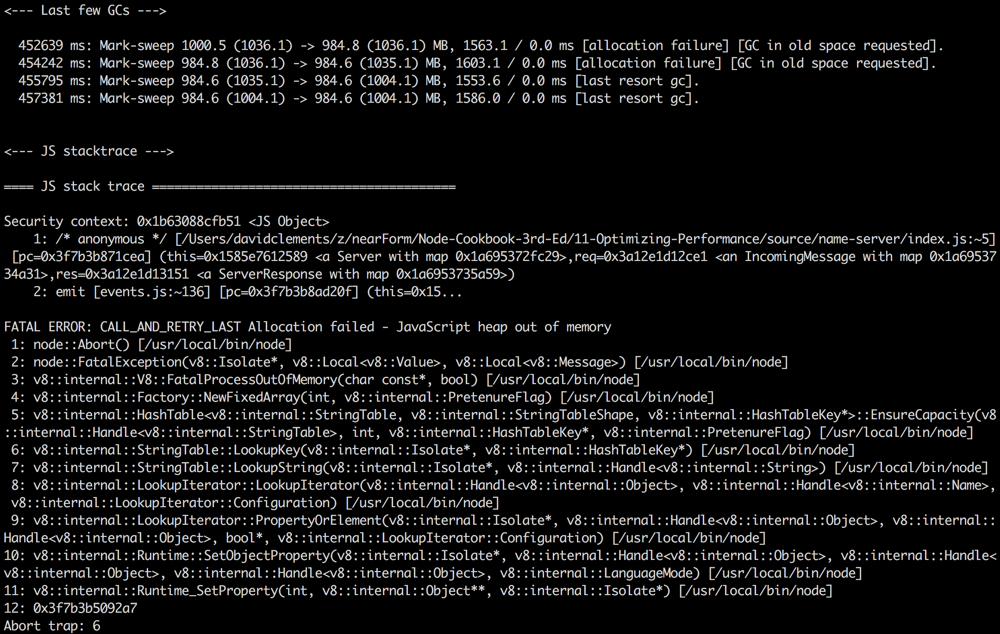
*Eventually our server crashes*

We can use the `--inspect` flag to start our server and initialize the Chrome Devtools Inspect Debugger protocol.

```sh
$ node --inspect index.js
Debugger listening on port 9229.
Warning: This is an experimental feature and could change at any time.
To start debugging, open the following URL in Chrome:
    chrome-devtools://devtools/remote/serve_file/@60cd6e859b9f557d2312f5bf532f6aec5f284980/inspector.html?experiments=true&v8only=true&ws=localhost:9229/node
```

If we copy and paste the `chrome-devtools://` URI into Chrome we'll be presented an instance of Devtools.


*Devtools Connected to Node*

> #### Inspecting Node below v6.3.x
> If we need to debug memory usage in a version of Node that pre-dates `--inspect` flag support we can achieve the equivalent with [node-inspector](http://npm.im/node-inspector)

There are three tabs at the top of Devtools ("Console", "Sources" and "Profile"), for our purposes we want to select the "Profiles" tab.

We'll then be presented with the profiling section, we need to select the "Take Heap Snapshot" radio button, and then press the "Take Snapshot" button. 


*Profile -> Take Heap Snapshot -> Take Snapshot*

This should create the following screen:


*Our initial snapshot*

Now we'll use `autocannon` to put the server under some pressure, so we can expose the leak. 

In a terminal we run:

```sh
$ autocannon localhost:8080
```

This will use `autocannon` defaults (10 connections, 10 seconds) to bombard the server with requests.

Now we'll take another heap snapshot, we can return to the main profiles screen by hitting the "Profiles" label, above the "Heap Snapshots" heading in the left panel.


*Returning to the main profiles screen*

From here we can press the "Take Snapshot" button again, will generate a second snapshot (named "Snapshot 2" in the left panel). Notice how the second snapshot is 10 times the size of the first (~50mb vs ~5mb).

Next we can use the "Comparison" view to compare our first snapshot to the second, this is located in a drop down currently displaying a label titled "Summary". 

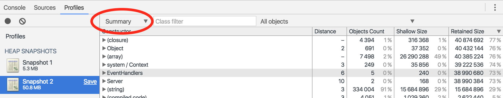
*Heapdump View Dropdown*

When we click this, we're presented with a menu which has a "Comparison" option, this is selection we want to make.

<br>
*Heapdump View Options*

Every entity in the heap is grouped by Constructor (the JavaScript equivalent of a base class). Some of the constructors are named after v8 native types (`(array)`, `(string)`, some after built-in JavaScript types (`Object`) and others have the name as defined in user space `HTTPPARSER`. 

The Comparison view calculates entity count and memory size deltas between the two snapshots, summarising these deltas at the constructor group level. The constructor types are then ordered according to delta size, with the biggest deltas at the top.


*Comparison View*


If we drill down into the top constructor (by clicking the small right arrow next to the `(array)` constructor) we may have a clue to where the leak is happening, and why:

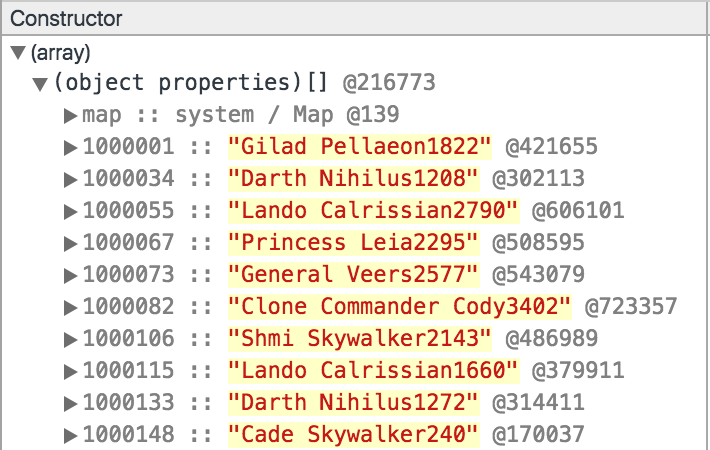<br>
*Drilling down into the constructor with largest delta*

Instead of *just* keeping a counter for the amount of times a name is used, we're accidentally storing each unique name. This means our `names` object is going to incrementally grow on each and every request.

Let's fix it, by rewriting our `createName` function like so:

```js
function createName () {
  var result = starwarsName()
  names[result] = names[result] ? 
    names[result] + 1 :
    1
  return result + names[result]
}
```

We can save these changes in a new folder (which we'll call `non-leaky`). 

Now, if we we're to follow the same exact process with the `non-leaky` server, generating two snapshots and going into "Comparison" view we should see a different story.

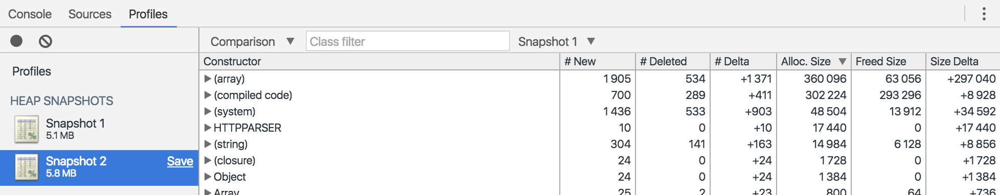
*Heap Snapshot of our non-leaky server*

### How it works

The V8 JavaScript engine is used by both Chrome and Node.js, this allows for compatibility in tooling. The V8 engine retains a heap of all objects and primitives that have are referenced in some way in the JavaScript code. The JavaScript heap can be exposed via V8's internal `v8_inspector` API, which in turn has a remote interface that can queried and controlled over a WebSocket connection. 

Chrome Devtools has the ability to connect to and interact with remote inspector connections. The `chrome-devtools://` URI supplied when we run `node` with the `--inspect` flag loads a instance of Devtools that is instructed via the URI to connect to exposed inspection WebSocket (notice the last part of the URI: `ws=localhost:9229/node`). 

Once connected, we can perform any action on our Node process that can be performed in the browser - including taking a snapshot of V8's heap.

Once we had connected Devtools to the process, we take an initial heap snapshot, prior to interacting with the server.

Then we generated load on the server with `autocannon` to simulate usage over time. In our case, we used the `autocannon` defaults (10 connections for 10 seconds). In another scenario we may have had to specify higher load for a longer period to expose a leak, it depends on the severity of the leak. 

Now our next heap snapshot reveals the effect our load has had on memory usage. 

If the size of the second snapshot is significantly higher than the first, it's a good indicator that there's a leak. 

We find the area of our leak by using the Comparison view, this supplies deltas between the two snapshots and places the largest delta at the top. All that's left is inspecting these areas to see where all the extra memory usage is coming from. 

In our case the clue is that there's Star Wars names everywhere and even in the first ten we can some are repeating (Darth Nihilus and Lando Calrissian) with different numbers suffixed.

Items are grouped by "Constructor", in our case the constructor group with the highest delta is `(array)` followed by `(string)`. The `(string)` delta makes perfect sense, all of our Star Wars names are strings, so in both cases our deltas correspond to the same items. However the `(array)` constructor could be confusing at first. If we were dealing with a JavaScript array, the constructor would actually be `Array`, however `(array)` is an internal structure used by V8 to store an objects keys. This leads us to the conclusion that the leak is occurring because of many keys being added to an object.

We rewrite our `createName` function to ensure that only the name (without a number) is stored as a key in the `names` object and then run through same heap snapshot workflow to validate our changes.

The second snapshot on our non-leaky code is still marginally larger - the `names` object will still be populated, but only with the total amount of possible Star Wars names, there is also likely additional memory usage from lazy initialization at the core level which may take place after the first request (and/or at certain request count thresholds).

### There's more

Let's check out an easy way to monitor and visualize memory usage in the terminal, and explore another aspect of memory management in Node: Garbage collection.

#### Visualizing Memory Usage in the Terminal

There are plenty of tools for visualising a processes memory usage, however these will only supply total memory usage. 

We can get a more granular breakdown of memory by asking V8. 

Node's `process.memoryUsage` function will output three memory usage figures, the Resident Set Size (`rss`), Total Heap Size (`heapTotal`), and Heap Used (`heapUsed`). 

```sh
$ node -p "process.memoryUsage()"
{ rss: 19095552, heapTotal: 8425472, heapUsed: 3949936 }
```

These terms are relevant to V8's memory scheme. The Resident Set is the amount of memory a process has allocated for itself - the total memory that has been reserved. Similarly the Total Heap Size is also an amount of memory set aside by the process for the heap. Finally the heap used portion relates to items that actually have references (are not assigned for garbage collection). 

The V8 memory scheme also includes a code segment (our code, dependency code, core code) and a stack. Since the code segment is essentially static, and the stack is rapidly changing these data points are less relevant. 

The [climem](http://npm.im) tool can be used to graph the `rss`, `heapTotal` and `heapUsed` indicators in the terminal!

First we need to install it globally

```sh
$ npm install -g climem
```

Then locally into our project

```sh
$ npm install --save-dev climem
```

Now we use the `-r` flag to externally require `climem` into our (leaky) process:

```sh
$ node -r climem index.js
```

This will create a file in the same directory named `climem-{PID}` where `{PID}` is the process ID of our node process. 

Let's say the process ID is 30277, the name of the file in our current folder would be `climem-30277`

To begin graphing memory usage, we open a new terminal and run 

```sh
$ climem climem-30277
```

Now we can put our leaky server under some load and see what happens to memory over time:

```sh
$ autocannon localhost:8080
```

This will cause climem to graph something similar to the following:


*`climem` graph*

The initial jump at the start of the graph is where climem connects to the process. The big climb in the middle is where we ran `autocannon` against the server. The drop in the middle of the climb appears to be a garbage collection. The steep climb in memory would have forced V8 to do a GC sweep and wipe anything laying around. The straight line followed by a drop off at the end is essentially V8 de-escalating defensive memory provisioning. That is, the process memory isn't under pressure any more, it's probably safe to deallocate additionally allocated memory. Notice that the severe declines apply to RSS and Heap Total, whereas Heap Used drops only very slightly (possibly another minor GC).

### See also

TBD

[autocannon]: https://github.com/mcollina/autocannon
[wrk]: https://github.com/wg/wrk
[express]: http://expressjs.com
[benchmark]: https://github.com/bestiejs/benchmark.js
[V8]: https://developers.google.com/v8/
[0x]: https://github.com/davidmarkclements/0x
[mongo]: https://www.mongodb.com
[lru-cache]: https://github.com/isaacs/node-lru-cache
[fastq]: https://github.com/mcollina/fastq
