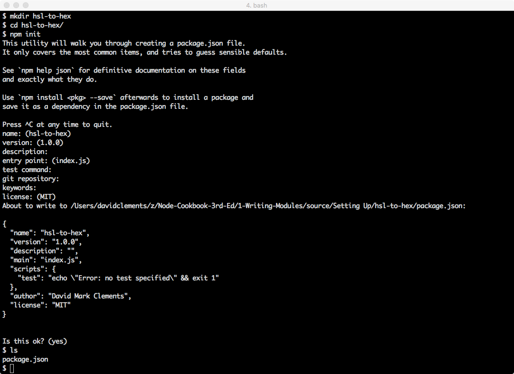
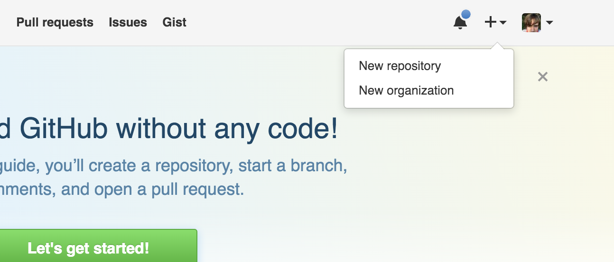
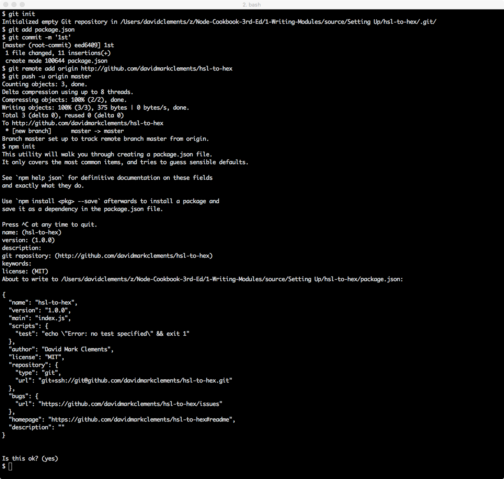
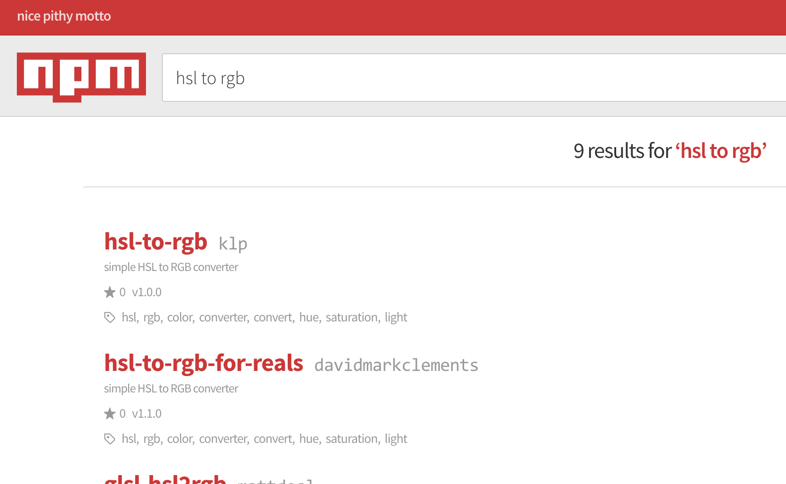
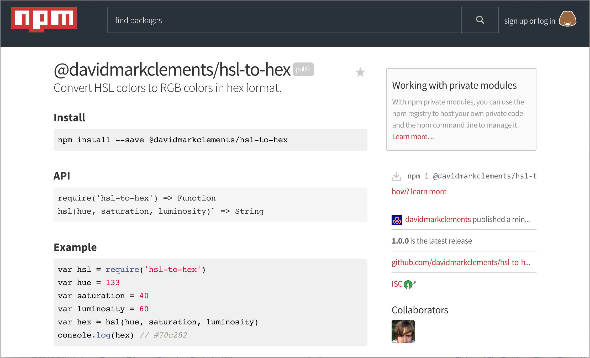

# 1 Writing Modules

This chapter covers the following topics

* Node's module system
* Initializing a module
* Writing a modules
* Tooling around modules
* Publishing modules
* Setting up a private module repository 
* Best practices

## Introduction

In idiomatic Node, the module is the fundamental unit of logic. Applications or systems should consist of many generic modules composed together while domain specific logic ties modules together at the application level. In this chapter we'll learn how Node's module system works, how to create modules for various scenarios and how we can reuse and share our code.


## Scaffolding a Module

### Getting Ready

> #### Installing Node 
> 
> If we don't already have Node installed, we can go to <https://nodejs.org> to pick up the latest version for our operating system.

If Node is on our system, then so is the `npm` executable. 

`npm` is the default package manager for Node, it's useful for 
creating, managing, installing and publishing modules. 

Before we run any commands, let's tweak the `npm` configuration
a little:

```sh
npm config set init.author.name "<name here>"
```

This will speed up module creation and ensure each package we create has a consistent author name, thus avoiding typos and variation of our name. 


> #### npm stands for.. 
> 
> Contrary to popular belief, `npm` is not an acronym for
> Node Package Manager, in fact it stands for "npm is Not 
> An Acronym", which is why it's not called NINAA.


### How to do it

Let's say we want to create a module that converts HSL (hue, saturation, luminosity) values into a hex based RGB representation, such as would be used in CSS (for example: `#fb4a45`).

`hsl-to-hex` seems like a good name, so let's make a new 
folder for our module and `cd` into it.

```sh
mkdir hsl-to-hex
cd hsl-to-hex
```

Every Node module must have a `package.json` file, which holds
meta data about the module. 

Instead of manually creating a `package.json` file, we can simply execute the following command in our newly created module folder:

```sh
npm init
```

This will ask a series of questions. We can hit enter for every question without supplying an answer. Notice how the default module `name` corresponds to the current working directory, and the default `author` is the `init.author.name` value we set earlier on. 



*An `npm init` should look like this*


Upon completion we should have a `package.json` file that looks something like the following:

```json
{
  "name": "hsl-to-hex",
  "version": "1.0.0",
  "description": "",
  "main": "index.js",
  "scripts": {
    "test": "echo \"Error: no test specified\" && exit 1"
  },
  "author": "David Mark Clements",
  "license": "MIT"
}
```

### How it Works

When Node is installed on our system, `npm` comes bundled with it.

The `npm` executable is written in JavaScript, and runs on Node.

The `npm config` command can be used to permanently alter settings. In our case we changed the `init.author.name` setting so that `npm init` would reference it for
the default during a modules initialization.

We can list all current configuration settings with `npm config ls`. 

> #### Config Docs 
> 
> See <https://docs.npmjs.com/misc/config> for all possible `npm` configuration settings

When we run `npm init` the answers to prompts are stored in an object, serialized as JSON and then saved to a newly created `package.json` file in the current directory.

### There's More

Let's find out some more ways to automatically manage the content of the `package.json` file via the `npm` command.

#### Reinitializing

Sometimes additional meta data can be available after we've created a module. A typical scenario can arise when we initialize our module as a git repository and add a remote endpoint after creating the module.

> ##### Git and GitHub  
> 
> If we've not used the `git` tool and GitHub before,
> we can refer to <http://help.github.com> to get started.
> 
> If we don't have a GitHub account we can head to <http://github.com> to get a free account.

To demonstrate, let's create a GitHub repository for our module.
Head to GitHub and click the plus symbol in the top right, then select
"new repository".


*Select "New repository"*

Specify the name as "hsl-to-hex" and click "Create Repository".

Back in the terminal, inside our module folder, we can now run:

```sh
git init
git add package.json
git commit -m '1st'
git remote add origin http://github.com/<username>/hsl-to-hex
git push -u origin master
```

Now here comes the magic part, let's initialize again (simply press enter for every question):

```sh
npm init
```


*Reinitializing*

This time the Git remote we just added was detected and became the default answer for the "git repository" question. Accepting this default answer meant that the `repository`, `bugs` and `homepage` fields were added to `package.json`.

A repository field in the `package.json` is an important addition when it comes to publishing open source modules since it will be rendered as a link on the modules information page on <http://npmjs.com>. 

A repository link enables potential users to peruse the code prior to installation. Modules that can't be viewed before use are far less likely to be considered viable.


#### Versioning

The `npm` tool supplies other functionality to help with module creation and management workflow. 

For instance the `npm version` command can allow us to manage our module's version number according to semver semantics. 

> #### semver 
> semver is a versioning standard. A version consists of three numbers separated by a dot, for example `2.4.16`. The position of a number denotes specific information about the version in comparison to other versions. The three positions are known as `MAJOR.MINOR.PATCH`. The PATCH number is increased when changes have been made that don't break existing functionality nor add any new functionality. For instance, a bug fix would be considered a patch. The MINOR number should be increased when new backwards compatible functionality is added. For instance the adding of a method. The MAJOR number increases when backwards-incompatible changes are made.
> See <http://semver.org/> for more information.

If we were to a fix a bug we would want to increase the PATCH number. We could either manually edit the `version` field in `package.json`, setting it to `1.0.1`, or we can execute the following: 

```sh
npm version patch
```

This will increase the version field in one command. Additionally, if our module is a Git repository, it will add a commit based on the version (in our case 'v1.0.1') which we can then immediately push. 

When we ran the command, `npm` output the new version number. However we can double check the version number of our module without opening `package.json`:

```sh
npm version
```

This will output something similar to the following:

```javascript
{ 'hsl-to-hex': '1.0.1',
  npm: '2.14.17',
  ares: '1.10.1-DEV',
  http_parser: '2.6.2',
  icu: '56.1',
  modules: '47',
  node: '5.7.0',
  openssl: '1.0.2f',
  uv: '1.8.0',
  v8: '4.6.85.31',
  zlib: '1.2.8' }
```

The first field is our module along with its version number.

If we added new backwards compatible functionality, we could run:

```sh
npm version minor
```

Now our version is `1.1.0`. 

Finally for a major version bump we can run the following:

```sh
npm version major
```

This sets the our modules version to `2.0.0`.

Since we're just experimenting and didn't make any changes we should set our version back to `1.0.0`.

We can do this via the `npm` command as well:

```sh
npm version 1.0.0
```

### See also

* TODO LATER


## Installing Dependencies

### Getting ready

For this recipe, all we need is a command prompt open in the `hsl-to-hex` folder from the **Scaffolding a Module** recipe. 

### How to do it

Our `hsl-to-hex` module can be implemented in two steps

1. convert the hue degrees, saturation percentage and luminosity percentage to corresponding red, green and blue numbers between 0 and 255
2. convert the RGB values to HEX

Before we tear into writing an HSL to RGB algorithm, we should check whether this problem has already been solved.

The easiest way to check is to head to <http://npmjs.com> and perform a search.


*Oh look somebodies already solved this*

After some research we decide that the `hsl-to-rgb-for-reals` module is the best fit.

Ensuring we are in the `hsl-to-hex` folder, we can now install our dependency with the following:

```sh
npm install --save hsl-to-rgb-for-reals
```

Now let's take a look at the bottom of `package.json`: 

```sh
tail package.json #linux/osx
```

```sh
type package.json #windows
```

Tail output should give us:

```  },
  "bugs": {
    "url": "https://github.com/davidmarkclements/hsl-to-hex/issues"
  },
  "homepage": "https://github.com/davidmarkclements/hsl-to-hex#readme",
  "description": "",
  "dependencies": {
    "hsl-to-rgb-for-reals": "^1.1.0"
  }
}
```

We can see that the dependency we installed has been added to a `dependencies` object in the `package.json` file.

### How it works

The top two results of the npm search are `hsl-to-rgb` and `hsl-to-rgb-for-reals`. The first result is unusable, because the author of the package forgot to export it and is unresponsive to fixing it. The `hsl-to-rgb-for-reals` module is a fixed version of `hsl-to-rgb`.

This situation serves to illustrate the nature of the npm ecosystem.

On the one hand there are over 200,000 modules and counting, on the other many of these modules are of low value. Nevertheless, the system is also self healing, in that if a module is broken and not fixed by the original maintainer a second developer often assumes responsibility and publishes a fixed version of the module.

When we run `npm install` in a folder with a `package.json` file, a `node_modules` folder is created (if it doesn't already exist). Then the package is downloaded from the npm registry and saved into a subdirectory of `node_modules` (for example, `node_modules/hsl-to-rgb-for-reals`). 


> #### npm 2 vs npm 3 
>
> Our installed module doesn't have any dependencies of its own. But if it did the sub-dependencies would be installed differently depending on whether we're using version 2 or version 3 of `npm`. 
>
> Essentially `npm` 2 installs dependencies in a tree structure, for instance `node_modules/dep/node_modules/sub-dep-of-dep/node_modules/sub-dep-of-sub-dep`. Conversely `npm` 3 follows a maximally flat strategy where sub-dependencies are installed in the top level `node_modules` folder when possible. For example `node_modules/dep`, `node_modules/sub-dep-of-dep` and `node_modules/sub-dep-of-sub-dep`. This results in fewer downloads and less disk space usage. `npm` 3 resorts to a tree structure in cases where there's two version of a sub-dependency, which is why it's called a "maximally" flat strategy. 
>
> Typically if we've installed Node 4 or above, we'll be using `npm` version 3.

### There's more

#### Installing Development Dependencies

We usually need some tooling to assist with development and maintenance of a module or application. The ecosystem is full of programming support modules, from linting, to testing to browser bundling to transpilation.

In general we don't want consumers of our module to download dependencies they don't need.
Similarly, if we're deploying a system built in node, we don't want to burden the continuous integration and deployment processes with superfluous, pointless work.

So we separate our dependencies into production and development categories.

When we use `npm --save install <dep>` we're installing a production module.

To install a development dependency we use `--save-dev`.

Let's go ahead and install a linter. 

> ##### standard  
> 
> `standard` is a JavaScript linter that enforces an unconfigurable rule set
> The premise of this approach is that we should stop using precious time 
> up on bikeshedding about syntax.

All the code in this book uses the `standard` linter so we'll install that. 

```sh
npm install --save-dev standard
```

> ##### semistandard  
> 
> If the absence of semi-colons is abhorrent, we can choose to 
> install `semistandard` instead of `standard` at this point. The lint rules
> match those of `standard`, with the obvious exception of requiring semi-colons.
> Further, any code written using standard can be reformatted to `semistandard`
> using the `semistandard-format` command tool. Simply `npm -g i semistandard-format` to get started with it.

Now let's take a look at the `package.json` file:

```json
{
  "name": "hsl-to-hex",
  "version": "1.0.0",
  "main": "index.js",
  "scripts": {
    "test": "echo \"Error: no test specified\" && exit 1"
  },
  "author": "David Mark Clements",
  "license": "MIT",
  "repository": {
    "type": "git",
    "url": "git+ssh://git@github.com/davidmarkclements/hsl-to-hex.git"
  },
  "bugs": {
    "url": "https://github.com/davidmarkclements/hsl-to-hex/issues"
  },
  "homepage": "https://github.com/davidmarkclements/hsl-to-hex#readme",
  "description": "",
  "dependencies": {
    "hsl-to-rgb-for-reals": "^1.1.0"
  },
  "devDependencies": {
    "standard": "^6.0.8"
  }
}
```

We now have a `devDependencies` field alongside the `dependencies` field.

When our module is installed as a sub-dependency of another package, 
only the `hsl-to-rgb-for-reals` module will be installed whilst the `standard` module since will be ignored since it's irrelevant to our modules actual implementation.

If this `package.json` file represented a production system we could run the install step with the `--production` flag like so:


```js
npm install --production
```

Alternatively, this can be set in production environment with the following command:

```js
npm config set production true
```

Currently we can run our linter using the executable installed in the `node_modules/.bin` folder. For example:

```js
./node_modules/.bin/standard
```

This is ugly and not at all ideal. See [Using npm run scripts](#using-npm-run-scripts) for a more elegant approach. 

#### Using npm run scripts

Our `package.json` file currently has a `scripts` property that looks like this:

```json
  "scripts": {
    "test": "echo \"Error: no test specified\" && exit 1"
  },
```

Let's edit the `package.json` file and add another field, called `lint`. 

Like so:

```
  "scripts": {
    "test": "echo \"Error: no test specified\" && exit 1",
    "lint": "standard"
  },
```

Now, as long as we have `standard` installed as a development dependency of our module (see [Installing Development Dependencies](#installing-development-dependencies)), we can run the following command to run a lint check on our code:

```sh
npm run-script lint
```

This can be shortened to:

```sh
npm run lint
```

When we run an npm script, the current directory's `node_modules/.bin` folder is appended
to the execution contexts `PATH` environment variable. This means even if we 
don't have the `standard` executable in our usual system `PATH`, we can reference
it in an npm script as if it was in our `PATH`.


Some consider lint checks to be a precursor to tests.

Let's alter the `scripts.test` field like so:

```sh
  "scripts": {
    "test": "npm run lint",
    "lint": "standard"
  },
```

> ##### Chaining commands  
> 
> Later we could append other commands to the `test` script using 
the double ampersand (`&&`), to run a chain of checks. For instance, 
`"test": "npm run lint && tap test"`

Now to run the `test` script:

```
npm run test
```

Since the `test` script is special, we can simply run 

```
npm test
```

#### Eliminating The Need for Sudo

The `npm` executable can install both local and global
modules. Global modules are mostly installed so their 
as command line utilities can be used system wide. 

On OSX and Linux the default `npm` set up requires `sudo`
access to install a module.

For example, for following will fail on a typical OS X or Linux 
system with the default `npm` set up:

```js
npm -g install cute-stack # <-- oh oh needs sudo
```

This is unsuitable for several reasons. Forgetting to use `sudo`
becomes frustrating, we're trusting `npm` with root access
and accidentally using `sudo` for a local install causes 
permissions problems (particularly with the npm local cache). 

The `prefix` setting stores the location for globally installed modules, we can view this with:

```sh
npm config get prefix
```

Usually the output will be `/usr/local'. To avoid the use of `sudo` all we have to do is set ownership permissions on any subfolders in `/usr/local` used by `npm`:

```sh
 sudo chown -R $(whoami) $(npm config get prefix)/{lib/node_modules,bin,share}
```

Now we can install global modules without root access:

```js
npm -g install cute-stack # <-- now works without sudo
```

If changing ownership of system folders isn't feasible, 
we can use a second approach which involves changing the
`prefix` setting to a folder in our home path:

```sh
mkdir ~/npm-global
npm config set prefix ~/npm-global
```

We'll also need to set our `PATH`:

```
export PATH=$PATH:~/npm-global/bin
source ~/.profile
```

The `source` essentially refreshes the terminal environment to reflect the changes we've made.

### See also

* TODO LATER

## Writing module code

### Getting Ready

Let's ensure that we have a folder called `hsl-to-hex`, with a `package.json` file in it. The `package.json` file should contain `hsl-to-rgb-for-reals` as a dependency. If there isn't a `node_modules` folder, we need to make sure we run `npm install` from the command line with the working directory set to the `hsl-to-hex` directories path.

To get started let's create a file called `index.js in the `hsl-to-hex` folder, then open it in our favourite text editor. 

### How to do it

The first thing we'll want to do in our `index.js` file is specify any dependencies we'll be using.

In our case, there's only one dependency

```js
var toRgb = require('hsl-to-rgb-for-reals')
```

Typically all dependencies should be declared at the top of the file.

Now let's define an API for our module, we're taking hue, saturation and luminosity values and outputting a CSS compatible hex string.

Hue is in degrees, between 0 and 359. Since degrees a cyclical in nature, we'll support numbers greater than 359 or less than 0 by "spinning" them around until they fall within the 0 to 359 range. 

Saturation and luminosity are both percentages, we'll represent these percentages with whole numbers between 0 and 100. For these numbers we'll need to enforce a maximum and a minimum, anything below 0 will become 0, anything above 100 will become 100.

Let's write some utility functions to handle this logic:

```js
function max (val, n) {
  return (val > n) ? n : val
}

function min (val, n) {
  return (val < n) ? n : val
}

function cycle (val) {
  // for safety:
  val = max(val, 1e7)
  val = min(val, -1e7)
  // cycle value:
  while (val < 0) { val += 360 }
  while (val > 359) { val -= 360 }
  return val
}
```

Now for the main piece, the `hsl` function:

```js
function hsl (hue, saturation, luminosity) {
  // resolve degrees to 0 - 359 range
  hue = cycle(hue)

  // enforce constraints
  saturation = min(max(saturation, 100), 0)
  luminosity = min(max(luminosity, 100), 0)

  // convert to 0 to 1 range used by hsl-to-rgb-for-reals
  saturation /= 100
  luminosity /= 100

  // let hsl-to-rgb-for-reals do the hard work
  var rgb = toRgb(hue, saturation, luminosity)

  // convert each value in the returned RGB array
  // to a 2 character hex value, join the array into
  // a string, prefixed with a hash
  return '#' + rgb
    .map(function (n) {
      return (256 + n).toString(16).substr(-2)
    })
    .join('')
}
```

In order to make our code into a bona fide module we have to export it:

```js
module.exports = hsl
```

We can run a few sanity checks to ensure our code is working.

Maximum saturation and luminosity should be white (`#ffffff`), 
regardless of hue. So, with our current working directory set 
to our modules folder, let's try the following:

```sh
node -p "require('./')(0, 100, 100)"
```

This should print `#ffffff`.

> #### The -p flag
> 
> The `-p` flag tells node to evaluate the supplied string and 
print the result to the terminal. 

Okay that was easy. Let's try another test. A saturation of 0%
and a luminosity of 50% should create red, green and blue values
that are half way between 0 and 256 (128). In hex this is `80`,
so the following should output `#808080`:

```sh
node -p "require('./')(0, 0, 50)"
```

We've checked luminosity and saturation, let's finish by ensuring
that hue input works as expected.

Hue represents the color spectrum, starting and finishing with red, 
defined in degree points. 


*Hue degrees*

As we know, setting both saturation and luminosity to 100% will
always result in white. After 50% luminosity colours beyond the
defined hue will be added to further increase the brightness of 
the colour. This means that we should get a pure hue by setting
saturation to 100% and luminosity to 50%. 

So, the following should output `#ff0000` (red)

```sh
node -p "require('./')(0, 100, 50)"
```

A hue of 240 should give exact blue (`#0000ff`):

```sh
node -p "require('./')(240, 100, 50)"
```

And 180 should result in cyan (`#00ffff`):

```sh
node -p "require('./')(180, 100, 50)"
```

### How it works

The algorithmic heavy lifting is performed by our dependency `hsl-to-rgb-for-reals`. This is often the case in the landscape of Node's ecosystem. Many fundamental computer science problems have already been solved (often multiple times) by third party contributors. 

We add some additional sanity to the inputs (like rotating 360 degrees back to 0 and enforcing minimum and maximums) and then convert the output from decimal values to hex values, prefixing them with a hash (`#`). 

Since the `hsl-to-rgb-for-reals` module returns an array of values between 0 and 255, we can use the native `map` method to iterate over each element in the array and convert it from base 10 to base 16. Then we `join` the resulting array into a string.


In our quick command line checks, we call the `node` binary with the `-p` flag.
This simply evaluates a supplied expression, and outputs its value. In each
case the expression involves calling `require`. 

The `require` function is central to Node's module system, when it's called the module system performs a series of steps. 

First `require` has to locate the module according to the supplied argument. Depending on the input, the module may be a local file, a core module or a separately installed module. 

We supplied a path `'./'`, so the `require `function attempts to load the current directory as a module. In order to do this it looks for a `package.json` file, and looks up the `main` field in the `package.json` file. The `main` field in our `package.json` file is `'index.js'`, so `require` recognises this file as the modules entry point. In the absence of a `package.json` file or `main` field, `require` also defaults to `index.js` as the entry point. 

Once an entry point file has been identified, Node synchronously loads it into a string. The modules code is wrapped with the following:

```js
(function (exports, require, module, __filename, __dirname) {
  /* module code here */
})
```

The resulting string is passed through the `vm` module's `runInThisContext` method, which essentially tells the JavaScript engine to compile the string
into a function. This function is then called with the five 
parameters dictated in the wrapper (`exports`, `require`, `module`, `__filename`, `__dirname`). The `exports` argument is an empty object,
the `module` argument is an object with an `exports` property pointing 
to the `exports` object. So there are two reference to the initial exports object: the `exports` parameter and the `module.exports` property. 

The value returned from `require` is the `module.exports` property.

In our code we overwrote the `module.exports` property with the `hsl` function, which is why we can call the result of `require` immediately (for example `require('./')(180, 100, 50)`). An alternative approach is to simply append properties to the `exports` object, but this doesn't allow for exporting a function, only an object. 


### There's more

#### Adding tests

If bugs arise, or we decide to make changes, or extend functionality it would be nice if we could run a single command that runs some checks against our code so we can be confident that we're not unintentionally breaking anything. We could lump all of our `node -p` checks from the main recipe into a single bash (or batch) file, but there's a more standard and elegant approach.

Let's write some tests.

First we'll need a test library, let's use the `tap` module. The `tap` tool is simple, doesn't require it's own test runner, has built in coverage analysis and outputs TAP, the Test Anything Protocol, which is used across many languages.

```sh
npm install --save-dev tap
```

Remember we're installing with `--save-dev` because this dependency would not be required in production.

Now, assuming we're in the `hsl-to-hex-folder`, let's create a `test` folder 

```sh
mkdir test
```

> #### Test writing 
> For an excellent article on test writing and TAP output, check out Eric Elliots blog post [Why I use Tape instead of Mocha & so should you](https://medium.com/javascript-scene/why-i-use-tape-instead-of-mocha-so-should-you-6aa105d8eaf4#.gjt1h4hj9)

Now, in the `test` folder let's create an `index.js` file, with the following code:

```js
var hsl = require('../')
var test = require('tap').test

test('pure white', function (assert) {
  var expected = '#ffffff'
  var actual = hsl(0, 100, 100)
  var it = 'max saturation and luminosity should return pure white'
  assert.is(actual, expected, it)
  assert.end()
})

test('medium gray', function (assert) {
  var expected = '#808080'
  var actual = hsl(0, 0, 50)
  var it = '0% saturation, 50% luminosity should be medium gray'
  assert.is(actual, expected, it)
  assert.end()
})

test('hue - red', function (assert) {
  var expected = '#ff0000'
  var actual = hsl(0, 100, 50)
  var it = '0deg should be red'
  assert.is(actual, expected, it)
  assert.end()
})

test('hue - blue', function (assert) {
  var expected = '#0000ff'
  var actual = hsl(240, 100, 50)
  var it = '240deg should be blue'
  assert.is(actual, expected, it)
  assert.end()
})

test('hue - cyan', function (assert) {
  var expected = '#00ffff'
  var actual = hsl(180, 100, 50)
  var it = '180deg should be cyan'
  assert.is(actual, expected, it)
  assert.end()
})

test('degree overflow', function (assert) {
  var expected = hsl(1, 100, 50)
  var actual = hsl(361, 100, 50)
  var it = '361deg should be the same as 1deg'
  assert.is(actual, expected, it)
  assert.end()
})

test('degree underflow', function (assert) {
  var expected = hsl(-1, 100, 50)
  var actual = hsl(359, 100, 50)
  var it = '-1deg should be the same as 359deg'
  assert.is(actual, expected, it)
  assert.end()
})

test('max constraint', function (assert) {
  var expected = hsl(0, 101, 50)
  var actual = hsl(0, 100, 50)
  var it = '101% should be the same as 100%'
  assert.is(actual, expected, it)
  assert.end()
})

test('max constraint', function (assert) {
  var expected = hsl(0, -1, 50)
  var actual = hsl(0, 0, 50)
  var it = '-1% should be the same as 0%'
  assert.is(actual, expected, it)
  assert.end()
})

```

In the `package.json` file we'll edit the `scripts.test` field to read thusly:

```json
    "test": "npm run lint && tap --cov test",
```

We can see if our tests are passing by running `npm test`

```sh
npm test
```

We also get to see a coverage report which was enabled with the `--cov` flag.

> #### coverage 
> 
> Coverage is a percentage of the amount of logic paths that were touched by our tests. This can be measured in several ways, for instance did we cover all the if/else branches? Did we cover every line of code? This can provide a sort of quality rating for our tests. However there are two things to consider when it comes to coverage. First, 100% coverage does not equate to 100% of possible scenarios. There could be some input that causes our code to crash or freeze. For example, what if we passed in a hue of `Infinity`. In our case we've handled that scenario, but haven't tested it. Yet we have 100% coverage. Secondly, in many real world cases, getting the last 20% of coverage can become the most resource intensive part of development and it's debatable whether that last 20% will deliver on the time and effort investment required. 


#### Modernizing syntax

Recent Node.js versions support modern JavaScript syntax (known as
EcmaScript 6), let's use some of these shiny new JavaScript features to improve the tests we wrote in the previous section.

> #### EcmaScript 6 
> Learn more about EcmaScript 6 at <http://es6-features.org/>

For this to work, we'll need at least Node version 5 installed,
preferable Node version 6 or greater. 

> #### Managing Node Versions 
> Check out [nvm](https://github.com/creationix/nvm) 
> or [n](http:/npm.im/n) for an easy way to switch between
> node versions

Node v6 and above should support all of the syntax we'll be using,
Node v5 will support all of it, as long as we pass a special flag. 

> #### Transpilation 
> For version below Node 5, or to use syntax that currently isn't available in even in the latest versions of Node we can fall back to transpilation. Transpilation is essentially compiling a later version of a language into an earlier version. This is beyond our scope, but check out <babeljs.io> for more information on how to transpile.


If we're using Node version 5 we'll need to adjust the `test` field in the
`package.json` file like so: 

```json
"test": "npm run lint && tap --node-arg='--harmony-destructuring' --cov test",
```

The `--node-arg` is supplied to the `tap` test runner to pass through a Node specific flag which will be applied via tap when it runs out tests.

In this case we passed the `--harmony-destructuring` flag, this turns
on an experimental syntax in Node version 5 (as mentioned, we don't need to do this for Node v6 and up). 

> #### Syntax Switches 
> Get a full list of experimental syntax and behaviours by running `node --v8-options | grep harmony` or if we're on windows: `node --v8-options | findstr harmony`.

Now let's rewrite out test code like so:

```js
const hsl = require('../')
const {test} = require('tap')

test('pure white', ({is, end}) => {
  const expected = '#ffffff'
  const actual = hsl(0, 100, 100)
  const it = `
    max saturation and luminosity should return pure white
  `
  is(actual, expected, it)
  end()
})

test('medium gray', ({is, end}) => {
  const expected = '#808080'
  const actual = hsl(0, 0, 50)
  const it = `
    0% saturation, 50% luminosity should be medium gray
  `
  is(actual, expected, it)
  end()
})

test('hue', ({is, end}) => {
  {
    const expected = '#ff0000'
    const actual = hsl(0, 100, 50)
    const it = `
      0deg should be red
    `
    is(actual, expected, it)
  }
  {
    const expected = '#0000ff'
    const actual = hsl(240, 100, 50)
    const it = `
      240deg should be blue
    `
    is(actual, expected, it)
  }
  {
    const expected = '#00ffff'
    const actual = hsl(180, 100, 50)
    const it = `
      180deg should be cyan
    `
    is(actual, expected, it)
  }
  end()
})

test('degree overflow/underflow', ({is, end}) => {
  {
    const expected = hsl(1, 100, 50)
    const actual = hsl(361, 100, 50)
    const it = `
      361deg should be the same as 1deg
    `
    is(actual, expected, it)
  }
  {
    const expected = hsl(-1, 100, 50)
    const actual = hsl(359, 100, 50)
    const it = `
      -1deg should be the same as 359deg
    `
    is(actual, expected, it)
  }
  end()
})

test('max constraint', ({is, end}) => {
  {
    const expected = hsl(0, 101, 50)
    const actual = hsl(0, 100, 50)
    const it = `
      101% should be the same as 100%
    `
    is(actual, expected, it)
  }
  {
    const expected = hsl(0, -1, 50)
    const actual = hsl(0, 0, 50)
    const it = `
      -1% should be the same as 0%
    `
    is(actual, expected, it)
  }
  end()
})
```

Here we've used several EcmaScript 6 features, all of which are available out-of-the-box in Node 6. 

The features we've used are

* destructuring assignment (enabled with --harmony-destructuring on Node v5)
* arrow functions
* template strings (also known as template literals)
* `const` and block scope

Destructuring is an elegant shorthand for taking property from an object and loading into a variable. 

We first use destructuring assignment early on in our rewritten tests when we take `test` method from the exported `tap` object and load it into the `test` `const`, like so: 

```js
const {test} = require('tap')
```

This is equivalent to:

```js
const test = require('tap').tap
```

On one line this doesn't deliver much value but destructuring reveals its terse simplicity when we wish to extract several properties from an object and assign to variables of the same name. 

For instance, the following:

```js
var foo = myObject.foo
var bar = myObject.bar
var baz = myObject.baz
```

Can be achieved in one line with destructuring, with less noise and (subjectively) greater readability. Like so:

```js
var {foo, bar, baz} = myObject
```

We also destructure the `assert` object in each of our `test` callbacks. 

For instance the top line of  first test looks like this:

```
test('pure white', ({is, end}) => {
```

Parameter destructuring allows us to focus only on the properties we're interested in using for that function. It presents a clear contract to whatever's calling our function. Namely, for our case, the input object should have `is` and `end` properties.

> #### Destructuring 
> Find more detail about destructuring at <https://developer.mozilla.org/en/docs/Web/JavaScript/Reference/Operators/Destructuring_assignment>

Each of the callbacks supplied to our test are arrow functions, which look like this:

```js
var fn = (some, params) => { return 'something' }
```

When it makes sense, arrow functions we can also omit the braces and the `return` keyword:

```
[1,2,3,4,5].map(n => n * n) // [1, 4, 9, 16, 25]
```

We use arrow functions purely for aesthetics, removing noise enhances the focus of our code. 

> #### Arrow Functions 
> We should note that arrow functions behave differently to normal functions, in particular when it comes to the `this` context. 
> Find out more about arrow functions at <https://developer.mozilla.org/en/docs/Web/JavaScript/Reference/Functions/Arrow_functions>

Template strings are denoted with backticks (<code>`</code>) and can be multiline. We use these for our `it` constants purely for the multiline capabilities, since describing behaviour can often take up more than 80-100 columns, or more than one line. Template strings (the clue being in the name), also supply interpolation, like so:

```
var name = 'David'
console.log(`Hi name is ${name}`)
```

> #### Template strings 
> Find out more about template strings at <https://developer.mozilla.org/en-US/docs/Web/JavaScript/Reference/Template_literals>

Finally, EcmaScript 6 supplies two additional assignment keywords to the JavaScript lexicon: `let` and `const`. In JavaScript the lifetime of `var` assigned reference occurs within the closest parent function. The `let` and `const` keywords introduce the more traditional block-scoped behavior, where the references lifetime is relative to the closest block (for example, as denoted by the braces in a `for` loop). We used this to our advantage and merged some of the tests together. For instance, `hue - blue`, `hue - red` and `hue - cyan` could all be separate assertions in a single `hue` test. Block scoping makes it easy to maintain the repeating pattern of `expected`, `actual`, and `it` without clashing with neighbouring assertions. The `let` keyword is similar to `var` in that it allows for reassignment. The `const` keyword is a constant *reference* to a value (it does **not** make the value a constant). We use `const` throughout since we have no intention of reassigning our references, and if that occurred it would be a bug (in which case our tests would conveniently throw).

> #### Block Scope In JavaScript 
> For more info about block scope a look at Dr. Axel Rauschmayer's article at <http://www.2ality.com/2015/02/es6-scoping.html>

### See also

* TODO LATER

## Publishing a module

In this recipe we'll prepare our module to be published then publish it as a scoped package.

### Getting ready

We're going to publish our `hsl-to-hex` module we've been working on in previous recipes. We'll also want the (original) tests we wrote in the [Adding tests](#adding-tests) portion of the the [There's more](#theres-more-3) section of the [Writing module code](#writing-module-code) recipe.

If we don't have an [npmjs.org](http://npmjs.org) account we'll need to head over to <https://www.npmjs.com/signup> and get an account. Keep the npm username handy, we're going to need it. 

### How to do it

If we've just signed up for an npm account (as explained in the previous [Getting Ready](#getting-ready-4) section) we'll want to authorise our `npm` client with [npmjs.org](http://npmjs.org).

On the command line, we simply need to run:

```sh
npm login
```
Then supply the username, password, and email address we signed up with.

Every module should have a Readme explaining how it works. 

Let's create a Readme.md file with the following markdown:

<pre><code>
# hsl-to-hex

Convert HSL colors to RGB colors in hex format.

## Install 

```sh
npm install --save @davidmarkclements/hsl-to-hex
```
 
## API

```
require('hsl-to-hex') => Function
hsl(hue, saturation, luminosity)` => String
```

## Example

```js
var hsl = require('hsl-to-hex')
var hue = 133 hsl(133, 40, 60)
var saturation = 40
var luminosity = 60
var hex = hsl(hue, saturation, luminosity)
console.log(hex) // #70c282
```

## License

ISC
</code></pre>

In the install section of the readme, we should replace `@davidmarkclements/hsl-to-hex` with out own username. 

> #### Markdown 
> Markdown is a lightweight documentation syntax, see 
> <https://guides.github.com/features/mastering-markdown/>

As a courtesy, we'll also take the example we wrote in the Readme and
put it in an `example.js` file.

Let's create a file called `example.js` with the following contents:

```js
var hsl = require('hsl-to-hex')
var hue = 133 hsl(133, 40, 60)
var saturation = 40
var luminosity = 60
var hex = hsl(hue, saturation, luminosity)
console.log(hex) // #70c282
```

Now we'll make some final touches the `package.json` file.

First we'll reinitialize the module:

```sh
npm init
```

Following this command, we can simply press Enter in response to all questions. The output of `npm init` should show that a `description` field has been added, with its content taken from the `readme.md` file.

```json
  "description": "Convert HSL colors to RGB colors in hex format.",
```

Now let's open the `package.json` file and change the `name` field, 
by prefixing it with an at (`@`) symbol, followed by our npm username, 
followed by a forward slash (`/`). For instance: 

```json
  "name": "@davidmarkclements/hsl-to-hex",
```

Of course, instead of using `@davidmarkclements` we'll use whatever username we supplied to `npm login`. 

Finally, we're ready to publish:

```sh
npm publish --access=public
```

We should now be able to navigate to <https://www.npmjs.com/package/@davidmarkclements/hsl-to-hex> (where `@davidmarkclements` is the username we're using) so view the modules npm page. 




### How it works


### There's more

#### Listing Installed Modules

#### Bundling Dependencies

#### Everything Everywhere

### See also

* TODO LATER

## Using a private repository

### Getting ready

### How to do it

### How it works

### There's more

#### Module Security Audit

#### Scope Registries


### See also

* TODO LATER


