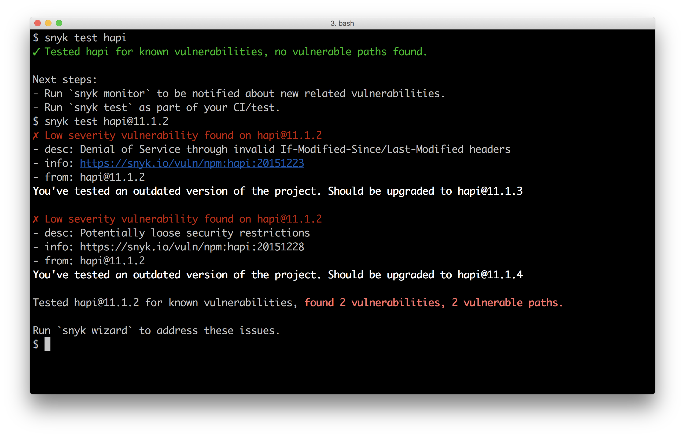

# 10 Dealing with Security

This chapter covers the following topics

* Injection
* Stress attacks
* Passive attacks
* Vulnerable configurations
* Path traversal
* Unicode exploits
* Escape sequences
* XSS, CSRF, DoS/DDoS
* DOR programmer error
* Server hardening
* Dependency auditing

## Introduction

It's far from controversial to assert that security is paramount.

Nevertheless, as is evident from highly notable security breaches
in recent years security mistakes are made all the time.

With a focus on handling adversarial input in a web application context, 
this chapter explores security fundamentals and good Node.js practices 
to help build more secure Node systems. 

## Detecting Dependency Vulnerabilities

Thanks to the wealth of modules on NPM, we're able to mostly
focus on application logic, relying on the ecosystem for 
canned solutions. This does, however, lead to large dependency
trees and security vulnerabilities can be discovered at any time,
even for the most conscientious, mature and popular modules and
frameworks. 

In this recipe we demonstrate how to detect vulnerabilities
in a projects dependency tree.

### Getting Ready

We'll create a folder called `app`, initialize it as 
a package install `express`:

```sh
$ mkdir app
$ cd app
$ npm init -y 
$ npm install express
```

We don't need to add any of our own code, since we're 
only checking dependencies.

### How to do it

We're going to use `auditjs` to automatically check our
dependency tree against vulnerability databases.

Let's install `auditjs` into our project `app` folder:

```sh
$ npm install --save-dev auditjs
```

Now let's add a field to the `scripts` object in the 
`package.json` file: 

```
  "scripts": {
    "test": "echo \"Error: no test specified\" && exit 1",
    "audit": "auditjs"
  },
```

Finally we can audit our dependencies with 

```sh
$ npm run audit
```

This should output something like the following image.


### How it works

The `auditjs` tool traverses the entire dependency tree, 
and makes requests to the [OSS Index](https://ossindex.net/)
which aggregates vulnerability announcemounts from npm,
the Node Security Project, the National Vulnerability Database,
and Snyk.io, and others.  

The `auditjs` tool also checks the local version of `node`
to see if it's secure, so it can be useful to run `auditjs`
on a CI (Continuous Integration) machine that has the exact
`node` version as used in production.

We install it as a development dependency, and then add it
as an `audit` script in `package.json`. This means auditing
comes "bundled" with our project whenever it's shared among
multiple developers. 

### There's more

What other methods can we use to manage dependency security?

#### Module Vetting

We can arbitrarily check modules for vulnerabilities (at least the vulnerability
database mantained by [snyk.io](http://snyk.io)) without installing them.

Let's install the `snyk` CLI tool: 

```sh
$ npm install -g snyk
```

We need to run through an authentication process, let's run:

```sh
$ snyk wizard
```

And follow the steps that the wizard takes us through. 

Once complete we can check any module on npm for vulnerabilities using
the `snyk test` command. 

We could test the Hapi framework (which we haven't used at all in our project),
for instance: 

```sh
$ snyk test hapi
```

That should (hopefully!) pass with without vulnerabilities.

An old version of Hapi (version 11.1.2), will show vulnerabilities
in the tree: 

```sh
$ snyk test hapi@11.1.2
``` 

Running the above commands should look result in something like the following:



#### Restricting Core Module Usage 

Some core modules are very powerful, and we depend on third party
which may perform powerful operations with little transparency. 

This could lead to unintended vulnerabilities where user input is 
passed through a dependency tree that eventually leads to shell 
commands that could inadvertently allow for malicious input to control
our server. Whilst the chances of this happening seem rare, the 
implications are severe. Depending on our use case, if we can eliminate
the risk, we're better off for it.

Let's write a small function which we can use to throw when 
a given core module is used thus allowing us to vet or at least 
monitor code (dependencies or otherwise) that uses the module. 

To demonstrate, let's create a folder called `core-restrict`
with an `index.js` file and an `example.js` file:

```sh
$ mkdir core-restrict
$ cd core-restrict
$ touch index.js example.js
```

In our `index.js` file we'll put the following code:

```js
module.exports = function (name) {
  require.cache[name] = {}
  Object.defineProperty(require.cache[name], 'exports', {
   get: () => { throw Error(`The ${name} module is restricted`) }
  })
}

```

Now we can try it out with the `example.js` file:

```js
const restrict = require('./')
restrict('child_process')

const cp = require('child_process')
```

If we run `example.js`:

```sh
$ node example.js
```

It should throw an error, stating "The child_process module is restricted".

This technique takes advantage of Node's module loading algorithm, it 
checks the loaded module cache (which we access through `require.cache`)
for namespace before it attempts to load a built in module. We override
the cache with that namespace and use `Object.defineProperty` to make 
a property definition on the `exports` key that throws an error when 
the key is accessed.

### See also

* TBD

## Hardening Headers in Web Frameworks

Due to Node's "batteries not included" philosophy, 
which has also influenced the philosophy of certain
web frameworks (like Express), security features often
tend to be a manual addon, or at least a matter of
manual configuration. 

In this recipe we'll show how to harden an Express 
web server (along with hardening servers built with
other frameworks in the There's More section). 

### Getting Ready

We're going to use the official Express application generator
because this definitively identifies the standard defaults
of an Express project.

Let's install `express-genenerator` and use it to create an 
Express project named `app`:

```sh
$ npm install -g express-generator
$ express app
$ cp app
$ npm install
```

> #### Web Frameworks 
> In this recipe we're hardening Express, in the There's More
> section we harden various other frameworks. For a comprehensive
> introduction to Web Frameworks see **Chapter 7 Working with Web Frameworks**

A final step to getting ready, since this book is written using
[StandardJS](http://npm.im/standard) lint rules, is to automatically
convert the generator to `standard` linting:

```sh
$ npm install -g standard
$ standard --fix
```

### How to do it

Let's begin by starting our server, in the `app` folder we run:

```sh
$ npm start
```

Now in another tab, let's take a look at our Express apps
default HTTP headers:

```sh
$ curl -I http://localhost:3000
```

If `curl` isn't installed in our system, we can achieve the same
result with the following:

```sh
$ node -e "require('http').get({port: 3000, method: 'head'})
.on('socket', (socket) => socket.pipe(process.stdout))"
```

The response should look something like the following:

```
HTTP/1.1 200 OK
X-Powered-By: Express
Content-Type: text/html; charset=utf-8
Content-Length: 170
ETag: W/"aa-SNfgj6aecdqLGkiTQbf9lQ"
Date: Mon, 20 Mar 2017 11:55:42 GMT
Connection: close
```

Now let's install the [`helmet`](http://npm.im/helmet) module. 

```sh
$ npm install --save helmet
```

In our `app.js` file we'll require `helmet` at the end of the 
included modules, but before we require local files:

```js
var express = require('express')
var path = require('path')
var favicon = require('serve-favicon')
var logger = require('morgan')
var cookieParser = require('cookie-parser')
var bodyParser = require('body-parser')
var helmet = require('helmet')
var index = require('./routes/index')
var users = require('./routes/users')
```

We can see `helmet` is required now, just above `index` and 
below `bodyParser`. 

Next we'll include `helmet` as middleware, at the top of the middleware
stack: 

```js
app.use(helmet())
app.use(logger('dev'))
app.use(bodyParser.json())
app.use(bodyParser.urlencoded({ extended: false }))
app.use(cookieParser())
app.use(express.static(path.join(__dirname, 'public')))
```

Ok, let's press Ctrl+C to stop our server, and then start it again:

```sh
$ npm start
```

In another tab let's make the same HEAD request: 

```sh
$ curl -I http://localhost:3000
```

Or the following in the absence of `curl`:

```sh
$ node -e "require('http').get({port: 3000, method: 'head'})
.on('socket', (socket) => socket.pipe(process.stdout))"
```

We should now see something like:

```
HTTP/1.1 200 OK
X-DNS-Prefetch-Control: off
X-Frame-Options: SAMEORIGIN
X-Download-Options: noopen
X-Content-Type-Options: nosniff
X-XSS-Protection: 1; mode=block
Content-Type: text/html; charset=utf-8
Content-Length: 170
ETag: W/"aa-SNfgj6aecdqLGkiTQbf9lQ"
Date: Mon, 20 Mar 2017 12:00:44 GMT
Connection: close
```

Note the removal of `X-Powered-By` and the addition of several 
new `X-` prefixed headers. 


### How it works

The `helmet` module is a collection of Express middleware,
that provides some sane security defaults when included.

The first sane default is removing the `X-Powered-By` header.

In the previous recipe we saw an older version of Express, 
with several known, and public vulnerabilities. 

Before we included `helmet` the header output contained: 

```
X-Powered-By: Express
```

While there are other ways to identify an Express server,
the first way we can harden our server, is to prevent it
being a low hanging fruit for automated attacks.

This is purely obfuscation, but it makes our server statistically 
less vulnerable. 

Next, `helmet` adds the `X-DNS-Prefetch-Control` with the value
set to `off`. This instructs browsers not to prefetch DNS records
for references within an HTML page (for instance, a link to a
third party domain may cause a browser to trigger a lookup request
to the domain). While this (and other types of prefetching) seems 
like a good idea (for client side performance), it does lead
to privacy issues. For instance, a user on a corporate network 
may have appeared to access content that was only *linked* from 
a page. The `helmet` module disables this by default.

> #### `lusca` 
> A popular alternative to `helmet` is [`lusca`](http://npm.im/lusca),
> it provides the same essential features as `helmet` and then some.

The next header, `X-Frame-Options: SAMEORIGIN` prevents iframe
based [Click Jacking](https://en.wikipedia.org/wiki/Clickjacking)
where our site may be loaded in an `<iframe>` HTML element on a
malicious site, but positioned behind other content that instigates
a user click. This click can then be used in a "bait and switch"
where click actually applies to an element on our site
*within* the iframe. Setting `X-Frame-Options` to `SAMEORIGIN` instructs
the browser to disallow the endpoint to be loaded in an iframe unless
the iframe is hosted on the same domain.

The `X-Download-Options: noopen` is an archaic throwback that
attempts to protect what remains of the Internet Explorer 8
user base (it may, by now, at time of reading, have been removed from `helmet`
defaults). Internet Explorer 8, by default, opens downloaded files
(such as HTML) with the authority of the site it was downloaded from.
This header disables that behavior.

The MIME type of a document is important, it describes the structure 
of the content, for instance `text/css` and `application/javascript`
have very different qualities, expectations and powers.
Browsers can attempt to guess the MIME type of a document, and
even in some cases (IE in particular), ignore the MIME type
sent from the server. This opens up the possibility of attacks 
that bypass security mechanisms by veiling themselves in an alternative
MIME type format, and then somehow switching back and being executed
in their original format to run malicious code. A very sophisticated
manifestation of this attack comes in the form of the [Rosetta Flash](https://miki.it/blog/2014/7/8/abusing-jsonp-with-rosetta-flash/)
attack created in 2004 to demonstrate the vulnerability.
Setting the `X-Content-Type-Options` to `nosniff` instructs the browser
to never guess and override the MIME type, rendering such attacks impossible.

The final `X-XSS-Protection` is supported in Internet Explorer and chrome.
The name is very much a misnomer, since `X-XSS-Protection` provides
very little protection from Cross Site Scripting. In fact, 
in Internet Explorer 8, when it was introduced,
the `X-XSS-Protection` header *created* an XSS vulnerability. So 
this piece of `helmet` also performs User Agent detection and disables
it for Internet Explorer 8. 


> #### XSS 
> We address Cross Site Scripting in detail in the 
> **Guarding Against Cross Site Scripting (XSS)** recipe
> in this chapter.

Setting the `X-XSS-Protection` header to `1; mode=block` instructs
the browser to refuse to render when it detects a Reflected XSS attack
(e.g. a non-persistent attack, such as crafting a URL with a query
parameter the executes JavaScript). However this shouldn't be relied on
as full XSS protection, since there are other types of XSS attacks and 
the ability for a browser to detect a reflected XSS attack in the first
place is non-trivial (and has been inneffective in the past).

One other header that `helmet` sets by default is the
`Strict-Transport-Security` which is only enabled for
HTTPS requests. Since we don't have HTTPS implemented,  
we don't see this header in output. Once a browser visits
a site over HTTPS using the `Strict-Transport-Security`
that browser becomes locked-in to using HTTPS, every 
subsequent visit must use HTTPS.

> #### Other `helmet` extras
> The `helmet` library can also enable a few other headers.
> In some cases, we may wish to disable client caching. 
> The `helmet.noCache` middleware will set a variety of headers 
> so that caching is eradicated from old and new browsers alike,
> as well instructing Content Delivery Networks (CDNs) to drop the cache. 
> The `helmet.referrerPolicy` restricts the `Referrer` header, 
> which privacy conscious users may appreciate. 
> The `helmet.hkpk` middleware sets the `Public-Key-Pins` header,
> which we have to supply with a public key that appears in a sites
> SSL certificate chain. This causes the browser to store the key,
> and compare it on subsequent requests thus securing against the
> the possibility of a rogue Certificate Authority (CA) (or other
> SSL based Person in the Middle attack)
> Finally there's the `helmet.contentSecurityPolicy` middleware which 
> we'll explore in more detail in the **Guarding Against Cross Site Scripting (XSS)**
> recipe in this chapter.

### There's more

Let's explore the other ways a potential attacker might identify
our server, and how to apply `helmets` sane defaults to other 
Web Frameworks (and even with Node's `http` core module). Additionally,
we'll also discuss the non-default security headers `helmet` can set. 

#### Avoiding fingerprinting

The `X-Powered-By` is one way vulnerability scanners will use
to fingerprint a server, but other heuristics are employed by more sophisticated
bots.

For instance, Node servers in general have a tendency towards 
lower case HTTP headers, the more lower case headers that appear 
the more likely a server is to be running Node. The only way to avoid this
is to ensure that when our code (or our dependencies code) set's a header,
it uses more typical casing.

Another case is the session cookie name, which in `express-session`
(the official middleware for Express sessions) defaults to `connect.sid`.

In Hapi, with the `hapi-auth-cookie` plugin, the default is `sid`
or with the `yar` plugin the default is `session`. These are slightly more
generic, but still identifiable, especially given the way case is used 
(again lowercase is a give away). In all cases, the session name is
configurable, and we might want to set it to something like `SESSIONID`. 

The format of the ETag header is another consideration. Since ETag
generation is unspecified in the HTTP specification, the format of header 
is often unique to the framework that generates it. In the case of Express,
ETag output has changed between major versions, so it's possible to 
parse ETag headers to identify the version of Express a server is using. 

Finally there's error pages (such as 404 or 500 page), 
the wording, html structure, styling can all help to identify the server.   

#### Hardening a core `http` server

The `helmet` module is just set of useful Express middlewares.
It provides sane defaults.
All of the `helmet` library's default enabled middleware simply
modifies the response header. Now that we're aware of the sane
defaults, we can do the same with an HTTP server 
written entirely with the core HTTP module.

Let's create a folder called `http-app` and create `index.js` 
file in it.

Let's open `index.js` in our favorite editor, and write the following:

```js
const http = require('http')

const server = http.createServer((req, res) => {
  secureHeaders(res)
  switch (req.url) {
    case '/': return res.end('hello world')
    case '/users': return res.end('oh, some users!')
    default: return error('404', res)
  }
})

function secureHeaders (res) {
  res.setHeader('X-DNS-Prefetch-Control', 'off')
  res.setHeader('X-Frame-Options', 'SAMEORIGIN')
  res.setHeader('X-Download-Options', 'noopen')
  res.setHeader('X-Content-Type-Options', 'nosniff')
  res.setHeader('X-XSS-Protection', '1; mode=block')
}

function error(code, res) {
  res.statusCode = code
  res.end(http.STATUS_CODES[code])
}

server.listen(3000)
```

Here we emulate the fundamental functionality from our main 
recipe. The `secureHeaders` function simply takes the 
response object, and calls `setHeader` for each of the
headers discussed in the main recipe.

#### Hardening Koa

> #### Web Frameworks 
> Due to Koa's use of ES2015 `async/await` this example will only
> run in Node 8 or higher.  

If we're using Koa, we can avail of `koa-helmet`, which is,
as the name suggests, `helmet` for `koa`.

To demonstrate, let's use the `koa-gen` tool to generate 
a Koa (v2) app: 

```sh
$ npm install -g koa-gen 
$ koa koa-app
```

Next let's install `koa-helmet`

```sh
$ npm i --save koa-helmet
```

Now we'll edit the `app.js` file, we'll add our 
dependency just above where `koa-router` is required:

```js
const Koa = require('koa')
const app = new Koa()
const helmet = require('koa-helmet')
const router = require('koa-router')()
const views = require('koa-views')
``` 

Next we'll place the `koa-helmet` middleware at the top of the 
middleware stack:

```js
// middlewares
app.use(helmet())
app.use(bodyparser())
app.use(json())
app.use(log4js.koaLogger(log4js.getLogger('http'), { level: 'auto' }))
app.use(serve(path.join(__dirname, 'public')))
```

Finally we'll start out server and check the headers:

```sh
$ npm start
```

Then with `curl`:

```sh
$ curl -I http://localhost:3000
```

Or without `curl`:

```sh
$ node -e "require('http').get({port: 3000, method: 'head'})
.on('socket', (socket) => socket.pipe(process.stdout))"
```

This should lead to something similar to the following output:

```
HTTP/1.1 200 OK
X-DNS-Prefetch-Control: off
X-Frame-Options: SAMEORIGIN
X-Download-Options: noopen
X-Content-Type-Options: nosniff
X-XSS-Protection: 1; mode=block
Content-Type: text/html; charset=utf-8
Content-Length: 191
Date: Mon, 20 Mar 2017 17:35:28 GMT
Connection: keep-alive
```

#### Hardening Hapi

We'll use a starter kit to quickly create a Hapi app:

```sh
$ git clone https://github.com/azaritech/hapi-starter-kit hapi-app
$ cd hapi-app
$ git reset --hard 5b6281
$ npm install
```

Hapi doesn't have an equivalent of `helmet` so we'll have to 
add the headers ourselves. The way to achieve this globally
(e.g. across every request) is with the `onPreResponse` extension 
(Hapi terminology for a hook).

In the `index.js` file, just under the statement
beginning `init.connections` we add:

```js
server.ext('onPreResponse', (request, reply) => {
  var response = request.response.isBoom ? 
    request.response.output : 
    request.response;
  response.headers['X-DNS-Prefetch-Control'] = 'off';
  response.headers['X-DNS-Prefetch-Control'] = 'off';
  response.headers['X-Frame-Options'] = 'SAMEORIGIN';
  response.headers['X-Download-Options'] = 'noopen';
  response.headers['X-Content-Type-Options'] = 'nosniff';
  response.headers['X-XSS-Protection'] = '1; mode=block';
  reply.continue();
});
```

The function we supplied as the second argument to `server.ext`
will be called prior to every response. We have to check for 
`Boom` objects (Hapi error objects) because error response
object is located on `requests.response.output`. Other than we simply
set properties on the `response.headers` and then call `reply.continue()`
to pass control back to the framework. 

If we hit our server with `curl`:

```sh
$ curl -I http://localhost:3000
```

Or with `node` instead of `curl`:

```sh
$ node -e "require('http').get({port: 3000, method: 'head'})
.on('socket', (socket) => socket.pipe(process.stdout))"
```

We should see something similar to: 

```
HTTP/1.1 200 OK
X-DNS-Prefetch-Control: off
X-Frame-Options: SAMEORIGIN
X-Download-Options: noopen
X-Content-Type-Options: nosniff
X-XSS-Protection: 1; mode=block
cache-control: no-cache
content-type: text/html; charset=utf-8
content-length: 16
vary: accept-encoding
Date: Mon, 20 Mar 2017 19:28:59 GMT
Connection: keep-alive
```

### See also

* TBD


## Handling Parameter Poisoning

When it comes to handling parameters, in some
frameworks there can be an unexpected type gotcha
that opens us up to Denial of Service attacks (at the least). 

In this recipe, we'll demonstrate and then 
tackle the issue of potential parameter poisoning. 

### Getting Ready

### How to do it

### How it works

### There's more

### See also

* TBD

## Guarding Against Cross Site Scripting (XSS)


### Getting Ready

### How to do it

### How it works

### There's more

### See also

* TBD

## Preventing Cross Site Request Forgery

The browser security model, where a session cookie
is valid among separate browser tabs/windows, enables
a vast array of nefarious attacks on users. 

### Getting Ready

### How to do it

### How it works

### There's more

### See also

* TBD

## Avoiding Timing Attacks

### Getting Ready

### How to do it

### How it works

### There's more

### See also
