# 11 Deploying Systems

This chapter covers the following recipes:

* Building a container for a Node.js process
* Running a Docker Registry
* Storing Images on DockerHub
* Deploying a Container To Kubernetes
* Creating a deployment pipeline
* Deploying a full system
* Deploying to the Cloud

## Introduction

Deploying and operating a distributed system is a complex task. At least as complicated as creating the code for the system in the first place. Given that a significant cost of a software system involves its ongoing operation and maintenance this is certainly a skill in high demand. Before the advent of cloud and container technology this was normally accomplished through co-location of hardware within data centers. System administrators were required to have the skill in hardware, system configuration and scripting. However with the increasing adoption of cloud and container technology, the need for these lower level skills is diminishing rapidly and is largely being replaced by the role of DevOps - developers who can write code to control infrastructure and operations.

In **Chapter 10 Building Microservice Systems** we explored how decomposing a system
into discrete processes and making those processes talk with each other works well with
Node.js in particular, since Node is highly apt for building networked applications.  

Wrapping these Node processes (microservices) in containers brings several key benefits, which is why the adoption of container technology (in general) has been so rapid across the industry:

* Encapsulation - A container holds everything that a service needs to execute, including library dependencies and environment. This solves the 'runs on my machine' problem.

* Homogeneity - If everything can be treated as a container, then we can treat all of the elements of our system in the same way.

* Orchestration - powerful container orchestration platforms are available precisely because of the encapsulated and homogeneous nature of containers

> ### Docker and BSD jails 
> The isolation model of Docker is not a new concept . The notion of processes running in an isolated environment first emerged in BSD Unix with the `chroot` command which evolved
> into the idea of isolated jails. See https://www.freebsd.org/doc/handbook/jails.html for
> an in-depth history.

In this chapter we will focus on deploying Node with two particular container technologies: Docker and Kubernetes. While a full introduction to these is well outside the scope of this book the following links should act as a quick start introduction to both:

* Docker overview https://docs.docker.com/engine/understanding-docker/
* Docker quick start guide https://docs.docker.com/engine/getstarted/
* Docker cheat sheet https://www.docker.com/sites/default/files/Docker_CheatSheet_08.09.2016_0.pdf
* Kubernetes overview https://kubernetes.io/docs/tutorials/kubernetes-basics/
* Kubernetes quick start guide https://kubernetes.io/docs/getting-started-guides/minikube/
* Kubernetes cheat sheet https://kubernetes.io/docs/user-guide/kubectl-cheatsheet/

In this chapter we will investigate how to build and deploy our microservice system from **Chapter 10 Building Microservice Systems** as a set of Docker containers on top of the Kubernetes platform. At a minimum, reading over Chapter 10 before proceeding would be ideal.

## Building a container for a Node.js process

In **Chapter 10 Building Microservice Systems** we developed a small microservice system.

In this recipe we're going to take the `adderservice` as we left it at the end of Chapter 10 in the *Adding a Queue Based Service* recipe and create a container for it. 

### Getting Ready

We will be using the Docker container engine for this recipe so we should have this installed on our system. If we don't yet have this installed, we can head over to http://www.docker.com and install the appropriate binary for our system. Docker supports Linux, Windows and Mac natively.

We can check that Docker was installed successfully by opening a shell and running the following:

```sh
$ docker run hello-world
```

This command will pull the `hello-world` image from Docker Hub - a central repository of public Docker images, create a new container from that image and run it. The executable within the container will output hello from Docker along with some help text.

We also need the code from the **Chapter 10 Building Microservice Systems** available, we can get this from the source code for Chapter 10 provided with this book (source files can be obtained from the publisher website). We'll specifically be working with the source code from the *Adding a queue based service* recipe in Chapter 10. 

### How to do it

Our final system from **Chapter 10 Building Microservice Systems** is depicted in below, recall that it comprises a frontend, three services and a reporting tool.


Our build process will need a base Docker image suitable for running Node application code. The first thing we'll do is pull an official Node base image from the Docker Hub repository. 

We'll use the `node:slim` variant for optimal container size:

```sh
$ docker pull node:slim
```

> ### Official Node containers 
> There are several variants of the official node.js Docker image available. These are explained here: https://hub.docker.com/_/node/. When building a system
> we should select an image that best supports our use case.

Now let's build a container for the `adderservice`. 

We'll enter the  `micro/adderservice` directory and create two files, one called `Dockerfile` and the other named `.dockerignore`:

```sh
$ cd micro/adderservice
$ touch Dockerfile .dockerignore
```

Using our favorite editor, let's place the following statements into our `Dockerfile`:

```
FROM node:slim
RUN mkdir -p /home/node/service
WORKDIR /home/node/service
COPY package.json /home/node/service
RUN npm install
COPY . /home/node/service
CMD [ "node", "index.js" ]
```

> ### Inspecting Official Containers 
> The `Dockerfile` for each official Docker images is publicly available on GitHub. Taking 
> some time to inspect publicly available official `Dockerfile` files can furnish us with both  precise knowledge of what any given container is composed of, and best practice tips for writing our own `Dockerfile`. 

The `.dockerignore` file ensures that we don't add unnecessary bloat to our container,
let's add the following to our `.dockerignore` file:

```
.git
.gitignore
node_modules
npm-debug.log
```

We are now ready to build our `adderservice` image. 

Let's run the following command from the `adderservice` directory:

```sh
$ docker build -t adderservice .
```

We should see Docker working through all of the steps in the `Dockerfile` to create our image. 

Once the build stops we can check that our newly created container has been built by issuing the following command:

```sh
$ docker images
``` 

We should see our `adderservice` image in the output.

Next let's check that the image can successfully run as a container with the following:

```sh
$ docker run -e ADDERSERVICE_SERVICE_PORT=8080 -p 8080:8080 -d adderservice
```

Let's quickly check that our container is running correctly by using the `curl` command to invoke the service:

```sh
$ docker ps
$ netstat -an | grep -i listen
$ curl http://localhost:8080/add/2/3
```

We should see that the number 5 is returned from the service. 

We can now close down any running containers with the following:

```sh
$ docker kill $(docker ps -q)
```

We have just built and run our first microservice container!

### How it works

Containers provide an isolated environment for our application and service code to execute in. The `Dockerfile` defines exactly what should go into this environment. Typically this should include all of the library and environmental dependencies that our code requires to execute successfully. 

Let's analyze what we placed into this container.

The `Dockerfile` contained the following instructions:

```
FROM node:slim
RUN mkdir -p /home/node/service
WORKDIR /home/node/service
COPY package.json /home/node/service
RUN npm install
COPY . /home/node/service
CMD [ "node", "index.js" ]
```

Let's examine these statements line-by-line:

* `FROM node:slim` - instructs Docker's build process to use `node:slim` as the base container image. This means that Docker will modify the `node:slim` image based on our instruction set to create the new service image.

* `RUN mkdir -p /home/node/service` - will run the `mkdir` command to create the directory `/home/node/services`. It is important to understand that and `RUN` commands execute in the context of the container. In other words this directory will be created inside the container not on the machine that is running the build.

* `WORKDIR /home/node/service` - sets the working directory for all future `RUN` and `COPY` commands in this `Dockerfile`

* `COPY package.json /home/node/service` - copies the `package.json` file from the build machine to the `/home/node/service` inside the container

* `RUN npm install` - runs `npm install` inside the container using the dependencies as listed in our `package.json` file. As a rule of thumb, we shouldn't just copy across our `node_modules` folder (unless we are sure there are no native dependencies and never will be). This is because the execution environment within the container may be different to our build system so any binary dependencies need to be installed from scratch.

* `COPY . /home/node/service` - copies our application code into the container. Note that the copy command will ignore all patterns listed in our `.dockerignore` file. This means that the `COPY` command will not copy `node_modules` and other information to the container.

* `CMD [ "node", "index.js" ]` - specifies the default command to execute when starting the container. This command will execute in the `/home/node/service` directory. The syntax
for creating the command actually matches how `process.argv` parses command line inputs.  

> ### Binary incompatibility 
> It is important to stress avoiding the shortcut of copying the `node_modules` folder 
> into a container, as a general rule. This is because some modules contain
> binary dependencies that will be built for the host system. 
> Instead running `npm install` from the `Dockerfile` will ensure that the correct binaries are placed inside our container. Failing to do this can result in some difficult to fix bugs! What's more, by copying the `package.json` first, then running `npm install`, and only after that copying our source code we're taking advantage of Dockers layer caching system. The upshot is, if we rebuild our container the `npm install` will *only* run again
if the `package.json` file was modified. This makes the copying of the `node_modules` folder less compelling from a build time perspective, since it would be faster to use Dockers cache.

The Docker build process created an image which we should have seen in the `docker images` command output. 

We created and executed a container from the image using the `docker run` command:

```sh
$ docker run -e ADDERSERVICE_SERVICE_PORT=8080 -p 8080:8080 -d adderservice
```

Let's explore the flags we passed to the `docker run` command:

* `-e` specifies an environment variable to set when running the container. In this case the `ADDERSERVICE_SERVICE_PORT`. The environment variable is read in the `adderservice` code and used to bind to the specified port number. 

* `-p` exposes a port from the container to the host system (the machine which is running `docker`). Inside the container our service code is listening on port 8080, however in order for us to 'see' the service from outside of the container we need to tell Docker to expose this port for us.

* `-d` instructs Docker to run this container in the background as a daemon process.

### There's more

Each command in the `Dockerfile` potentially creates a new layer in the image. This allows container deployment to be very efficient. For example if we subsequently change some code in our service and rebuild the container, this will result in a very thin layer being created that represents just the delta between the last image and this one. 

This means that if our target deployment environment has all of the previous layers, deployment of a new version of a container may only require a new layer of a few kilobytes or less.

Let's explore Docker layers.

#### Viewing the layers in a Docker image

It is possible to view the layers that make up an image using the `docker history` command.

Let's try it:

```sh
$ docker history adderservice
```

This should output something similar to the following image:

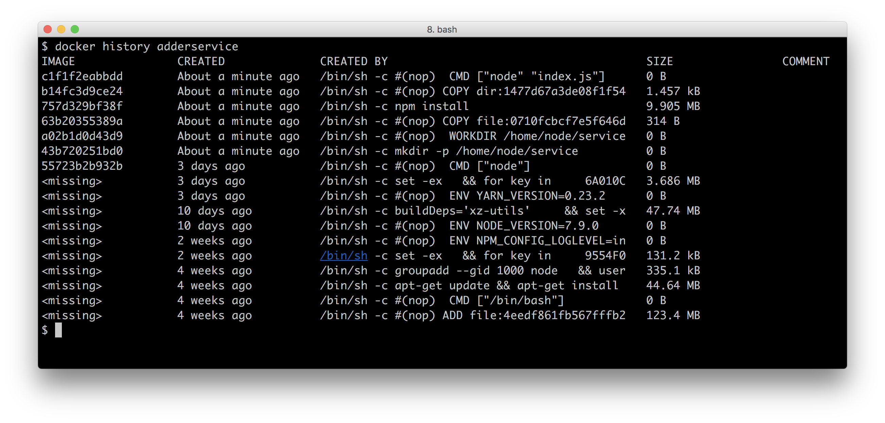

Not only does this command show the layers created by our `Dockerfile`, it also shows the commands that were used to build up the base image, in this case our base `node:slim` image.

#### Adding a new layer

To see how Docker adds layers to an image let's make a change to the adder service and rebuild the container.

For example we could modify our `adderservice/index.js` like so:

```js
console.log('HI!')
const wiring = require('./wiring')
const service = require('./service')()

wiring(service)
```


Then we can rebuild the container with:

```
$ docker build -t adderservice .
```

Let's see how that's affected the images by running:

```sh
$ docker images
```

The output would look something like the following:

```
REPOSITORY    TAG           IMAGE ID         CREATED           SIZE
adderservice  latest        7809fbfaaf33     3 seconds ago     226 MB
<none>        <none>        83c1f429d9c5     13 minutes ago    226 MB
node          slim          9be176e26d04     3 weeks ago       216 MB
```

Notice the image labeled `<none>`. This is the previous version of our `adderservice` container which was displaced because we built another image with the same tag name. The second build command has moved the repository name and the `latest` tag to our new image. 

If we now rerun the history command, like so:

```sh
$ docker history adderservice
```

We should be able to see how our layers have changed, as in the following figure:


If we look at the `IMAGE` column, we can see that the ID for the uppermost two layers is different. This means that the difference between these two images is just these two layers. Notice also that these layers consist of a total of 1.475 kBytes. It is important to understand that when this change to a container is deployed, on the delta, in this case only 1.475 kBytes will be changed.

#### Docker alternatives & container standards

Docker is the leading container technology at present. However it should be pointed out that alternatives do exist. One such alternative is the `rkt` engine which is part of the CoreOS project. we can find out more about `rkt` here: https://coreos.com/rkt/.

Following the recent explosive growth in container technology, there has been a drive to push for binary and runtime standardization among interested parties in this space. The standardization effort is being led by the Open Container Initiative, we can read about their work here: https://www.opencontainers.org/

### See also

* *Adding a Queue Based Service* in **Chapter 10 Building Microservice Systems**
* *Deploying a Container to Kubernetes* in this chapter
* *Storing Images on DockerHub* in this chapter
* *Running a Docker Registry* in this chapter

## Running a Docker Registry

In this recipe we are going to publish our `adderservice` container that we built in the last recipe to our own private Docker registry.

### Getting Ready

To get setup for this recipe we need to pull the official Docker registry container. 

We do this by running the following:

```sh
$ docker pull registry
```

This recipe uses the code from the previous recipe *Building a container for a Node.js process*. 

If we haven't already done so, we'll need to build the the `adderservice` image from the previous recipe:

```sh
$ cd micro/adderservice
$ docker build -t adderservice .
```

Finally we need the `openssl` command line tool available, which should be installed with our preferred package manager (for example `homebrew` if we are using a Mac).

### How to do it

Let's start a Docker registry container (we pulled the Docker registry container in the *Getting Ready* section of this recipe) with the following command:

```sh
$ docker run -d -p 5000:5000 --name registry registry:2
```

If we now issue a `docker ps` command we can see that our registry container is up and running on port 5000. 

Now let's push a container to the registry to test it out. 

To do this we need to tag an image with a specific naming convention.

Let's run the following command:

```sh
$ docker tag adderservice localhost:5000/adderservice
```

If we now issue a `docker images` command we should see the tag against our `adderservice` image:

```
REPOSITORY                   TAG     IMAGE ID      CREATED      SIZE
adderservice                 latest  ced38dc8a822  2 hours ago  235 MB
localhost:5000/adderservice  latest  ced38dc8a822  2 hours ago  235 MB
```

We can now push the image to our local registry:

```sh
$ docker push localhost:5000/adderservice
```

We can check that this was successful by pulling the image back again:

```sh
$ docker pull localhost:5000/adderservice
```

Running a registry in this configuration is not all that useful because the registry is only accessible over the localhost interface. 

To run a registry in production we should use a full domain registry which requires a domain certificate. 

However to run a local development registry, say for our development teams office, we can use a self signed certificate.

Let's use the `openssl` tool to create a self signed certificate:

```sh
$ cd micro
$ mkdir certs
$ openssl req -newkey rsa:4096 -nodes -sha256 -keyout \
  certs/localhost.key -x509 -days 365 -out certs/localhost.crt
```

Before we can generate the certificate `openssl` will ask some questions. For most we can simply press return. However the Common Name prompt should be passed "localhost" as the response:

```
Common Name (e.g. server FQDN or our name) []:localhost
```

Now that we have generated our certificate we need to tell Docker about it.

To do this on Mac we run the following:

```sh
$ sudo security add-trusted-cert -d -r trustRoot -k /Library/Keychains/System.keychain certs/localhost.crt
```

On Linux the command would be:

```sh
$ sudo cp certs/localhost.crt /etc/docker/certs.d/localhost:5000/ca.crt
```

> #### Linux troubleshooting
> Some Linux distributions require other steps to allow Docker to use a self signed certificate, see 
> https://docs.docker.com/registry/insecure/#troubleshooting-insecure-registry

On Windows (assuming the ProgramData directory is at `C:\ProgramData`) we'd add our certificate with:

```sh
$ copy certs\localhost.crt C:\ProgramData\docker\certs.d\localhost5000\ca.crt
```

We now need to restart Docker to allow the daemon to pick up the certificate. 
Once Docker has restarted we can spin up our registry container passing the certificate configuration via the necessary environment variables:

```sh
$ cd micro
$ docker run -d -p 5000:5000 --name registry -v `pwd`/certs:/certs \
  -e REGISTRY_HTTP_TLS_CERTIFICATE=/certs/localhost.crt \
 -e REGISTRY_HTTP_TLS_KEY=/certs/localhost.key registry:2
```

Finally we can tag and push our `adderservice` image to our secured registry:

```sh
$ docker tag adderservice localhost:5000/adderservice
$ docker push localhost:5000/adderservice
```

> ### Querying private registries 
> Whist there is currently no official command line client to query the contents of a Docker registry we can interface directly to the the registry HTTP API. For instance  `curl https://localhost:5000/v2/_catalog` will return a list of all images in the local private registry in JSON format.

In order to pull and push images from other machines - for example other developers in our team, we can simply share the generated certificate file.

### How it works

We use `openssl` to create a self signed certificate. This basically means we are
our own Certificate Authority, we give credence to the certificate. The CRT file doubles as both the certificate authority key and the private key in a typical SSL exchange. 

We register the certificate file Docker by copying it to a relevant folder or registering it with Keychain in the case of Mac. Then we start our Docker registry container, and mount our `certs` folder into the container using the `-v` flag. This effectively means our `certs` folder is a shared folder - between the host machine and the container. 

Then we set two environment variables with the `-e` flag which configure the registry to use the relevant key and certificate files in the mounted `/certs` folder.

It should be noted that using a self signed certificate is fine within a development setting, for sharing images across a development team, as access to the certificate can be tightly controlled. However a full domain registry or a hosted registry must be used in any deployment environment.

> ### Domain Registry 
> Instructions on how to run a secured domain registry can be found here https://docs.docker.com/registry/deploying/

Docker tagging may seem a little confusing at first so let's dig into the details a little. 

A tag is comprised of the following:

```
[registry host[:registry port]/]image name[:version]
```

In other words the registry host, port and version part of the tag are optional. If no registry name is supplied then any subsequent `push` command will attempt to push to the central Docker hub which can be accessed at https://hub.docker.com/. Indeed once we have signed up for an account we may push and pull to this registry.

> ### Registry and Repository 
> We may hear the term repository and registry used interchangeably with regard to Docker. Strictly speaking registry refers to a Docker registry server
> such as the private registry that we ran in the last recipe or the central Docker hub. A repository refers to a collection of images, for example, we
> could create an account on the Docker Hub, create a repository against this account and then push images into this repository.

Once an image has been tagged with a repository, the `docker push` command can be used to push images to that repository. We should emphasize that we're using an insecure local private registry, which is fine for experimentation. However in a full production environment a secured registry should always be used even when sitting behind multiple firewall layers.

We have been running the official Docker registry container however there are alternatives to this that we can install and run on premise:

> #### Registry alternatives
> We've been running the official Docker registry, which is freely available.
> Additional enterprise alternatives include the CoreOS Enterprise Registry 
> and Artifactory from JFrog also offers Container artifact management. 

### There's more

Let's explore Docker tags a little more.

#### Tagging

Let's look again at the output of the `docker images` command:

```
REPOSITORY                    TAG    IMAGE ID     CREATED        SIZE
192.168.1.2:5000/adderservice latest ba4c0f31a321 34 minutes ago 226 MB
adderservice                  latest ba4c0f31a321 34 minutes ago 226 MB
192.168.1.2:5000/report       latest e4331baa0d97 35 minutes ago 219 MB
report                        latest e4331baa0d97 35 minutes ago 219 MB
192.168.1.2:5000/webapp       latest bb760b8d806a 36 minutes ago 233 MB
webapp                        latest bb760b8d806a 36 minutes ago 233 MB
192.168.1.2:5000/eventservice latest f3ee71045a1b 36 minutes ago 223 MB
eventservice                  latest f3ee71045a1b 36 minutes ago 223 MB
192.168.1.2:5000/auditservice latest f88358133c8e 36 minutes ago 232 MB
auditservice                  latest f88358133c8e 36 minutes ago 232 MB
```

Note that the TAG field for our containers is 'latest'. This is the version tag that is applied in the case that an explicit version tag is not specified. Docker will move the 'latest' tag for us when we change, build and tag containers. To see this make a change to one of the files in the `adderservice` by adding a comment or a console.log and rerun the build script. The output should be similar to the following:

```
REPOSITORY                    TAG    IMAGE ID     CREATED        SIZE
192.168.1.2:5000/adderservice latest d33f02b95f74 31 minutes ago 226 MB
adderservice                  latest d33f02b95f74 31 minutes ago 226 MB
192.168.1.2:5000/adderservice <none> ba4c0f31a321 34 minutes ago 226 MB
192.168.1.2:5000/report       latest e4331baa0d97 35 minutes ago 219 MB
report                        latest e4331baa0d97 35 minutes ago 219 MB
192.168.1.2:5000/webapp       latest bb760b8d806a 36 minutes ago 233 MB
webapp                        latest bb760b8d806a 36 minutes ago 233 MB
192.168.1.2:5000/eventservice latest f3ee71045a1b 36 minutes ago 223 MB
eventservice                  latest f3ee71045a1b 36 minutes ago 223 MB
192.168.1.2:5000/auditservice latest f88358133c8e 36 minutes ago 232 MB
auditservice                  latest f88358133c8e 36 minutes ago 232 MB
```

We can observe that the latest tag has been moved for the changed service. For experimentation it's fine to use the latest tag however for a full production system it is best to explicitly apply a version tag to our containers.

### See also

* *Adding a Queue Based Service* in **Chapter 10 Building Microservice Systems**
* *Building a container for a Node.js process* in this chapter
* *Storing Images on DockerHub* in this chapter


## Storing Images on DockerHub

DockerHub provides a global repository of images. In **Chapter 10 Building Microservice  Systems** we implicitly used the global repository when we pulled MongoDB and Redis images. We also made use of it in the previous recipe *Building a container for a Node.js process* when we fetched the Docker Registry container. 

In this recipe we are going to push our `adderservice` container to DockerHub.

### Getting Ready

This recipe uses the code from the first recipe in this Chapter, *Building a container for a Node.js process*. 

If we haven't already done so, we'll need to build the `adderservice` image:

```sh
$ cd micro/adderservice
$ docker build -t adderservice .
```

### How to do it

Firstly we need to create an account on DockerHub, to do this head over to `http://hub.docker.com` and sign up for an account:

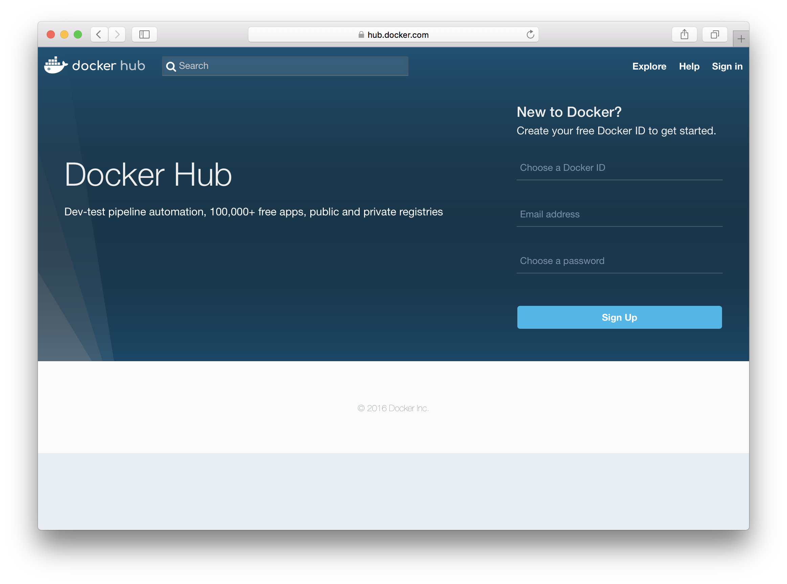

Once we have our account we need to create a repository for our `adderservice` images. To do this hit the `Create Repositoy` button as illustrated below:

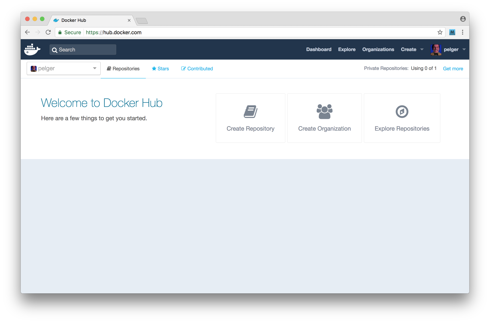

We need to complete the form using `adderservice` as the repository name, leaving the "Visibility" of the repository as "public". 

Once the repository is created we should see a screen similar to the following:


Of course the username will be different in each case! 

Now that we have our account setup we need to login from our Docker command line client, to do this run:

```sh
$ docker login
```

Once we have logged in, we can push our `adderservice` image to DockerHub. 

As in the previous recipe we need to tag the image and then push by running the following commands:

```sh
$ docker tag adderservice <namepace>/adderservice
$ docker push <namespace>/adderservice
```

Replacing `<namespace>` with the repository namespace, which is to say the docker hub account name (in the illustrated case the namespace is `pelger`). 

Docker will push our image to the hub. 

We can navigate to the `tags` tab to confirm that the push was succesful, as illustrated below:

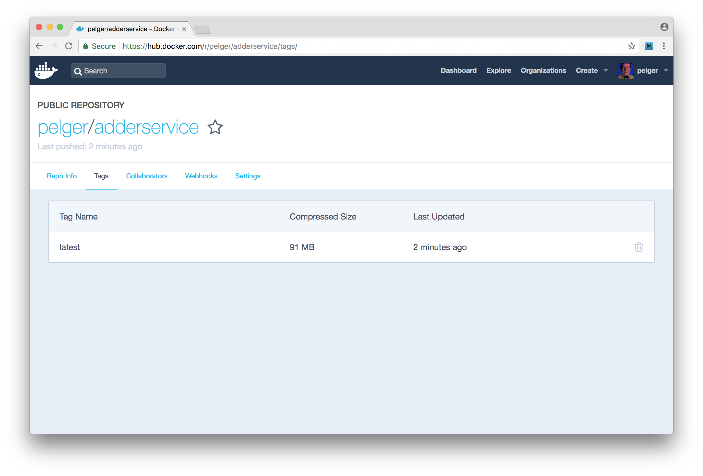

We should also now be able pull this image:

```sh
$ docker pull <namespace>/adderservice
```

### How it works

Applying the tag `<namespace>/adderservice` instructs Docker that this image is associated with a repository on DockerHub. Docker differentiates between a local private registry and the central hub based on the format of the tag. If the namespace tag contains an IP address or dotted domain name and port then Docker will attempt to push/pull from a private registry. If the tag is just a namespace then Docker will use the central Hub to push and pull. To minimize confusion the namespace that we provide on DockerHub is restricted to only allow letters and digits.

In this recipe we created a public repository. DockerHub is free to use for public repositories, but of course public repositories may be accessed by anyone on the internet. This is a similar model to GitHub and other cloud-based code version management systems. It's therefore important not to push any proprietary code or secret information (such as ssh or API keys) to a public repository.

It is possible to host private repositories on DockerHub for a fee. Private repositories are only accessible to nominated DockerHub accounts so access can be tightly controlled.

DockerHub is just one of several cloud based registries that we can use, alternatives include:

* Google Container Registry - managed registry for those using Google cloud services

* Amazon ECR  - managed registry for those using AWS

### There's more

Using a cloud based registry can be far more convenient than managing our own 
on-premise registry. However a proficient image version management strategy is imperative. Let's explore image versioning.

#### Using a specific version tag

Applying the tag structure in this recipe results in Docker applying using `latest` as the version tag. When we build a new version of an image without explicitly providing a version, Docker will move the `latest` tag to this new image and leave the previous build untagged. The same process will occur with images that we push to Docker Hub. It is generally better practice to use a specific image version tag. By doing this we can maintain a history of our images which makes any rollback or post incident analysis easier.

Let's tag our `adderservice` image with a version by running:

```sh
$ docker tag adderservice <namespace>/adderservice:1
```

We can now push this image to Docker Hub, like so:

```sh
$ docker push <namespace>/adderservice:1
```

If we now navigate to the `Tags` panel for our `adderservice` image on DockerHub we can see that our newly pushed image is available.

Using an incremental build number is one approach to maintaining version tags, another approach is to pull the version field from `package.json` and use that as a version tag. Our preferred approach is to use the `git` SHA as a version tag, that we we can immediately identify the exact code that is built into our service containers.

### See also

* *Adding a Queue Based Service* in **Chapter 10 Building Microservice Systems**
* *Using containerized infrastructure* in **Chapter 10 Building Microservice Systems**
* *Building a container for a Node.js process* in this chapter
* *Storing Images on DockerHub* in this chapter
* *Deploying a Container to Kubernetes* in this chapter

## Deploying a Container to Kubernetes

Kubernetes is an open source container orchestration and management system originally built at Google. Kubernetes is a powerful tool and can become quite complex. However the basics are fairly simple to understand. To get to grips with Kubernetes, we will be deploying a single container into a local Kunbernetes system using Minikube. Minikube is a convenient way to explore the power of Kubernetes without building a complex cloud based deployment.

### Getting ready

For this recipe we will need to install Minikube locally. Let's head over to the project's GitHub page at https://github.com/kubernetes/minikube/releases to install prerequisites and the appropriate build for our platform.

This recipe builds on the work that we did in the recipe *Storing Images on DockerHub*, in order to proceed with the recipe we will need a DockerHub account with our `adderservice` container available. 

We will also need the code from our first recipe in this chapter, *Building a container for a Node.js process*.  

Once we have our code, a DockerHub account and Minikube installed we are good to go.

### How to do it

Firstly we need to start up `minikube`. To do so, we can execute the following:

```sh
$ minikube start
```

Now that we have Minikube running let's try out a few commands. 

The main interface into Kubernetes is the `kubectl` command line tool, which was installed during the Minikube installation process. 

Let's confirm that `kubectl` was installed successfully:

```sh
$ kubectl version
```

```sh
$ kubectl help
```

We should see the version of Kubernetes that we are running and then some help information. 

Let's try some commands to list out the current state of our local Kubernetes cluster:

```sh
$ kubectl get nodes
```

```sh
$ kubectl get services
```

We should see that we have a single node in the cluster and a single Kubernetes service running. Let's now go ahead and deploy our `adderservice`. 

Let's begin by creating a `deployment` directory inside our `micro` folder,with three configuration files `namespace.yml`, `adderservice-dep.yml` and `adderservice-svc.yml`:

```sh
$ cd micro
$ mkdir deployment
$ cd deployment
$ touch namespace.yml adderservice-dep.yml adderservice-svc.yml
```

Recall from the *Service discovery with DNS* recipe in  **Chapter 10 Building Microservice Systems** that we used the DNS namespace `micro`, we need to create a namespace in Kubernetes to mirror our present DNS configuation. Fortunately, this is fairly trivial to achieve. 

Let's add the following to `deployment/namespace.yml`:

```
apiVersion: v1
kind: Namespace
metadata:
  name: micro
  labels:
    name: micro
```

Next we register the namespace decribed with Kubernetes like so:

```sh
$ kubectl create -f namespace.yml
```

Now that we have our namespace created we need to set the Kubernetes context to use this namespace as the default. Meaning that all subsequent `kubectl` operations will use the `micro` namespace as opposed to the default namespace. 

To enable this let's run:

```sh
$ kubectl config set-context minikube --namespace=micro
```

Next let's describe the deployment topology by adding the following code to the `adderservice-dep.yml` file:

```
apiVersion: extensions/v1beta1
kind: Deployment
metadata:
  name: adderservice
spec:
  replicas: 1
  template:
    metadata:
      labels:
        run: adderservice
    spec:
      containers:
      - name: adderservice
        image: <dockerhub-account>/adderservice
        ports:
        - containerPort: 8080
```

In doing this we need to replace `<dockerhub-account>` with the account namespace that we used to upload our `adderservice` to DockerHub in the previous recipe. 

We also need to supply Kubnerenets with service description to allow `adderservice` container to be exposed to the deployment. 

Let's populate `adderservice-svc.yml` with the following configuration code:

```
apiVersion: v1
kind: Service
metadata:
  name: adderservice
  labels:
    run: adderservice
spec:
  ports:
    - port: 8080
      name: main
      protocol: TCP
      targetPort: 8080
  selector:
    run: adderservice
  type: NodePort
```

Now let's actually push the button and deploy our `adderservice` container. 

Run the following two commands:

```sh
$ kubectl create -f adderservice-svc
$ kubectl create -f adderservice-dep
```

Kubernetes will begin rolling out our container, we can check the status of the rollout with the following commands:

```sh
$ kubectl rollout status -f adderservice-dep.yml
$ kubectl describe deployment adderservice
$ kubectl describe service adderservice
```

Now that we have deployed our service let's test that it is in fact working. The first thing we need to ascertain is the minikube cluster's IP address. We can obtain this with the following:

```sh
$ minikube ip
192.168.99.100
```

Next we need to get the port number that Minikube has exposed our service on. To determine this we run:

```sh
$ kubectl get services
NAME            CLUSTER-IP   EXTERNAL-IP   PORT(S)          AGE
adderservice    10.0.0.106   <nodes>       8080:30532/TCP   16m
kubernetes      10.0.0.1     <none>        443/TCP          1h
```

We can see from this that Minikube has exposed our service on 30532 so to check our `adderservice` we can run the following:

```sh
$ curl http://192.168.99.100:30532/add/1/2
{"result":3}
```

Our service has returned the correct result. Excellent! we have just deployed our first Node microservice to Kubernetes.

### How it works

We achieved a lot in this recipe, and there are a lot of concepts to understand if we are new to Kubernetes. While a full description of Kubernetes is outside the scope of this book, the following diagram illustrates what our single service deployment looks like:

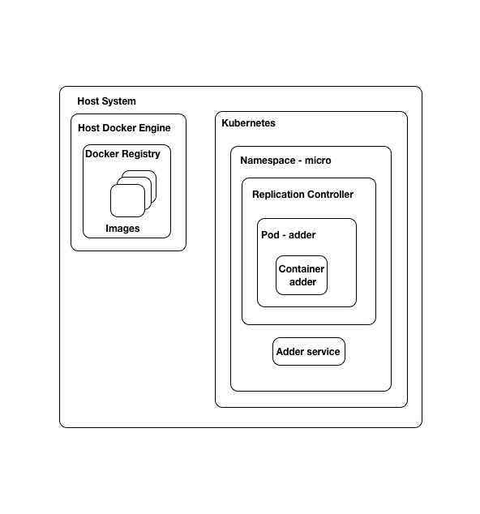

The structure is as follows:

* We have a Docker engine instance running on our host machine, we used this to build and tag our images

* We pushed our Docker image to a public repository on DockerHub

* Kubernetes (`minikube`) is running inside a VM on our local machine

* Kubernetes pulled our `adderservice` image from our Docker repository

* Kubernetes created a [pod](https://kubernetes.io/docs/concepts/workloads/pods/pod/) in which to run our container. Pods are managed by a replication controller which is associated with a namespace. In this case the `micro` namespace.

* We also created a Kubernetes [service](https://kubernetes.io/docs/concepts/services-networking/service/) to expose our `adderservice` container to the outside world. The service exists within our `micro` namespace.

A full introduction and tutorial on Kubernetes can be found on the official Kubernetes site here: https://kubernetes.io/docs/tutorials/. This tutorial provides a great explanation of the basic concepts that we need in order to work with Kubernetes. If the intricacies of our deployment thus far are still a little unclear we recommend working through the Kubernetes tutorial revisiting the diagram above before proceeding to the next recipe.

There are of course alternatives to Kubernetes, some alternatives include:

* Docker Swarm - https://docs.docker.com/engine/swarm/
* Apache Mesos - http://mesos.apache.org/
* Amazon Elastic Container Services - https://aws.amazon.com/ecs

However, Kubernetes is at the time of writing the leading container orchestration platform. 

### There's more

It is important to fully understand the core concepts behind Kubernetes. To help us do this we will explore the dashboard and also push an updated container to `minikube`

### Using the `minikube` dashboard

The `minikube` tool comes with a built in web dashboard. While the `kubectl` command line client is our primary point of interaction, the dashboard is a great visual tool for exploring Kubernetes. 

We can open the dashboard with the following command:

```sh
$ minikube dashbaord
```

If we use the menu on the left hand side to select the `micro` namespace we can see a summary of our deployment, it should look as follows:


If we click on the `logs` icon in the `adderservice` pod line, we can view the log output from the service, which is depicted below:

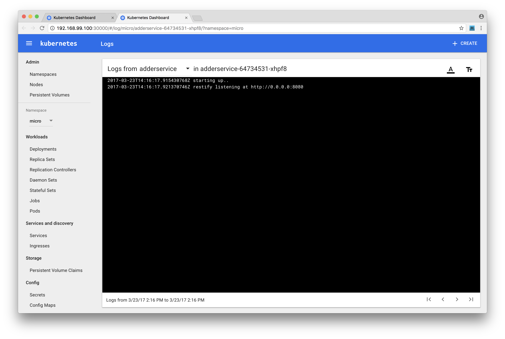

Let's take some time to explore the dashboard, ensuring the dashboard output mentally matches the diagram in the `How it Works` section for this recipe.

#### Pushing microservice updates into Kubernetes

Let's now try making a change to our service. For experimentation purposes 
let's copy the `micro` folder to `micro2` as we make these changes.

Let's edit the file `micro/adderservice/service.js` and add some `console.log` statements so that it looks as below:

```js
module.exports = service

function service () {
  function add (args, cb) {
    const {first, second} = args
    console.log(`add called: ${first} ${second}`)
    const result = (parseInt(first, 10) + parseInt(second, 10))
    cb(null, {result: result.toString()})
  }

  return { add }
}
```

Let's now quickly rebuild and push our container to DockerHub:

```sh
$ cd micro2/adderservice
$ docker build -t adderservice .
$ docker tag adderservice <dockerhub-account>/adderservice:2
$ docker push <dockerhub-account>/adderservice:2
```

Notice that we applied a version tag this time rather than using the default `latest` tag. Also notice that on the push Docker only needs to push a single layer, reporting that the other layers already exist. Now let's update our deployment. 

Firstly let's edit the file `micro/deployment/adderservice-dep.yml` and update the image field to reflect the tag of the image that we just pushed, the line should read:

```
    image: <dockerhub-account>/adderservice:2
```

Next tell Kubernetes to apply the change as follows:

```sh
$ cd micro2/deployment
$ kubectl apply -f adderservice-dep.yml
```

Finally let's test our service and check that our log statement shows up.

As before we can use the `get services` command to fetch the port mappings:

```
$ kubectl get services
```

We can use `curl` to hit the service endpoint (assuming port 30532): 

```sh
$ curl http://192.168.99.100:30532/add/1/2
```

Now if we open the dashboard (by running `minikube dashboard`) and view the logs we should see our inserted message in the log output:


### See also

* *Service discovery with DNS* in **Chapter 10 Building Microservice Systems**
* *Creating a simple RESTful microservice* in **Chapter 10 Building Microservice Systems** 
* *Building a container for a Node.js process* in this chapter
* *Storing Images on DockerHub* in this chapter

## Creating a deployment pipeline

In the previous recipes of this chapter we have become familiar with Docker and Kubernetes. It's now time to weild the power of these technologies by creating a deployment pipeline. 

Whether we are deploying to a staging environment (Continuous Delivery) or directly to production (Continuous Deployment) a robust and automated pipeline is powerful tool that should form the core of our DevOps strategy.

In this recipe we're going to create a deployment pipeline for our system.

> #### Requires bash 
> This recipe uses bash scripts (a common practice in creating build pipelines),
> thus requires a machine capable of running bash to effectively implemented
> (Linux, Mac and Windows 10 Pro support the bash shell).

### Getting Ready

For this recipe we are going to be using the Jenkins CI/CD system as our build and deployment tool so we will need to install this first. We can head over to https://jenkins.io/ to download the appropriate binary for our system. Once we have the the download run the installer.

Jenkins runs in the background as a daemon process. To achieve this, the installer creates a `jenkins` user account. This account is very restricted in what it can do which is great for security on a production build system, however we'll be loosening the restrictions for local development purposes. 

We'll configure `jenkins` to have `sudo` powers. Let's run the following command:

```sh
$ sudo visudo
```

This will open up the sudoers file in the `vi` editor, add the following line to the end of the file:

```
jenkins ALL=(ALL) NOPASSWD:ALL
```

> ### Sudoers 
> We have used very loose permissions for the Jenkins user, there are other more secure methods that can be used to allow `jenkins` to effectively run builds
> We have used this method as it allows us to focus on build configuration and not security.

We also need to update the `PATH` environment variable for the jenkins user. To do this run the following:

```sh
$ sudo su jenkins
$ cd ~
$ echo export PATH="/usr/local/bin:$PATH" > .bashrc
```

This recipe uses the `micro` folder as we left it in previous recipe *Deploying a Container to Kubernetes*.

We'll be using the `git` version control tool in this recipe, so we need to have that installed on our system.

We'll also need a GitHub account. If we don't have a GitHub account we can navigate to http://github.com and create one. 

Additionally, we need to create a GitHub repository called `micro` (see https://help.github.com/articles/create-a-repo/ for help on this). We'll be adding code to our GitHub repository throughout.

### How to do it

Our build pipeline is going to consist of the following steps:

* pull the latest code
* run a build step (`npm install`)
* run a test step (`npm test`)
* build an updated container, updating the version number
* push the container to DockerHub
* rollout the new container to our minikube environment

This build pipeline will be controlled and executed by Jenkins. Our pipeline will focus only on building the `adderservice` project. The build process relies on being able to pull the latest code from GitHub. So the first thing we need to do is initalize the `micro` folder as a local git repository:

```sh
$ cd micro
$ git init
```

To keep the repository clean let's add a `.gitignore` file at the root containing the following:

```
.DS_Store
*.log
node_modules
npm-debug.log
```

We also need to make a slight change to `package.json` in the `adderservice`. Update the test command in the `scripts` section to read as follows:

'''
scripts {
  "test": "echo \"no test specified\" && exit 0"
}
'''

By default `npm` will insert an `exit 1` command which would cause our test build phase to fail. 

> ### Testing is important 
> Note that we are not advocating skipping the test phase. Robust unit testing is a key practice for any system's development. However the focus of this recipe is on constructing a build pipeline not on the content of any unit tests we might write. 

We can now add the contents of the `micro` folder into our local git repository, make the first commit, add the remote origin and push to GitHub.

```sh
$ git add .
$ git commit -m '1st'
$ git remote add origin https://github.com/<user>/micro.git
$ git push -u origin master
```

In these steps, we substitute `<user>` with the name of our GitHub user account.

Before we wire up Jenkins, we are going to create our build script. We're also going to make our Kubernetes deployment a little more generic. 

Let's create two new files in the `micro/deployment` folder:

```sh
$ cd micro/deployment
$ touch deployment-template.yml service-template.yml
```

The `deployment-template.yml` should look like so: 

```
apiVersion: extensions/v1beta1
kind: Deployment
metadata:
  name: _NAME_
spec:
  replicas: 1
  template:
    metadata:
      labels:
        run: _NAME_
    spec:
      containers:
      - name: _NAME_
        image: _IMAGE_
        ports:
        - containerPort: _PORT_
```

The `service-template.yml` should contain the following code:

```
apiVersion: v1
kind: Service
metadata:
  name: _NAME_
  labels:
    run: _NAME_
spec:
  ports:
    - port: _PORT_
      name: main
      protocol: TCP
      targetPort: _PORT_
  selector:
    run: _NAME_
  type: NodePort
```

Our new template files are simply the previous Kubernetes deployment scripts which we created in the *Deploying a container to Kubernetes* recipe with the specific service name, port and image replaced with the string `_NAME_`, `_PORT` and `_IMAGE_`. Since previous scripts are now redundant let's go ahead and remove them:

```
$ rm adderservice*.yml
```

> ### Build scripts 
> Jenkins and other build systems can be powerful all-encompassing tools. However we recommend writing simple build scripts which are then triggered or managed by automation software like Jenkins. This layer of separation keeps us decoupled from the build tool, and could make debugging easier since we've written the build scripts using familiar languages and tools.

 Next we'll write a build script for the `adderservice`. 
 
 Let's create a `build.sh` file in the `micro/adderservice` folder:

 ```sh
 $ cd ../adderservice # assuming cwd is micro/deployment
 $ touch build.sh
 ``` 
 
 Our `build.sh` file should look as follows, 

```sh
#!/bin/bash
source ~/.bashrc
GITSHA=$(git rev-parse --short HEAD)

case "$1" in
  container)
    sudo -u <username> docker build -t adderservice:$GITSHA .
    sudo -u <username> docker tag adderservice:$GITSHA \
      <dockerhub account>/adderservice:$GITSHA
    sudo -i -u <username> docker push \
      <dockerhub account>/adderservice:$GITSHA
  ;;
  deploy)
    sed -e s/_NAME_/adderservice/ -e s/_PORT_/8080/ \
      < ../deployment/service-template.yml > svc.yml
    sed -e s/_NAME_/adderservice/ -e s/_PORT_/8080/ \
      -e s/_IMAGE_/<dockerhub account>\\/adderservice:$GITSHA/ \
      < ../deployment/deployment-template.yml > dep.yml
    sudo -i -u <dockerhub account> kubectl apply -f $(pwd)/svc.yml
    sudo -i -u <dockerhub account> kubectl apply -f $(pwd)/dep.yml
  ;;
  *)
    echo invalid build step
    exit 1
  ;;
esac
```

Here we need to replace <username> with our username, i.e. the account that we log into our computer with. Replace <dockerhub account> with our DockerHub user account name.

> ### Templates and `sed` 
> We are using `sed` as a simple way of running a template based build script. There is discussion in the Kubernetes community on adding templates to
> Kubernetes but this is not currently supported. `sed` is an easy way to create a template based solution.

Next we'll wire our build script into Jenkins. We'll be using a Jenkin's feature called [pipelines](https://jenkins.io/doc/book/pipeline/). 

Pipelines are described in text files named Jenkinsfile (by convention). 

Let's create a Jenkinsfile for our `addderservice` build pipeline:

```sh
$ touch Jenkinsfile # cwd should be micro/adderservice
```

The contents of our `Jenkinsfile` should look as follows:

```
pipeline {
  agent any

  stages {
    stage('Checkout') {
      steps {
        checkout scm
      }
    }
    stage('Build') {
      steps {
        sh 'source ~/.bashrc && cd adderservice && npm install'
      }
    }
    stage('Test'){
      steps {
        sh 'source ~/.bashrc && cd adderservice && npm test'
      }
    }
    stage('Container'){
      steps {
        sh 'source ~/.bashrc && cd adderservice && sh build.sh \
        container'
      }
    }
    stage('Deploy'){
      steps {
        sh 'source ~/.bashrc && cd adderservice && sh build.sh deploy'
      }
    }
  }
}
```

Now we'll commit and push our changes thus far to our GitHub repository:

```sh
$ cd micro
$ git add .
$ git commit -m 'build script'
$ git push origin master
```

Great! Now we need to hook up Jenkins. To do we'll open the Jenkins web interface at http://localhost:8080. 

Select the `New Item` link on the left hand menu and create a new pipeline project called `adderservice` as illustrated below:

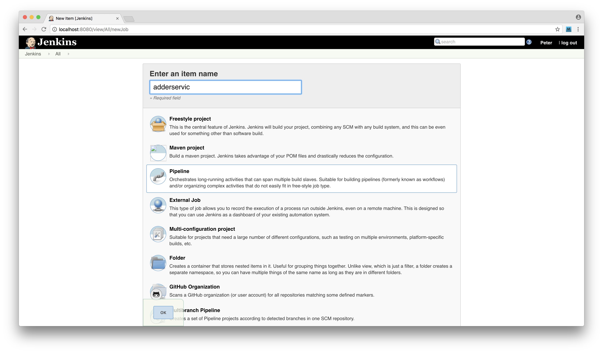

Then we'll configure the pipeline by pointing it to our GitHub repository. Under the *General* heading we should select *GitHub project* input and provide the url to the project.

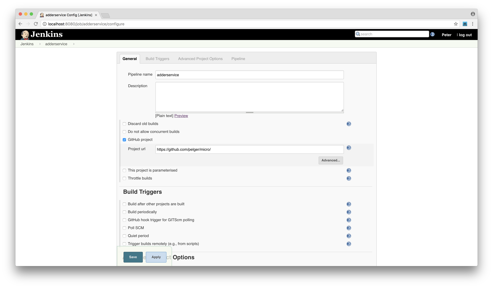

We also need to configure the pipeline settings under the *Pipeline* tab, with SCM set to Git, a single repository with the *Repository URL* set to our GitHub repository (in `.git` format), *Branch specifier* set to `*/master` and *Script Path* configured as `adderservice/Jenkinsfile`, as illustrated in the following image:


Once we have these settings configured and saved, we're able to test our pipeline. 

From the main Jenkins menu we can click the *adderservice* link, then click the *build now* link. Jenkins will initiate the pipeline, building and deploying our service to Kubernetes. 

Once the build is complete we can view Jenkins overview screen as in the following screenshot: 


We can also inspect a builds log output via in Jenkins as in the following screenshot:


Finally we can use the `minikube` dashboard to inspect the state of our Kubernetes cluster after the build:

```sh
$ minikube dashboard
```

We should see that a fresh pod has been deployed along with our newly created container image.

### How it works

We've accomplished a lot so far, let's break it down into pieces. 

Let's begin with the build script, The first line reads the short form Git SHA for the current branch in our micro project using this code:

```sh
GITSHA=$(git rev-parse --short HEAD)
```

Later in the script we used the SHA to tag our image and to upload it to DockerHub.

```sh
sudo -u <username> docker tag adderservice:$GITSHA <dockerhub account>/adderservice:$GITSHA
sudo -i -u <username> docker push <dockerhub account>/adderservice:$GITSHA
```

Using a Git SHA as a tag on a container image is a useful technique because it means that we can identify the exact code that is in the container by cross referencing the container tag with the git history (which can be viewed using `git log`).

There are of course other valid tagging strategies, such as using the `npm` version number from `package.json` or some kind other independent build number.

We used the following code to generate our Kubernetes deployment configuration from our templates:

```sh
sed -e s/_NAME_/adderservice/ -e s/_PORT_/8080/ \
  < ../deployment/service-template.yml > svc.yml
sed -e s/_NAME_/adderservice/ -e s/_PORT_/8080/ \
  -e s/_IMAGE_/<user>\\/adderservice:$GITSHA/ \
  < ../deployment/deployment-template.yml > dep.yml
```

This is just using `sed` the stream editor to replace our template strings with the required values for the deployment. The output files are written to `svc.yml` for the service and `dep.yml` for the deployment. Finally in the deployment stage we use `kubectl` to apply the updated container using the files we generated through `sed`

```sh
sudo -i -u <user> kubectl apply -f $(pwd)/svc.yml
sudo -i -u <user> kubectl apply -f $(pwd)/dep.yml
```

Note that we use the `pwd` command to generate an absolute path because of the context that this script is run in by Jenkins differs from our terminal session (meaning, that the working directories are not the same). 

Let's take a look at the `adderservice/Jenkinsfile` again. It's broken down into a number of stages. Jenkins scans the repository that we nominated when we configured the pipeline through the Jenkins web interface. Jenkins reads the `Jenkinsfile` and begins executing the first phase (the `stage('Checkout')` phase). 

Here Jenkins will get a pull a full copy of our `micro` GitHub repository into a temporary build area.

The next two stages (`state('Build')` and `stage('Test')`) run `npm install` and `npm test` as the build and test phases. We define unit tests for the `adderservice` since it was beyond our scope, but in an actual system the test phase should break the build pipeline on test failure by returning a non-zero exit code. In the test phase we might also apply other constraints such as minimum coverage levels or code linting.

In the `stage('Container')` phase we build, tag and upload our new container image to DockerHub. Finally we apply the changes to Kubernetes in the deployment phase. It is important to note that our approach when using tools like Jenkins is to always do the minimum work within the tool itself and to handle the build as much as possible in external scripts. This makes our build process much easier to debug and also much more portable.

We should note that Jenkins is just one of a number of CI/CD tools, although it is very widely used. There are several noteworthy alternatives, including:

* Bamboo - Part of the Atlassian tool suite https://www.atlassian.com/software/bamboo
* Travis - Cloud based build tool free for use with public projects https://travis-ci.org/
* Circle CI - Fully featured, commercial build tool https://circleci.com/
* Go - from ThroughtWorks https://www.gocd.io/

### There's more

We accomplished a lot in this recipe! We now have a Jenkins controlled pipeline building and deploying our `adderservice` container to Kubernetes. Let's explore how we might debug this build process and also automatically trigger it.

#### Debugging the build

If we encounter any issues with the build process, Jenkins will report these in the output logs. Once we have made a correction to our build scripts we will need to commit and push them to GitHub before telling Jenkins to rebuild. This results in quite a long development cycle. A much better way is to test the scripts directly in a shell so that we can be sure they're working before committing for Jenkins to build.

To do this we need to test our scripts in the context of the `jenkins` user. We can do this using the `sudo` command. 

Let's run the container build step in isolation:

```sh
$ cd micro/adderservice
$ sudo su jenkins
$ sh build.sh container
```

This allows us to figure out any environmental or permission issues with a build step before committing the code. Remember to `exit` from the `jenkins` user login once we are done debugging. The `whoami` command, which tells us the context of the user our shell is running in, can be generally useful in this process.

#### Automating the build trigger

In the main recipe we manually triggered the build in Jenkins, this isn't ideal. A preferable approach is to trigger the build as code is checked into the master branch. 

Let's configure Jenkins and GitHub to automate the build process. 

We need to create a GitHub API access token. Let's go to http://github.com, and login if we're not already. Next we click the *settings* link from right hand drop down menu (located next to our profile picture). Under the Developer settings menu on the left hand side click the Personal access tokens link (following this navigation should lead to https://github.com/settings/tokens). 

Next we set the permissions on the token as per the image below:

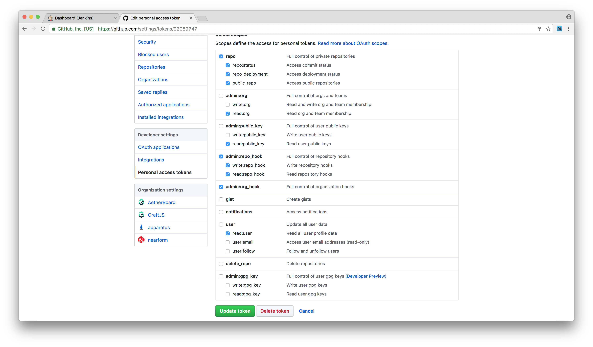

Once the token has been created it's only displayed once on the GitHub UI so we should copy and paste the token string somewhere for safe keeping. 

Next we need to make our access token available to Jenkins. We can achieve this by opening the main Jenkins dashboard page and clicking the *credentials* link on the left hand menu. Following this we click the *system link* and then select the *add credentials* link under the global scope (this should lead us to http://localhost:8080/credentials/store/system/domain/_/newCredentials). 

Then we can complete the form shown in the following screenshot:

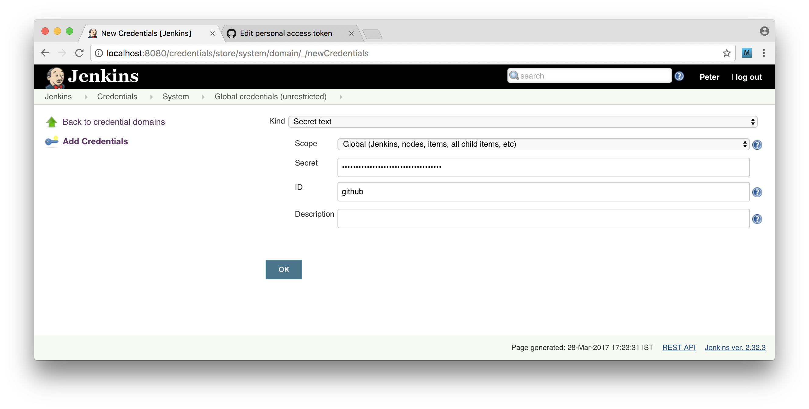

Select the type as `secret text` and paste in the access token from GitHub into the secret field. Next we need to configure the Jenkins GitHub plugin. Naviage to the main Jenkins dashboard and then hit the link to `Manage Jenkins` then the `Configure System` link, scroll down to the `Githuib` section and configure it as depicted below:

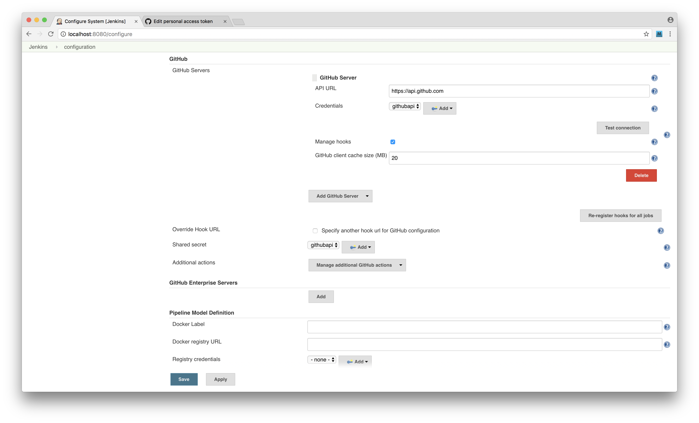

Using the credentials that we created in the previous step. We can use the *Test Connection* button to check that our access is setup correctly. 

Finally we need to configure our pipeline so that it's triggered from GitHub.

We navigate to the configuration screen for our pipeline and scroll down to the *Build Triggers* section. Then we select the *Poll SCM* option and the string `* * * * *` in the schedule box.

> ### Webhooks 
> We are using polling in this recipe because our Jenkins server is running on localhost. A more efficient way to trigger a build is to setup a GitHub webhook.
> Using this technique, GitHub will call a nominated url on certain events such as a branch merge.

Now that we have GitHub polling configured we can go ahead and trigger a build by pushing to GitHub.

We can make a small change to our project, for example adding an additional `console.log` or a comment to the code and push the change to our master branch.

For instance, we could make our `adderservice/index.js` look like so:

```js
console.log('BUILD ME :D')
const wiring = require('./wiring')
const service = require('./service')()

wiring(service)
```

Then we would use the following commands to add the change, commit, and push to GitHub:

```sh
$ cd micro
$ git add adderservice/index.js
$ git commit -m 'test build'
$ git push
```

Jenkins will pick this change the next time it polls github and automatically run the full pipeline for us right through to deploying new pods on Kubernetes!

### See also

* *Creating a simple RESTful microservice* in **Chapter 10 Building Microservice Systems** 
* *Storing Images on DockerHub* in this chapter
* *Deploying a Container to Kubernetes* in this chapter
* *Deploying a full system* in this chapter

## Deploying a full system

Now that we have experience with containers and building a deployment pipeline for a single service, we're going to build a deployment pipeline for an entire microservice system. 

We'll be setting this up to work on our local machine for now, but in the next recipe we'll explore how to lift this into a cloud environment.

### Getting Ready

In **Chapter 10 Building Microservice Systems** we developed a small microservice system. For this recipe we will be deploying this system using techniques used in the previous recipes in this chapter. 

So to prepare we need to grab a copy `micro` folder from the last recipe of chapter 10 *Adding a queue based service*, we'll by copy folders from this recipe into the `micro` folder in previous recipe of this chapter *Creating a deployment pipeline*.

Since we're building on the work of the previous recipe it is necessary to complete it before proceeding with this one.

We also assume that Docker, Minikube and Jenkins are installed locally as required by the previous recipe.

If GitHub triggers are running for the `adderservice` in Jenkins (using SCM Polling) then now would be a good time to temporarily disable these while we work on the rest of the pipeline.

### How to do it

We need to add the code for the rest of the system into our `micro` repository that we created in the previous recipe. 

To do this copy the following top level directories from the *Adding a queue based service* `micro` folder into the root of our current `micro` folder (the one which is initialized as a GitHub) repository:

* `auditservice`
* `eventservice`
* `webapp`
* `report`
* `fuge`

Our `micro` repository directory structure should now look as follows:

```
micro
├── .gitignore
├── adderservice
├── auditservice
├── deployment
├── eventservice
├── fuge
├── report
└── webapp
```

Let's go ahead and commit our changes and push them to GitHub:

```sh
$ cd micro
$ git add .
$ git commit -m 'added services and webapp'
$ git push origin master
```

Now let's apply the same build structure to `eventservice`, `auditservice` and `webapp`.

> ### Check with Fuge 
> We have copied across our Fuge config (`fuge/fuge.yml`) with our microservice system. We can start the system up anytime with Fuge to check that the system is running correctly (simply run `fuge shell fuge/fuge.yml`). Note that Jenkins runs
> on port 8080 by default, as does our `adderservice` which leads to an unfortunate port conflict, so when testing in Fuge we would need to stop Jenkins
> temporarily. It's left as an exercise for the reader to solve this collision.

To do this copy the files `.dockerignore`, `Dockerfile`, `Jenkinsfile` and `build.sh` from the `adderservice` folder to each of the `eventservice`, `auditservice` and `webapp` folders.

```sh
$ cp adderservice/{.dockerignore,Dockerfile,Jenkinsfile,build.sh} eventservice
$ cp adderservice/{.dockerignore,Dockerfile,Jenkinsfile,build.sh} auditservice
$ cp adderservice/{.dockerignore,Dockerfile,Jenkinsfile,build.sh} webapp
``` 

Once copied we will need to modify the `Jenkinsfile` and `build.sh` files to match the service that they are now pertaining to. 

Specifically this means replacing references to the name of the service (which currently be `adderservice`) and the port number. 

We can do the bulk of necessary customizations quickly with `sed`. We can 
process each `Jenkinsfile` like so:

```sh
$ cat auditservice/Jenkinsfile | sed -e s/adderservice/auditservice/ | tee auditservice/Jenkinsfile
$ cat eventservice/Jenkinsfile | sed -e s/adderservice/eventservice/ | tee eventservice/Jenkinsfile
$ cat webapp/Jenkinsfile | sed -e s/adderservice/webapp/| tee webapp/Jenkinsfile
```

The `build.sh` we can alter in similar form:

```sh
$ cat auditservice/build.sh | sed -e s/adderservice/auditservice/ -e s/8080/8081/ | tee auditservice/build.sh
$ cat eventservice/build.sh | sed -e s/adderservice/eventservice/ -e s/8080/8082/ | tee eventservice/build.sh
$ cat webapp/build.sh | sed -e s/adderservice/webapp/ -e s/8080/3000/ | tee webapp/build.sh
```

Notice how we also convert the port number in each case from 8080 to the
relevant port for the service (based on how we've typically mapped services
to ports thus far, as laid out initially in `fuge/fuge.yml`).

As in our previous recipe, we need to tweak `test` field in the `package.json` for each service so it has an exit code of zero. As mentioned previously, we're simulating successfully passing unit tests, but in a real scenario we would want each service to run unit tests instead of having a faux successful exit code.

We can run the following commands to alter the `package.json` in each service:

```sh
$ node -e 'o = require(`./auditservice/package.json`);o.scripts.test = `echo "Error: no test specified" && exit 0`;fs.writeFileSync(`./auditservice/package.json`, JSON.stringify(o, 0, 2))'
$ node -e 'o = require(`./eventservice/package.json`);o.scripts.test = `echo "Error: no test specified" && exit 0`;fs.writeFileSync(`./eventservice/package.json`, JSON.stringify(o, 0, 2))'
$ node -e 'o = require(`./webapp/package.json`);o.scripts.test = `echo "Error: no test specified" && exit 0`;fs.writeFileSync(`./webapp/package.json`, JSON.stringify(o, 0, 2))'
```

The `webapp/Dockerfile` should be modified with the final `CMD` set to `npm start` instead of `node index.js`.

The entire the `webapp/Dockerfile` should look as follows:

```
FROM node:slim
RUN mkdir -p /home/node/service
WORKDIR /home/node/service
COPY package.json /home/node/service
RUN npm install
COPY . /home/node/service
CMD [ "npm", "start" ]
```

Once we have completed these changes for the `auditservice`, `eventservice` and `webapp`, we can commit them to the GitHub master branch.

```sh
$ git add .
$ git commit -m 'added build files'
$ git push
```

> ### Independent variation 
> We have chosen to clone and modify our build script and `Jenkinsfile` for each service. While we could have created a single parameterized script to deploy our
> services it is usually better to have a build script per service. That way the build may be customized as required for each service without introducing
> complication into a master build script.

Recall from our microservice chapter that the `auditservice` and `eventservice` require `mongodb` and `redis` to run correctly so we need to ensure that these elements are deployed as part of our overall pipeline. To do this create a directory called `infrastructure` under `micro` and add a `build.sh` and a `Jenkinsfile` which should contain the following code, for `build.sh`:

```sh
#!/bin/bash
source ~/.bashrc
case "$1" in
  mongo)
    sed -e s/_NAME_/mongo/ -e s/_PORT_/27017/  \
      < ../deployment/service-template.yml > svc.yml
    sed -e s/_NAME_/mongo/ -e s/_PORT_/27017/ -e s/_IMAGE_/mongo/ \
      < ../deployment/deployment-template.yml > dep.yml
    sudo -i -u <user> kubectl apply -f $(pwd)/svc.yml
    sudo -i -u <user> kubectl apply -f $(pwd)/dep.yml
  ;;
  redis)
    sed -e s/_NAME_/redis/ -e s/_PORT_/6379/  \
      < ../deployment/service-template.yml > svc.yml
    sed -e s/_NAME_/redis/ -e s/_PORT_/6379/ -e s/_IMAGE_/redis/ \
      < ../deployment/deployment-template.yml > dep.yml
    sudo -i -u <user> kubectl apply -f $(pwd)/svc.yml
    sudo -i -u <user> kubectl apply -f $(pwd)/dep.yml
  ;;
  *)
    echo 'invalid build command'
    exit 1
  ;;
esac
```

The `Jenkinsfile` should look as follows:

```
pipeline {
  agent any

  stages {
    stage('Checkout') {
      steps {
        checkout scm
      }
    }
    stage('DeployMongo'){
      steps {
        sh 'source ~/.bashrc && cd infrastructure && sh build.sh mongo'
      }
    }
    stage('DeployRedis'){
      steps {
        sh 'source ~/.bashrc && cd infrastructure && sh build.sh redis'
      }
    }
  }
}
```

We can now commit and push the infrastructure additions to GitHub:

```sh
$ git add infrastructure
$ git commit -m 'infrastructure'
$ git push
```

Now we're ready to configure Jenkins. 

From the main Jenkins dashboard let's click *New Item* and select the *Pipeline* type. We'll name the pipeline *infrastructure*. Jenkins provides a convenient shortcut, we can instruct Jenkins to copy settings from *adderservice* pipeline  configuration as shown below. 


This means we also copy the GitHub configuration the *infrastructure* pipeline automatically. It also means that the *Script Path* setting points to the `adderservice/Jenkinsfile` instead of `infrastructure/Jenkinsfile`. Let's navigate to the configuration screen for the *infrastructure* pipeline section and change the *Script Path* setting from *adderservice/Jenkinsfile* to *infrastructure/Jenkinsfile*. We can now manually trigger a build of our infrastructure pipeline. Once this is done we can inspect Kubernetes using the dashboard:

```
$ minikube dashboard
```

Which should look similar to below:

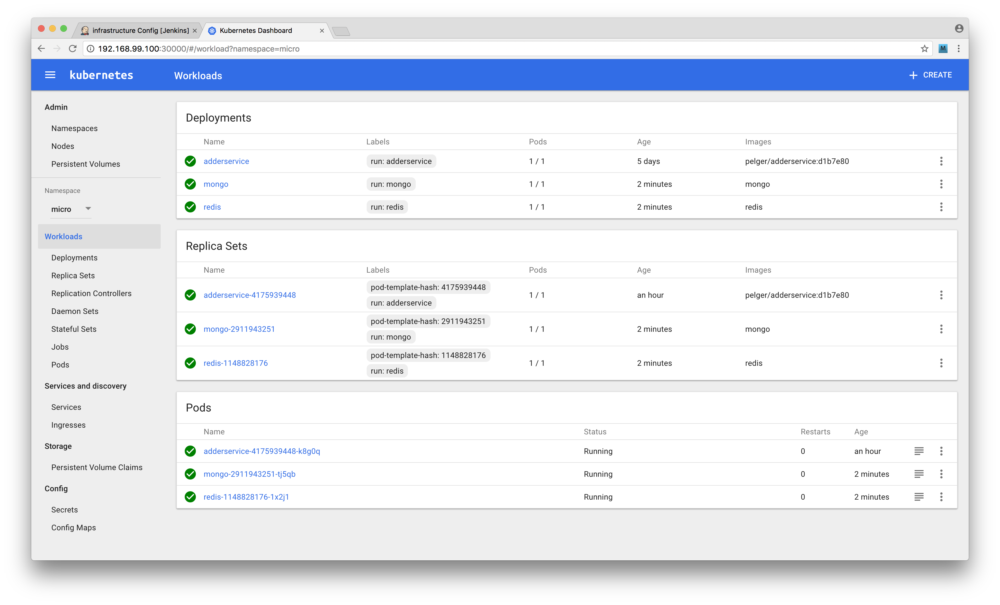

That takes care of our infrastructure. We now just need to configure our other services. To do this repeat the above steps for each of `eventservice`, `auditservice` and `webapp` making sure to copy settings from `adderservice` and updating the `Script path` setting in each case. 

Once we completed this our main Jenkins dashboard should look as below:


We can now trigger builds for each of our services and the `webapp` by clicking the left hand menu, selecting each and clicking *build now*. 

Once all of the builds have completed we can open up the `minikube` dashboard which should look similar to the image below:

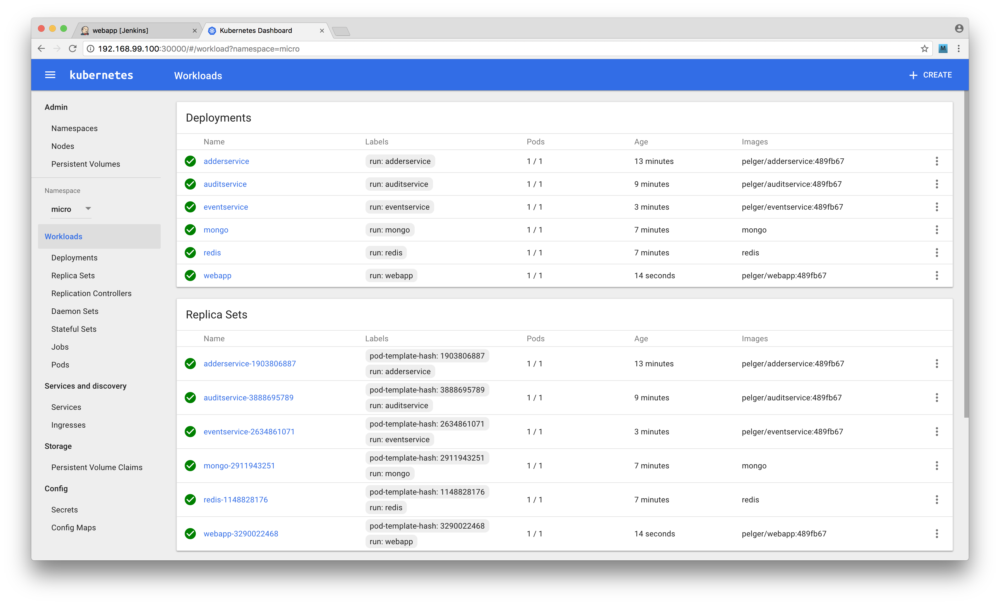

Finally we can test that our system is up and running correctly. 

We need to determine the external port number that Kubernetes assigned to our web app and also the Kubernetes IP address:

```sh
$ minikube ip
192.168.99.100
$ kubectl get services
NAME           CLUSTER-IP   EXTERNAL-IP   PORT(S)           AGE
adderservice   10.0.0.139   <nodes>       8080:30743/TCP    22m
auditservice   10.0.0.209   <nodes>       8081:32391/TCP    19m
eventservice   10.0.0.41    <nodes>       8082:32104/TCP    13m
mongo          10.0.0.172   <nodes>       27017:31000/TCP   17m
redis          10.0.0.57    <nodes>       6379:31863/TCP    17m
webapp         10.0.0.54    <nodes>       3000:30607/TCP    9m
```

In the case of the output above we can see that the `webapp` is available on IP address `192.168.99.100` port number `30607`. If we now go ahead and point our browser to `http://192.168.99.100:30607/add` we should see the `webapp` page rendered as before. When we enter some numbers and press `add` we should see a result. Also the audit link at `http://192.168.99.100/30607/audit` should show a recording of all of our calculations.

The final thing to do is to automate the build pipeline to trigger after pushing to GitHub. 

To do this we need to repeat the step of the previous recipe by selecting the `Poll SCM` setting for each project and setting the schedule to `* * * * *` to poll every minute.

### How it works

We now have a functioning microservice system with a continuous delivery pipeline. 

This is depicted in the image below:

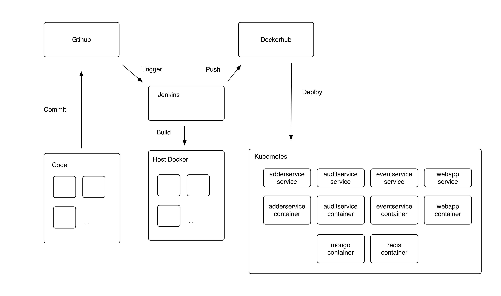

Once a commit is pushed to the master branch, Jenkins will pull the latest version of the code, run build and test steps before creating a new container image. Once the image is created it is pushed up to DockerHub. Jenkins then triggers a deployment into Kubernetes. Kubernetes pulls the nominated image from DockerHub and creates a new pod. The old pod is then discarded. 

We have created independent pipelines for our `adderservice`, `auditservice`, `eventservice` and `webapp`

This is a good point to note the ease of transition from running our system in development mode using Fuge (the microservice development toolkit used in several recipes in **Chapter 10 Building Microservice Systems**) to running our system in Kubernetes. This down to our code being written from the start to use the same service discovery mechanisms in both environments.

### There's more

While Kubernetes can seem a little overwhelming at first, exploring some more *power user* techniques can help with mastering it.

One helpful technique is opening a shell inside a Kubernetes managed container.

Let's try this out.

#### Running a report

Recall that in the recipe *Adding a queue based service* in **Chapter 10 Building Microservice Systems** we created a reporting utility that displayed URL counts for our system. Let's run this again but from inside of Kubernetes. To do this we need to build a container for our reporting service. Firstly copy the code from **Chapter 10 Building Microservice Systems** recipe directory  `micro/report` into our working `micro` directory.

As above, copy in the same `Dockerfile` and `.dockerignore` files into the `report` directory. Next let's build, tag and push our container:

```sh
$ cd micro/report
$ docker build -t report .
$ docker tag report <dockerhub account>/report
$ docker push <dockerhub account>/report
```

Next we are going to manually tell Kubernetes to run out report container and open up a shell inside the report container. To do this run:

```sh
$ kubectl run -i --tty report --image=<dockerhub account>/report -- /bin/bash
```

This will cause Kubernetes to pull the report container and then open a `bash` shell for us. Once the container is pulled we will be dropped into a root prompt inside the `report` container:

```sh
root@report-1073913328-h8st5:/home/node/service#
```

In order to run the report in the Kubernetes environment, 
we need the `DNS_HOST` and `DNS_PORT` environment variables to *not* be set
so that the `concordant` dependency uses the containers standard DNS resolution.

Fortunately we planned for this. 

Let's quickly review the `report/env.js` file:

```js
const env = {
  DNS_NAMESPACE: 'micro',
  DNS_SUFFIX: 'svc.cluster.local'
}

if (process.env.NODE_ENV !== 'production') {
  Object.assign(env, {  
    DNS_HOST: '127.0.0.1',
    DNS_PORT: '53053'
  })
}

Object.assign(process.env, env)
```

When we set `NODE_ENV` to production, `DNS_HOST` and `DNS_PORT`
remain unset, thus Kubernetes DNS system is used instead to
find relevant services.

We can run our report with:

```sh
root@report-1073913328-h8st5:/home/node/service# NODE_ENV=production node index.js
┌──────────────────────────────────────────────────┬──────────┐
│ url                                              │ count    │
├──────────────────────────────────────────────────┼──────────┤
│ http://192.168.99.100:30607/add                  │ 1        │
├──────────────────────────────────────────────────┼──────────┤
│ http://192.168.99.100:30607/favicon.ico          │ 1        │
├──────────────────────────────────────────────────┼──────────┤
│ http://192.168.99.100:30607/add/calculate        │ 2        │
├──────────────────────────────────────────────────┼──────────┤
│ http://192.168.99.100:30607/audit                │ 1        │
└──────────────────────────────────────────────────┴──────────┘
```

Finally we type `exit` to close the command prompt and exit the running container.

### See also

* *Adding a Queue Based Service* in **Chapter 10 Building Microservice Systems**
* *Creating a deployment pipeline* in this chapter
* *Deploying a Container to Kubernetes* in this chapter
* *Deploying to the Cloud* in this chapter

## Deploying to the Cloud

In the final recipe for this chapter we are going to take our deployment and shift it up onto a public cloud. By the end of this recipe we will have a cloud based deployment of our microservice system with a supporting continuous delivery pipeline. 

While we've built our deployment structure without coupling it to any particular cloud provider, we'll be focusing on deploying to Amazon Web Services AWS in this recipe. At the time of writing AWS is the most popular Infrastructure as a Service (IAAS) provider. 

Please note that this recipe will incur billable time on the AWS cloud so we advised shutting down the system once the recipe is complete (and between long breaks) in order to minimize costs.

### Getting Ready

For this recipe we will need an AWS account. If we do not already have an account, we can navigate to http://aws.amazon.com and sign up for one.

The code in this recipe builds on the `micro` folder we've been working on in our previous recipe *Deploying a Full System* so we will need to have this code available.

> ### AWS Billing 
> On sign up we will need to provide a payment method to AWS. The cost to run 
> this recipe for an hour or so is in the order of a few dollars. However please 
> ensure that all resources are terminated after use in order not to incur 
> additional costs.

Next we will need to install the AWS command line tools. These are implemented in Python and are best installed using `pip`. Python and `pip` may be installed using our systems package manager such as `homebrew` or `apt-get`.

> ### Pip 
> Pip is the Python equivalent of `npm` and stands for "Pip installs packages"

Full details on how to install the AWS tools can be found here: http://docs.aws.amazon.com/cli/latest/userguide/cli-chap-getting-set-up.html. 

Once we have installed and configured the tools we can validate them by running the following:

```
$ aws ec2 describe-instances
```

Which should complete without error. Note that this will operate against the default AWS region which can be configured by setting the environment variable `AWS_DEFAULT_REGION`.

We will also need a copy of `kubectl` available locally. We should already have this from the previous recipes in this chapter involving Kubernetes.

Finally, we are going to be using a tool called `kops` to install our Kubernetes cluster. The `kops` command is an open source Kubernetes cluster management tool,the projects GitHub can be found at https://github.com/kubernetes/kops. Instructions on how to install `kops` are available here https://kubernetes.io/docs/getting-started-guides/kops/.

> ### Kops 
> Kops is short for 'Kubernetes Operations'. Kops allows us to deploy and manage multiple Kubernetes clusters and supports a variety of cloud platforms.

Once we have `kops` installed we are good to go!

### How to do it

Firstly we need to ensure that we have our tooling configured correctly as per the instructions in the *Getting Ready* section. 

To confirm we should have the following environment variables defined in our working shell:

```sh
export PATH=~/Library/Python/<version>/bin/:$PATH
export AWS_ACCESS_KEY_ID=xxxxxxxx
export AWS_SECRET_ACCESS_KEY=xxxxxxxxxxxxxx
export AWS_DEFAULT_REGION=us-west-2
```

For this recipe the examples will use `us-west-2` as the AWS region. Any region may be used, however we suggest using a region in which no previous resources have been deployed.

Let's enter the `micro` folder (as we left it in the previous recipe),
and create a `cluster` directory:

```sh
$ cd micro
$ mkdir cluster
```

The `cluster` folder will store our local cluster configuration information.

Instructions for creating a cluster with `kops` are provided here: https://kubernetes.io/docs/getting-started-guides/kops/. We'll walk through the process here and provide additional direction and explanations.

First we need to create a Route53 domain (Route53 is simply the AWS' domain name registrar). 

Let's open the AWS console and navigate to the Route53 control panel. Next we';; enter a domain name into the text box provided and hit the `check` button. If the Domain is available proceed to register it. This will cost 12 USD to complete (at time of writing). 

During the process we need to provide an email address as the administrative and technical contact for the domain. AWS will validate this address by sending an email, we must be sure to click the validation link in the email. 

For the purposes of this recipe any valid domain name can be used, in the examples we have used `nodecookbookdeployme.com` as our throwaway domain name.

Next we need to create an S3 bucket (S3 is the AWS static assets service). Let's navigate to the S3 control panel from the AWS console and create an empty bucket. For this example we have used `nodecookbookdemo` as our bucket name. 

Once we have created the bucket we need to set an environment variable in our shell to tell `kops` where to store and read cluster configuration to. 

We do this by setting the following variable:

```sh
export KOPS_STATE_STORE=s3://<bucket name>
```

Substituting `<bucket name>` for the name of the bucket we just created. We are now ready to create our configuration.

```sh
$ kops create cluster --zones=<desired zone> <domain name>
```

Substituting our zone and domain name information. For example using `us-west-2c` as our zone we would run:

```sh
$ kops create cluster --zones=us-west-2c nodecookbookdeployme.com
```

This command will generate a cluster configuration for us and write it to our S3 bucket. We can inspect this by navigating to the bucket and viewing the files that `kops` created. Note that at this point `kops` has only created the configuration. No other resources have been created in AWS.

To actually deploy the cluster run:

```sh
$ kops update cluster <domain name> --yes
```

This causes `kops` to create a cluster for us on AWS. Operations include booting up machine instances and deploying the Kubernetes container to the instances. Note that this command will take several minutes to complete. We can check our cluster status using:

```sh
$ kops validate cluster <domain name>
```

Once our cluster is up and running on AWS it's time to deploy our system. 

When we created the cluster `kops` created a file for us called `kubeconfig` in the `cluster` directory. To control our cluster using `kubectl` we need to point our local tools to this configuration. We can do this using the `KUBECONFIG` environment variable.

```sh
export KUBECONFIG=<path to kubeconfig>
```

Once we have this environment variable set, we can run `kubectl` as in our previous recipes. Only now it will point to our AWS Kubernetes cluster rather than a our local `minikube` instance. 

Let's run the following to check that everything is working correctly:

```sh
$ kubectl get namespaces
NAME          STATUS    AGE
default       Active    3h
kube-system   Active    3h
```

This may take a few seconds to complete. Note that there will be no `micro` namespace reported as we have yet to create this in our AWS cluster. 

In fact let's now go ahead and create this:

```sh
$ cd ../deployment # assuming cwd is micro/cluster
$ kubectl create -f namespace.yml
$ kubectl get namespaces
NAME          STATUS    AGE
default       Active    3h
kube-system   Active    3h
micro         Active    1h
```

Now that we've registered our namespace with our Kubernetes cluster on AWS we need to make it the default namespace for `kubectl`. 

Let's open up the `kubeconfig` file and locate the `context` entry. 

In our example the context is `uswest2.nodecookbookdeployme.com`, which we can pass to `kubectrl config set-context` to configure the `kubectrl` tool's default namespace, like so:

```sh
$ kubectl config set-context  uswest2.nodecookbookdeployme.com --namespace=micro
```

Now that we have `kubectl` configured locally we can go ahead and deploy our system containers. 

Interestingly, because of the way that we structured our build and deployment scripts, our Jenkins build process should work without change. This is because we have pointed our local `kubectl` command at our AWS cluster and not at `minikube`. 

Let's open the Jenkins control panel and deploy the infrastructure project to spin up our Mongo and Redis containers. 

Once this project has deployed run the following:

```sh
$ kubectl get deployments
NAME           DESIRED   CURRENT   UP-TO-DATE   AVAILABLE   AGE
mongo          1         1         1            1           2h
redis          1         1         1            1           2h
```

Now that the infrastructure is deployed, we can go ahead and deploy the rest of our systems containers. We can do this by manually triggering a build from our Jenkins server for each of `adderservice`, `auditservice`, `eventservice`:

```sh
$ kubectl get services
NAME           CLUSTER-IP       EXTERNAL-IP   PORT(S)           AGE
adderservice   100.67.229.222   <nodes>       8080:30860/TCP    2h
auditservice   100.70.233.161   <nodes>       8081:30212/TCP    2h
eventservice   100.66.88.128    <nodes>       8082:31917/TCP    2h
mongo          100.67.19.86     <nodes>       27017:30940/TCP   2h
redis          100.68.54.205    <nodes>       6379:31896/TCP    2h
```

> ### GitHub Triggers 
> We could at this point re-enable our GitHub triggers from the previous recipe to provide a fully automated build pipeline into AWS.

Finally we need to deploy our `webapp` project. This is our frontend into the system and we need to make a small tweak before deploying. We deployed our services as type `NodePort` which exposes services in a point to point manner using a direct IP address and port number for each service instance. 

However for the `webapp` service, which is a public facing layer, deploying with the type `LoadBalancer` allows for a more scalable deployment.

Let's go ahead and configure the build to run our `webapp` service instance in `LoadBalancer` mode.

First let's remove our existing `webapp` service and deployment:

```sh
$ kubectl delete service webapp
$ kubectl delete deployment webapp
```

Next let's copy `deployment/service-template.yml` to `deployment/service-template-lb.yml`:

```sh
$ cp service-template.yml service-template-lb.yml
```

We'll modify `service-template-lb.yml`, so that the type is `LoadBalancer` as below:

```
apiVersion: v1
kind: Service
metadata:
  name: _NAME_
  labels:
    run: _NAME_
spec:
  ports:
    - port: _PORT_
      name: main
      protocol: TCP
      targetPort: _PORT_
  selector:
    run: _NAME_
  type: LoadBalancer
```

Next we'll edit the `micro/webapp/build.sh` so it uses our
new `service-template-lb.yml` file:

```sh
#!/bin/bash
source ~/.bashrc

GITSHA=$(git rev-parse --short HEAD)

case "$1" in
  container)
    sudo -u <user> docker build -t webapp:$GITSHA .
    sudo -u <user> docker tag webapp:$GITSHA <user>/webapp:$GITSHA
    sudo -i -u <user> docker push <user>/webapp:$GITSHA
  ;;
  deploy)
    sed -e s/_NAME_/webapp/ -e s/_PORT_/3000/ \
      < ../deployment/service-template-lb.yml > svc.yml
    sed -e s/_NAME_/webapp/ -e s/_PORT_/3000/ \
      -e s/_IMAGE_/<user>\\/webapp:$GITSHA/ \
      < ../deployment/deployment-template.yml > dep.yml
    sudo -i -u <user> kubectl apply -f $(pwd)/svc.yml
    sudo -i -u <user> kubectl apply -f $(pwd)/dep.yml
  ;;
  *)
    echo 'invalid build command'
    exit 1
  ;;
esac
```

Once we have made these changes we need to commit them to our GitHub repository.

If our Jenkins server was set to trigger on commit then a build will start automatically. Otherwise we can navigate to the *webapp* project in Jenkins and manually trigger a build (refer to the *Creating a deployment pipeline* for details). 

Once the rebuild is complete we can check that the updates to our cluster were successful:

```sh
$ kubectl get deployments
NAME           DESIRED   CURRENT   UP-TO-DATE   AVAILABLE   AGE
adderservice   1         1         1            1           22h
auditservice   1         1         1            1           22h
eventservice   1         1         1            1           22h
mongo          1         1         1            1           22h
redis          1         1         1            1           22h
webapp         1         1         1            1           21m
$ kubectl get services
NAME          CLUSTER-IP       EXTERNAL-IP       PORT(S)           AGE
adderservice  100.67.229.222   <nodes>           8080:30860/TCP    22h
auditservice  100.70.233.161   <nodes>           8081:30212/TCP    22h
eventservice  100.66.88.128    <nodes>           8082:31917/TCP    22h
mongo         100.67.19.86     <nodes>           27017:30940/TCP   22h
redis         100.68.54.205    <nodes>           6379:31896/TCP    22h
webapp        100.65.39.113    a0ac218271915...  3000:31108/TCP    22m
```

We can see that our `webapp` service now has a different `EXTERNAL-IP` field. Let's check this out:

```
$ kubectl describe service webapp
Name:			webapp
Namespace:		micro
Labels:			run=webapp
Annotations:		kubectl.kubernetes.io/last-applied-configuration={"apiVersion":"v1","kind":"Service","metadata":{"annotations":{},"labels":{"run":"webapp"},"name":"webapp","namespace":"micro"},"spec":{"ports":[{"name"...
Selector:		run=webapp
Type:			LoadBalancer
IP:			100.65.39.113
LoadBalancer Ingress:	a0ac21827191511e78d220ae28f9af81-1027644718.us-west-2.elb.amazonaws.com
Port:			main	3000/TCP
NodePort:		main	31108/TCP
Endpoints:		100.96.1.7:3000
Session Affinity:	None
```

From this we can observe that Kubernetes has created an Elastic Load Balancer within AWS for us. We can now access our system through this balancer by pointing a browser to (in the case case of this example) http://a0ac21827191511e78d220ae28f9af81-1027644718.us-west-2.elb.amazonaws.com:3000/add (in our case the URL will be similar but unique to us). The add screen will load as before and we can also see our audit service at the usual `/audit` route.

Excellent! We now have a fully automated build pipeline to our system running on AWS!

We will be inspecting this system in the There's More section below, but please note that AWS will be billing us for the instance time and other resources used such as the ELB. 

To remove the system from AWS at any time and stop incurring costs, run:

```sh
$ kops delete cluster <domain name> --yes
```

### How it works

Our deployed system is shown in the diagram below:

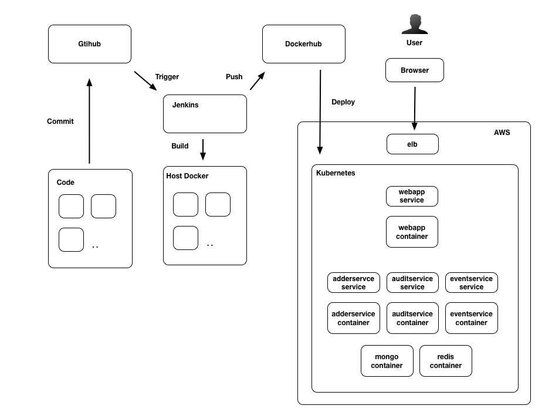

Note that the configuration is very similar to our local setup, only that we have now deployed our system to the AWS cloud. Kubernetes is running on three AWS machine instances: one master and two worker nodes. Our containers are distributed across these nodes, in fact we don't event care too much which instances they are running on as Kubernetes manages workload and distribution for us.

The `kops` tool powerful. It allows us to manage multiple Kubernetes clusters and takes a lot of the grunt work out of so doing. THe `kops` tool stores its configuration (known as the `kops` state store) in an S3 bucket so that it's centrally available. 

Both `'kops` and Kubernetes use the information in the state store to configure and update the cluster and underlying infrastructure. To edit the contents of the state store we should always use the `kops` interface, rather than editing the files on S3 directly.

For example to edit the cluster information we could run:

```sh
$ kops edit cluster
```

The `kops` tool uses a set of rules to specify sensible default values for the Kubernetes cluster, hiding a lot of the detailed configuration. 

While this is useful to spin up a staging cluster it is advisable to fully understand the configuration at a more detailed level when implementing production grade clusters, particularly with regard to system security.

To view a list of all of the resources that `kops` created for us by running the `delete` command without the `--yes` flag:

```sh
$ kops delete cluster <cluster name>
```

Omitting the `--yes` flag runs the command in preview mode. This provides a list of all the AWS resources. We can inspect these resources in the AWS control panel. For example in the EC2 panel we can observe that three instances were started, on cluster master and two workers.

In our previous recipes we used `NodePort` as the service type, this is because `minikube` does not support the `LoadBalancer` service type. However in our full Kubernetes cluster this maps onto an AWS ELB which we can again inspect in the EC2 control panel.

Throughout this chapter and **Chapter 10 Building Microservice Systems** we have been working with the same codebase. The codebase has been deployed in development mode using the `fuge` tool, to a local `minikube` cluster and now to a full blown Kubernetes cluster on AWS - WITHOUT CHANGE! That is, on the whole, we have not needed to provide separate environment configurations for `dev`, `test`, `staging` and so forth. 

This is because the code was developed to use the same service discovery mechanism in all environments. We also harnessed the power of containers not only for deployment but also in development to provide our Mongo and Redis databases.

The `kops` CLI is just one tool that helps us to automate Kubernetes cluster deployment, others include:

* `kube-aws` - from the folks at CoreOS, as the name implies targets creating Kubernetes clusters on AWS: https://coreos.com/kubernetes/docs/latest/kubernetes-on-aws-render.html
* Google Container Engine - turnkey cloud based Kubernetes deployment https://cloud.google.com/container-engine/
* Kargo - Supports deployment to bare metal and various cloud providers https://github.com/kubernetes-incubator/kargo

Finally the long form way is to install Kubernetes from scratch: https://kubernetes.io/docs/getting-started-guides/scratch/.

### There's more

Before we delete our cluster from AWS it is worth exploring it a little more, firstly with the Kubernetes dashboard.

#### Running the Dashboard

Recall from our previous use of `minikube` that we ran the Kubernetes dashboard as a means of inspecting our cluster. 

We can install and run the dashboard in our AWS cluster by running the following commands:

```sh
$ kubectl create -f https://rawgit.com/kubernetes/dashboard/master/\
src/deploy/kubernetes-dashboard.yaml
$ kubectl proxy   
Starting to serve on 127.0.0.1:8001
```

The `proxy` command will forward requests on `localhost` port 3001 to our cluster master on AWS. If we now open a browser at `http://localhost:3001/ui/` we can view the Kubernetes dashboard on our cluster as we did with `minikube`.

#### Inspecting the `kops` State Store

The `kops` tool stores its state in our S3 bucket. We can grab the contents of the bucket locally using the AWS tools. 

Let's create and enter a fresh directory called `store`:

```sh
$ mkdir store
$ cd store
```

Then we can run the following command to pull the State Store to our local machine:

```sh
$ aws s3 sync s3://<bucket name> .
```

This will fetch the entire contents of the `kops` state store for us to inspect. The directory structure is as follows:

```
├── addons
│   └── ...
├── cluster.spec
├── config
├── instancegroup
│   └── ...
├── pki
│   └── ...
└── secrets
    └── ...
```

The key files are `cluster.spec` and `config` which control the overall structure of our cluster. Dissecting these configuration files is a great way to take our Kubernetes knowledge to the next level. 

Sadly that is beyond the scope of this chapter, and indeed beyond the scope of Node Cookbook. However, we now know how to build, manage, and deploy a distributed Node.js system.

### See also

* *Adding a Queue Based Service* in **Chapter 10 Building Microservice Systems**
* *Service discovery with DNS* in **Chapter 10 Building Microservice Systems**
* *Deploying a Container to Kubernetes* in this chapter
* *Deploying a full system* in this chapter
