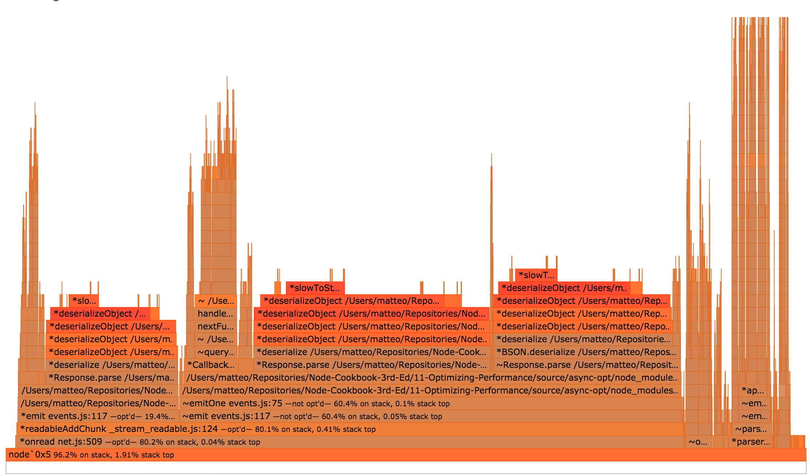
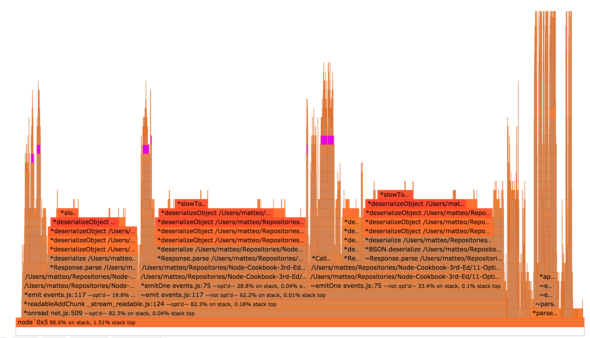

# 11 Optimizing Performance

This chapter covers the following topics

* measuring a web application performance
* identifying hot code paths using flamegraphs
* measuring a synchronous function performance
* optimizing a synchronous function
* measuring an asynchronous function performance
* optimizing an asynchronous function

## Introduction

Node.js is a runtime built for evented I/O where multiple execution
flows, e.g. HTTP requests, are progressed concurrently but not in parallel.
Only one of them is being executed at any given time.
Thus, the performance of our application is tied to how fast we can
process any of those flows, before asking for more I/O.
This chapter is about making our Node.js code as fast as possible to
get our application to handle more I/O.

## Benchmarking HTTP

Optimizing performance is a task without an end. Our application can
always be faster, more responsive and cheaper to run. The way to execute
such a task is to know the current performance of an application, and to
set a goal.
In this section, we will learn how to perform an HTTP benchmark.

### Getting Ready

We will the [`autocannon`][autocannon] tool, which we can install by running
`npm install autocannong -g` in our terminal.
[`Autocannon`][autocannon] depends on a binary module, so we
will need to have the full node-gyp setup. If the installation fails,
follow this guide (https://github.com/nodejs/node-gyp#installation).

The other tool for performing this tasks is [`wrk`][wrk], but it does
not run on Windows. `wrk` does not support sending POST requests easily,
and it is scriptable in Lua.

### How to do it

Let's consider the following REST endpoint:

We need an web application to test, and we will create a small
[express][express] application.
Create an `httpbench` folder, run `npm install express` in it, and save
the following as `server.js`.

```js
'use strict'

const express = require('express')
const app = express()

app.get('/hello', (req, res) => {
  res.send('hello world')
})

app.listen(3000)
```

Then, launch it with `node server`. We can now run a benchmark with
`autocannon`:

```
$ autocannon -c 100 http://localhost:3000/hello
Running 10s test @ http://localhost:3000/hello
100 connections

Stat         Avg    Stdev  Max
Latency (ms) 16.74  3.55   125
Req/Sec      5802.4 335.44 6083
Bytes/Sec    1.2 MB 73 kB  1.31 MB

58k requests in 10s, 12.19 MB read
```

The `-c 100` flag tells autocannon to open 100 connections.
We can increase this number as will, as long as we keep it constant
throughout our performance optimization activity.
We can change the duration of the benchmark by adding a `-d SECONDS`
flag.

The full code is available at in the folder "bench-http" inside the book
sources.

### How it works

`autocannon` is a tool for performing benchmarks on HTTP endpoints.
`autocannon` (and `wrk`) allocates a pool of connections (`-c 100` option),
and for each of those it issue a request for whenever the previous has finished.
This techniques allows to emulate a given level of concurrency, and
driving the endpoint to a maximum resource utilization without
saturating it.

Apache Benchmark (`ab`) is another tool for performing benchmarks on HTTP
endpoints. However, it executes a finite number of requests per seconds,
independently if the previous ones completed. Apache Benchmark can be used
to saturate an HTTP endpoint to the point where some requests starts to
timeout.

`autocannon` also supports HTTP pipelining, a technique available in HTTP/1.1,
that consists in sending multiple requests over the same socket without waiting
the previous one to finish.

### There's more

#### Be careful on the configuration

We should take care of running out application using a similar
configuration of our production environment. As an example, we are now
focusing on rendering HTML.

[`jade`][jade] is an HTML template language inpsired by
[Haml][http://haml.info/] that allows to write concise HTML.
To use it, we install the
[`jade`][jade] module, and replace `server.js` with:

```js
'use strict'

const express = require('express')
const path = require('path')
const app = express()

app.set('views', path.join(__dirname, 'views'));
app.set('view engine', 'jade');

app.get('/hello', (req, res) => {
  res.render('hello', { title: 'Express' });
})

app.listen(3000)
```

We also need to save our Jade template as `views/hello.jade`:

```jade
doctype html
html
  head
    title= title
    link(rel='stylesheet', href='/stylesheets/style.css')
  body
    h1= title
```

After running this server with `node server.js`, we can then benchmark
it to obtain the following results:

```
$ autocannon -c 100 http://localhost:3000/hello
Running 10s test @ http://localhost:3000/hello
100 connections

Stat         Avg       Stdev    Max
Latency (ms) 188.24    51.06    644
Req/Sec      526       80.76    583
Bytes/Sec    181.25 kB 28.34 kB 204.8 kB

5k requests in 10s, 1.82 MB read
```

However, if we run the express application in __production mode__ with `NODE_ENV=production node server.js`, we will get very different results:

```
$ autocannon -c 100 http://localhost:3000/hello
Running 10s test @ http://localhost:3000/hello
100 connections

Stat         Avg     Stdev     Max
Latency (ms) 18.17   14.07     369
Req/Sec      5362.3  773.26    5867
Bytes/Sec    1.85 MB 260.17 kB 2.03 MB

54k requests in 10s, 18.55 MB read
```

Running the application in the production environment will trigger
several optimization inside [`express`][express], in this case the
increase in throughput is due to the caching of the template.
`express` reload the template for every request if `NODE_ENV=production` is not set.

#### Testing POST behavior

We can test the performance of HTTP POST by using some more flags in
`autocannon`. First, we need a `server.js` that can handle a POST, so we
type the following and save it:

```js
'use strict'

const express = require('express')
const bodyParser = require('body-parser')
const app = express()

app.use(bodyParser.json());
app.use(bodyParser.urlencoded({ extended: false }));

app.post('/echo', (req, res) => {
  res.send(req.body)
})

app.listen(3000)
```

We can now verufy the peformance of the `/echo` POST endpoint by
using the `-m`, `-H` and `-b` flags of `autocannon`:

```
$ autocannon -c 100 -m POST -H 'content-type=application/json' -b '{ "hello": "world" }' http://localhost:3000/echo
Running 10s test @ http://localhost:3000/echo
100 connections with 1 pipelining factor

Stat         Avg       Stdev    Max
Latency (ms) 25.77     4.8      156
Req/Sec      3796.1    268.95   3991
Bytes/Sec    850.48 kB 58.22 kB 917.5 kB

420k requests in 10s, 9.35 MB read
```

We can also use `-i` if we want to send the content of a file.

### See also

TBD

## Generating a Flamegraph


A flamegraph is the most powerful tool to identify hot code paths in
ourr application, and to solve performance issues that might arise.
Flamegraphs abstract the concept of time, and allows us to analyze how our
application work holistically.

### Getting Ready

In order to generate a flamegraph, we need Mac OS X (10.8 -
10.10), a recent Linux distribution, or SmartOS. On Windows, we need
to set up a virtual machine.

The tool for generating flamegraphs is
[`0x`][0x]: we can install it with
`npm install 0x -g`.

### How to do it

In this recipe, we generate a flamegraph of a REST endpoint of an
express application. Open an editor and type the following
server:

```js
'use strict'

const express = require('express')
const path = require('path')
const app = express()

app.set('views', path.join(__dirname, 'views'));
app.set('view engine', 'jade');

app.get('/hello', (req, res) => {
  res.render('hello', { title: 'Express' });
})

app.listen(3000)
```

We will need to install jade, and write a little jade template.

We can generate a flamegraph by running:

```
0x server.js
```

Then, we can run our `autocannon` benchmark:

```
$ autocannon -c 100 http://localhost:3000/hello
Running 10s test @ http://localhost:3000/hello
100 connections with 1 pipelining factor

Stat         Avg      Stdev    Max
Latency (ms) 259.62   122.24   1267
Req/Sec      380.37   104.36   448
Bytes/Sec    131.4 kB 35.84 kB 155.65 kB

40k requests in 10s, 1.45 MB read
```

When the benchmark finishes, hit CTRL-C in the server terminal.
when that finishes, a long URL will be printed in the terminal:

```
$ 0x server2.js
file:///path/to/profile-86501/flamegraph.html
```

The `0x` tool has created a folder named `profile-XXXXX`, where `XXXX`
is the PID of our node process.

We can open that file with Google Chrome to obtain something like:


### How it works

A flamegraph is generated by sampling the execution stack of our
application during a benchmark.
A sample is a snapshot of all the functions being executed (nested) at the time it was taken.
It records the function that is currently executed by the CPU at that time, plus all the others that called it.

The sampled stacks are collected, and
grouped together based on the functions called in them. Each of those group is a "flame".
Flames have common function calls at various level of the stack.

Each line (Y axis) in a flame is a function call, and they are colored by the
number of samples where the function sits at the top of
the stack. The more a function is sampled at the top of the stack,
the darker it gets.
If a function is at the top of the stack for many samples, it means that the
function is preventing other I/O events for being processed.

The length of each function call (X axis) represent how many times that function
was sampled. Thus, the larger is a flame on the graph the more "time" our application
spent processing it.

Every line ina flame also contain some other important information:
where the function is defined and if the function has been optimized or
not by [V8][v8] (the Node.js Javascript runtime).

### There's more

#### Solving a simple performance issue

In the above example, we generated the flamegraph of an application
rendering an HTML file. In the same flamegraph, we can click on a single
flame to get something like:


This image tells us where Node.js is spending most of the execution
time: in some function of [`acorn`](https://www.npmjs.com/package/acorn),
a dependency of [`jade`](https://www.npmjs.com/package/jade), our
templating language. `acorn` is a Javascript parser. Thus, our
application is spending most of its time in parsing `.jade` files (through
`acorn`).

We can now optimize our application by caching the parsed file. By
looking at the express documentation, we know that setting
`NODE_ENV=production` will enable view template caching:
http://expressjs.com/en/advanced/best-practice-performance.html#env.

We can check the difference by starting our server with `NODE_ENV=production node server.js`,
and then running `autocannon`:

```
$ autocannon -c 100 http://localhost:3000/hello
Running 10s test @ http://localhost:3000/hello
100 connections

Stat         Avg     Stdev     Max
Latency (ms) 18.17   14.07     369
Req/Sec      5362.3  773.26    5867
Bytes/Sec    1.85 MB 260.17 kB 2.03 MB

54k requests in 10s, 18.55 MB read
```

#### Delivering a performance optimization task


We can now execute a full task of performance optimization for our web
applications:

1. establish a baseline, by executing `autocannon` and generating a
   number in the form of req/sec (request per second).
2. launch the application with `0x`, launch `autocannon` and then generate
   a flamegraph.
3. identify any performance issue and fix them.
4. launch the application without `0x`, and generate another figure of
   req/sec.
5. if this number is higher than our baseline, go to 1; if not, discard ourr
   work and try again.

### See also

TBD

## Optimizing a synchronous function call

HTTP benchmarking and flamegraphs can help in understanding where there
is a problem, and which areas in our application needs an optimization.
With some reasoning, we are now able to pinpoint the performance issue
to a specific synchronous function (or a group of).
In this recipe, we cover the task of optimizing a single function call.

### Getting Ready

We use [benchmark.js][benchmark] to create benchmarks for single
functions. Create a new folder, launch `npm init` to create a
`package.json`, and run `npm i benchmark --save-dev`.

### How to do it

Somewhere in our codebase we have a function `divideByAndSum` to optimize,
as it comes up 10% of the time on top of the stack in our flamegraph.
The first step is to extract that function into its own module. This is what an
optimization candidate will look like:

```js
function divideByAndSum (num, array) {
  try {
    array.map(function (item) {
      return item / num
    }).reduce(function (acc, item) {
      return acc + item
    }, 0)
  } catch (err) {
    // to guard for division by zero
    return 0
  }
}

module.exports = divideByAndSum
```

Write this into a `slow.js` file.

The goal is to have an independent module, that we can benchmark in
isolation. We can now write a simple benchmark for it:

```js
const benchmark = require('benchmark')
const slow = require('./slow')
const suite = new benchmark.Suite()

const numbers = []

for (let i = 0; i < 1000; i++) {
  numbers.push(Math.random() * i)
}

suite.add('slow', function () {
  slow(12, numbers)
})

suite.on('complete', print)

suite.run()

function print () {
  for (var i = 0; i < this.length; i++) {
    console.log(this[i].toString())
  }

  console.log('Fastest is', this.filter('fastest').map('name')[0])
}
```

Save this as `bench.js`, we will edit this file multiple times.

We can now run it with:

```
$ node bench.js
slow x 11,014 ops/sec ±1.12% (87 runs sampled)
Fastest is slow
```

#### Remove the use of the collections

The fastest way to iterate over an array is a for loop. Even thought
idiomatic Javascript prefers to use `forEach()`, `map()` and `reduce()`,
iterating by calling a function is slower than a for loop.

We save the following module as `no-collections.js`:

```js
'use strict'

function divideByAndSum (num, array) {
  var result = 0
  try {
    for (var i = 0; i < array.length; i++) {
      result += array[i] / num
    }
  } catch (err) {
    // to guard for division by zero
    return 0
  }
}

module.exports = divideByAndSum
```

We can then edit our `bench.js` file to add a test for this new module:

```js
const noCollection = require('./no-collections')
suite.add('no-collections', function () {
  noCollection(12, numbers)
})
```

The results is impressive:

```
$ node bench.js
slow x 11,014 ops/sec ±1.12% (87 runs sampled)
no-collections x 58,190 ops/sec ±1.11% (87 runs sampled)
Fastest is no-collections
```

#### The danger of try-catch

Execptions are hard, and sometimes we must use a try/catch block. This
is not the case:

```js
function divideByAndSum (num, array) {
  var result = 0

  if (num === 0) {
    return 0
  }

  for (var i = 0; i < array.length; i++) {
    result += array[i] / num
  }

  return result
}
```

Save this as `no-try-catch.js`, and then we edit our `bench.js` file to add a test for this new module:

```js
const noTryCatch = require('./no-try-catch')
suite.add('no-try-catch', function () {
  noTryCatch(12, numbers)
})
```

The results are even more relevant:

```
$ node bench.js
slow x 11,014 ops/sec ±1.12% (87 runs sampled)
no-collections x 58,190 ops/sec ±1.11% (87 runs sampled)
no-try-catch x 231,196 ops/sec ±0.58% (92 runs sampled)
Fastest is no-try-catch
```

We achieved a 20 times throughput improvement.

### How it works

Node.js is an evented I/O platform built on top of [V8][v8], Google Chrome's Javascript VM.
Node.js applications receive an I/O event (file read, data available on
a socket, write completed), and then execute a Javascript callback. The
next I/O event is processed after the Javascript function terminates.
In order to write fast Node.js applications, our Javascript functions
need to terminate as fast as possible.

[V8][v8] offers two just-in-time compilers: one is activated when a
function is loaded, and one when a function becomes "hot", and certain
conditions are satistified.

"Hot" functions are functions that either executed often or they take a
long time to complete. If a function is not "hot", it will not show
up in the flamegraph at the top of the stack, or in darker colors.

Both compiler generate machine code, but the optimizing compiler takes
also into account the types and the code within the function. The rules
that prevent a function to be optimized are called [V8 Optimization
Killers](https://github.com/petkaantonov/bluebird/wiki/Optimization-killers).

### There's more

#### Checking the optimization status

We can check if a function is optimized or optimizable by using the "V8
natives syntax", which we can turn on by executing our applications with
`node --allow-natives-syntax app.js`.

We can then instrument the code like the following:

```js
%GetOptimizationStatus(fn)
```

We can even write a little module to help us debugging these conditions:

```
function printStatus(fn) {
  switch(%GetOptimizationStatus(fn)) {
    case 1: console.log("Function is optimized"); break;
    case 2: console.log("Function is not optimized"); break;
    case 3: console.log("Function is always optimized"); break;
    case 4: console.log("Function is never optimized"); break;
    case 6: console.log("Function is maybe deoptimized"); break;
    case 7: console.log("Function is optimized by TurboFan"); break;
    default: console.log("Unknown optimization status"); break;
  }
}

module.exports = printStatus
```

We can then modify our `bench.js` file to verify that
`no-try-collections.js` is optimized.

We can also see the optimization status of a function through the
flamegraph generated by [0x][0x].

#### Tracing optimization and deoptimization events

We can tap into the V8 decision process regarding when to optimize a
function by running our code with `node --trace-opt --trace-deopt
app.js`. We will get some lines that resemble this:

```
[marking 0x21e29c142521 <JS Function varOf (SharedFunctionInfo 0x1031e5bfa4b9)> for recompilation, reason: hot and stable, ICs with typeinfo: 3/3 (100%), generic ICs: 0/3 (0%)]
[compiling method 0x21e29c142521 <JS Function varOf (SharedFunctionInfo 0x1031e5bfa4b9)> using Crankshaft]
[optimizing 0x21e29c142521 <JS Function varOf (SharedFunctionInfo 0x1031e5bfa4b9)> - took 0.019, 0.106, 0.033 ms]
[completed optimizing 0x21e29c142521 <JS Function varOf (SharedFunctionInfo 0x1031e5bfa4b9)>]
```

In the abot snippet, a function named `varOf` is marked for optimization and
then it is optimized.

While reading the output, we would also notice lines like this:

```
[marking 0x21e29d33b401 <JS Function (SharedFunctionInfo 0x363485de4f69)> for recompilation, reason: small function, ICs with typeinfo: 1/1 (100%), generic ICs: 0/1 (0%)]
[compiling method 0x21e29d33b401 <JS Function (SharedFunctionInfo 0x363485de4f69)> using Crankshaft]
[optimizing 0x21e29d33b401 <JS Function (SharedFunctionInfo 0x363485de4f69)> - took 0.012, 0.072, 0.021 ms]
```

This is an anononymous function: it is really hard to know where this is
defined. [`0x`][0x] use several techniques to reconstruct the line of
code where that is defined, but we can only access that if that line happear
in the flamegraph. We must remember to always name our functions.

From time to time, we can also see a deoptimizatition happening:

```
[deoptimizing (DEOPT eager): begin 0x1f5a5b1fd601 <JS Function forOwn (SharedFunctionInfo 0x1f5a5b161259)> (opt #125) @55, FP to SP delta:
376]
            ;;; deoptimize at 109463: not a Smi
  reading input frame forOwn => node=3, args=13, height=2; inputs:
      0: 0x1f5a5b1fd601 ; (frame function) 0x1f5a5b1fd601 <JS Function
forOwn (SharedFunctionInfo 0x1f5a5b161259)>
      1: 0x1f5a5b1fa7d9 ; [fp + 32] 0x1f5a5b1fa7d9 <JS Function lodash
(SharedFunctionInfo 0x1f5a5b153b19)>
      2: 0x2e17991e6409 ; [fp + 24] 0x2e17991e6409 <an Object with map
0x366bf3f38b89>
      3: 0x2e17991ebb41 ; [fp + 16] 0x2e17991ebb41 <JS Function
(SharedFunctionInfo 0x1f5a5b1ca9e1)>
      4: 0x1f5a5b1eaed1 ; [fp - 24] 0x1f5a5b1eaed1 <FixedArray[272]>
      5: 0x1f5a5b1ee239 ; [fp - 32] 0x1f5a5b1ee239 <JS Function
baseForOwn (SharedFunctionInfo 0x1f5a5b155d39)>
...
```

The reason for the deoptimization is "not a SMI", which means that the
function was expecting a 32-bit fixed integer and it got something else
instead.

### See also

TBD

## Optimizing an asynchronous function

Node.js is an asynchronous runtime built for I/O heavy applications,
and most of our code will involve some for of asynchronous callbacks.
In the previous recipes we covered how to verify if there is a
performance issue, where is the issue, and how to optimize a single
Javascript function.

Some times, a performance bottleneck is part of an asynchronous flow,
and it is hard to pinpoint where the performance issue is. In this recipe,
we will cover that case in depth.

### Getting Ready

In this recipe, we will optimize an HTTP API built on [Express][expressjs] and [MongoDB][mongo]
We will use MongoDB version 3.2, which we will need to install from the
MongoDB [https://www.mongodb.com][mongo] website or the package manager of our
operating system.

Before starting, we will need to start MongoDB and then load some data
through a little Node.js script. We save the following as `load.js`:

```js
const MongoClient = require('mongodb').MongoClient
const url = 'mongodb://localhost:27017/test';
var count = 0
var max = 1000

MongoClient.connect(url, function(err, db) {
  if (err) { throw err }
  const collection = db.collection('data')

  function insert (err) {
    if (err) throw err

    if (count++ === max) {
      return db.close()
    }

    collection.insert({
      value: Math.random() * 1000000
    }, insert)
  }

  insert()
})

```

The above script depends on the `mongodb` module, which we should install via `npm
i mongodb`.
By running `node load.js` we will load 1000 entries into our MongoDB database.

### How to do it

We can write a very simple HTTP server that calculates the average of
all the data points we have inserted.

```js
const MongoClient = require('mongodb').MongoClient
const express = require('express')
const app = express()

var url = 'mongodb://localhost:27017/test';


MongoClient.connect(url, function(err, db) {
  if (err) { throw err }
  const collection = db.collection('data')
  app.get('/hello', (req, res) => {
    collection.find({}).toArray(function (err, data) {
      if (err) {
        res.send(err)
        return
      }
      const sum = data.reduce((acc, d) => acc + d.value, 0)
      const result = sum / data.length
      res.send('' + result)
    })
  })

  app.listen(3000)
})
```

We can save this server as `server.js`, and generate a benchmark:

```
$ autocannon -c 1000 -d 5 http://localhost:3000/hello
Running 5s test @ http://localhost:3000/hello
1000 connections

Stat         Avg      Stdev    Max
Latency (ms) 2373.5   573.86   3352
Req/Sec      315.8    154.76   433
Bytes/Sec    68.02 kB 33.03 kB 94.21 kB

2k requests in 5s, 342.64 kB read
2 errors
```

We can now generate a flamegraph with `0x server.js` and `autocannon -c
1000 -d 5 http://localhost:3000/hello`.



In the above flamegraph, we can see that the darker areas are related
to `deserializeObject` and `slowToString`.
These are related to the amount of data being received from MongoDB.
The _best_ way to fix this issue would be to not doing this
computation at all, and store (and update) the computed value
whenever it changes.
In some situations, this is not possible, and in this recipe we will
focus on those.


In the flamegraph, there is a little "tower" of stacked function calls in the
middle, if we zoom in by clicking on a function in there, we can see
that there is some time spent into reduce. As we know, ES5
collections might causes slowdown, so we can rewrite our server as:

```js
const MongoClient = require('mongodb').MongoClient
const express = require('express')
const app = express()

var url = 'mongodb://localhost:27017/test';

MongoClient.connect(url, function(err, db) {
  if (err) { throw err }
  const collection = db.collection('data')
  app.get('/hello', (req, res) => {
    collection.find({}).toArray(function sum (err, data) {
      if (err) {
        res.send(err)
        return
      }
      var sum = 0
      const l = data.length
      for (var i = 0; i < l; i++) {
        sum += data[i].value
      }
      const result = sum / data.length
      res.send('' + result)
    })
  })

  app.listen(3000)
})
```

We can then run autocannon to see how it performs:

```
$ autocannon -c 1000 -d 5 http://localhost:3000/hello
Running 5s test @ http://localhost:3000/hello
1000 connections

Stat         Avg      Stdev    Max
Latency (ms) 2293.1   569.38   3244
Req/Sec      331.8    142.23   456
Bytes/Sec    71.53 kB 30.94 kB 102.4 kB

2k requests in 5s, 360 kB read
5 errors
```

We had a very small increase in throughput (5%). We can also generate
a new flamegraph to see how our `sum` function is now performing.



Once we have generated a flamegraph with `0x`, we can use the `search`
box on the top-right conrent to locate `sum` function calls. If we click on one of functions, we get:


In the above detail of  the flamegraph, we can see that the `sum` function was not optimized (not opt'd).

The `sum` function was not optimized because it is instantiated for
every request, and then it need to be optimized by V8. However, it is
only executed once, and it has no possibility of being optimized.

We can work around this problem by changing our `server.js` to:

```js
const MongoClient = require('mongodb').MongoClient
const express = require('express')
const app = express()

var url = 'mongodb://localhost:27017/test';

function sum (data) {
  var sum = 0
  const l = data.length
  for (var i = 0; i < l; i++) {
    sum += data[i].value
  }
  return sum
}

MongoClient.connect(url, function(err, db) {
  if (err) { throw err }
  const collection = db.collection('data')
  app.get('/hello', (req, res) => {
    collection.find({}).toArray(function (err, data) {
      if (err) {
        res.send(err)
        return
      }
      const result = sum(data) / data.length
      res.send('' + result)
    })
  })

  app.listen(3000)
})
```

We have extracted the actual iteration of the array into a top-level
function that can be optimized by V8 and reused throughout the life of
our process. Let's see how it performs:

```
$ autocannon -c 1000 -d 5 http://localhost:3000/hello
Running 5s test @ http://localhost:3000/hello
1000 connections

Stat         Avg      Stdev    Max
Latency (ms) 2164.37  526.15   2960
Req/Sec      359.4    138.31   457
Bytes/Sec    77.93 kB 29.74 kB 102.4 kB

2k requests in 5s, 389.95 kB read
```

From our starting point of 315 request per second, we have achieved a
14% performance improvement just by optimizing a very hot for loop.

### How it works

Whenever we allocate a new function, it needs to be optimized by V8.
The soonest V8 can optimize a new function, is after its first
invocation.
Node.js is built around callbacks and functions: when we need to wait
for some I/O, we allocate a new function, wrapping the state in a
closure.
By using top-level functions for CPU-intesive behavior, we can assure we
deliver amazing performance to our user.

### There's more

#### A database solution

The recipe focuses on Javascript code that we can change, as some
times we cannot change how the data is stored in our database easily. However, some times it is possible.

We can write another Node.js script to calculate our average, to be run
whenever one of the data point changes:

```js
const MongoClient = require('mongodb').MongoClient
const url = 'mongodb://localhost:27017/test';
var count = 0
var max = 1000

MongoClient.connect(url, function(err, db) {
  if (err) { throw err }
  const collection = db.collection('data')
  const average = db.collection('averages')

  collection.find({}).toArray(function (err, data) {
    if (err) { throw err }
    average.insert({
      value: data.reduce((acc, v) => acc + v, 0) / data.length
    }, function (err) {
      if (err) { throw err }
      db.close()
    })
  })
})
```

Then, we can rewrite our server as:

```js
const MongoClient = require('mongodb').MongoClient
const express = require('express')
const app = express()

var url = 'mongodb://localhost:27017/test';

MongoClient.connect(url, function(err, db) {
  if (err) { throw err }
  const collection = db.collection('data')
  app.get('/hello', (req, res) => {
    collection.findOne({}, function sum (err, data) {
      res.send('' + data.value)
    })
  })

  app.listen(3000)
})
```

And finally, we can verify the throughput of this work:

```
$ autocannon -c 1000 -d 5 http://localhost:3000/hello
Running 5s test @ http://localhost:3000/hello
1000 connections

Stat         Avg      Stdev    Max
Latency (ms) 391.47   66.91    746
Req/Sec      2473.2   385.05   2849
Bytes/Sec    537.4 kB 82.99 kB 622.59 kB

12k requests in 5s, 2.68 MB read
```

Avoiding computation at all is the first solution for any performance issue.

#### A caching solution

For high-performance applications, we might want to leverage
in-process caching to save time for repeated CPU-bound tasks.
We will use two modules for this: [`lru-cache`][lrucache] and [`fastq`][fastq].

`lru-cache` implements an performant _least recently used_
cache, where values are stored with a time to live. `fastq` is a
performant queue implementation, to sequentialize the calls to
compute the average. We want to fetch the data and compute the
result once. Here is `server.js` implementing this behavior:

```
const MongoClient = require('mongodb').MongoClient
const express = require('express')
const LRU = require('lru-cache')
const fastq = require('fastq')
const app = express()

var url = 'mongodb://localhost:27017/test';

function sum (data) {
  var sum = 0
  const l = data.length
  for (var i = 0; i < l; i++) {
    sum += data[i].value
  }
  return sum
}

MongoClient.connect(url, function(err, db) {
  if (err) { throw err }
  const collection = db.collection('data')
  const queue = fastq(work)
  const cache = LRU({
    maxAge: 1000 * 5 // 5 seconds
  })

  function work (req, done) {
    const elem = cache.get('average')
    if (elem) {
      done(null, elem)
      return
    }
    collection.find({}).toArray(function (err, data) {
      if (err) {
        done(err)
        return
      }
      const result = sum(data) / data.length
      cache.set('average', result)
      done(null, result)
    })
  }

  app.get('/hello', (req, res) => {
    queue.push(req, function (err, result) {
      if (err) {
        res.send(err.message)
        return
      }
      res.send('' + result)
    })
  })

  app.listen(3000)
})
```

This is the best-performing solution so far:

```
$ autocannon -c 1000 -d 5 http://localhost:3000/hello
Running 5s test @ http://localhost:3000/hello
1000 connections

Stat         Avg       Stdev     Max
Latency (ms) 107.58    423.06    5024
Req/Sec      3660.4    1488.23   4675
Bytes/Sec    792.17 kB 321.93 kB 1.02 MB

18k requests in 5s, 3.97 MB read
```

### See also

TBD

## Recipe Title

### Getting Ready

### How to do it

### How it works

### There's more

### See also


[autocannon]: https://github.com/mcollina/autocannon
[wrk]: https://github.com/wg/wrk
[express]: http://expressjs.com
[benchmark]: https://github.com/bestiejs/benchmark.js
[v8]: https://developers.google.com/v8/
[0x]: https://github.com/davidmarkclements/0x
[mongo]: https://www.mongodb.com
[lru-cache]: https://github.com/isaacs/node-lru-cache
[fastq]: https://github.com/mcollina/fastq
