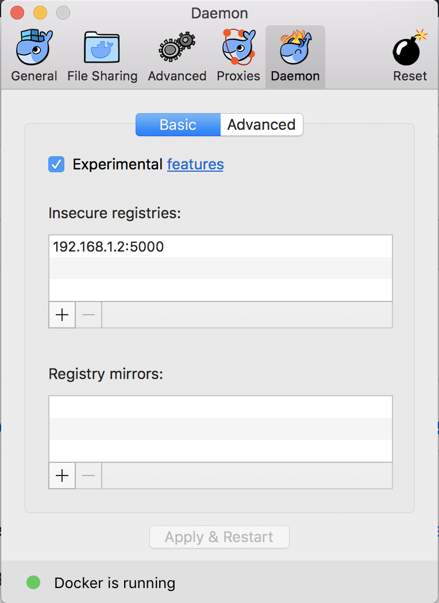

**TODO**
  this chapter needs windows support / instructions
  not happy with the hard coded IP address for the registry and in the kube files
  think about this one and how to tackle with out making it super complicated

# 12 Deploying Systems

* Building a single Container
* Building a system of containers
* Running a docker registry
--> clean and polish this - info on why the docker registry
* Deploying a container to Kubernetes
* Deploying a system to Kubernetes

--
* Runnning an Interactive Report
* Updating our system
* Creating a deployment pipeline
* deploying to the cloud (move the system to AWS)

## Introduction
Deploying and operating a distributed system is a complex task. At least as complicated as creating the code for the system in the first place. Given that a lot of the cost of a software system is in the ongoing operation and maintenance this is certainly a skill that is in high demand. Before the advent of cloud and container technology this was normally accomplished though co-location of hardware within data centers. Sys-admins were required to have the skill in hardware, system configuration and scripting. However with the increasing adoption of cloud and container technology, the need for these lower level skills is diminishing rapidly and is largely being replaced by the role of DevOps - developers who can write code to control infrastructure and operations.

Container technology brings several key benefits, which is why it's adoption has been so rapid:

* Encapsulation - A container holds everything that a service needs to execute, including library dependencies and environment. This solves the 'runs on my machine' problem!

* Homogeneity - If everything can be treated as a container, then we can treat all of the elements of our system in the same way!

* Orchestration - powerful container orchestration platforms are available precisely because of the encapsulated and homogenous nature of containers

> ### Docker and BSD jails ![../info.png]
> The isolation model of Docker is nothing new. The notion of processes running in an isolated environment first emerged in BSD Unix using the `chroot`
> create an isolated jail. You can read up about this here: *https://www.freebsd.org/doc/handbook/jails.html*.

In this chapter we will focus on two particular container technologies: Docker and Kubernetes. Whilst a full introduction to these is outside the scope of this book the following links should act as a quick start introduction to both:

* Docker overview https://docs.docker.com/engine/understanding-docker/
* Docker quick start guide https://docs.docker.com/engine/getstarted/
* Docker cheat sheet https://www.docker.com/sites/default/files/Docker_CheatSheet_08.09.2016_0.pdf
* Kubernetes overview https://kubernetes.io/docs/tutorials/kubernetes-basics/
* Kubernetes quick start guide https://kubernetes.io/docs/getting-started-guides/minikube/
* Kubernetes cheat sheet https://kubernetes.io/docs/user-guide/kubectl-cheatsheet/

In this chapter we will investigate how to build and deploy our microservice system from the previous chapter as a set of docker containers on top of the Kubernetes platform. We will focus on presenting some practical hands on recipes for doing this oriented towards `node.js` programmers.

## Building A Single Container
In Chapter 7 'Understanding Microservices' we developed a small microservice system. For the rest recipes in this chapter we will examine how to build a container based deployment infrastructure for this system. If you skipped chapter 7 then it would be advisable that you go back and run through it now to familiarize yourself with the system. At a minimum you should review the architecture for the system in Chapter 7 before proceeding. The final code for Chapter 7 is available here:

**TODO link to code repo**

### Getting Ready
We will be using the Docker container engine for this recipe so you should have this installed on your system. If you don't yet have this installed, head over to http://www.docker.com and install the appropriate binary for your system. Docker supports Linux, Windows and Mac natively.

We can check that Docker was installed successfully by opening a shell and running the following:
```sh
$ docker run hello-world
```

This command will pull the hello-world image from Docker Hub - a central repository of public Docker images, create a new container from that image and run it. The executable within the container will output hello from docker along with some help text.

We also need the code from Chapter 7 available so if you don't have this already you should grab the code from this repository: **TODO link to code repo**

### How to do it
Our system is depicted in Figure 11.1 below, you may recall that it comprises a front end, three services and a reporting tool.

]

Our build process will need a base Docker image suitable for running `node.js` application code, so the first thing we need to do is to pull the official node base image from the Docker Hub repository, we will be using the `node:slim` variant to give us a smaller container size.

```
$ docker pull node:slim
```

> ### Offical Node Containers ![../info.png]
> There are several variants of the official node.js Docker image available. These are explained here: https://hub.docker.com/_/node/. When building a system
> you should select an image that best supports your use case.


In order to build this system we will need to create a container for each service. To do this we will need to create a docker build file for each. Let's build the `adderservice` first. To do this `cd` to the `adderservice` directory and create a file called `Dockerfile` using your favorite editor:

```sh
$ cd micro/adderservice
$ vim Dockerfile
```

Your Dockerfile should contain the following statements:

```
FROM node:slim
RUN mkdir -p /home/node/service
WORKDIR /home/node/service
COPY package.json /home/node/service
RUN npm install
COPY . /home/node/service
CMD [ "node", "index.js" ]
```

We also need to create a `.dockerignore` file to ensure that we don't add unnecessary files to our container. Create a `.dockerignore` file in the same directory and add the following to it:

```
.git
.gitignore
node_modules
npm-debug.log
```

> ### Inspecting Offical Containers ![../info.png]
> The Dockerfiles for all of the official Docker images are publicly available on Github. You should take some time to inspect these to learn what goes into
> each container and also to pick up some tips on how to best build Docker images
We are now ready to build our `adderservice` image. Run the following command from the `adderservice` directory:

Next issue the following command to build our `adderservice` container:

```sh
$ docker build -t adderservice .
```

We can see that docker is working through all of the steps in the `Dockerfile` to create our image, once the build stops we can check that our newly created container built by issuing a `docker images` command. Next lets check that our container runs by issuing the following:

```sh
$ docker run -e ADDERSERVICE_SERVICE_PORT=8080 -p 8080:8080 -d adderservice
```

We can now run a `docker ps` command to check that our container is running followed by a `netstat` command to check that our container is available on port 8080. Let's quickly check that our container is running correctly by using the `curl` command to invoke the service:

```sh
$ docker ps
$ netstat -an | grep -i listen
$ curl http://localhost:8080/add/2/3
```

We should see that the number 5 is returned from the service. Let's now close down our running containers.

```sh
$ docker kill $(docker ps -a -q)
```

We have just built and run our first microservice container.

### How it works
Containers provide an isolated environment for our application and service code to execute in. The Dockerfile defines exactly what should go into this environment. Typically this should include all of the library and environmental dependencies that our code requires to execute successfully. Let's analyze what we placed into this container, the Dockerfile contained the following instructions:

```
FROM node:slim
RUN mkdir -p /home/node/service
WORKDIR /home/node/service
COPY package.json /home/node/service
RUN npm install
COPY . /home/node/service
CMD [ "node", "index.js" ]
```

Line by line this did the following:

* `FROM node:slim` - tells the Docker build process to use `node:slim` as the base container image. This means that Docker will build our image on top of this so anything that is in the node:slim image will be included in our image.

* `RUN mkdir -p /home/node/service` - will run the `mkdir` command to create the directory `/home/node/services`. It is important to understand that and `RUN` commands execute in the context of the container. In other words this directory will be created inside the container not on the machine that is running the build.

* `WORKDIR /home/node/service` - sets the working directory for all future `RUN` and `COPY` commands in this Dockerfile

* `COPY package.json /home/node/service` - copies the file package.json from the build machine to the `/home/node/service` inside the container

* `RUN npm install` - runs `npm install` inside the container using the dependencies as listed in our package.json file. It is important to understand that all dependencies should be installed in this manner. We should never just copy across our `node_modules` folder. This is because the execution environment within the container may be different to our build system so any binary dependencies need to be installed from scratch.

* `COPY . /home/node/service` - copies our application code into the container. Note that the copy command will ignore all patterns listed in our `.dockerignore` file. This means that the `COPY` command will not copy `node_modules` and other information to the container

* `CMD [ "node", "index.js" ]` - specifies the default command to execute when starting the container. This command will execute in the `/home/node/service` directory.

> ### Binary Incompatibility ![../tip.png]
> It is important to stress that one should never just copy the contents of a node_modules folder into a container. This is because some modules contain
> binary dependencies that will be built for the host system. Instead running `npm install` from the Dockerfile will ensure that the correct binaries are placed
> inside your container. Failing to do this can result in some difficult to fix bugs!

The Docker build process created an image and we can see the resultant image by running the `docker images` command. We created and executed a container from the image using the docker run command:

```sh
$ docker run -e ADDERSERVICE_SERVICE_PORT=8080 -p 8080:8080 -d adderservice
```

the flags on this command are as follows:

* -e specifies en environment variable to set when running the container. In this case the ADDERSERVICE_SERVICE_PORT. This is need to tell our service code the port it should listen on.

* -p exposes a port. Inside the container our service code is listening on port 8080, however in order for us to 'see' the service from outside of the container we need to tell Docker to expose this port for us. We do this with the -p flag when starting the container.

* -d tells Docker to run this container in the background as a daemon process

### There's more
It is important to understand that Docker is based on the concept of layers. Each command in the Dockerfile potentially creates a new layer in the image. This allows container deployment to be very efficient. For example if we subsequently change some code in our service and rebuild the container, this will result in a very thin layer being created that represents just the delta between the last image and this one. This means of course that provided our target deployment environment has all of the previous layers, deployment of a new version of a container may only require a new layer of a few KBytes or less.

### See also
Docker is the leading container technology at present, however it should be pointed out that alternatives do exist. One such alternative is the `rkt` engine which is part of the CoreOS project. You can find out more about `rkt` here: https://coreos.com/rkt/.

Following the recent explosive growth in container technology, there has been a drive to push for binary and runtime standardization among interested parties in this space. The standardization effort is being led by the Open Container Initiative, you can read about their work here: https://www.opencontainers.org/

## Building a system of containers
In this recipe we are going to apply what we learnt in the last recipe to build the rest of our microservice system. We will create a script to automate this build process for us so that we can build our system with a single command.

### Getting Ready
We already have everything we need so lets dive in and build the containers.

### How to do it
Now that we have built our `adderservice` container we need to replicate the above steps for the rest of our services, namely `auditservice`, `eventservice` and `webapp`. The `.dockerignore` file will be the same in each case, however the `Dockerfile` will be slightly different. Let's go ahead and do this for the rest of our services and `webapp` using the file contents below:

For auditservice:
```
FROM node:slim
RUN mkdir -p /home/node/service
WORKDIR /home/node/service
COPY package.json /home/node/service
RUN npm install
COPY . /home/node/service
CMD [ "node", "index.js" ]
```

For eventservice:
```
FROM node:slim
RUN mkdir -p /home/node/service
WORKDIR /home/node/service
COPY package.json /home/node/service
RUN npm install
COPY . /home/node/service
CMD [ "node", "index.js" ]
```

For webapp:
```
FROM node:slim
RUN mkdir -p /home/node/service
WORKDIR /home/node/service
COPY package.json /home/node/service
RUN npm install
COPY . /home/node/service
CMD [ "npm", "start" ]
```

For each of the above we also need to create a `.dockerignore` file. As before, this should have the following contents:

```
.git
.gitignore
node_modules
npm-debug.log
```

Now that we have created the Dockerfile for each element of our system, lets write a quick build script so that we can build all of our containers with one command. to do this `cd` into the `micro` directory and create a file `build.sh` with the following code:

```sh
#!/bin/bash
cd adderservice
docker build -t adderservice .
cd ../auditservice
docker build -t auditservice .
cd ../eventservice
docker build -t eventservice .
cd ../webapp
docker build -t webapp .
```

Now let's run our build script to create our full container set

```sh
$ sh build.sh
```

Once this has finished executing, we can run a `docker images` command to check that everything built correctly. We should see all of the images that we just built listed in the output which should look similar to the following:

```sh
REPOSITORY          TAG                 IMAGE ID            CREATED              SIZE
webapp              latest              aa2fc46c373f        15 seconds ago       245 MB
eventservice        latest              6f865d1f68dc        About a minute ago   232 MB
auditservice        latest              a69c5138bbc1        About a minute ago   245 MB
adderservice        latest              ced38dc8a822        About a minute ago   235 MB
node                slim                9be176e26d04        2 weeks ago          216 MB
```

### How it works
This recipe works in much the same way as the previous one except that we are now building multiple containers. The astute reader may have noticed that when we ran the build script the `adderservice` built a lot faster than the rest of the images. To see this, lets just run the build script again. `sh bnuild.sh` we can see that this time the entire process is much faster, we can also observe that Docker will produce output similar to that below:

```sh
953d7df06758: Layer already exists
96670683cee7: Layer already exists
dbf6805bc50e: Layer already exists
6af8de99473e: Layer already exists
2d0ab17d1c70: Layer already exists
```

This is because Docker builds up images in layers and rather than just blindly executing the commands in a Dockerfile, will check only add the delta to an image. This makes the build and deployment of images and containers much more efficent.

### There's more
It is possible to view the layers that make up an image using the docker history command:

```
$ docker history adderservice
IMAGE               CREATED             CREATED BY                                      SIZE                COMMENT
701b85edde1f        5 minutes ago       /bin/sh -c #(nop)  CMD ["node" "index.js"]      0 B
6b8060ba086a        5 minutes ago       /bin/sh -c #(nop) COPY dir:d6927351f9a956c...   1.29 kB
56a2ecc6ff92        7 hours ago         /bin/sh -c npm install                          9.74 MB
5317191a3d6f        7 hours ago         /bin/sh -c #(nop) COPY file:0710fcbcf7e5f6...   314 B
bd1a734cf315        7 hours ago         /bin/sh -c #(nop) WORKDIR /home/node/service    0 B
927f09fa9521        7 hours ago         /bin/sh -c mkdir -p /home/node/service          0 B
9be176e26d04        2 weeks ago         /bin/sh -c #(nop)  CMD ["node"]                 0 B
<missing>           2 weeks ago         /bin/sh -c buildDeps='xz-utils'     && set...   48 MB
<missing>           2 weeks ago         /bin/sh -c #(nop)  ENV NODE_VERSION=7.6.0       0 B
<missing>           2 weeks ago         /bin/sh -c #(nop)  ENV NPM_CONFIG_LOGLEVEL...   0 B
<missing>           2 weeks ago         /bin/sh -c set -ex   && for key in     955...   120 kB
<missing>           8 weeks ago         /bin/sh -c groupadd --gid 1000 node   && u...   335 kB
<missing>           8 weeks ago         /bin/sh -c apt-get update && apt-get insta...   44.3 MB
<missing>           8 weeks ago         /bin/sh -c #(nop)  CMD ["/bin/bash"]            0 B
<missing>           8 weeks ago         /bin/sh -c #(nop) ADD file:89ecb642d662ee7...   123 MB
```

It is interesting to observe that not only does this show the layers created by our Dockerfile, it also shows the commands that were used to build up the base image, in this case node:slim.

### See also
We have used a simple shell script to automate our build process, but we could also have used `docker-compose` which is a tool that supports the build and execution of multi-container applications. We will not be using Compose in this chapter as we are focusing on Kubernetes, however it is worth understanding how Compose works as it can sometimes be used as a lightweight alternative. You can find out more about `docker-compose` here: https://docs.docker.com/compose/

## Running a Docker Registry
In this recipe we are going to publish the containers that we built to our own private docker registry.

### Getting Ready
To get setup for this recipe we need to pull the official Docker registry container. Do this by running the following:

```sh
$ docker pull registry
```

### How to do it
Firstly we need to start by running our Docker registry which is it's self running inside a Docker container. To do this run the following command:

```sh
$ docker run -d -p 5000:5000 --name registry registry:2
```

If we now issue a `docker ps` command we can see that our registry container is up and running on port 5000.

Firstly lets push a container to the registry to test it out. To do this we need to tag an image. Let's do this with the `adderservice`

```sh
$ docker tag adderservice localhost:5000/adderservice
```

If we now issue a `docker images` command we should see the tag against our `adderservice` image:

```
REPOSITORY                     TAG                 IMAGE ID            CREATED             SIZE
adderservice                  latest              ced38dc8a822        2 hours ago         235 MB
localhost:5000/adderservice   latest              ced38dc8a822        2 hours ago         235 MB
```

We can now push the image to our local registry:

```sh
$ docker push localhost:5000/adderservice
```

and then check that everything went OK by pulling the image back again:

```sh
$ docker pull localhost:5000/adderservice
```

> ### Querying private registries ![../info.png]
> Whist there is currently no official command line client to query the contents of a docker registry we can interface directly to the the registry HTTP API
> using curl. Running `curl http://localhost:5000/v2/_catalog` will return a list of all images in the local private registry in JSON format

Obviously we don't want to have to manually push images every time we make a change so lets update our build script to push our containers for us. However we are going to make one small change before we do this. Instead of using the `localhost` address we will use the IP address of our local machine. The reason for doing this will become apparent in the next recipe.

We can obtain our local IP address using the following command:

```sh
$ ipconfig getifaddr en0
```

Once you have the IP address of your local interface we need to configure the local Docker daemon to use the local registry over HTTP. The default for registries not on localhost is to run as a `secure` registry over HTTPS however for local experimentation, using an insecure registry over HTTP is fine. To configure this, we need to open the preferences dialog for our local Docker daemon and add our registry as illustrated below:

]

Once this has been configured, we will need to restart our registry as before by running:

```sh
$ docker kill $(docker ps -a -q)
$ docker run -d -p 5000:5000 --name registry registry:2
```

We can now go ahead and update our build script. `cd` into the `micro` directory and update `build.sh` so that it looks as follows:

```sh
#!/bin/bash
export REG_IP=$(ipconfig getifaddr en0)

function build {
  cd $1
  docker build -t $1 .
  docker tag $1 $REG_IP:5000/$1
  docker push $REG_IP:5000/$1
  cd ..
}

build adderservice
build auditservice
build eventservice
build webapp
```

> ### Registry and Repository ![../tip.png]
> If your local IP address changes - for example you move to another network - you will need to restart your registry and rerun the build script to populate it

Finally lets run our build script:

```sh
$ sh build.sh
```

We should now observe each of the containers being rebuilt and also this time each container is pushed to our local registry.

### How it works
Docker tagging may seem a little confusing at first so lets dig into the details a little. A tag is comprised of the following:

```
[registry host[:registry port]/]image name[:version]
```

In other words the registry host, port and version part of the tag are optional. If no registry name is supplied then any subsequent `push` command will attempt to push to the central docker hub which can be accessed at this url: https://hub.docker.com/. Indeed once you have signed up for an account you may push and pull to this registry.

> ### Registry and Repository ![../info.png]
> You may hear the term repository and registry used interchangeably with regard to Docker. Strictly speaking registry refers to a docker registry server
> such as the private registry that we ran in the last recipe or the central docker hub. A repository refers to a collection of images, for example, we
> could create an account on the Docker Hub, create a repository against this account and then push images into this repository.

Once an image has been tagged with a repository, the `push` command can be used to push images to that repository. It is important to stress that in these recipes we are using an insecure local private registry, which is fine for experimentation, however in a full production environment a secured registry should always be used even when sitting behind multiple firewall layers.

### There's more
Let's look again at the output of the `docker images` command:

```
REPOSITORY                      TAG                 IMAGE ID            CREATED             SIZE
192.168.1.2:5000/adderservice   latest              ba4c0f31a321        34 minutes ago      226 MB
adderservice                    latest              ba4c0f31a321        34 minutes ago      226 MB
192.168.1.2:5000/report         latest              e4331baa0d97        35 minutes ago      219 MB
report                          latest              e4331baa0d97        35 minutes ago      219 MB
192.168.1.2:5000/webapp         latest              bb760b8d806a        36 minutes ago      233 MB
webapp                          latest              bb760b8d806a        36 minutes ago      233 MB
192.168.1.2:5000/eventservice   latest              f3ee71045a1b        36 minutes ago      223 MB
eventservice                    latest              f3ee71045a1b        36 minutes ago      223 MB
192.168.1.2:5000/auditservice   latest              f88358133c8e        36 minutes ago      232 MB
auditservice                    latest              f88358133c8e        36 minutes ago      232 MB
```

Note that the TAG field for our containers is 'latest'. This is the version tag that is applied in the case that an explicit version tag is not specified. Docker will move the 'latest' tag for us when we change, build and tag containers. To see this make a change to one of the files in the `adderservice` by adding a comment or a console.log and rerun the build script. The output should be similar to the following:

```
REPOSITORY                      TAG                 IMAGE ID            CREATED             SIZE
192.168.1.2:5000/adderservice   latest              d33f02b95f74        31 minutes ago      226 MB
adderservice                    latest              d33f02b95f74        31 minutes ago      226 MB
192.168.1.2:5000/adderservice   <none>              ba4c0f31a321        34 minutes ago      226 MB
192.168.1.2:5000/report         latest              e4331baa0d97        35 minutes ago      219 MB
report                          latest              e4331baa0d97        35 minutes ago      219 MB
192.168.1.2:5000/webapp         latest              bb760b8d806a        36 minutes ago      233 MB
webapp                          latest              bb760b8d806a        36 minutes ago      233 MB
192.168.1.2:5000/eventservice   latest              f3ee71045a1b        36 minutes ago      223 MB
eventservice                    latest              f3ee71045a1b        36 minutes ago      223 MB
192.168.1.2:5000/auditservice   latest              f88358133c8e        36 minutes ago      232 MB
auditservice                    latest              f88358133c8e        36 minutes ago      232 MB
```

We can observe that the latest tag has been moved for the changed service. For experimentation it's fine to use the latest tag however for a full production system it is best to explicitly apply a version tag to our containers.

### See also
We have been running the official Docker registry container however there are alternatives to this both open source and commercial including:

* CoreOS Enterprise Registry - installable on premise registry

* Artifactory from JFrog - installable on premise registry

* Google Container Registry - managed registry for those using Google cloud services

* Amazon ECR  - managed registry for those using AWS


## Running a Container in Kubernetes
Now that we have build our system as a set of containers and we have pushed our container images to a local Docker registry, it's time to deploy them. For this recipe we will be deploying a single container into a local Kunbernetes system using Minikube. Minikube is a convenient way to explore the power of Kubernetes without building a complex cloud based deployment.

### Getting Ready
For this recipe we will need to install Minikube locally. Head over to the projects Github page to install pre-requisites and the appropriate build for your platform: `https://github.com/kubernetes/minikube/releases`. Once Minikube is installed we are good to get started.

### How to do it
Firstly we need to start up `minikube` to do this run:

```sh
$ minikube start --insecure-registry=$REG_IP:5000
```

Where `$REG_IP` is the ip address that we bound the Docker registry to in the last recipe.

> ### Registry configuration ![../tip.png]
> note that if the your REG_IP changes for any reason, minikube will  need to be restarted. to do this run `minikube destroy` followed by
> `minikube start --insecure-registry=$REG_IP:5000` this will recreate the underlying virtual machine with the appropriate registry configuration

Now that we have minikube running lets try out a few commands. The main interface into Kubernetes is `kubectl` which was installed during the Minikube installation process. Firstly lets confirm that `kubectrl` was installed successfully:

```sh
$ kubeclt version
$ kubeclt help
```

We can now see the version of Kubernetes that we are running and also some online help information. Let's try some commands to list out the current state of our local Kubernetes cluster:

```sh
$ kubectl get nodes
$ kubectl get services
```

We should see that we have a single node in the cluster and a single Kubernetes service running. Lets now go ahead and deploy our `adderservice`. Firstly `cd` into the `micro` directory and then create a new directory called `deployment` we will use this to hold our Kubernetes deployment scripts. In this directory create a new file `adderservice-dep.yml` and add the following code to it:

```
apiVersion: extensions/v1beta1
kind: Deployment
metadata:
  name: adderservice
spec:
  replicas: 2
  template:
    metadata:
      labels:
        run: adderservice
    spec:
      containers:
      - name: adderservice
        image: <registry ip>:5000/adderservice
        ports:
        - containerPort: 8080
```

In doing this we need to replace `<registry ip>` with the ip address of our local docker registry as determined in the previous recipe. We also need to create a service to expose our `adderservice` deployment so create a second file called `adderservice-svc.yml` and add the following code:

```
apiVersion: v1
kind: Service
metadata:
  name: adderservice
  labels:
    run: adderservice
spec:
  ports:
    - port: 8080
      name: main
      protocol: TCP
      targetPort: 8080
  selector:
    run: adderservice
  type: NodePort
```

Now lets actually push the button and deploy our `adderservice` container. Run the following two commands:

```sh
$ kubectl create -f adderservice-svc
$ kubectl create -f adderservice-dep
```

We can check the status of the rollout with the following commands:

```sh
$ kubectl rollout status -f adderservice-dep.yml
$ kubectl describe deployment adderservice
$ kubectl describe service adderservice
$ minikube dashboard
```

Using the dashboard we can explore the deployment, pods, service and replica-sets created with this deployment. Now that we have deployed our service let's test that it is in fact working by running a curl command against it firstly we need to determine the  minikube cluster IP address, to do this run:

```sh
$ minikube ip
192.168.99.100
```


Next we need to get the port number that Minikube has exposed our service on. To determine this run:

```sh
$ kubectl get services
NAME            CLUSTER-IP   EXTERNAL-IP   PORT(S)          AGE
adderservice    10.0.0.106   <nodes>       8080:30532/TCP   16m
kubernetes      10.0.0.1     <none>        443/TCP          1h
```

We can see from this that Minikube has exposed our service on 30532 so to test this out we need to run the following curl:

```sh
$ curl http://192.168.99.100:30532/add/1/2
{"result":3}
```

Our service has returned the correct result. Excellent! we have just deployed our first `node.js` microservice to Kubernetes.

### How it works
**TODO**
Need a digram here on Kubernete general
Need a diagram here on our minikube with registry and the interplay

explain the need for the regisrty running on a specific IP address - so minikube can see it and pull localhost of course wont work

### There's more
**TODO**
We should see that we have a single node in the cluster and a single Kubernetes service running. To get a more visual view of our cluster we can start up the dashboard by running:

```sh
$ minikube dashboard
```

This will launch a dashboard allowing us to expore
connect to the running container
detroy the deployment

### See also
**TODO**


## Deploying a system to Kubernetes

kubectl config set-context minikube --namespace=micro

kubectl run -i --tty report --image=report -- /bin/bash

### Getting Ready

### How to do it

### How it works
**TODO**
Need a digram here on full system in Kubernetes

### There's more
Node POrt not load balancer as not supported yet in mini

### See also

## Runnning an Interactive Report
walk through cfreating the report conainer and running it interactively as a means of working within the cluster

### Getting Ready

### How to do it

### How it works

### There's more

### See also


## Updating our system

### Getting Ready

### How to do it

### How it works

### There's more

### See also


## Creating a deployment pipeline

### Getting Ready

### How to do it

### How it works
**TODO**
Need a digram here on full deployment pipeline

### There's more

### See also


## Deploying to the Cloud

### Getting Ready

### How to do it

### How it works

### There's more

### See also
