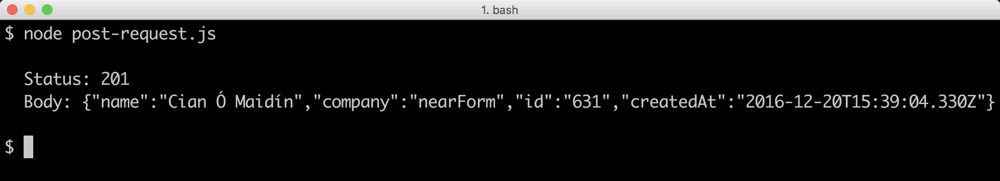

# 4 Connecting with Web Protocols

This chapter covers the following topics

* Creating an HTTP server
* Processing GET requests
* Processing POST requests
* Handling a file upload over HTTP
* Making HTTP requests
* Creating an SMTP server
* Creating a WebSocket server-client application

## Introduction

One of the great qualities of Node is the simplicity it provides around 
low-level system operations. 

Unlike template-centric languages such as PHP or ASP 
we have fine grain controlled over the behavior we want without 
sacrificing easy content control.  

With Node we can create the server, customize it, 
and deliver content all at the code level. 

Starting with a focus on core API's and low-level implementation 
then working our way up to more complex protocols with third party 
libraries, this chapter demonstrates how to create various clients 
and servers in the "Application Layer" of the TCP/IP stack.

> ### From Protocols to Frameworks 
> This chapter focuses on Node's direct relationship with Network protocols.
> It's intended to develop understanding of fundamental concepts. 
> For creating more extensive and enterprise focused HTTP infrastructure
> check out **Chapter 6. Weilding Web Frameworks**. 

## Creating an HTTP server

### Getting Ready

### How to do it

```js
const http = require('http')
const host = '0.0.0.0'
const port = 8080

http.createServer((req, res) => {
  if (req.method !== 'GET') {
    res.statusCode = 400
    res.end('Bad Request')
    return
  }
  switch (req.url) {
    case '/about': return about(res)
    case '/contact': return contact(res)
    default: return index(res)
  }
}).listen(port, host)

function index (res) {
  res.write('<a href="/about">about</a>')
}

function about (res) {
  res.end('all about this thing')
}
```

### How it works

### There's more

#### Handling Multipart POST Requests

#### In-Process Caching

### See also

TBD


## Receiving POST Data

If we want to be able to receive POST data we have to instruct our
server on how to accept and handle a POST request. 

In a language where I/O blocking is the primary runtime behavior,
accessing POST body data would be as straight forward as accessing a property.

For instance in PHP we could access our POST values with `$_POST['fieldname']`,
the execution thread would block until an array value was filled. 

Contrariwise, Node provides low level interaction with the asynchronous flow of HTTP data 
allowing us to interface with the incoming message body as a stream, 
leaving it entirely up to the developer to turn that stream into usable data.

> ### Streams ![../info.png]
> For more information on streams see **Chapter 3. Using Streams**

### Getting ready

Let's create a `server.js` file ready for our code, 
plus a folder called `public` with an HTML file inside called `form.html`. 

The `form.html` file should contain the following:

```html
<form method="POST">
  <input type="text" name="userinput1"><br>
  <input type="text" name="userinput2"><br>
  <input type="submit">
</form>
```

### How to do it

We'll provision our server for both `GET` and `POST` requests. 

Let's start with `GET` by requiring the core `http` module and loading `form.html` 
into memory, which we'll then serve via `http.createServer`:

```js
const http = require('http')
const fs = require('fs')
const path = require('path')
const form = fs.readFileSync(path.join(__dirname, 'public', 'form.html'))

http.createServer((req, res) => {
  if (req.method === 'GET') {
    get(res)
    return
  }
  reject(405, 'Method Not Allowed', res)
}).listen(8080)

function get (res) {
  res.writeHead(200, {'Content-Type': 'text/html'})
  res.end(form)  
}

function reject (code, msg, res) {
  res.statusCode = code
  res.end(msg)
}
```

We are synchronously loading `form.html` at initialization time instead of accessing 
the disk on each request. When building servers, initialization is the only time it's
a good idea to perform synchronous I/O.  

If we navigate to `http://localhost:8080` we'll be presented with a form. 

But if we fill out the form and submit we'll encounter a "Method Not Allowed" response.
This is because the `method` attribute on our HTML form is set to `POST`. 
If the method is anything other than `GET`, our request handler 
(the function passed to `http.createServer`) will fall through to calling the `reject` 
function which sets the relevant status code and sends the supplied message via the `res` object.

Our next step is to implement `POST` request handling.

First we'll add the `querystring` module to our list of required dependencies at 
the top of the file. The top section of our `server.js` file should become:

```js
const http = require('http')
const fs = require('fs')
const path = require('path')
const form = fs.readFileSync(path.join(__dirname, 'public', 'form.html'))
const qs = require('querystring')
```

For safety we'll want to define a maximum request size, which we'll use to 
guard against payload size based DoS attacks:

```js
const maxData = 2 * 1024 * 1024 // 2mb
```

Now we'll add a check for POST methods in the request handler, 
so our `http.createServer` calls looks like so:

```js
http.createServer((req, res) => {
  if (req.method === 'GET') {
    get(res)
    return
  }
  if (req.method === 'POST') {
    post(req, res)
    return
  }
  reject(405, 'Method Not Allowed', res)
}).listen(8080)
```

Next, let's implement the `post` function that's called within the request handler: 

```js
function post (req, res) {
  if (req.headers['content-type'] !== 'application/x-www-form-urlencoded') {
    reject(415, 'Unsupported Media Type', res)
    return
  }
  const size = parseInt(req.headers['content-length'], 10)
  if (isNaN(size)) {
    reject(400, 'Bad Request', res)
    return
  }
  if (size > maxData) {
    reject(413, 'Too Large', res)
    return
  }

  const buffer = Buffer.allocUnsafe(size)
  var pos = 0

  req
    .on('data', (chunk) => {
      const offset = pos + chunk.length
      if (offset > size) {
        reject(413, 'Too Large', res)
        return
      }
      chunk.copy(buffer, pos)
      pos = offset
    })
    .on('end', () => {
      if (pos !== size) {
        reject(400, 'Bad Request', res)
        return
      }
      const data = qs.parse(buffer.toString())
      console.log('User Posted: ', data)
      res.end('You Posted: ' + JSON.stringify(data))
    })
}
```

Notice how we check the `Content-Type` and `Content-Size` headers sent by the browser. 
In particular `Content-Size` is validated at several check-points, this is important 
for preventing various types of attack from DoS attacks to leaking deallocated memory.

Once the form is completed and submitted, the browser and terminal should present 
the data provided via the form.

### How it works

The `http` module sits on top of the `net` module (Node's TCP library) which in 
turn interacts with an internal C library called libuv. 
The libuv C library handles network socket input/output, passing data between 
the C layer and the JavaScript layer. 

When we call `http.createServer` an object is returned which represents the HTTP server.
We immediately call the `listen` method on the server object which instructs the `http` 
module to listen for incoming data on the supplied port (`8080`).

Every time data is received at the network socket layer, if the data is successfully 
translated into an HTTP request the `http` module creates an object representing the 
request (`req`) and response (`res`) then calls our supplied request handler passing 
it the request and response objects.

Our request handler checks the `method` property of the request object to determine 
whether the request is `GET` or `POST`, and calls the corresponding function accordingly,
falling back to calling our `reject` helper function if the request is neither `GET` nor `POST`.

The `get` function uses `writeHead` to indicate a success code (`200`) and set the `Content-Type` 
header to inform the browser of the mime-type of our form content (`text/html`).
The `res` object is a `WriteStream`, which have `write` and `end` methods.
Our `get` function finishes by calling `res.end` passing it the cached `form` content,
this simultaneously writes to the response stream and ends the stream, thus closing the HTTP connection.

The `reject` function sets the `statusCode` and similarly calls `res.end` with the supplied message.

Our `post` function implements the core objective of our server. The `post` function checks 
the `Content-Type` and `Content-Size` HTTP headers to determine that we can support the
supplied values (we'll talk more about size validation shortly) and uses it to preallocate a buffer.
The HTTP request object (`req`) is a Node stream, which inherits from the `EventEmitter` object.
Readable streams constantly emit `data` events until an `end` event is emitted. In the `data` event
listener we use the `Buffer` `copy` method to duplicate the bytes in each incoming `chunk` into our
preallocated `buffer` and update the `pos` to `chunk.length` so the next `data` event starts from
where we left off in the previous event. 

When all the data is received from the client the `end` event will be triggered. Our `end` event
listener converts the buffer to a string, passing it into `qs.parse`. This converts the POST data
(which is in the format `userinput1=firstVal&userinput2=secondVal`) into an object. This object
is logged our to the console, and serialized with `JSON.stringify` as it's passed to `res.end`
and thus mirrored back to the user.

We cannot trust the client to reliably represent the size of the content, as this could be manipulated
by an attacker so we take several measures to validate the `Content-Size` HTTP header. HTTP headers will
always be in string format, so we use `parseInt` to convert from string to number. If the `Content-Size`
header sent wasn't a number `size` would be `NaN` - in that case we send a `400 Bad Request` response. 

> #### Web Frameworks 
> Node's core API provides a powerful set of primitives to build functionality as we see fit.
> Of course, this also means there's a lot of angles to think about. In Chapter 6 we'll be talking
> about Web Frameworks where the low-level considerations have been taken care of, allowing us to focus
> primarily on business logic.

If `size` is a number we pass it to `Buffer.allocUnsafe` which creates a buffer of the given size.
The choice by Node core developers to put "unsafe" in name is deliberately alarming. 

`Buffer.allocUnsafe` will create a buffer from deallocated (i.e. unlinked) memory.
That means any kind of data might appear in a buffer created with `allocUnsafe`,
potentially including highly sensitive data like cryptographic private keys.
This is fine as long as there isn't some way of leaking previously deallocated memory to the client.
By using it we accept the burden of ensuring that a malicious request can't leak the data.
This is why in the `end` event listener we check that `pos` is equal to `size`.
If it isn't then the request is ending prematurely, and the old memory in our `buffer` hasn't
been fully overwritten by the payload. Without the `size` check in the `end` event listener
internal memory could leak to the client.

We could use `Buffer.alloc` instead, which zero-fills the memory (overwrites the memory with `00` bytes)
before handing the buffer back but `Buffer.allocUnsafe` is faster.

The other check against `size` is in the `data` event listener, where we make sure the payload
size doesn't exceed the provided `Content-Size`. This scenario could be a malicious attempt to
overload the memory of our server, resulting in a Denial Of Service attack.

### There's More

#### Accepting JSON

REST architectures (among others) typically handle the `application/json` content type in preference
to the `application/x-www-form-urlencoded` type. Generally this is due to the versatility
of JSON as a multi-language interchange data format. 

Let's convert our form and server to working with JSON instead of URL-encoded data.

We're going to use a third party module called `fast-json-parse` for safely and efficiently parsing the JSON.

To do this we'll have to initialize our folder with a `package.json` file and then install `fast-json-parse`. 

Let's run the following on the command line

```sh
$ npm init -y
$ npm install --save fast-json-parse
```

In the `server.js` file we need to add the following to our required dependencies at the top of the file:

```js
const parse = require('fast-json-parse')
```

The first line of our `post` function should be changed to checking `Content-Type` for `application/json`, like so:

```js
function post (req, res) {
  if (req.headers['content-type'] !== 'application/json') {
    reject(415, 'Unsupported Media Type', res)
    return
  }
  /* ... snip .. */
}
```

The final step in converting our `server.js` file is to adjust the `end` event listener like so:

```js
/* ... snip .. */
    .on('end', () => {
      if (pos !== size) {
        reject(400, 'Bad Request', res)
        return
      }
      const data = buffer.toString()
      const parsed = parse(data)
      if (parsed.err) {
        reject(400, 'Bad Request', res)
        return  
      }
      console.log('User Posted: ', parsed.value)
      res.end('{"data": ' + data + "}")
    })
/* ... snip .. */
```

Unfortunately HTML forms do not natively support POSTing in the JSON format,
so we'll need to add a touch of JavaScript to `public/form.html`.

Let's add the following `script` tag to `form.html`, underneath the `<form>` element:

```html
<script>
  document.forms[0].addEventListener('submit', function (evt) {
    evt.preventDefault()
    var form = this
    var data = Object.keys(form).reduce(function (o, i) {
      if (form[i].name) o[form[i].name] = form[i].value
      return o
    }, {})
    form.innerHTML = ''
    var xhr = new XMLHttpRequest()
    xhr.open('POST', '/')
    xhr.setRequestHeader('Content-Type', 'application/json')
    xhr.send(JSON.stringify(data))
    xhr.addEventListener('load', function () {
      var res
      try { res = JSON.parse(this.response) } catch (e) {
        res = {error: 'Mangled Response'}
      }
      form.innerHTML = res.error 
        ? res.error 
        : 'You Posted: ' + JSON.stringify(res.data)
    })
  })
</script>
```

Our form and server should now largely behave in the same manner as the main recipe.

Except our frontend is a tiny Single Page App and JSON (the backbone of modern web architecture)
is being used for communication between server and client.

### See Also

* TBD

## Handling File Uploads

We cannot process an uploaded file in the same way we process other POST data.
When a file input is submitted in a form, the browser embeds the file(s) into a multipart message. 

Multipart was originally developed as an email format allowing multiple pieces of mixed content
to be combined into one payload. If we attempted to receive the upload as a stream and write it to a
file, we would have a file filled with multipart data instead of the file or files themselves. 

We need a multipart parser, the writing of which is more than a recipe can cover.
So we'll be `multipart-read-stream` module which sits on top of the well-established `busboy`
module to convert each piece of the multipart data into an independent stream, which we'll
then pipe to disk.


### Getting Ready

Let's create a new folder called `uploading-a-file` and create an `uploads` directory inside that:

```sh
$ mkdir uploading-a-file
$ cd uploading-a-file
$ mkdir uploads
```

We'll also want to initialize a `package.json` file and install `multipart-read-stream` and `pump`.

On the command line, inside the `uploading-a-file` directory we run the following commands:

```sh
$ npm init -y
$ npm install --save multipart-read-stream pump
```

> #### Streams 
> For more about streams (and why `pump` is essential) see the previous chapter, **Chapter 3. Using Streams**

Finally we'll make some changes to our `form.html` file from the last recipe:

```html
<form method="POST" enctype="multipart/form-data">
  <input type="file" name="userfile1"><br>
  <input type="file" name="userfile2"><br>
  <input type="submit">
</form>
```

We've included an `enctype` attribute of `multipart/form-data` to signify to the browser
that the form will contain upload data and we've replaced the text inputs with file inputs.

To gain some understanding of how multipart requests differ from normal `POST` requests, 
let's use our newly modified `form.html` file with the server from the previous recipe to see how a
server without multipart capabilities handles a multipart upload. 

If we upload the `form.html` file itself we should see something like the following:   


*Result of uploading multipart form data server from previous recipe*

Our original POST server simply logs the raw HTTP message body to the console, which in this case is multipart data.


We had two file inputs on the form. Though we only uploaded one file,
the second input is still included in the multipart request. Each file is separated by a
predefined boundary that is set in a secondary attribute of the `Content-Type` HTTP headers.


### How to do it

Let's set up our initial modules and load the form HTML as in our former recipe:

```js
const http = require('http')
const fs = require('fs')
const path = require('path')
const mrs = require('multipart-read-stream')
const pump = require('pump')
const form = fs.readFileSync(path.join(__dirname, 'public', 'form.html'))
```

Next we'll set up the HTTP server, along with a `GET` handler function 
and a `reject` function for dealing with unsupported methods.   

```js
http.createServer((req, res) => {
  if (req.method === 'GET') {
    get(res)
    return
  }
  if (req.method === 'POST') {
    post(req, res)
    return
  }
  reject(405, 'Method Not Allowed', res)
}).listen(8080)

function get (res) {
  res.writeHead(200, {'Content-Type': 'text/html'})
  res.end(form)  
}

function reject (code, msg, res) {
  res.statusCode = code
  res.end(msg)
}
```

Finally we'll write the `post` function:

```js
function post (req, res) {
  if (!/multipart\/form-data/.test(req.headers['content-type'])) {
    reject(415, 'Unsupported Media Type', res)
    return
  }
  console.log('parsing multipart data')
  const parser = mrs(req, res, part, () => {
    console.log('finished parsing')
  })
  var total = 0
  pump(req, parser)

  function part (field, file, name) {
    if (!name) {
      file.resume()
      return
    }
    total += 1
    const filename = `${field}-${Date.now()}-${name}`
    const dest = fs.createWriteStream(path.join(__dirname, 'uploads', filename))
    pump(file, dest, (err) => {
      total -= 1
      res.write(err 
        ? `Error saving ${name}!\n`
        : `${name} successfully saved!\n`
      )
      if (total === 0) res.end('All files processed!')
    })
  }
}
```

Now we have an upload server.

If we run 

```sh
$ node server.js
```

Then open a browser at http://localhost:8080 we can upload some files, and check 
if our `upload` folder to see if they were added.

### How it works

Setting the `enctype` attribute of the HTML `<form>` element to
`multipart/form-data` causes the browser to set the `Content-Type`
in the request header to `multipart/form-data` and to embed data
in any files supplied via the `<input type="file">` elements into
a multipart wrapper. 

Our `post` function checks for the appropriate `multipart/form-data` 
content type in the `req.headers` object, rejecting the request with
a 415 HTTP code (Unsupported Media Type) if the content type isn't
`multipart/form-data`.

We create our `parser` by instantiating the `multipart-request-stream`
module (`mrs`), passing it `req`, `res` and `part` (a function we declare shortly after), 
and finally an inline fat-arrow function that will be called when all multipart data has been parsed.

We set up a `total` variable, which we use to track files from 
their point of discovery to when they've been completely written
to disk. 

The `pump` module is used to pipe data from the `req` object
to the `parser`, this will cause our `part` function to be called
each time the `parser` stream encounters a multipart boundary that
contains file data. 

In the `part` function we check to see that the `name` has a non-falsey
value. This is because the browser will include all file fields even if their
not populated, in the multipart data. If the a file section has no name, then
we can simply skip it. The `file` argument passed to `part` is a stream,
in the event of an empty file section, we call the  `resume` method (a stream method) 
to make the stream run to completion, allowing us to process the next file section 
in the multipart data.

Once we've verified the section has file data, we add one to `total`.

Then we create a filename based on the HTML elements field name, the current
epoch time stamp and the original file name. 

We create a write stream that writes to the `uploads` folder (`dest`) 
and again use `pump` to pipe data from the `file` stream
provided by `multipart-read-stream` to the `part` function to the `dest` stream.

This effectively writes a particular section of the multipart data to the 
`uploads` folder with the appropriate file. Using streams to do this is means
no matter how big the file is, memory and CPU usage will remain flat.   

In the final parameter to the second call to `pump`, we provide a fat arrow
callback. This will be called either in the event of an error or once all data
has been written from the `file` stream into the `dest` stream. When the callback
supplied to `pump` is called, we minus one from the `total` and write a message based 
on error state to the response stream. 

When the `total` reaches 0 we know we've processed
all the files in the multipart data and can end the response with a completion message.

### There's more

Multipart data doesn't just contain files, and file uploading from the browser
isn't limited to multipart POST requests. Let's explore. 

#### Processing all field types in multipart data

Multipart data can contain both files and field values. 

Let's copy the `uploading-a-file` folder to a folder called
`processing-all-types`.

Let's modify our `public/form.html` file by changing one of the 
file inputs to a text input:

```html
<form method="POST" enctype="multipart/form-data">
  <input type="text" name="userinput1"><br>
  <input type="file" name="userfile2"><br>
  <input type="submit">
</form>
```

The `multipart-read-stream` module is a thin wrapper around the 
[`busboy`](http://npm.im/busboy) module, it listens to `busboy`
for a `file` event and calls the user supplied function (which
we called `part` in the main recipe). 

Fortunately, `multipart-read-stream` returns the `busboy` instance,
which also emits a `field` event. We can listen to this to process
any non-file elements contained in the multipart data. 

In `server.js`, let's add a `field` event listener directly under 
the assignment our `parser` variable, making the top of our `post` function
look like the following:

```js
function post (req, res) {
  if (!/multipart\/form-data/.test(req.headers['content-type'])) {
    reject(415, 'Unsupported Media Type', res)
    return
  }
  console.log('parsing multipart data')
  const parser = mrs(req, res, part, () => {
    console.log('finished parsing')
  })
  parser.on('field', (field, value) => {
    console.log(`${field}: ${value}`)
    res.write(`processed "${field}" input.\n`)
  })
  var total = 0
  pump(req, parser)
  /* ... snip ... */
}
```

#### Uploading files via PUT

Browsers are also capable of uploading files via an HTTP PUT request.

While we can only send one file per request, we don't need to do any parsing
on the server side since we can simply stream the request contents directly
to a file. This means less server-side processing overhead. 

It would be magnificent if we could achieve this by changing our form's method
attribute from POST to PUT, but alas, no, there is no specification for this.

However thanks to XMLHttpRequest Level 2 (xhr2), we can now transfer binary data
via JavaScript in modern browsers (see http://caniuse.com/xhr2 (IE9 and Operara mini are lacking support)).

We can grab a file pointer using a `change` event listener on the input file element, 
and then we open a PUT request and send the file upon form submission. 

Let's copy the `uploading-a-file` folder to a folder called
`uploading-a-file-with-put`.

We won't be needing `multipart-read-stream`, but we will need the `through2` 
module, so let's alter our dependencies accordingly:

```sh
$ npm i --save through2
$ npm uninst --save multipart-read-stream
```

Next we'll modify our `public/form.html` file like so:

```html
<form id="upload">
  <input type="file" name="userfile1"><br>
  <input type="submit">
</form>
<pre id="status"></pre>
```

We've added an `id` attribute to the form and the
`method` and `enctype` attributes have been removed.
We're also using just one file element because we can only send one file per request.

We've also added a `<pre>` tag which we'll be using to display status updates 
from the server.

In the same `public/form.html` file let's add an inline script
at the end of the file:

```html
<script>
(function () {
  var fieldName = 'userfile1'
  var field = document.querySelector('[name=' + fieldName + ']')
  var uploadForm = document.getElementById('upload')
  var status = document.getElementById('status')
  var file
  field.addEventListener('change', function () {
    file = this.files[0]
  })
  uploadForm.addEventListener('submit', function (e) {
    e.preventDefault()
    if (!file) return
    var xhr = new XMLHttpRequest()
    xhr.file = file
    xhr.open('put', window.location, true)
    xhr.setRequestHeader("x-field", fieldName)
    xhr.setRequestHeader("x-filename", file.fileName || file.name)
    xhr.onload = updateStatus
    xhr.send(file)
    file = ''
    uploadForm.reset()
  })
  function updateStatus() {
    status.innerHTML += this.status === 200 
      ? this.response
      : this.status + ': ' + this.response
  }
}())
</script>
```

Our script attaches a `change` listener to the file input element. 

When the user selects a file, we grab a handle for the file from a `files`
array that exists on the `change` listner functions context (`this`). 

Once a user submits the form our `submit` listeners, prevents default behavior
(stops the browser from automatically submitting), checks whether a file
is selected (doing nothing if no file has been selected),
initializes an xhr object and opens a PUT request to our server.
Then we set two custom headers, `x-field` and `x-filename`, we'll use these 
in our `server.js` file to determine the name of the input field and the
original file name on the clients file system.

We set the `onload` method to our `updateStatus` function which will 
append responses from the server to our `<pre>` tag.  

Finally we use the `send` method to initiate the PUT request and clean up
by clearing the `file` variable and resetting our form.

Let's modify the top of our `server.js` file as follows:

```js
const http = require('http')
const fs = require('fs')
const path = require('path')
const pump = require('pump')
const through = require('through2')
const form = fs.readFileSync('public/form.html')
const maxFileSize = 51200
```

We've removed the `multipart-read-stream` dependency, added `through2`
and created a `maxFileSize` constant. 

Let's modify `http.createServer` response handler like so:

```js
http.createServer((req, res) => {
  if (req.method === 'GET') {
    get(res)
    return
  }
  if (req.method === 'PUT') {
    put(req, res)
    return
  }
  reject(405, 'Method Not Allowed', res)
}).listen(8080)
```

We've simply changed the check for the `POST` method to a check for `PUT` 
method and call a `put` function instead of a `post` function.

Finally we need to remove the old `post` function, and replace it with
the following `put` function:

```js
function put (req, res) {
  const size = parseInt(req.headers['content-length'], 10)
  if (isNaN(size)) {
    reject(400, 'Bad Request', res)
    return
  }
  if (size > maxFileSize) {
    reject(413, 'Too Large', res)
    return
  }

  const name = req.headers['x-filename']
  const field = req.headers['x-field']
  const filename = `${field}-${Date.now()}-${name}`
  const dest = fs.createWriteStream(path.join(__dirname, 'uploads', filename))
  const counter = through(function (chunk, enc, cb) {
    this.bytes += chunk.length
    if (this.bytes > maxFileSize) {
      cb(Error('size'))
      return
    }
    cb(null, chunk)
  })
  counter.bytes = 0
  counter.on('error', (err) => {
    if (err.message === 'size') reject(413, 'Too Large', res)
  })
  pump(req, counter, dest, (err) => {
    if (err) return reject(500, `Error saving ${name}!\n`, res)
    res.end(`${name} successfully saved!\n`)
  })
}
```

After some `Content-Length` checks we grab the originl filename and field 
as supplied through the HTTP headers and construct a filename in
similar fashion to our output filenames in the main recipe. Also similar
to the main recipe, we create a `dest` stream.

For safety we also use the `through2` module to create a byte counting stream.
This could be important, since a malicious client could lie about `Content-Length`
and send a much larger payload. We keep a running total of bytes passing through
our stream, if they exceed the maximum we send an error down the stream.

As outlined in *Chapter 3 Using Streams* the `pump` module will propagate errors
to all streams in the pipeline. We need to catch an error on the `counter` stream
before `pump` does that, since it will close the `req` stream which will implicitly
end the response. So we listen directly for an `error` event on the `counter` stream
and send a 413: Too Large response within the error event handler.

Then we set up a pipeline from `req` to `counter` to our output `dest`, 
when the pipeline ends we send a success message, or failure if some other 
error has occurred.

### See Also

* TBD


## Making an HTTP POST request

Making a GET request with Node is trivial, in fact HTTP GET 
requests have been covered in **Chapter 3 - Using Streams** in the context 
of stream processing. 

HTTP GET requests are so simple we can fit a request that prints to 
stdout into a single shell command (the `-e` flag passed to the `node` 
binary instructs node to evaluate the string that follows):

```sh
$ node -e "require('http').get('http://example.com', (res) => res.pipe(process.stdout))"
```

In this recipe we'll look into constructing POST requests.


### Getting Ready

Let's create a folder called `post-request`, create an `index.js` inside 
the folder and open it in our favorite text editor.

### How to do it

We only need one dependency, the core `http` module. Let's require it:

```js
const http = require('http')
```

Now let's define a payload we wish to POST to an endpoint:

```js
const payload = `{
  "name": "Cian Ó Maidín",
  "company": "nearForm"
}`
```

Now we'll define the configuration object for the request we're about to make:

```js
const opts = {
  method: 'POST',
  hostname: 'reqres.in',
  port: 80,
  path: '/api/users',
  headers: {
    'Content-Type': 'application/json',
    'Content-Length': Buffer.byteLength(payload)
  }
}
```

Notice how we use `Buffer.byteLength` to determine the `Content-Length` header.

> #### [reqres.in](http://reqres.in) 
> We're using [reqres.in](http://reqres.in), a dummy REST API
> provided as a public service. The endpoint we're posting to 
> simply mirrors the payload back in the response. 

Next we'll make the request, supplying a callback handler which will
be called once the request has completed:

```js
const req = http.request(opts, (res) => {
  console.log('\n  Status: ' + res.statusCode)
  process.stdout.write('  Body: ')
  res.pipe(process.stdout)
  res.on('end', () => console.log('\n'))
})
```

Let's not forget to handle errors: 

```js
req.on('error', (err) => console.error('Error: ', err))
```

Finally the most important part, sending the payload.

```js
req.end(payload)
```

Now if we execute our script:

```sh
$ node index.js
```

Providing the website [reqres.in](http://reqres.in) is functioning correctly,
we should see something like the following:


**[reqres.in](http://reqres.in) will simply mirror the posted payload**

### How it works

The `http` module provides both server and client capabilities. 

We use the `http.request` method to create a request stream, which
takes an options object (`opts`) describing the request and a callback.

> #### HTTPS Requests 
> If the endpoint is encrypted (e.g. a standard HTTPS endpoint)
> We simply swap out the `http` module for the `https` module, 
> the rest of the code remains the same. 

In the `headers` of the `opts` object we set `Content-Type` and
`Content-Length` headers. Whilst the request will still be successful
without providing `Content-Length` it is good practice and allows the
make informed assumptions about the payload. However, setting `Content-Length`
to a number lower than the payload size will result in an error. This is
why it's important to use `Buffer.byteLength` because this gives the exact
size of the string in bytes, which can differ from the string length when
unicode beyond the ascii range are in the string (since unicode characters
can be from 1 to 4 bytes, but are treated as a single character where
`String.prototype.length` is concerned).  

The `http.request` method opens a socket that's connected to the endpoint
described in opts and returns a stream (which we assign to `req`).

When we write to this stream (using `req.end`) data is posted to the
endpoint and the underlying socket is closed (because we ended the stream), 

Since `req` is a stream it also has an `error` event, which we listen to. 
This would be fired in the event of network or socket errors, whereas a
server error response would be reflected in the response status code.

The fat arrow callback passed to the `http.request` method is passed
a response object, which we call `res`. We output the status using
`res.statusCode`. Then we write the "Body:" label to the `process.stdout`
stream (`console.log` would add a newline, we don't want that in this case),
followed by piping the `res` object to `process.stdout`. Finally we listen
to the `end` event on the `res` object to add two final newlines to the output
(`console.log` adds an additional newline).


### There's more

How would we parse an entire data set at once? Can stream a payload to 
a POST endpoint? How would we go about making a multipart POST upload in Node? 

#### Buffering a GET Request

Sometimes it may be necessary to receive response data in it's entirety 
before it can parsed. 

Let's create a folder called `buffering-a-request` with a fresh `index.js`
file. 

In the `index.js` file we write the following code:

```js
const http = require('http')
const assert = require('assert')
const url = 'http://www.davidmarkclements.com/ncb3/some.json'

http.get(url, (res) => {
  const size = parseInt(res.headers['content-length'], 10)
  const buffer = Buffer.allocUnsafe(size)
  var index = 0
  res.on('data', (chunk) => {
    chunk.copy(buffer, index)
    index += chunk.length
  })
  res.on('end', () => {
    assert.equal(size, buffer.length)
    console.log('GUID:', JSON.parse(buffer).guid)
  })
})
```

When we run our script:

```sh
$ node index.js
```

We should see a log message containing the `guid` property found in the JSON 
data set. 

We use `Buffer.allocUnsafe` to preallocate a buffer, "unsafe" is in the name
because it uses garbage memory instead of zero-filling it - this is more 
performant but the risk of leaking internal data should be understood (for instance
if the content length was greater than the actual amount of data received). 
In our case everything happens locally, so it's not a problem.

Then we listen to the `data` event of the response object (`res`),
each `chunk` that comes through the `data` event is a `Buffer` instance, 
we use the `copy` method to copy the contents of the buffer into
our pre-allocated `buffer`, keeping a running total of bytes copied
in the `index` variable, which is passed to the `copy` method as the
offset argument.

When the response ends, (in the `end` event handler), we check that 
the servers provided `Content-Length` header matches the amount of
data received by checking `size` with `buffer.length`. Finally
we parse the whole payload with `JSON.parse` and grab the `guid` property
from the subsequent object returned from `JSON.parse`. 

> #### Parsing remote data 
> In a production setting, we should never call `JSON.parse` without
> wrapping a `try/catch` block around it. This is because any invalid
> JSON will cause `JSON.parse` to throw, which will cause the process
> to crash. The [`fast-json-parse`](http://npm.im/fast-json-parse) 
> supplies, safe, high performance and clean JSON parsing.    

#### Streaming Payloads

Since the instance returned from `http.request` is a writable stream,
we can take an input stream and pipe it to to the POST request as data. 

In this case we want to notify the server that we'll be incrementally
writing the request body to the server in chunks. 

Let's copy the main recipe folder to a new folder, call it `streaming-payloads`. 

Now we'll tweak the `index.js` file slightly.

Let's make the top of the file look accordingly:

```js
const http = require('http')
const opts = {
  method: 'POST',
  hostname: 'reqres.in',
  port: 80,
  path: '/api/users',
  headers: {
    'Content-Type': 'application/json',
    'Transfer-Encoding': 'chunked'
  }
}

```
The `payload` assignment has been completely removed and we've replaced
the `Content-Length` header with a `Transfer-Encoding` headed, set to `chunked`. 

At the bottom of the file, we can replace the line `req.end(payload)` with:

```js
http.get('http://reqres.in/api/users', (res) => {
  res.pipe(req)
})
```

We've initialized a stream of JSON from [reqres.in](http://reqres.in) (`res`) and piped 
it directly to request object (`req`).

When we run our script, we should see something like the following.


#### Multipart POST uploads

For fun and profit, let's build our own multipart request which we can
post to the multipart upload server we created in the 
[Receiving Post Data](#receiving-post-data) recipe (if we haven't completed that
recipe now might be a good time to read up). 

Let's create a new folder called `multipart-post-uploads`, 
with an `index.js`. We'll also initialize a `package.json` file and install `steed` 
(a low-overhead asynchronous control flow library).

```sh
$ mkdir multipart-post-uploads
$ touch index.js
$ npm init -y
$ npm install --save steed
```

Now in the `index.js` file let's begin by setting up our dependencies:

```js
const http = require('http')
const fs = require('fs')
const path = require('path')
const steed = require('steed')()
```

Now for some configuration:

```js
const files = process.argv.slice(2)
const boundary = Date.now()
const opts = {
  method: 'POST',
  hostname: 'localhost',
  port: 8080,
  path: '/',
  headers: {
    'Content-Type': 'multipart/form-data; boundary="' + boundary + '"',
    'Transfer-Encoding': 'chunked'
  }
}
```

We're using `process.argv` (command line arguments), to 
determine which files to send in the multipart data. Our `Content-Type` header
tells the server the multipart boundary that will designate each section 
in the data, and signify the end of the multipart data.

Next we'll set up the request:

```js
const req = http.request(opts, (res) => {
  console.log('\n  Status: ' + res.statusCode)
  process.stdout.write('  Body: ')
  res.pipe(process.stdout)
  res.on('end', () => console.log('\n'))
})

req.on('error', (err) => console.error('Error: ', err))
```

Finally we'll write the multipart data to the `req` stream,
based on the files provided via the command line:

```js
const parts = files.map((file, i) => (cb) => {
  const stream = fs.createReadStream(file)
  stream.once('open', () => {
    req.write(
      `\r\n--${boundary}\r\n` +
      'Content-Disposition: ' +
      `form-data; name="userfile${i}";` +
      `filename="${path.basename(file)}"\r\n` +
      'Content-Type: application/octet-stream\r\n' +
      'Content-Transfer-Encoding: binary\r\n' +
      '\r\n'
    )
  })
  stream.pipe(req, {end: false})
  stream.on('end', cb)
})

steed.series(parts, () => req.end(`\r\n--${boundary}--\r\n`))

```

The `parts` assignment is essentially a list of operations which 
we subsequently run in series using `steed.series`. To create this
we map over each of the file paths, and return a function that takes
a callback (`cb`). 

Within that function, we create a read stream from
the supplied file path. Read streams have an `open` event, which is triggered
the moment the file is opened. We listen for this event and write the multipart
header for the file. The header contains the field name (just called name in the
header) - we set this simply to `userfile` plus the index of the file as it
appeared in the command line arguments. A more sophisticated approach would
involce mime-type detection and we'd be setting `Content-Type` in the multipart
header appropriately. Since all data can be binary, we simplify by sending 
everything with the `Content-Type` of `application/octet-stream` and
`Content-Transfer-Type` of binary. 

Then we pipe from `stream` to `req`, passing an additional options
argument to `pipe`, with an `end` property set to `false`. This will prevents
`req` being closed when `stream` finishes. Since we may have additional files, 
the `req` stream needs to stay open. 

When `stream` ends we call `cb`. At this point, our flow control library `steed`,
will process the next operation. When every function in the `parts` array
has been processed by `steed.series` we end the request stream (`req`) with the
multipart end boundary.

We can test this out by sending the source `index.js` twice to 
our multipart server from the [Receiving Post Data](#receiving-post-data) recipe.

First we can run the upload server from, in the `uploading-a-file` folder
from that recipe we run: 

```sh
$ node server.js
```

Then in a new terminal, in our `multipart-post-uploads` folder we run

```sh
$ node index.js package.json index.js
```

This will send the `package.json` file and the source `index.js`
file to our server.

We can check the `uploads` folder in the `uploading-a-file` directory,
to determine whether the `index.js` and `package.json` file we're correclty
uploaded.

### See Also

TBD


## Communicating with WebSockets

HTTP was not made for the kind of real-time web applications that many
developers are creating today. As a result, all sorts of workarounds have
been discovered to mimic the idea of bidirectional, uninterrupted communication 
between servers and clients. 

WebSockets don't mimic this behavior; they provide it.

In this recipe we will use the third-party `ws` module to create a pure WebSocket 
server that will receive and respond to WebSocket requests from the browser.

### Getting Ready

Let's new folder called `websocket-app` with a `server.js` file, 
plus a folder called `public` containing a `index.html` file.

```sh
$ mkdir websocket-app
$ cd websocket-app
$ touch server.js
$ mkdir public
$ touch public/index.html
```
 
We also need to initialize our app as a Node package, and install the `ws` module.

```sh
$ npm init -y 
$ npm install --save ws
``` 

### How to do it

In `server.js` let's begin by requiring our dependencies:

```js
const http = require('http')
const fs = require('fs')
const ws = require('ws')
```

Next we want to load `public/index.html` into memory (we'll write `index.html` 
shortly), create an HTTP server, and then enhance it with a WebSocket server:

```js
const app = fs.readFileSync('public/index.html')
const server = http.createServer((req, res) => {
  res.setHeader('Content-Type', 'text/html')
  res.end(app)
})
const wss = new ws.Server({server})
```

Now that we have our WebSocket server instance (`wss`),
we can listen to its `connection` event:

```js
wss.on('connection', (socket) => {
  socket.on('message', (msg) => {
    console.log(`Received: ${msg}`)
    console.log(`From IP: ${socket.upgradeReq.connection.remoteAddress}`)
    if (msg === 'Hello') socket.send('Websockets!')
  })
})
```

Finally let's tell our HTTP server to listen on port 8080:

```js
server.listen(8080)
```

Now for our frontend code.

Let's place the following in `public/index.html` 

```html
<input id="msg"><button id="send">Send</button>
<div id="output"></div>
```

Now in the same `public/index.html`, we'll place our 
client side JavaScript.

At the bottom of `public/index.html` let's add the following:

```html
<script>
(function () {
  var ws = new WebSocket('ws://localhost:8080')
  var output = document.getElementById('output')
  var send = document.getElementById('send')

  function log (event, msg) {
    return '<div>' + event + ': ' + msg + '</div>';
  }

  send.addEventListener('click', function () {
    var msg = document.getElementById('msg').value
    ws.send(msg)
    output.innerHTML += log('Sent', msg)
  })

  ws.onmessage = function (e) {
    output.innerHTML += log('Recieved', e.data)
  }

  ws.onclose = function (e) {
    output.innerHTML += log('Disconnected', e.code + '-' + e.type)
  }

  ws.onerror = function (e) {
    output.innerHTML += log('Error', e.data);
  }
}())
</script>
```

Let's try it out buy starting our server:

```sh
$ node server.js
``` 

Then going to http://localhost:8080 in our browser, 
typing "Hello" in the textbox and clicking on the "Send" button. 

The terminal should then output something like:

```sh
Received: Hello
From IP: ::1
``` 

On other systems (where IPv4 is the default) the IP might be 127.0.0.1
instead.

Our browser should display something like the following:


### How it works

WebSocket servers start out as HTTP servers, 
then the browser connects to the HTTP server and asks to upgrade; 
at this point, the WebSocket logic takes over.

We supply an HTTP server instance to the WebSocket server 
at initialization time by passing it in the options object
(we use ES6 shorthand to set a property of `server` with the value
being the `server` instance).

When we navigate the browser to http://localhost:8080, an HTTP request is 
made and we send our in-memory `public/index.html` file as the response. 

As soon as the HTML is loaded in the browser,
the inline script is executed and the WebSocket upgrade request is 
made to our server.

When the server receives this WebSocket upgrade request,
our WebSocket server instance (`wss`) emits a `connection` event 
that supplies `socket` as the first parameter of the connection 
event handler function.

The `socket` parameter is an instance of `EventEmitter`; 
we use its `message` event to respond to incoming messages
on the established WebSocket connection.

In the `message` event handler function we log the received 
data and the client IP address to the terminal and check whether
the incoming message is "Hello". If it is, we use the `socket.send`
method to respond to the client with "WebSockets!".

### There's more

WebSockets have so much potential for efficient low latency 
real-time web apps. Let's take a look at a WebSocket client 
outside of the browser and then further see how browser APIs
can be wrapped in one of Node's fundamental paradigms: streams.

#### Creating a Node.js WebSocket client

The `ws` module also allows us to create a WebSocket 
client outside of the browser environment.

Let's see if we recreate equivalent (and enhanced) functionality 
to our browser app in the terminal. Essentially we're going to create
a generic interactive WebSocket testing command-line tool!

We'll start by creating a new folder called `websocket-client` with an `index.js`
file. We'll also need to create a `package.json` and install the `ws` module

```sh
$ mkdir websocket-client
$ cd websocket-client
$ npm init -y
$ npm install --save ws
```

Now let's open `index.js` in our favorite editor, and begin
by requiring and initializing the `ws` module and the core `readline` module:

```js
const WebSocket = require('ws')
const readline = require('readline')
const ws = new WebSocket(process.argv[2] || 'ws://localhost:8080')
const rl = readline.createInterface({
  input: process.stdin,
  output: process.stdout,
  prompt: '-> '
})
```

Notice that we allow a command line argument to determine the 
WebSocket address, although we default to the address of the
server in the main recipe. 

Next let's set up some convenience references to ANSI terminal 
escape codes (we'll be using these to set colors in the terminal):

```js
const gray = '\u001b[90m'
const red = '\u001b[31m'
const reset = '\u001b[39m'
```

Next we'll listen for an `open` event on our WebSocket client instance (`ws`),
and output an appropriate status message when it fires:

```js
ws.on('open', () => {
  rl.output.write(`${gray}-- Connected --${reset}\n\n`)
  rl.prompt()
})
```

Notably, we use `rl.output` instead of `process.stdout`, this makes our
implementation agnostic to the I/O streams, which theoretically allows for
extensible and plug-able code.

The readline module allows us to take line by line input, so let's 
listen for the `line` event and send user input as a WebSocket message:

```js
rl.on('line', (msg) => {
  ws.send(msg, () => {
    rl.output.write(`${gray}<= ${msg}${reset}\n\n`)
    rl.prompt()
  })
})
```
If the message is successfully sent (using `ws.send`), the supplied 
callback (second argument passed to `ws.send`) is called. Here 
we output a status message confirming the user input was sent, and
set up the prompt for further input.

WebSocket communication is of course bidirectional, so let's listen
for any messages coming from the server:

```js
ws.on('message', function (msg) {
  readline.clearLine(rl.output)
  readline.moveCursor(rl.output, -3 - rl.line.length, -1)
  rl.output.write(`${gray}=> ${msg}${reset}\n\n`)
  rl.prompt(true)
})
```

Finally we'll finish by listening the `close` and `error` events,
and outputting relevant status' to the terminal:

```js
ws.on('close', () => {
  readline.cursorTo(rl.output, 0)
  rl.output.write(`${gray}-- Disconnected --${reset}\n\n`)
  process.exit()
})
ws.on('error', (err) => {
  readline.cursorTo(rl.output, 0)
  rl.output.write(`${red}-- Error --${reset}\n`)
  rl.output.write(`${red}${err.stack}${reset}\n`)
})
```

Lets start out server from the main recipe by 
running (from the `websocket-app` folder):

```sh
$ node server.js
```

Then in a separate terminal, from the `websocket-client` folder, we can execute

```sh
$ node index.js
```

We should see an interaction illustrated in the following figure:


If we try to run our Node.js websocket client without the server started
we'll see the error handler in effect:


Since we also allow command line input, we can easily connect 
to other WebSocket servers. For instance we could connect to 
ws://echo.websocket.org like so:

```sh
$ node index.js ws://echo.websocket.org
```

We can see the results of doing so, and typing "Echo :)" in the following figure:


The WebSocket protocol is not purely request-response oriented,
so a message may come from the server without direct client 
interaction. We cater to this possibility in several ways.

Every non-terminal status (everything other than close or 
error status') is followed by two newlines. This gives us
space to seamlessly inject a received message.   
When a message comes from the server we use `readLine.clearline`
to wipe the current user prompt. Then we use `readline.moveCursor`
to jump to the above line, and set the X position to the first column. 
We write the message out to `rl.output` (the terminal), and then 
call `rl.prompt` with `true` (this preserves current prompt 
content and cursor position). 

### See also

TBD


## Creating an SMTP server


### Getting Ready

### How to do it

### How it works

### There's more

Let's make an SMPT client to go with our SMTP server!

#### SMTP client (with substacks thing)

### See also

TBD