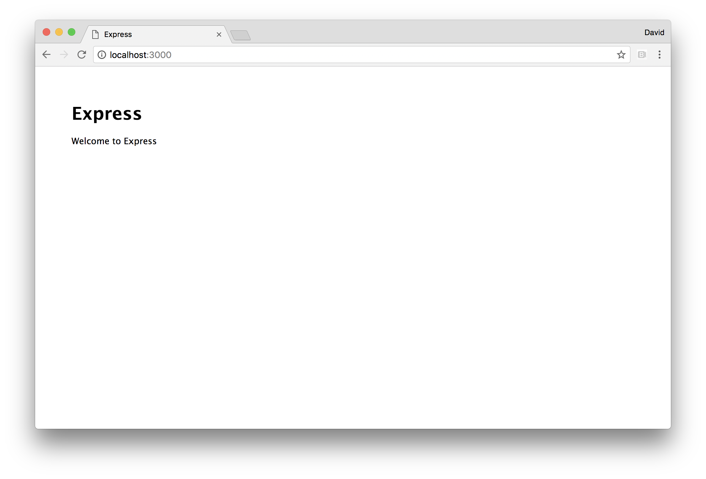
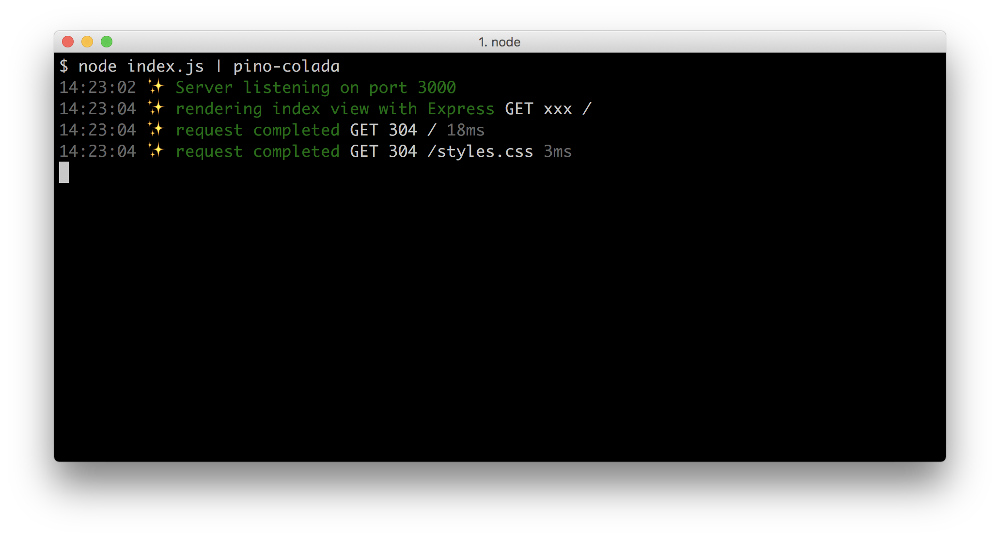
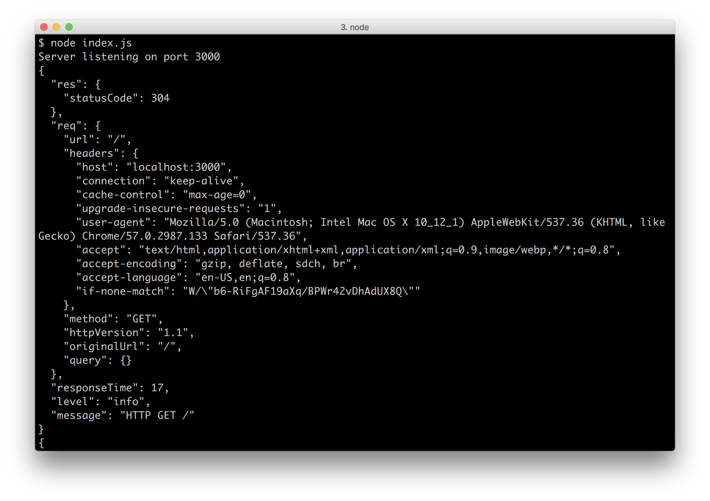
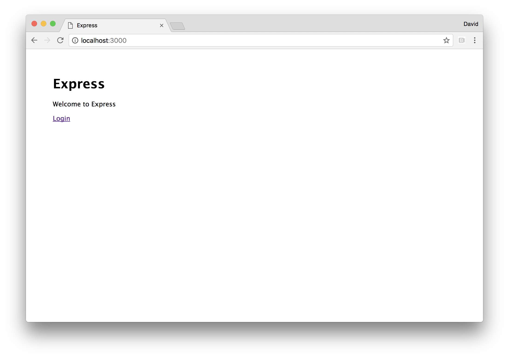

# 6 Working with Web Frameworks

This chapter covers the following topics

* Creating web applications with common web frameworks
* Configuring web frameworks such as Express, Hapi and Koa
* Recommended logging practices
* Implementing views in web frameworks
* Building an example authentication based web application (with Express, Hapi and Koa)

## Introduction

Node core supplies a strong set of well balanced primitives
that allow us to create all manner of systems, for service-based
architectures, to realtime data server, to robotics there's just
enough in the Node core for purpose built libraries to arise
from the Node community and ecosystem.

Building web site infrastructure is a very common use case for Node,and several high profile web frameworks have grown to become staple
choices for creating web applications.

In this chapter we're going to explore the popular frameworks,
and look at common tasks such as implementing server logging,
sessions, authentication and validation. 

## Creating an Express Web App

Express has long been the most popular choice of web framework,
which is unsurprising since it was the first Node web framework
of a high enough quality for mass consumption whilst also drawing
from familiar paradigms presented in the Sinatra web framework
for Ruby on Rails.

In this recipe we'll look at how to put together an Express 
web application. 

### Getting Ready

Let's create a folder called `app`, initialize it as a package,
and install `express`:

```sh
$ mkdir app
$ cd app
$ npm install --save express
```

### How to do it

Let's start by creating a few files:

```sh
$ touch index.js
$ mkdir routes public
$ touch routes/index.js
$ touch public/styles.css
```

Now let's open the `index.js` file in our favorite
editor, and prepare to write some code.

At the top of the file we'll load the following dependencies:

```js
const {join} = require('path')
const express = require('express')
const index = require('./routes/index')
```

We'll write the `routes/index.js` file shortly, but
for now let's continue writing the `index.js` file.
Next we'll instantiate an Express object, which we'll
call `app` while also setting up some configuration:

```js
const app = express()
const dev = process.env.NODE_ENV !== 'production'
const port = process.env.PORT || 3000
```

Next we'll register some Express middleware, like so:

```js
if (dev) {
  app.use(express.static(join(__dirname, 'public')))
}
```
And mount our `index` route at the `/` path: 

```js
app.use('/', index)
```

We'll finish off the `index.js` file by telling the 
Express application to listen on the `port` which 
we defined earlier.

```js
app.listen(port, () => {
  console.log(`Server listening on port ${port}`)
})
```

Our `index.js` file is requiring `./routes/index`,
so let's write the `routes/index.js` file:

```js
const {Router} = require('express')
const router = Router()

router.get('/', function (req, res) {
  const title = 'Express'
  res.send(`
    <html>
      <head>
        <title> ${title} </title>
        <link rel="stylesheet" href="styles.css">
      </head>
      <body>
        <h1> ${title} </h1>
        <p> Welcome to ${title} </p>
      </body>
    </html>
  `)
})

module.exports = router
```

Now for a little bit of style. Let's complete the picture
with a very simply CSS file in `public/styles.css` 


```css
body {
  padding: 50px;
  font: 14px "Lucida Grande", Helvetica, Arial, sans-serif;
}
```

We should be able to run our server with:

```sh
$ node index.js
```

If we access our server at http://localhost:3000 in a browser,
we should see something like the following image:

 

### How it works

Express is a framework built on top of Node's core 
`http` (and `https` when relevant) module. 
 
> #### The core `http` module 
> See **Chapter 5 Wielding Web Protocols** for more 
> on the Node's core `http` module.

Express decorates the `req` (`http.IncomingMessage`) and
`res` (`http.ServerResponse`) objects which are passed to the `http.createServer` request handler
function. 

To explain this using code, at a very basic level Express
essentially performs the following internally:

```js
const http = require('http')
http.createServer((req, res) => { 
  /* add extra methods and properties to req and res  */ 
}))
```

When we call the `express` function, it returns an instance
which we called `app` which represents our Express server. 

The `app.use` function allows us to register "middleware" 
which at a fundamental level is a function that is called from
the same `http.createServer` request handling function.

Again, for a pseudo-code explanation:

```js
const http = require('http')
http.createServer((req, res) => { 
  /* call the middleware registered with app.use */
  /* wait for each piece of middleware to finish
     before calling the next (wait for the next cb) */
}))
```

Each piece of middleware may call methods on `req`
and `res`, and extend the objects with additional
methods or properties. 

The `express.static` method comes bundled with Express. 
It returns a middleware function which is passed into
`app.use`. This function will attempt to locate a file
based on supplied configuration (in our case, we set 
the root directory to the `public` folder) for a given route.
Then it will create a write stream from the file and stream
it to the request object (`req`). If it can't find a file
it will pass control to the next middleware by calling the `next`
callback.

We only use the static middleware in development mode
(based on the value of the `dev` reference, which is
assigned based on whether the `NODE_ENV` environment
variable is set to "production"). This assumes a production
scenario where a reverse proxy (such as nginx or apache)
(or, even better a CDN) handles static file serving. Whilst 
Node has come a long way in recent years, Node's strength
remains in generating dynamic content - it still doesn't 
usually make sense to use it for static assets in production. 

The order of middleware is significant, because middleware executes in
cascading fashion. For instance, if we register static file handling 
middleware before route handling middleware in the case of 
name collision (where a route could apply to a file or a dynamic route),
the file handling middleware will take precedence. However,
if the route handling middleware is first, the dynamic route
takes will serve the request first instead. 

The `app.use` function can accept a string as the first
argument, which determines a "mount point" for a piece 
of middleware. This means instead of the middleware
applying to all incoming requests it will only be called
when there is a route match.

Route handlers are essentially the same mounted middleware,
but are constructed with Express' `Router` utility for cleaner
encapsulation. In our `routes/index.js` file we create 
a router object which we called `router`. Router objects
have methods which correspond to the HTTP verbs (such as GET, PUT, POST, PATCH, DELETE) 
in relevant specification ([rfc7231](https://tools.ietf.org/html/rfc7231)).

Most commonly we would use `GET` and `POST` for web facing
applications. We use `router.get` to register a route (`/`),
with and supply a route handling function 
(which is technically also middleware).

In our route handler, we pass `res.send` a string of
HTML content to respond to the client.  

The `res.send` method is added by Express,
it's the equivalent of `res.end` but with additional 
features such as content type detection.

We export the `router` instance from the `routes/index.js`,
then load it into the `index.js` file and pass it to `app.use`
(as the second argument, after a mount point string argument (`/`)).

The `router` instance is itself, middleware. It's a function
that accepts `req`, `res` and `next` arguments. When called, it checks its 
internal state based on any routers registered (via `get` etcetera),
and responds accordingly.  

The function we pass to `router.get` can also take
a `next` callback function. We ignored the
`next` callback function in our case (we didn't define
it in the route handling functions parameters), because
this route handler is a terminal point - there is nothing
else to be done after sending the content. However, in other
scenarios there may be cause to use the `next` callback and
even pass it an error to propagate request handling the next
piece of middleware (or route middleware, since a route registering
method (like `get`) can be passed multiple subsequent route handling
functions).

At the end of `index.js` we call `app.listen` and pass it a callback
function. This will in turn call the `listen` method on the core
`http` server instance which Express has created internally, and pass
our supplied callback to it. Our callback simply logs that the server
is now listening on the given port.

> #### What About SSL
> While Express can work with HTTPS, we recommend 
> that the general approach should be to terminate
> SSL at the load balancer (or reverse proxy) for
> optimal efficiency. 

### There's more

Let's explore some more of the functionality offered
by Express.

#### Production

Our Express server defines a `dev` reference, based on the
value of the `NODE_ENV` environment variable. This is a 
standard convention in Node. In fact Express will behave 
differently when `NODE_ENV` is set to production - 
for instance views will be cached in memory.

We can check out production mode with 

```js
$ NODE_ENV=production node index.js
```

We should notice this removes styling from our app. This is
because we only serve static assets in development mode, and
the `<link>` tags in our views will be generating 404 errors
in attempts to fetch the `public/styles.css` file.

#### Route Parameters and POST requests

> #### CAUTION!
> This example is for demonstration purposes only!
> Never place user input directly into HTML output 
> in production without sanitizing it first. Otherwise, 
> we make ourselves vulnerable to XSS attacks.
> See *Guarding Against Cross Site Scripting (XSS)* 
> in **Chapter 8 Dealing with Security** for details.

Let's copy our `app` folder to `params-postable-app`,
and then install the `body-parser` middleware module:

```sh
$ cp -fr app params-postable-app
$ cd params-postable-app
$ npm install --save body-parser
```

In the `index.js` file, we'll load the middleware and use it.

At the top of `index.js` file we'll require the body parser
middleware like so:

```js
const bodyParser = require('body-parser')
```

Then we'll use it, just above the `port` assignment we'll
add:

```js
app.use(bodyParser.urlencoded({extended: false}))
```

> #### Use `extended: false` 
> We set `extended` to `false` because the `qs` module which 
> provides the parsing functionality for `bodyParse.urlencoded`
> has options which could (without explicit validation) allow
> for a Denial of Service attack. See the **Anticipating Malicious**
> in **Chapter 8 Dealing with Security** for details.  

Now in `routes/index.js` we'll alter our original 
GET route handler to the following:

```js
router.get('/:name?', function (req, res) {
  const title = 'Express'
  const name = req.params.name
  res.send(`
    <html>
      <head>
        <title> ${title} </title>
        <link rel="stylesheet" href="styles.css">
      </head>
      <body>
        <h1> ${title} </h1>
        <p> Welcome to ${title}${name ? `, ${name}.` : ''} </p>
        <form method=POST action=data>
        Name: <input name=name> <input type=submit>
        </form>
      </body>
    </html>
  `)
})
```

We're using Express' placeholder syntax here to define
a route parameter called `name`. The question mark in the
route string indicates that the parameter is optional
(which means the original functionality for the `/` route
is unaltered). If the `name` parameter is present, we add
it into our HTML content.

We've also added a form which will perform a POST request
to the `/data` route. By default it will be of type
`application/x-www-form-urlencoded` which is why we use
the `urlencoded` method on the `body-parser` middleware.

Now to the bottom of `routes/index.js` we'll add a POST
route handler:

```js
router.post('/data', function (req, res) {
  res.redirect(`/${req.body.name}`)
})
```

Now let's start our server:

```sh
$ node index.js
```

Then load navigate our browser to http://localhost:3000
we should be able to supply a name to the input box,
press the submit button and subsequently see our name
in the URL bar and on the page.

> #### CAUTION!
> This example is for demonstration purposes only!
> Never place user input directly into HTML output 
> in production without sanitizing it first. Otherwise, 
> we make ourselves vulnerable to XSS attacks.
> See **Chapter 8 Dealing with Security** for details

#### Creating Middleware

Middleware (functions which are passed to `app.use`) is a
fundamental concept in Express (and other web frameworks).

If we need some custom functionality (for instance, business
logic related), we can create our middleware.

Let's copy the `app` folder from our main recipe to
the `custom-middleware-app` and create a middleware folder 
with an `answer.js` file:

```sh
$ cp -fr app custom-middleware-app
$ cd custom-middleware-app
$ mkdir middleware
$ touch middleware/answer.js
```

Now we'll place the following code in `middleware/answer.js`:

```js
module.exports = answer

function answer () {
  return (req, res, next) => {
    res.setHeader('X-Answer', 42)
    next()
  }
}
```

Finally we need to modify the `index.js` file in two places.
First at the top, we add our answer middleware to the dependency
loading section:

```js
const {join} = require('path')
const express = require('express')
const index = require('./routes/index')
const answer = require('./middleware/answer')
```

Then we can place our `answer` middleware at the 
top of the middleware section, just underneath the
`port` assignment:

```js
app.use(answer())
```

Now let's start our server: 

```sh
$ node index.js
```

And hit the server with `curl -I` to make a `HEAD` 
request and view headers:

```sh
$ curl -I http://localhost:3000
```

We should see output similar to:

```
HTTP/1.1 200 OK
X-Powered-By: Express
X-Answer: 42
Content-Type: text/html; charset=utf-8
Content-Length: 226
ETag: W/"e2-olBsieaMz1W9hKepvcsDX9In8pw"
Date: Thu, 13 Apr 2017 19:40:01 GMT
Connection: keep-alive
```

With our `X-Answer` present.

Middleware isn't just for setting custom headers,
there's a vast range of possibilities, parsing
the body of a request and session handling to 
implementing custom protocols on top of HTTP. 

### See also

* *Creating a Web Server* in **Chapter 5 Wielding Web Protocols**
* *Anticipating Malicious Input* in **Chapter 8 Dealing with Security** 
* *Guarding Against Cross Site Scripting (XSS)* in **Chapter 8 Dealing with Security**
* *Adding a View Layer* in this Chapter
* *Implementing Authentication* in this Chapter

## Creating a Hapi Web App

Hapi is a fairly recent addition to the "enterprise" 
web framework offerings. The Hapi web framework has a reputation
for stability, but tends to perform slower (for instance,
see https://raygun.com/blog/node-performance/) whilst 
also requiring more boilerplate than alternatives.
With a contrasting philosophy and approach to Express 
(and other "middleware" centric frameworks like Koa and Restify) 
Hapi may be better suited to certain scenarios and preferences.

In this recipe, we'll create a simple Hapi web application. 

### Getting Ready

Let's create a folder called `app`, initialize it as a package,
and install `hapi` and `inert`:

```sh
$ mkdir app
$ cd app
$ npm install --save hapi inert
```

### How to do it

Let's start by creating a few files:

```sh
$ touch index.js
$ mkdir routes public
$ touch routes/index.js
$ touch routes/dev-static.js
$ touch public/styles.css
```

We'll begin by populating the `index.js` file.

At the top of `index.js` let's require some dependencies:

```js
const hapi = require('hapi')
const inert = require('inert')
const routes = {
  index: require('./routes/index'),
  devStatic: require('./routes/dev-static')
}
```

Now we'll instantiate a Hapi server, and set up
`dev` and `port` constants:

```js
const dev = process.env.NODE_ENV !== 'production'
const port = process.env.PORT || 3000

const server = new hapi.Server()
```

Next we'll supply Hapi server connection configuration:

```js
server.connection({
  host: 'localhost',
  port: port
})
```

We're only going to use `inert` (a static file handling
Hapi plugin) in development mode, so let's conditionally
register the `inert` plugin, like so:

```js
if (dev) server.register(inert, start)
else start()
```

We'll finish off `index.js` by supplying the `start`
function we just referenced:

```js
function start (err) {
  if (err) throw err

  routes.index(server)
  
  if (dev) routes.devStatic(server)

  server.start((err) => {
    if (err) throw err
    console.log(`Server listening on port ${port}`)
  })
}
```

This invokes our route handlers, and calls `server.start`.

Our `index.js` file is relying on two other files, 
`routes/index.js` and `routes/devStatic.js`.

Let's write the `routes/index.js` file:

```js
module.exports = index 

function index (server) {
  server.route({
    method: 'GET',
    path: '/',
    handler: function (request, reply) {
      const title = 'Hapi'
      reply(`
        <html>
          <head>
            <title> ${title} </title>
            <link rel="stylesheet" href="styles.css">
          </head>
          <body>
            <h1> ${title} </h1>
            <p> Welcome to ${title} </p>
          </body>
        </html>
      `)
    }
  })
}
```

And now the `routes/dev-static.js` file:

```js
module.exports = devStatic 

function devStatic (server) {
  server.route({
    method: 'GET',
    path: '/{param*}',
    handler: {
      directory: {
        path: 'public'
      }
    }
  })
}
```

Finally we need to supply the `public/styles.css` file:

```css
body {
  padding: 50px;
  font: 14px "Lucida Grande", Helvetica, Arial, sans-serif;
}
```

Now we can start our server:

```sh
$ node index.js
```

If we navigate to http://localhost:3000 in our browser,
we should see something like the following:

 

### How it works

After we create a `hapi.Server` instance (which we named
`server`) we call the `connection` method. This will register
the settings we pass in a list of connections. 

When we later call `server.start` Hapi creates an `http` 
(or `https` if a `tls` object is supplied with `key` and `cert` buffer 
values). Unlike Express or Koa, Hapi allows for multiple
connections, which in turn will create multiple core 
`http` server instances (with Express or Koa we would simply
instantiate multiple instances of Express/Koa and reuse any
routes/middleware between them as required). 

In our case we call `server.connection` once, as a result, upon calling 
`server.start`, a single `http` server is created which listens 
to port `3000` (unless otherwise set in the `PORT` environment 
variable, according to how we've defined the `port` constant).

We use the separate `inert` Hapi plugin to serve static
files in development mode. The `server.register` function
can take a single plugin, or an array of plugins. We currently
only have one plugin (and only when `dev` is `true`), so we
pass the `inert` plugin to `server.register` and supply the
`start` function as the second argument. The second argument
to `server.register` is a callback, which is triggered once
plugins are loaded. If our server was in production mode
(that is, if the `NODE_ENV` environment variable was set to
production), then we simply call `start` directly as we 
have no other plugins to register.

We have two routes files, `routes/index.js` and `routes/dev-static.js`.
These files simply export a function that takes the `server` object
which we created in `index.js`. 

In both `routes/index.js` and `routes/dev-static.js`
we call `server.route` to register a new route with Hapi.

The `server.route` method takes an object which describes the route.
We supply an object with `method`, `path` and `handler` properties
in both cases. 

> #### Route options 
> In addition to the required three properties (`method`, `path`, `handler`),
> another possible key on the settings object passed to `server.route` is the
> `config` property. This allows for a vast amount of behavioral 
> tweaks both for internal Hapi and for additional plugins.
> See <https://hapijs.com/api#route-options> for more information.

In `routes/index.js` we set the `method` to `GET`,
the `path` to `/` (because it's our index route) and the `handler`
to a function which accepts `request` and `reply` arguments.

The `request` and `reply` parameters whilst analogous to the 
parameters passed to the `http.createServer` request handler function
(often callef `req` and `res`) are quite distinct. Unlike Express
which *decorates* `req` and `res`, Hapi creates separate abstractions
(`request` and `reply`) which interface with `req` and `res` internally.

In the `handler` function, we call `reply` as a function, passing
it our HTML content.

In `routes/dev-static.js` the `path` property is using 
route parametization with segment globbing to allow 
match any route. In our case the use of `param` in `/{param*}`
is irrelevant. It could be named anything at all, this is just 
a necessity to get the required functionality. 
The asterisk following `param` will cause any number of 
route segments (parts of the route separated by `/`) to match.
Instead of a function, the `handler` in our `routes/dev-static.js` file
is an object with `directory` set to an object containing a `path`
property which points to our `public` folder. This is as route
configuration settings by the `inert` plugin.

Our `start` function checks for any error 
(rethrowing if there is one) and passes the `server` object to the
the `routes.index` and `routes.devStatic` functions, then calls
`server.start` which causes Hapi to create the `http` server and
bind to the host and port supplied to `server.connection` earlier on.
The `server.start` method also takes a callback function, which is
called once all servers have been bound to their respective hosts
and ports. The callback we supply checks and rethrows an error, 
and logs out confirmation message that the server is now up.

### There's more

Let's explore some more of Hapi's functionality.

#### Creating a plugin

Let's copy the `app` folder from our main recipe to
the `custom-plugin-app` and create a `plugins` folder 
with an `answer.js` file:

```sh
$ cp -fr app custom-plugin-app
$ cd custom-plugin-app
$ mkdir plugins
$ touch plugins/answer.js
```

We'll make the contents of `plugins/answer.js` 
look like so:

```js
module.exports = answer

function answer (server, options, next) {
  server.ext('onPreResponse', (request, reply) => {
    request.response.header('X-Answer', 42)
    reply.continue()
  })
  next()
}

answer.attributes = {name: 'answer'}
```

The `next` callback is supplied to allow for any
asynchronous activity. We call it to let Hapi know
we've finished setting up the plugin. Under the hood
Hapi would call the `server.register` callback once
all the plugins had called their respective `next` callback 
functions.

> #### Events and Extensions 
> There are a variety of server events (which we can listen
> to with `server.on`) and "extensions". Extensions are
> very similar to server events, except we use `server.ext`
> to listen to them and must call `reply.continue()` when
> we're ready to proceed. See <https://hapijs.com/api#request-lifecycle>
> as a starting point to learn more.

We use the `onPreResponse` extension (which is very much like 
an event) to add our custom header. The `onPreResponse` extension
is the *only* place we can register headers (the `onRequest` 
extension is too early and the `response` event is too late).

We'll add the answer plugin near the top of 
the `index.js` file like so:

```js
const answer = require('./plugins/answer')
```

Then at the bottom of `index.js` we'll modify
the boot up code to the following:

```js
const plugins = dev ? [answer, inert] : [answer]
server.register(plugins, start)

function start (err) {
  if (err) throw err

  routes.index(server)
  
  if (dev) routes.devStatic(server)

  server.start((err) => {
    if (err) throw err
    console.log(`Server listening on port ${port}`)
  })
}
```

#### Label Selecting

Each Hapi connection can be labelled with one or more identifiers,
which can in turn be used to conditionally register plugins and
define routes or perform other connection specific tasks.

Let's copy the `app` folder from our main recipe to `label-app`:

```sh
$ node index.js
```

Now we'll alter our `index.js` to the following:

```js
const hapi = require('hapi')
const inert = require('inert')
const routes = {
  index: require('./routes/index'),
  devStatic: require('./routes/dev-static')
}

const devPort = process.env.DEV_PORT || 3000
const prodPort = process.env.PORT || 8080

const server = new hapi.Server()

server.connection({
  host: 'localhost',
  port: devPort,
  labels: ['dev', 'staging']
})

server.connection({
  host: '0.0.0.0',
  port: prodPort,
  labels: ['prod']
})

server.register({
  register: inert,
  select: ['dev', 'staging']
}, start)

function start (err) {
  if (err) throw err

  routes.index(server)
  
  routes.devStatic(server)

  server.start((err) => {
    if (err) throw err
    console.log(`Dev/Staging server listening on port ${devPort}`)
    console.log(`Prod server listening on port ${prodPort}`)
  })
}
```

We removed the `dev` constant as we're using Hapi labels to
handle conditional environment logic. We now have two port
constants, `devPort` and `prodPort` and we use them to create
two server connections. The first listens on the local loopback
interface (`localhost`) as normal, on the `devPort` which defaults
to port `3000`. The second listens on the public interface 
(`0.0.0.0`), on the `prodPort` default to port `8080`. 

We add `label` property to each connection, on the first we supply
an array of `['dev', 'staging']` and to the second a string containing
`prod`. This means we can treat our development connection as a
staging connection when it makes sense - for instance in our case
we're using `inert` for static file hosting on both development and
staging but in production we assume a separate layer in the deployment
architecture is handling this. 

We've removed the `if` statement checking for `dev` and have instead
housed the `inert` plugin in an object as we pass it to `server.register`.
Passing `inert` directly or passing as the `register` property of an object
are equivalent. However passing it inside an object allows us to supply
other configuration. In this case add a `select` property which is 
set to `['dev', 'staging']`. This means the `inert` plugin will only
register on the development connection, but will not be present on the
production connection.

In the `start` function we've also removed the `if(dev)` 
statemenet preceeding our call to `routes.devStatic`. We need
to modify `routes/dev-static.js` so that the static route 
handler is only registered for the development connection.    

Let's change `routes/dev-static.js` to the following:

```js
module.exports = devStatic 

function devStatic (server) {
  server.select(['dev', 'staging']).route({
    method: 'GET',
    path: '/{param*}',
    handler: {
      directory: {
        path: 'public'
      }
    }
  })
}
```

We've added in call to `server.select`. When we call `route` on
the resulting object, the route is only applied to connections
that match the supplied labels.

We can confirm that our changes are working by running our server:

```sh
$ node index.js
```

And using curl to check whether the development server delivers
static assets (which it should) and the production server responds
with 404:

```sh
$ curl http://localhost:3000/styles.css
```

This should respond with the contents of `public/styles.css`.

However the following should respond with `{"statusCode":404,"error":"Not Found"}`:

```sh
$ curl http://localhost:8080/styles.css
```

This approach does uses more ports than necessary in production,
may lead to reduced performance and does beg some security questions.
However, we could side step these problems while still getting the
benefits of labelling (in this specific case) by reintroducing the
`dev` constant and only conditionally creating the connections 
based on whether `dev` is true or false. 

For example: 

```js
const dev = process.env.NODE_ENV !== 'production'

if (dev) server.connection({
  host: 'localhost',
  port: devPort,
  labels: ['dev', 'staging']
})

if (!dev) server.connection({
  host: '0.0.0.0',
  port: prodPort,
  labels: 'prod'
})
```

However this would require a modification to any conditional routing,
since there Hapi requires at least one connection before a route
can be added.
For instance in our case we would have to modify 
the top of the function exported from `routes/dev-static.js` like so:

```js
function devStatic (server) {
  const devServer = server.select(['dev', 'staging'])
  if (!devServer.connections.length) return
  devServer.route({ /* ... etc ... */ })
}
```

### See also

* TBD

## Creating a Koa Web App

Koa is an evolution of the middleware concept in line with
updates to the JavaScript language. Originally in Koa v1, flow
control was handled by repurposing EcmaScript 2015 (ES6) Generator
functions (using the `yield` keyword to freeze function execution) 
combined with promises. In Koa v2, a more normative route is taken 
using EcmaScript 2016 `async/await` syntax.

It's a minimalist web framework compared to Express
(and far more minimalist compared to Hapi). Koa is more closely
comparable to the Connect web framework (which was the precursor
to Express). This means that functionality which tends to come
as standard in other web frameworks (such as route handling) is 
is installed separately as Koa middleware.

In this recipe, we're going to create a Koa (v2) web application.

> #### Node 8+ Only 
> This recipe focuses on Koa 2, using up to date `async/await`
> syntax which is only supported from Node 8 onwards.  

### Getting Ready

Let's create a folder called `app`, initialize it as a package,
and install `koa`, `koa-router` and `koa-static`:

```sh
$ mkdir app
$ cd app
$ npm install --save koa koa-router koa-static
```

### How to do it

We'll start by creating a few files:

```sh
$ touch index.js
$ mkdir routes public
$ touch routes/index.js
$ touch public/styles.css
```

Now let's kick off the `index.js` file by loading necessary
dependencies:

```js
const Koa = require('koa')
const serve = require('koa-static')
const router = require('koa-router')()
const {join} = require('path')
const index = require('./routes/index')
```

Next we'll create a Koa app and assign `dev` and `port`
configuration references:

```js
const app = new Koa()
const dev = process.env.NODE_ENV !== 'production'
const port = process.env.PORT || 3000
```

Next we'll register relevant middleware and routes:

```js
if (dev) {
  app.use(serve(join(__dirname, 'public')))
}

router.use('/', index.routes(), index)

app.use(router.routes())
```

Finally in `index.js` we'll bind Koa's internal server to our
`port` by calling `app.listen`:

```js
app.listen(port, () => {
  console.log(`Server listening on port ${port}`)
})
```

Our `index.js` file is relying on `routes/index.js` so
let's write it. 

Our code in `routes/index.js` should look as follows:

```js
const router = require('koa-router')()

router.get('/', async function (ctx, next) {
  await next()
  const { title } = ctx.state
  ctx.body = `
    <html>
      <head>
        <title> ${title} </title>
        <link rel="stylesheet" href="styles.css">
      </head>
      <body>
        <h1> ${title} </h1>
        <p> Welcome to ${title} </p>
      </body>
    </html>
  `
}, async (ctx) => ctx.state = {title: 'Koa'})

module.exports = router
``` 

Finally the `public/styles.css` file:

```css
body {
  padding: 50px;
  font: 14px "Lucida Grande", Helvetica, Arial, sans-serif;
}
```

let's start our server with:

```sh
$ node index.js
```

And access http://localhost:3000 in a browser,
we should see something like the following image:

 

### How it works

Since Koa is a bare bones web framework, we installed
`koa-static` and `koa-router` along with `koa` and use
them in our `index.js` file.

> #### Essential Knowledge 
> To understand how Koa works at a basic level,
> we need a fundamental understanding of JavaScript
> Promises (in particular ES 2015 Promises) and
> of `async/await` syntax. See https://medium.com/@bluepnume/eb148164a9c8
> for an excellent article on how these abstractions interact.

The `koa-static` module returns a Koa middleware function
which is passed into `app.use`. Koa middleware accepts
a context object (often called `ctx`) and a `next` function.
The `next` function always returns a promise.

The `koa-static` middleware attempts to locate files as per 
our defined path (the `public` folder), then creates 
a write stream from a file (if found) to the `ctx.request`
object which is Node's core `http` request object 
(an instance of `http.IncomingMessage` often called `req`).
If the file isn't found it passes on control to the next
piece of middleware.

The `koa-router` middleware is superficially similar
to the `Router` utility in Express. However, we 
register other router instances with our main
router instance (our `router` object in `index.js`)
by calling `router.use`. This allows us to  
set mount points for a particular set of routes. 
Then we pass the main `router` instance into `app.use`. 

In `routes/index.js` we load `koa-router` and call it as
a function (the same as we do in `index.js`) to create another
`router` instance. We can call methods on the `router` 
object that correspond to HTTP verbs (such as `get`, `post`,
`delete`, `put` etcetera). 

We register the `/` route with `router.get`, meaning we've
set up a GET route that will respond to requests to the `/`
path.

We've taken a contrived approach to handling this route,
in order to demonstrate how control flow works in Koa.

We supply two functions to the `router.get` call, both 
of them prefixed with the `async` keyword. An `async` 
function always returns a promise, which Koa is expecting.

Our first function immediately calls the `next` function
with the `await` keyword (`await next()`). This means the
execution of the function pauses until the promise returned 
from `next` is resolved. 

The `next` function will (indirectly)
call whichever piece of middleware is next in the stack.
In our case, it's the route specific middleware, that is,
the third argument passed to `router.get`, which is also
an `async` function. 

This second function simply
sets `ctx.state` to an object containing a `title` property. 
Since it's an `async` function it returns a promise, which 
our first function waits to be resolved because `await next()` 
in this case relates to the resolution of the next route middleware
(the third function supplied to `router.get`). 

The line following `await next()` then assigns the `title`
constant based on the contents of `ctx.state`. In this case
`title` will now equal "Koa". Then we set `ctx.body` to
our HTML content with the `title` constant interpolated.

This asynchronous dance is completely unnecessary, we could
have just set the `title` constant directly in the first
function and not bothered with the second function. However,
the point of supplying this example in this recipe
was to showcase Koa's control flow behavior in action.

This declarative fine grained control over where a 
function should defer to subsequent middleware before 
the function continues to execute is what makes Koa
special in comparison to Express and Hapi.

> #### A note about promises 
> This book has taken a light touch approach to promises, 
> since their usage on the server side is a matter of some
> contention. While the concept of promises is excellent,
> their specification in the language have unfortunate 
> drawbacks the detailing of which is far too in depth and
> out of scope - but primarily concerns traceability and analysis which 
> has an effect on certain production diagnostics, such as post mortems. 
> However, Koa is a futuristic framework (which is on the 
> brink of being modern), and promise adoption continues to 
> increase so these issues will hopefully be resolved 
> (or at least alternative approaches will arise) in future. 

### There's more

Let's explore more Koa functionality.

#### Creating Middleware

Let's copy the `app` folder from our main recipe to
the `custom-middleware-app` and create a middleware folder 
with an `answer.js` file:

```sh
$ cp -fr app custom-middleware-app
$ cd custom-middleware-app
$ mkdir middleware
$ touch middleware/answer.js
```

Our `middleware/answer.js` file should look like
the following:

```js
module.exports = answer

function answer () {
  return async (ctx, next) => {
    ctx.set('X-Answer', 42)
    await next()
  })
}
```

In our main `index.js` file we can load our
answer middleware like so:

```js
const answer = require('./middleware/answer')
```

And then register the middleware with Koa as follows:

```js
app.use(answer())
```

Our `answer` function returns an `async` function,
which sets our custom header using `ctx.set` and then
delegates execution to subsequent middleware by calling
`next` with `await` (`await next()`).

#### Performing Asynchronous Lookups

Koa's use of promises via `async` functions does 
make a very clear declarative syntax when it comes
to common scenarios involving asynchronous operations.

For instance, let's consider our `routes/index.js` file,
imagine we had to lookup the `title` from a database.

With `async/await` it would look something like the following:

```js
const router = require('koa-router')()

router.get('/', async function (ctx, next) {
  const title = await pretendDbLookup('title')
  ctx.body = `
    <html>
      <head>
        <title> ${title} </title>
        <link rel="stylesheet" href="styles.css">
      </head>
      <body>
        <h1> ${title} </h1>
        <p> Welcome to ${title} </p>
      </body>
    </html>
  `
})

function pretendDbLookup () {
  return Promise.resolve('Koa')
} 

module.exports = router
```

We can check this by copying the `app` folder from the main
recipe to `async-ops-app` and placing the above in `routes/index.js`.

As long as the asynchronous operation returns a promise, 
we can use `await` inside Koa middleware and route handlers
to perform asynchronous operations in a syntactically 
aesthetic manner. On a side note `pretendDbLookup` could 
have been written as `async function pretendDbLookup () { return 'Koa' }`
and the net result would be same (a promise which resolves
to the string "Koa"). 

### See also

* TBD

## Adding a view layer

At a basic level, web frameworks are primarily responsible 
for delivering dynamically generated HTML to a web browser.

We tend to use a view layer of some kind, generally 
in the form of a template language, as a declarative way 
to integrate data with HTML to produce the desired combined
output.

In this recipe we'll learn how to use views with Express,
and in the **There's More** section we'll explore the same
with the Hapi and Koa.

### Getting Ready

For this recipe we're going to copy the express
application from our **Creating an Express Web App**
recipe (we'll cover view layers for Hapi and Koa
in the **There's More** section).

Let's copy the folder called `express-views` and 
add the `ejs` module:

```sh
$ cp -fr creating-an-express-web-app/app express-views
$ cd express-views
$ npm install --save ejs
```

### How to do it

Let's start by creating a `views` folder and placing
a view file in there, which we'll call `index.ejs`:

```sh
$ mkdir views
$ touch views/index.ejs
```

Next we'll configure Express using `app.set` to configure
the view engine and location of the views folder.

We'll place the following just underneath the `port`
assignment in the main `index.js` file:

```js
app.set('views', join(__dirname, 'views'))
app.set('view engine', 'ejs')
```

Now for our view, we'll fill the `views/index.js` file
with the following content:

```html
<html>
  <head>
    <title> <%= title %> </title>
    <link rel="stylesheet" href="styles.css">
  </head>
  <body>
    <h1> <%= title %> </h1>
    <p> Welcome to <%= title %> </p>
  </body>
</html>
```

> #### Escaping Inputs 
> EJS syntax allows for interpolation with 
> `<%= %>` or `<%- %>`. The former (with the equals sign)
> will escape inputs whereas the latter includes inputs
> verbatim. While the `title` template local is set by 
> us (and is therefore trusted input which doesn't require escaping)
> it's generally good habit to use the `<%= %>` syntax by default,
> and then consciously unescape inputs at a later stage 
> (e.g. when optimizing). For more on escaping inputs see 
> the *Guarding Against Cross Site Scripting (XSS)* in 
> **Chapter 10 Dealing with Security**.

Finally we'll modify the GET route in our
`routes/index.js` file to use the template engine:

```js
const {Router} = require('express')
const router = Router()

router.get('/', function(req, res) {
  const title = 'Express'
  res.render('index', {title: 'Express'})
})

module.exports = router
```

Now let's start our server:

```sh
$ node index.js
```

Then navigate to http://localhost:3000 we should see
the same result as in previous recipes, however this time
our page is being rendered from EJS templates.

### How it works

The `app.set` method is used to alter settings which 
are used internally by Express (although can also be
used a general store for application code too). We set
the `views` namespace to the location of our `views`
folder. This is actually unnecessary in our case, since
Express defaults to this location anyway, but it's good
to be explicit nonetheless.

The `view engine` setting sets the default extension
for rendering. For instance in our `routes/index.js`
file we call `res.render` with `index`. Express takes
this to mean `views/index.ejs` because of the `views`
setting and the `view engine` setting. 

> #### Alternative View Engines 
> We use EJS in this recipe because it's popular
> and easy to understand due to the use of 
> embedded JavaScript syntax. For alternative
> template engines see https://github.com/expressjs/express/wiki#template-engines
> For incompatible view engines, there's the [consolidate](http://npm.im/consolidate)
> module, which maps a wide range of template engines.    

We do not require the `ejs` module directly, Express
will attempt to require the view engine based on the 
file extension. Since the file extension is exploded 
from `index` to `views/index.ejs`, the first time we 
load our view, Express parses out the extension (`ejs`)
and requires it. Template engines that are compatible 
with Express export an `__express` function which will 
integrates the render engine with Express. Essentially
the act of rendering `views/index.js` results in the
`app.engine('ejs', require('ejs').__express))` being
called on first render which maps the `ejs` extension
to the function supplied by the `ejs` modules exported
`__express` property. To use an alternative extension
with the same view engine (say, `html`), we could call 
`app.engine('html', require('ejs').__express))` in the
main `index.js` file.

> #### A note on CSS preprocessing 
> While web frameworks do support CSS preprocessing on 
> the fly (such as Sass, Less and Stylus) we would recommend
> avoiding this work in the web server layer. Instead, build 
> assets (including CSS processing) as part of a build pipeline, 
> then host them on a CDN. CSS preprocessing could be performed
> in the web server in development, but the time it takes to run
> this as separate process would be similar. Using a build pipeliine
> in development is also advisable.  

### There's more

Let's see how to render views with Hapi and Koa,
plus a way organize and render views in a framework 
independent way.

#### Adding a view layer to Koa

Let's copy the application we created in the **Creating a Koa Web App** recipe,
and call it `koa-views`. 

We'll install the `ejs` and `koa-views` module:


```sh
$ cp -fr creating-a-koa-web-app/app koa-views
$ cd koa-views
$ npm install --save koa-views ejs
```

We'll also copy the views folder from the main recipe
to the `koa-views/views`:

```sh
$ cp -fr ../express-views/views views
```

Next we'll require `koa-views` module among 
the other dependencies at the top of `index.js`:

```js
const {join} = require('path')
const Koa = require('koa')
const serve = require('koa-static')
const views = require('koa-views')
const router = require('koa-router')()
const index = require('./routes/index')
```

Then, beneath were assign the `port` constant in `index.js`,
we'll use the `views` middleware, and pass it the path
to the `views` folder, along with an options object 
specifying the relevant file extension of our view files: 

```js
app.use(views(join(__dirname, 'views'), {
  extension: 'ejs'
}))
```

> #### Alternative View Engines in Koa 
> The `koa-views` middleware depends upon the 
> `consolidate` module, which has a list of 
> supported template engines at http://npm.im/consolidate#supported-template-engines   


Now let's turn our attention to the `routes/index.js` file:

```js
const router = require('koa-router')()

router.get('/', async function (ctx, next) {
  await next()
  await ctx.render('index')
}, async (ctx) => ctx.state = {title: 'Koa'})

module.exports = router
```

We can run our server `node index.js` and check 
http://localhost:3000 in a browser to verify that
everything is working as before.

The `koa-views` middleware adds a `render` function 
to the `ctx` object, which we use to render a template. 
The `koa-views` middleware already knows that the extension 
is `ejs` and where the views folder is so it converts the 
string we pass (`index`) to `views/index.ejs` and attempts
to load that view. Like Express, `koa-views` will require 
the `ejs` module by itself.

We could have passed our template locals as the second 
argument to `ctx.render`, much like we do in the main recipe
with Express' `res.render` method. 

However, `koa-views` will automatically set template locals
based on `ctx.state`. In Express there is a equivalent behavior,
any keys set on `res.locals` is loaded as template state as well.

However, with Koa, we can set the state in subsequent middleware
(or route middleware), and then wait for `ctx.state` to be set
(using `await next()` prior to rendering.

Again this slightly over complicated for teaching purposes, 
our GET route in `routes.js` could be written thusly: 

```js
router.get('/', async (ctx, next) => {
  await ctx.render('index', {title: 'Koa'})
})
```

The `ctx.render` method is called with `await`, without using `await`
an error occurs (headers sent after response finished) because due to
a race condition, the  rendering process isn't able to complete before
the request finishes. For instance, the following will cause a server error
(and a 404 GET response code): 

```js
// WARNING THIS WON'T WORK~
router.get('/', async (ctx, next) => {
  ctx.render('index', {title: 'Koa'})
})
```

The return value of an `async` function is a promise, 
which only resolves (completes) when all `await` statements have resolved. If we don't
call `ctx.render` with `await`, the promise returned from `ctx.render` resolves
in *parallel* to the outer `async` function and the promise returned from the 
`async` function tends to resolve before the promise returned from `ctx.render`.
When the promise from the `async` route middleware function resolves, 
subsequent middleware and Koa internals continue to execute until eventually
the response is ended - but without using `await` on the `ctx.render` promise,
the rendering process attempts to continue after the response has finished, 
resulting in the server error.

#### Adding a view layer to Hapi

Let's copy the `app` folder we created in the *Creating a Hapi Web App* recipe to
the `hapi-views` folder, install the `vision` (a Hapi view manager) and `ejs`
modules and copy the `views` folder from our main recipe into the `hapi-views`
directory: 

```sh
$ cp -fr creating-a-hapi-web-app/app hapi-views
$ cd hapi-views
$ npm install --save vision ejs
$ cp -fr ../express-views/views views
```

At the top of `index.js` we'll include the `vision` and `ejs` modules:

```js
const hapi = require('hapi')
const inert = require('inert')
const vision = require('vision')
const ejs = require('ejs')
```

Near the bottom of `index.js` we'll update the plugins we want to register
(based on the `dev` constant):

```js
const plugins = dev ? [vision, inert] : [vision]
server.register(plugins, start)
```

Now we'll call the new `server.views` method,
in our `start` function with relevant settings: 

```js
function start (err) {
  if (err) throw err

  server.views({
    engines: { ejs },
    relativeTo: __dirname,
    path: 'views'
  })

  routes.index(server)
  
  if (dev) routes.devStatic(server)

  server.start((err) => {
    if (err) throw err
    console.log(`Server listening on port ${port}`)
  })
}
```

Finally let's update the route handler in `routes/index.js`:

```js
module.exports = index 

function index (server) {
  server.route({
    method: 'GET',
    path: '/',
    handler: function (request, reply) {
      const title = 'Hapi'
      reply.view('index', {title})
    }
  })
}
```

The `vision` plugin decorates the server object by adding a `views` method, 
and the `reply` function with a `view` method.

When we call `server.views` in the `start` function, we set the `engines`
property to an object with a key of `ejs` containing the `ejs` module
(we used ES2015 shorthand object properties, `{ ejs }` is the same as `{ejs: ejs}`).
The key on the `engines` object corresponds to the extension used for a given view,
if there is only one property of the engines object then it becomes the default
view extension. So when we call `reply.view` with `index` Hapi knows to assume
we mean `views/index.ejs`. 

> #### Alternative View Engines in Hapi 
> The `vision` middleware used for template rendering
> has a standard interface for hooking in different 
> template engines. See https://github.com/hapijs/vision#examples
> for several examples of template engines integrating with `vision`.


#### ES2015 Template Strings as Views

With the advent of ES2015 tagged template strings,
and their implementation into Node's JavaScript engine
(V8) multi-line strings with interpolation syntax became 
supported natively. If we wish to take a minimalist, framework
independent approach to a web servers view layer implementation 
we could use functions that return template strings instead
of template engines. 

Let's copy the `app` folder from the *Creating an Express Web App*
recipe and call it `express-template-strings`, create a `views` folder
with an `index.js` file:

```sh
$ cp -fr creating-an-express-web-app/app express-template-strings
$ cd express-template-strings
$ mkdir views
$ touch index.js
```

This would generally be more performant, can be used with
any web framwork without the need for compatibility 
facades and as a native part of JavaScript, doesn't require
us to learn yet another DSL.

However, it's important not to forget a primary function
that template engines typically provides: context aware
escaping. In our case, `title` is a trusted
template input, however if we were taking user input and
displaying it in a template we would need to HTML escape
(in this case) the input. Check out 
*Guarding Against Cross Site Scripting (XSS)* in 
**Chapter 8 Dealing with Security**  
for more information.

### See Also

* TBD

## Adding Logging

A web server should provide some form of log data,
particularly of incoming requests and their responses
before it can be considered production worthy.

In this recipe we look at using `pino`, which is a
high performance JSON logger with Express. In the
**There's More** section we'll look at alternative
loggers and integrating logging into Koa and Hapi.

### Getting Ready

Let's copy the `express-views` folder from our previous
recipe into a new folder we'll call `express-logging`, 
and install `pino` and `express-pino-logger`:

```sh
$ cp -fr adding-a-view-layer/express-views express-logging
$ cd express-logging
$ npm install --save pino express-pino-logger
```

### How to do it

We'll require `pino` and `express-pino-logger` at the
top of the `index.js` file:

```js
const {join} = require('path')
const express = require('express')
const pino = require('pino')()
const logger = require('express-pino-logger')({
  instance: pino
})
const index = require('./routes/index')
```

Notice how we instantiate a Pino instance by immediately
calling the function returned from `require('pino')` and
then pass that as the `instance` property of the object
passed to the function returned from `require('express-pino-logger')`. 

This creates the `logger` middleware, let's register the middleware.
Just underneath the second call to `app.set` we can add
the following line:

```js
app.use(logger)
```

At the bottom of `index.js` we'll modify the `app.listen`
callback like so:

```js
app.listen(port, () => {
  pino.info(`Server listening on port ${port}`)
})
```

Let's also add a log message to the GET route
in our `routes/index.js` file: 

```js
router.get('/', function (req, res) {
  const title = 'Express'
  req.log.info(`rendering index view with ${title}`)
  res.render('index', {title: 'Express'})
})
```

Now let's start our server:

```sh
$ node index.js
```

Then, if we make a request to the server by navigating
to http://localhost:3000 in the browser, log messages
similar to those shown in the following image should
be generated.


> #### Pino
> For more on `pino` and `express-pino-logger` see
> http://npm.im/pino and http://npm.im/express-pino-logger

### How it works

We require `pino` and  `express-pino-logger` which is a middleware
wrapper around `pino`. We separate the creation of the logger 
(using `pino`) and the middleware instantiation, passing the logger
instance into the middleware, so that the logger instance can be used 
independently.

The Pino logger has a Log4J interface - an Apache
logger written for Java which has become a common, intuitive
abstraction across other languages. Messages can be logged at 
different levels by calling methods on a logging instance
(`trace`, `debug`, `info`, `warn`, `error`, `fatal`). 
The general log level is `info`. 

So we changed our `console.log` in the `app.listen` callback
to `pino.info`, which writes a JSON log message on
server start, like:

```json
{"pid":92598,"hostname":"Davids-MBP.lan","level":30,"time":1492375156224,"msg":"Server listening on port 3000","v":1}
```

When we register `logger` in `app.js` the `express-pino-logger`
middleware function adds a `log` object to every incoming request
(as `req.log`). Each log object is unique to that request, and contains
a req property with various data about the request, along with a unique
generated id - which allows us to trace any log messages to a specific
client request.

So our call to `req.log.info` outputs JSON similar to:

```json
{"pid":92598,"hostname":"Davids-MBP.lan","level":30,"time":1492375259910,"msg":"rendering index view with Express","req":{"id":1,"method":"GET","url":"/","headers":{"host":"localhost:3000","user-agent":"curl/7.49.1","accept":"*/*"},"remoteAddress":"::ffff:127.0.0.1","remotePort":52021},"v":1}
```

Additionally the `express-pino-logger` middleware generates
a log message for each completed request, adding a `res` key
to the JSON describing the status code, headers and response time.

So we'll also see a log message like:

```json
{"pid":92598,"hostname":"Davids-MBP.lan","level":30,"time":1492375259931,"msg":"request completed","req":{"id":1,"method":"GET","url":"/","headers":{"host":"localhost:3000","user-agent":"curl/7.49.1","accept":"*/*"},"remoteAddress":"::ffff:127.0.0.1","remotePort":52021},"res":{"statusCode":200,"header":"HTTP/1.1 200 OK\r\nX-Powered-By: Express\r\nContent-Type: text/html; charset=utf-8\r\nContent-Length: 182\r\nETag: W/\"b6-RiFgAF19aXq/BPWr42vDhAdUX8Q\"\r\nDate: Sun, 16 Apr 2017 20:40:59 GMT\r\nConnection: keep-alive\r\n\r\n"},"responseTime":26,"v":1}
```
 
 Other JSON loggers and their respective middleware wrappers work
 in much the same way, however we focus on Pino in this recipe because
 it adds significantly less overhead to the server. 

> #### Log Processing 
> Talk about transports, give e.g. elasticsearch etc

### There's more

Let's take a look at some pino utilities, alternative loggers and adding
logging to Hapi and Koa.

#### Pino Transports and Prettifying

It's advisable to keep as much log processing work outside
of the main web server Node process as possible. To this end
the Pino logging philosophy promotes piping log output to 
a separate process (which we call a logging transport).

This separate process may move the logs into a database, or 
message bus, or may apply data transforms or both.

For instance, if we wanted to marshal logs into an Elasticsearch
database (which would allow us to analyse log messages with Kibana
which is excellent data visualisation and anaalysis tool for 
Elasticsearch) in a production setting, we could use the 
`pino-elasticsearch` transport and pipe our server log output to it
like so:

```sh
$ node index | pino-elasticsearch
```

See the `pino-elasticsearch` readme for more information 
(http://npm.im/pino-elasticsearch). 

Another type of transport that's more for development purposes is
a prettifier. The `pino` module supplies it's own prettifier, 
if we install `pino` globally:

```sh
$ npm install -g pino
```

This will install a CLI executable called `pino` on our system.

Then if we run our server from the main recipe and
pipe the servers output to `pino` executable:

```sh
$ node index.js | pino
```

After navigating to http://localhost:3000, we should see 
something like the following:


An alternative prettifer for pino which provides
more concise information is the `pino-colada` module.

If we install `pino-colada` globally:

```sh
$ npm install -g pino-colada
```

And pipe our server output through the `pino-colada` executable
now on our system:

```sh
$ node index.js | pino-colada
```

We should see something like the following, once we've hit
http://localhost:3000:



#### Logging with Morgan

Another alternative logger is the morgan logger, which can
output logs in different formats which can be defined
using preset labels (such as common, which provides
standard Apache log output), with tokenized strings or
with a function. 

We'll use Morgan to make our Express server log out common
Apache log messages: 

Let's copy the `express-views` folder from our previous
recipe into a new folder we'll call `express-morgan-logging`, 
and install `morgan`:

```sh
$ cp -fr adding-a-view-layer/express-views express-morgan-logging
$ cd express-morgan-logging
$ npm install --save morgan
```

Near the top of the `index.js` file, we can load morgan like so:

```js
const morgan = require('morgan')
```

Then around the middleware, we can register it as the first
middleware like so:

```js
app.use(morgan('common'))
```

We pass `common` to configure Morgan to output messages in 
common Apache log format.

let's start out server with `node index.js` and make a 
request to http://localhost:3000 we should see something
similar to the following:


Morgan is a nice lightweight logger that can provide Apache
style (and other common) log formats that may integrate well
into pre-existing deployments. However it will only work
for request/response logging, custom log messages are not
supported.

#### Logging with Winston

A very popular alternative to `pino` is the `winston` logger.

In the main, the `winston` logger has the same Log4J interface as Pino,
however it differs greatly from `pino` in philosophy.

The `winston` logger supplies a large amount of features and configuration
options - such as log rotation, multiple destinations based on 
log levels, and in process logging transformations. 

These come with the `winston` logger as standard, and are 
used in the same Node process as the server 
(which from a performance perspective is something of a trade off).

Let's copy the `express-views` folder from our previous
recipe into a new folder we'll call `express-winston-logging`, 
and install `winston` and `express-winston`:

```sh
$ cp -fr adding-a-view-layer/express-views express-morgan-logging
$ cd express-morgan-logging
$ npm install --save morgan
```

Now we'll add the following to our dependencies at the top of the `index.js` file:

```js
const winston = require('winston')
const expressWinston = require('express-winston')
```

Just above where we instantiate the Express app (`const app = express()`), 
we'll create a Winston logger instance, configured to output to `process.stdout`
in JSON format:

```js
const logger = new winston.Logger({
  transports: [
    new winston.transports.Console({
      json: true
    })
  ]
})
```

By default, the `winston.transports.Console` transport will output logs in 
the format `${level}: ${message}`. However we can set the `json` option 
to true to enable JSON logging. 

In the middleware section of `index.js` we'll register the `express-winston` middleware
, passing it the Winston logger instance (`logger`) like so:

```js
app.use(expressWinston.logger({
  winstonInstance: logger
}))
```

Finally at the bottom of `index.js` we'll use the `logger` instance to output
the initial server log:

```js
app.listen(port, () => {
  logger.info(`Server listening on port ${port}`)
})
```

We won't modify the `routes/index.js` file to log a request-linked message,
as Winston does not support this. 

If we run our server (`node index.js`) and make a request to http://localhost:3000
we should see output similar to the following:



The `winston` logger and its `express-winston` counterpart have a vast
API with many options, see the respective Readmes (http://npm.im/winston and http://npm.im/express-winston) for more information.

#### Adding Logging to Koa

Setting up logging with Koa is very similar to
logging with Express. Let's copy the `koa-views`
folder which we created in the *There's More* section of
the *Adding a View Layer* recipe and name it `koa-logging`,
we'll also install `pino` and `koa-pino-logger`:

```sh
$ cp -fr adding-a-view-layer/koa-views koa-logging
$ cd koa-logging
$ npm install --save pino koa-pino-logger
```

Near the top of our `index.js` we'll add the following: 

```js
const pino = require('pino')()
const logger = require('koa-pino-logger')({
  instance: pino
})
```

Then, still in `index.js` underneath where we configure view settings,
we'll register the logging middleware like so:

```js
app.use(logger)
```

At the bottom of `index.js` we'll update the `app.listen`
callback to use `pino.info` instead of `console.log`:

```js
app.listen(port, () => {
  pino.info(`Server listening on port ${port}`)
})
```

Finally in `routes/index.js` we'll add a log
message to our GET route:

```js
router.get('/', async function (ctx, next) {
  await next()
  ctx.log.info(`rendering index view with ${ctx.state.title}`)
  await ctx.render('index') 
}, async (ctx) => ctx.state = {title: 'Koa'})
```

When we start our server with `node index.js` and navigate
to http://localhost:3000 we'll see similar log output to 
the log messages in the main recipe.

#### Adding Logging to Hapi

For high performance logging in Hapi, there's the `hapi-pino` plugin.

Let's copy the `hapi-views` folder from the *There's More* section of
the *Adding a View Layer* recipe, and call it `hapi-logging` and install
the `pino` and `hapi-pino` modules.

```sh
$ cp -fr adding-a-view-layer/hapi-views hapi-logging
$ cd hapi-logging
$ npm install --save pino hapi-pino
```

Near the top of our `index.js` file we'll require 
and instantiate `pino`, and load the `hapi-pino` plugin:

```js
const pino = require('pino')()
const hapiPino = require('hapi-pino')
```

Next we'll add the logger to our plugins (both development
and production plugins):

```js
const plugins = dev ? [{
  register: hapiPino,
  options: {instance: pino}
}, vision, inert] : [{
  register: hapiPino,
  options: {instance: pino}
}, vision]
```

Notice how we pass the `hapiPino` plugin inside an object
with a `register` property and an `options` property containing
and object with `instance` property referencing the `pino` logger
instance. This instructs Hapi to supply the options provided
to the `hapi-pino` plugin at instantiate time (Hapi instantiates
plugins internally).

At the bottom of `index.js`, inside the `start` function,
we'll modify the `server.start` callback to use `server.log`
instead of `console.log`:

```js
  server.start((err) => {
    if (err) throw err
    server.log(`Server listening on port ${port}`)
  })
```

Finally we'll update the `routes/index.js` file by adding
an info log message in the request handler:

```js
module.exports = index 

function index (server) {
  server.route({
    method: 'GET',
    path: '/',
    handler: function (request, reply) {
      const title = 'Hapi'
      request.logger.info(`rendering index view with ${title}`)
      reply.view('index', {title})
    }
  })
}
```

The `hapi-pino` plugin modifies the `server.log` method to output
info log messages with `pino` (it's also possible to get the entire
logger instance by calling `server.logger()`).

Starting our server (`node index.js`) and hitting http://localhost:3000
should again yield similar JSON logs as output in the main recipe. 

#### Capturing `debug` logs with with Pino

In **Chapter 1 Debugging Processes** we discuss the 
[`debug`](http://npm.im/debug) module which is used to conditionally 
output debug logs based on namespeces defined on the `DEBUG` variable.
Both Express and Koa (and the dependencies they use) use the `debug` module
heavily. 

The `pino-debug` module can hook into the debug logs, and wrap 
them in JSON logs, all whilst logging at ten times the speed 
of `debug` module. This affords us the opportunity of high resolution
production logging.

Let's check it out copying our `express-logging` folder from the
main recipe, saving as `express-pino-debug-logging` and
installing `pino-debug`:

```sh
$ cp -fr express-logging express-pino-debug-logging
$ cd express-pino-debug-logging
$ npm install --save pino-debug
```

Now we start our server using the `-r` (require) Node 
flag, with `pino-debug`. This will automatically load
`pino-debug` as the process starts:

```sh
$ DEBUG=* node -r pino-debug index.js
```

If we hit the http://localhost:3000 route this will give
us plenty of (low overhead) logging information.

### See also

* TBD

## Implementing Authentication

A common scenario for web sites is an elevated privileges 
area that requires a user to identify themselves via
authentication.

The typical way to achieve this is with sessions, so in this
recipe we're going to implement an authentication layer with
our Express server and in the *There's More* section we'll
do the same with Koa and Hapi.

### Getting Ready

Let's copy the `express-logging` folder from the previous
section and name the new folder `express-authentication`,
we'll also need to install `express-session` and `body-parser`:

```sh
$ cp -fr ../adding-logging/express-logging express-authentication
$ cd express-authentication
```

### How to do it

We're going to need the `body-parser` module (so we can 
accept and parse POST requests for a login form), and the
`express-session` module. Let's begin by installing those:

```sh
$ npm install --save express-session body-parser
```

Along with modifying a few files, we're also going to create
a `routes/auth.js` file and `views/login.ejs` file:

```sh
$ touch routes/auth.js views/login.ejs
```

Let's require the `express-session` and `body-parser` at the 
top of the `index.js` file:

```js
const session = require('express-session')
const bodyParser = require('body-parser')
```

Underneath where we load the `index` route, we'll 
also load our `auth` route:

```js
const index = require('./routes/index')
const auth = require('./routes/auth')
```

HTTP sessions rely on cookies, we want to use secure 
cookies in production, behind an SSL terminating load
balancer but it's easier to have non-secure cookies
server over HTTP in developemnt. 

So underneath where we set our views we'll add 
the following configuration settting:

```js
if (!dev) app.set('trust proxy', 1)

```

Next, underneath where we register the logger middleware,
we'll register session and body parser middleware:

```js
app.use(session({
  secret: 'I like pies',
  resave: false,
  saveUninitialized: false,
  cookie: {secure: !dev}
}))
app.use(bodyParser.urlencoded({extended: false}))
```

We'll also set another mount point, `/auth` for 
our `auth` routes, underneath the original `/` mount point,:

```js
app.use('/', index)
app.use('/auth', auth)
```

We're going to supply a login link if the user does not
have escalated privileges, and a logout link if they do, 
also acknowledging the user by name. 

Let's modify `views/index.ejs` like so:

```html
<html>
  <head>
    <title> <%= title %> </title>
    <link rel="stylesheet" href="styles.css">
  </head>
  <body>
    <h1> <%= title %> </h1>
    <p> Welcome to <%= title %> </p>
    <% if (user) { %>
    <p> Hi <%= user.name %>! </p>
    <p> <a href=/auth/logout> Logout </a> </p>
    <% } else { %>
    <p> <a href=/auth/login> Login </a> </p>
    <% } %> 
  </body>
</html>
```

Now for the login screen, let's create a `views/login.ejs`
file with the following content:

```html
<html>
  <head>
    <title> Login </title>
    <link rel="stylesheet" href="../styles.css">
  </head>
  <body>
    <h1> Login </h1>
    <% if (fail) { %> 
    <h2> Try Again </h2>
    <% } %>
    <form method=post action=login>
      User: <input name=un> <br>
      Pass: <input type=password name=pw> <br>
      <input type=submit value="login">
    </form>
  </body>
</html>
```

If login fails, our `view/login.ejs` template will include
a "Try Again" message.

Now for our auth routes, let's populate `routes/auth.js`
with the following code:

```js
const { Router } = require('express')
const router = Router()

router.get('/login', function (req, res, next) {
  res.render('login', {fail: false})
})

router.post('/login', function (req, res, next) {
  if (req.session.user) {
    res.redirect('/')
    next()
    return
  }
  if (req.body.un === 'dave' && req.body.pw === 'ncb') {
    req.session.user = {name: req.body.un}
    res.redirect('/')
    next()
    return
  }

  res.render('login', {fail: true})

  next()
})

router.get('/logout', function (req, res, next) {
  req.session.user = null
  res.redirect('/')
})

module.exports = router
```

> #### Password Security 
> It goes without saying, but we'll say it anyway: don't check plaintext
> passwords in real life. Always store a cryptographically
> secure hash of the password and check against the hash of 
> user supplied password.

Finally we'll tweak the GET route in `routes/index.js`
as follows:

```js
router.get('/', function (req, res) {
  const title = 'Express' 
  req.log.info(`rendering index view with ${title}`)
  const user = req.session.user
  res.render('index', {title, user})
})
```

> #### Session storage and production worthiness 
> The `express-session` module has a standard `MemoryStore` interface,
> that can be used to store sessions in a database. However, by default the 
> session storage mechanism is in-process storage - the lack of a peer dependency
> makes for faster development. However, tokens are not expired, so a process
> would eventually crash. See the *There's More* section for alternative storage
> options. 

Now let's start our server:

```sh
$ node index.js
```

When we navigate to http://localhost:3000 in a browser,
we should see an initial screen like the following:



Upon clicking the login button we should see the following
login view:


Then after logging in, we're redirected back to the 
index page as an authenticated user, and should see
something similar to the following:


If we click the logout link, we'll see the first screen
again.

### How it works

Perhaps the easiest way to discuss our authentication 
implementation is to analyze if from a user flow perspective.

The first route, the `/` (index) route conditionally displays
a login or logout link, plus the users name if logged in.
The `views/index.ejs` template contains the logic which checks
for a truthiness of a `user` template local and if it doesn't 
exist presents a login link, pointing to `/auth/login`.
The `user` local passed to the template in `routes/index.js` 
is the value on `req.session.user`.

We registered `express-session` middleware on our Express app
in `index.js`, which means every `req` object has a `session`
object. However, prior to logging in, the user does not have a session,
it's simply an empty object where `user` is `undefined` (which 
equates to false in the the `views/index.js` `if` statement).

When the `/auth/login` link is clicked a GET request to 
`/auth/login` is made from the browser. In the main
`index.js` file we mounted the `auth` routes at `/auth`
with `app.use`. So a request to `/auth/login` matches the
`/login` GET route in `routes/auth.js`. The route handler
the `views/login.ejs` view with `fail` set to `false`. 

When the HTML form is filled out and submitted, the browser
creates a URL Encoded string of the inputs according to the
input elements names. So in our case, given the user name
of `dave` and password of `ncb` the browser creates a request
body of `pw=dave&un=ncb`. The browser makes a POST 
request to the `/auth/login` route - because that's how
the HTMl form was configured, the action attributed was 
set to `login` (which expands to `/auth/login` based on 
relative path) and the `method` attribute was set to `post`.

The `body-parser` module is covered in the *There's More*
section (subheading *Route Parameters and POST requests*) 
of the first recipe of this chapter, *Creating an Express Web App*.

In short, a POST request has a message body. By default browser
HTML forms send the message body in URL Encoded format (the same as 
we see with the "search" portion of GET urls, the parameters after the
question mark). We use the `urlencoded` method of the `body-parser` module
to create body parsing middleware converts an incoming POST request to
the `/login` route to an object on `req.body`. 

The POST `/auth/login` route handler in `routes/auth.js` handles
the login request and will take one of three actions.

If there's is already a session, with an associated `user` 
object (that is, if `req.session.user` exists), it will
redirect to the `/` (index) route.

Next we validate the request POST message (`req.body`).
We do a simple conditional check on username and
password, but this could be adapted to check a database
of usernames and password hashes.

If the POST body is invalid, the `/auth/login` POST
route will respond to the request by rendering the 
`views/loging.ejs` template again, but this time with
`fail` set to `true`. Which will cause the template
to render with a `Try Again` message.

If the POST body is valid we set `req.session.user`. 
At this point, a session identifer is created. Then
we redirect to the `/` route. The redirect response
will contain a `Set-Cookie` HTTP header, containing
a key and value that holds the session key name (which
defaults to `connect.sid`) and the session identifier.


> #### Session Key Name 
> To avoid server fingerprinting, we should make a practice 
> of configuring web servers to set a generic session key name.
> See the *Avoiding Fingerprinting* subheading of the *There's More*
> section in the  *Hardening Headers in Web Frameworks* recipe in 
> **Chapter 8 Dealing with Security** for details.

As the browser dutifily makes a new request for the `/`
route (as per the HTTP redirection), it will pass the
string which came through the `Set-Cookie` header back
to the browser under the `Cookie` header. 

The `express-session` middleware will intercept the request,
and recognize the `connect.sid` portion of the `Cookie` header,
extract the session identifier and match query the session
storage for any state is associated with the identifer. State is
then placed onto the `req.session` object. In our case the `user`
object is added to `req.session`. The `routes/index.js` GET handler
will pass the `req.session.user` object into the `res.render` method,
and the `views/index.ejs` template will enter the first logic branch
in the conditional statement checking for truthiness of the `user`
template local.

This time when the `views/index.ejs` renders, it will include
a welcome message to the logged in user ("Hi dave!") and a logout
link pointing to `/auth/logout`.

When the `/auth/logout` link is clicked, the `/logout` GET
route in `routes/auths.js` is passed the request and response objects.
We set `req.session` to `null` which unsets the session (the session
data is released from the session store). Then we redirect back
to the index route (`/`). 

The browser will continue to cache and send the obsolete session cookie
until it expires, however the session identifer will have no matches in the
store so our server will treat the browser as if it has no session
(which it doesn't). Upon logging in again, the browser receives a new 
session cookie which replaces the old cookie.

The session cookie sent to the browser may or may not be marked
with a "Secure" attribute. This attribute instructs the 
browser to never send the session cookie back to the server
over HTTP - this helps to avoid person in the middle attacks
designed to steal session cookies. However, the Secure attribute
cannot be set in the first place if an incoming request is made
over HTTP (and of course, even if it could, we wouldn't be able to
receive the users session cookie back without HTTPS). 

In production, we should absolutely use HTTPS and send secure
session cookies, in development it's more convenient to use HTTP
(which means we can't use secure cookies). So we assume a production
environment that applies SSL encryption to connections at a load balancer
or reverse proxy layer, but our web server serves content to the 
load balancer (or reverse proxy) via HTTP. To make this work we 
set the Express `trust proxy` setting to `1`. Which means trust exactly
one proxy IP to deliver unencrypted content to. The `trust proxy` setting
can also (preferably) be set to a whitelist array of accepted proxy
IP addresses to trust (or for more complex setups, a predicate function
which checks the IP for validitiy). We only do this in production, based
on the value of the `dev` constant (which is set based on the `NODE_ENV` environment
variable). We also use the `dev` constant to determine whether a session cookie
should be secure or not. When we call the `session` function (which is exported
from `express-session`) we pass an options object, with `secure` set to
the opposite of `dev` (`!dev`). 

### There's more

Let's look at implementating authentication in Hapi
and Koa, and take a brief exploration of production storage 
for session data.

### Hapi

```sh
$ cp -fr ../adding-logging/hapi-logging hapi-authentication
$ cd hapi-authentication
$ cp -fr ../express-authentication/views views
$ npm install --save yar
```

```js
const yar = require('yar')
const routes = {
  index: require('./routes/index'),
  auth: require('./routes/auth'),
  devStatic: require('./routes/dev-static')
}
```

```js
const plugins = dev ? [{
  register: hapiPino,
  options: {instance: pino}
}, {
  register: yar,
  options: {
    cookieOptions: {
      password: 'I really really really like pies',
      isSecure: false
    }
  }
}, vision, inert] : [{
  register: hapiPino,
  options: {instance: pino}
}, {
  register: yar,
  options: {
    cookieOptions: {
      password: 'something more secure than a bit about pies',
      isSecure: true
    }
  }
}, vision]
```

```js
  routes.index(server)
  routes.auth(server)
  
  if (dev) routes.devStatic(server)
```

routes/auth.js

```js
module.exports = auth

function auth (server) {

  server.route({
    method: ['GET', 'POST'],
    path: '/auth/login',
    handler: function (request, reply) {
      if (request.auth.isAuthenticated) {
        reply.redirect('/');
        return
      }

      if (request.method === 'get') {
        reply.view('login', {fail: false})
        return
      }

      if (request.method === 'post') {
        if (request.payload.un === 'dave' && request.payload.pw === 'ncb') {
          request.yar.set('user', {name: request.payload.un})
          reply.redirect('/')
        } else {
          reply.view('login', {fail: true})
        }
      }
    }
  })

  server.route({
    method: 'GET',
    path: '/auth/logout',
    handler: function (request, reply) {
      request.yar.reset()
      reply.redirect('/')
    }
  })
}
```

### Koa

app.keys - keygrip

```sh
$ cp -fr ../adding-logging/koa-logging koa-authentication
$ cd koa-authentication
$ cp -fr ../express-authentication/views views
$ npm install --save koa-bodyparser koa-generic-session
```

```js
const bodyParser = require('koa-bodyparser')
const session = require('koa-generic-session')
const index = require('./routes/index')
const auth = require('./routes/auth')
```

```js
app.keys = ['koa has integrated secret management', 'add another key for rotated credentials benefits']
```

```js
app.use(session())
app.use(bodyParser())
```

```js
router.use('/', index.routes())
router.use('/auth', auth.routes())

app.use(router.routes())
```

routes/auth.js

```js
const router = require('koa-router')()

router.get('/login', async (ctx) => {
  await ctx.render('login', {fail: false})
})

router.post('/login', async (ctx) => {
  const { session, request } = ctx
  const { body } = request
  if (session.user) {
    ctx.redirect('/')
    return
  }
  if (body.un === 'dave' && body.pw === 'ncb') {
    session.user = {name: body.un}
    ctx.redirect('/')
    return
  }

  await ctx.render('login', {fail: true})
})

router.get('/logout', async (ctx, next) => {
  ctx.session.user = null
  ctx.redirect('/')
})

module.exports = router
```

routes/index.js

```js
const router = require('koa-router')()

router.get('/', async function (ctx) {
  const title = 'Koa'
  ctx.log.info(`rendering index view with ${title}`)
  const user = ctx.session.user
  await ctx.render('index', {title, user})
})

module.exports = router
```

- notes on memory store
- notes on koa-session for cookie client-side storage

### See also

* TBD