# 8 Building Microservice Systems

This chapter covers the following topics

* Creating a simple RESTful microservice
* Consuming a Service
* Setting up a Development Environment
* Standardizing services boilerplate
* Using Containerized Infrastructure
* Service discovery with DNS
* Adding a queue based service

## Introduction

In recent years, microservices and distributed systems have become increasingly popular.  

Not only does breaking a system into small independent processes suit a single-threaded
event-loop platform such as Node, but there can be significant advantages in 
adopting a microservices architecture such as:

* Focus - Each service should do one thing only and do it well. This means that an individual microservice should contain a small amount of code that is easy for an individual developer to reason about.

* Decoupling - Services run in their own process space and are therefore decoupled from the rest of the system. This makes it easy to replace an individual microservice without greatly perturbing the rest of the system.

* Fine Grained Continuous Delivery / Deployment - Services are individually deployable, this leads to a model whereby deployment can be an ongoing process. thus removing the need for 'Big Bang' deployments.

* Individually scalable - systems may be scaled at the service level leading to more efficient use of compute resources.

* Language independent - microservice systems may be composed of services written in multiple languages, allowing developers to select the most appropriate tool for each specific job.

Of course it is not always appropriate to use microservices, certainly the 'golden hammer' anti-pattern should be avoided at all costs. However it is a powerful approach when applied correctly. 

In this chapter we will learn how to construct a simple RESTful microservice as well as how this service might be consumed. We will also look at how to set up a local development environment using the Fuge toolkit. Then we'll advance to building services that communicate over protocols other than simple HTTP. Finally we will create a simple service discovery mechanism to allow us to consume our services without hard coding system configuration into each service.

Before diving into let's take a brief moment to review our definition of a microservice and how this concept plays into a reference architectural frame. 

The following figure depicts a typical microservice system.

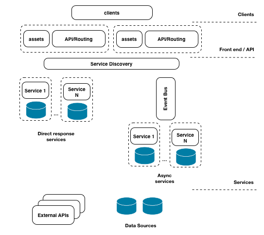

Our reference architecture contains the following elements that are typical to most microservice style systems:

* Clients - typically web based or mobile applications, make HTTP connections to an API layer.

* Static assets - such as images, style sheets and other elements that are used to render the user interface.

* API layer - This is usually a thin layer that provides the routing between client requests and microservices that ultimately respond to these requests.

* Service Discovery - A mechanism for discovering and routing to microservices. This can be as simple as a shared configuration file or a more dynamic mechanism such as DNS

* Direct response services - These types of services are typically reached via a point to point protocol such as HTTP or raw TCP and will usually perform a distinct action and return a result.

* Async services - These types of services are typically invoked via a bus based technology such as RabbitMQ or Apache Kafka. These may or may not return a response to the caller.

* Data sources and External APIs - Services will usually interact with one or more data sources or external systems in order to generate responses to requests

Based on this logical architecture we will use the following definition for a microservice:

*A microservice is a small, highly cohesive unit of code that has responsibility for a small functional area of a system. It should be independently deployable and should be of a size that it could be rewritten by a single developer in two weeks at maximum.*

To break this down further, a microservice has the following qualities:

* Limited, focused responsibility
* Highly cohesive, tightly scoped functionality
* Independently deployable
* Small enough to be rewritten by a single developer in under two weeks

In the following recipes we will look at how microservices operate in the context of an example system, how to set up an effective development environment for this style of coding and also look microservice messaging and communication protocols.

This chapter concerns itself more with architectural structure than implementation details.
Explanations tend to focus on how the pieces of a system integrate at an external, higher level rather than detailing in depth the intricacies of internal logic. However, much of the code, abstractions, patterns and techniques used here are covered throughout the rest of this book.    

## Creating a simple RESTful microservice

In this recipe we will build a simple microservice using the `restify` module. Restify is an easy to use middleware-centric framework (similar in API to Express) that is designed to help us rapidly build services that can be consumed over HTTP. 

Once we have built our first service we will test our service using the `curl` command.

### Getting Ready
To get let's create a fresh empty directory we'll call it `micro`.

```sh
$ mkdir micro
$ cd micro
```

### How to do it

We're going to create a service that adds two numbers together. 

A service is simply a Node process, so let's go ahead and create an `adderservice` folder inside our `micro` directory, initialize our new folder as a package and create a `service.js` file:

```sh
$ mkdir adderservice
$ cd adderservice
$ npm init -y
$ touch service.js
```

This will create a fresh `package.json` for us. 

Next let's add in the `restify` module for our service with the followiung command:

```sh
npm install restify --save --no-optional
```

This will install the `restify` module and also add the dependency to `package.json`

> #### --no-optional.. 
> By default `restify` installs DTrace probes, this can be disabled during install with the --no-optional flag. Whilst DTrace is great not all systems support it which is why we have chosen to disable it in this example. We can find out more about dtrace here: http://dtrace.org/blogs/about/

Now it's time to actually write our service. Using our favorite editor 
let's add the following code to the `service.js` file:

```js
const restify = require('restify')

function respond (req, res, next) {
  const result = (parseInt(req.params.first, 10) + 
    parseInt(req.params.second, 10)).toString()
  res.send(result)
  next()
}

const server = restify.createServer()
server.get('/add/:first/:second', respond)

server.listen(8080, () => {
  console.log('%s listening at %s', server.name, server.url)
})
```

To see if everything is working we'll start the `service.js` file:

```sh
$ node service.js
```

Which should give the following output:

```sh
restify listening at http://[::]:8080
```

Let's test our service using `curl`. 

Open a fresh terminal and type the following:

```sh
$ curl http://localhost:8080/add/1/2
```

The service should respond with the answer 3. 

We have just built our first RESTful microservice.

> #### `curl` 
> `curl` is a command line HTTP client program that works much like a web browser. If we don't have `curl` available on our system we can test the service by putting the url into our web browser.

### How it works

When we executed the microservice, `restify` opened up tcp port 8080 and began listening for requests. The `curl` command opened a socket on localhost and connected to port 8080. The `curl` tool then sent an HTTP `GET` request for the url `/add/1/2`. 

Our code configured `restify` to serve `GET` requests matching a specific url pattern:

```js
server.get('/add/:first/:second', respond)
```

The `:first` and `:second` placeholders instruct `restify` to match path elements in these positions to parameters with are added to `req.params`. We can see this working in the respond function where we were able to access the parameters using the form `req.params.first`

Finally our service sent a response using the `res.send` function.

> #### Restify and Express 
> Restify and Express have very similar API's. We can learn more about 
> `req.params` and `res.send` in the *Creating an Express Web App* 
> recipe in **Chapter 7 Working with Web Frameworks** 

Whilst this is a trivial service it should serve to illustrate the fact that a microservice is really nothing more than a Node module that runs as an independent process. 

A microservice system is a collection of these cooperating processes. Of course it gets more complicated in a real system where we have lots of services and have to manage problems such as service discovery and deployment, however keep in mind that the core concept is really very simple.

### There's more

Let's look at alternative ways to create and test a RESTful microservice.

#### Using the Core HTTP Module

Whilst we have used `restify` to create this simple service, there are several alternative approaches that we could have used such as:

* The Node core `http` module
* The `Express` framework [http://expressjs.com/](http://expressjs.com/)
* The `HAPI` framework [https://hapijs.com/](https://hapijs.com/)

Let's create an alternative implementation using the Node core HTTP module. Let's copy the `micro` folder to `micro-core-http` and alter the `service.js` file in the `micro-core-http/adderservice` folder to the following:

```js
const http = require('http')

const server = http.createServer(respond)

server.listen(8080, function () {
  console.log('listening on port 8080')
})

function respond (req, res) {
  const [cmd, first, second] = req.url.split('/').slice(1)
  const notFound = cmd !== 'add' || 
    first === undefined || 
    second === undefined

  if (notFound) {
    error(404, res)
    return
  }

  const result = parseInt(first, 10) + parseInt(second, 10)
  res.end(result)
}

function error(code, res) {
  res.statusCode = code
  res.end(http.STATUS_CODES[code])
}
```

We can start our service, as in the main recipe, with:

```sh
$ node service.js
```

We can use `curl` as before to test our service:

```sh
$ curl http://localhost:8080/add/1/2
```

Whilst using the core `http` module can give us the same results, we
have to implement additional lower level logic. Neglecting edge cases or misunderstanding fundamentals can lead to brittle code. The framework support provided by the `restify` module also supplies us with conveniences such as parameter parsing, automated error handling, middleware support and so forth.

#### Testing Microservices with a Browser 

We don't necessarily need to use the `curl` command to test our microservices, We can test out HTTP GET requests just using a web browser. For example we could open the default browser on our system and type the url into the address bar. Our service will return a response and the browser should render it as text for us. Bear in mind that some browsers will treat the response as a file download depending on how they have been configured.

### See also

* TBD

## Consuming a Service

In this recipe we are going to create a web application layerthat will consume our microservice. This is the API and client tier in our reference architecture depicted in the figure in the introduction to the chapter. 

We will be using the Express web framework to do this and also the Express Generator to create an application skeleton.

> #### Express
> For an introduction to Express see the *Creating an Express Web App* 
> recipe in **Chapter 7 Working with Web Frameworks**

### Getting Ready

This recipe builds on the code from our last recipe *Creating a simple RESTful microservice*. We'll be using the `micro` folder from the previous recipe as a starting point. 

> #### Previous Code ... 
> Code from the previous recipe is available in the source files
> for this chapter.

Let's install the `express-generator`, which we'll be using
to rapidly generate Express scaffolding, and the `standard` 
linter (and formatter) which we'll use to reformat the generated
code the lint rules used in this book.

To do this run:

```sh
$ npm install -g express-generator standard
```

Now, let's build our web app.

### How to do it

First let's open a terminal and `cd` into the directory we created in the first recipe.

```sh
$ cd micro
```

Next we'll generate the application skeleton using the `express` command line tool, and then use `standard --fix` to confirm the code to our lint
rules:

```sh
$ express --view=ejs ./webapp
$ cd webapp
$ standard --fix
```

This will create a skeletal web application using `ejs` templates in a new directory called `webapp`.

> #### `ejs`.. 
> The `ejs` module provide EJS templating capabilities. To learn more EJS and template engines see the *Adding a View Layer* recipe in **Chapter 7 Working with Web Frameworks**

We'll also create a few files, and add an additional dependency:

```sh
$ touch routes/add.js views/add.ejs
$ npm install --save --no-optional restify 
```

We'll be using `express` for the web application, and `restify`
(in this case) to create a RESTful client.

To install the rest of our dependencies (as speicifed in the `package.json` that was generated by `express-generator`) we run:

```sh
$ npm install
```

Once this has completed we can run the application with the following:

```sh
$ npm start
```

If we now point a browser to http://localhost:3000 we should see a page rendered by our application as in the figure below:

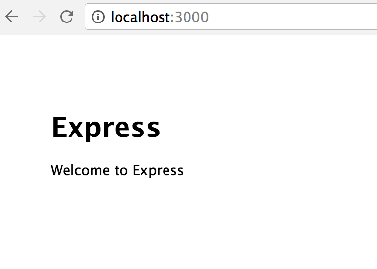

Now that we have our web application skeleton it's time to wire it up to our microservice. 

Let's begin by creating a route and a frontend to interact with our service. 

We'll start with routing. 

The `webapp/routes/add.js` should look like so:

```js
const { Router } = require('express')
const restify = require('restify')
const router = Router()

router.get('/', function (req, res) {
  res.render('add', { first: 0, second: 0, result: 0 })
})

router.post('/calculate', function (req, res, next) {
  const client = restify.createStringClient({
    url: 'http://localhost:8080'
  })
  const {first, second} = req.body
  client.get(
    `/add/${first}/${second}`,
    (err, svcReq, svcRes, result) => {
      if (err) { 
        next(err)
        return 
      }
      res.render('add', { first, second, result })
    }    
  ) 
})

module.exports = router
```

Next we need to create a template to provide users of the app with access to the service.

Let's make `webapp/views/add.ejs` look as follows:

```html
<!DOCTYPE html>
<html>
  <head>
    <title>Add</title>
    <link rel='stylesheet' href='/stylesheets/style.css' />
  </head>
  <body>
    <h1>Add it up!</h1>
    <form id='calc-form' action='/add/calculate' method='post'>
      <input type='text' id='first', name='first'
        value=<%= first %>></input>
      <input type='text' id='second', name='second'
        value=<%= second %>></input>
    </form>
    <button type="submit" form="calc-form"
      value="Submit">Submit</button>
    <h2>result = <%= result %></h2>
  </body>
</html>
```

We then need to update the file `webapp/app.js` to wire in the template and route. 

Near the top of `webapp/app.js`, underneath where the other routes are required we can insert the following line:

```js
var add = require('./routes/add')
```

Finally towards the bottom of the `webapp/app.js` file, we'll mount
our `add` route at the `/add` path with the following line:

```js
app.use('/add', add)
```

Now it's time to test our application and service together! 

We open up one terminal and start our adding service:

```sh
$ cd micro/adderservice
$ node service.js
```

Then we open a second terminal and start the webapp:

```sh
$ cd micro/webapp
$ npm start
```

Now that we have our webapp and service running, open a browser and point it to http://localhost:3000/add. 

This will render the template that we created above and should look as depicted below:


If we type a number into each of the input fields and hit the calculate button to verify that the service is called and returns the correct result. 

For instance typing "1" in the first input, and "2" in the other and
pressing the submit button should produce a response as shown in the following image: 

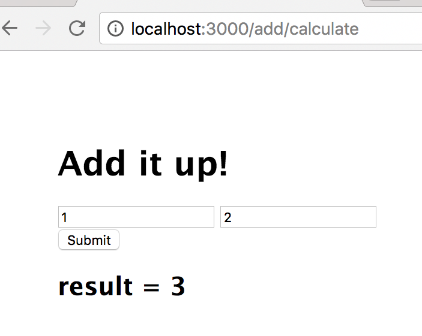

### How it works

The elements of our reference architecture that we have touched on so far are illustrated below:

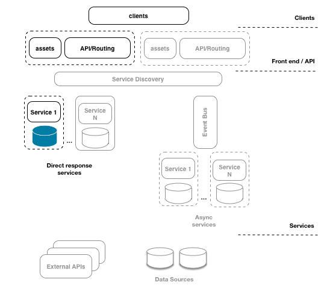

We have implemented a frontend web layer with a single backend service. 

When our frontend page renders the user is presented with a standard web form. When they press submit a standard HTTP post request is made to our API tier, which is implemented using the Express framework.

We implemented a route in our API tier that uses `restify` to make a connection to our microservice. This route marshals parameters from the original form `POST` request and sends them onto our microservice via a HTTP `GET` request. Once the service has returned a result, our Express application renders it using our EJS template.

Of course, for a small system like this it is hardly worth going to the trouble. However this is just for illustrative purposes. As a system grows in functionality the benefits of this type of architectural approach become more apparent.

It's also important to note the reason for the API tier (the Express application): minimizing the public API surface area. 

We strongly recommended that microservices are *never* directly exposed to the client tier, even on protected networks. Instead prefer to use an API gateway pattern (like we've built in this recipe) to minimize the attack surface.

The following recipes will go on to build on more elements of our system however before we do so our next recipe will look at how we can configure an effective local development environment.

### There's more

Let's write an integration test for our system

#### Integration testing

So far we have omitted unit and integration testing from our code.
 
Whilst testing is not the focus of this chapter, robust testing is an absolute requirement for any system. 

Let's create a quick integration test for our `webapp` and `adderservice`. To do this we will use the `superagent` and `tap` modules. 

Let's get setup by creating a fresh directory for our tests:

```sh
$ cd micro
$ mkdir inttest
$ cd inttest
$ npm init -y
$ npm install superagent --save-dev
$ npm install tap --save-dev
$ npm install -g tap
```

Next let's create a test script in a file `addtest.js`:

```js
const request = require('superagent')
const { test } = require('tap')

test('add test', (t) => {
  t.plan(2)

  request
    .post('http://localhost:3000/add/calculate')
    .send('first=1')
    .send('second=2')
    .end((err, res) => {
      t.equal(err, null)
      t.ok(/result = 3/ig.test(res.text))
    })
})
```

> #### TAP 
> TAP stands for Test Anything Protocol and has implementations in many languages. Find out more about TAP here: https://testanything.org/

To run the integration test, the system needs be running.

Let's open three terminals (each with the working directory set to the `micro` folder).

In the first terminal we run:

```sh
$ cd micro/adderservice
$ node service.js
```

In the second terminal we run:

```sh
$ cd micro/webapp
$ npm start
```

In the third we're going to run our integration test.

Since we installed the `tap` command globally we can run this test using the `tap` executable which `npm` has installed on our system. We can actually run our tests directly with Node (`tap` doesn't need a test runner) but the `tap` executable provides a more visual UI. 

In our third terminal we can run our test like so:

```sh
$ cd inttest
$ tap addtest.js
addtest.js ............................................ 2/2
total ................................................. 2/2
  2 passing (328.645ms)
  ok
```

Our simple test exercises both our frontend `webapp` and also our `adderservice`. 

This of course is no sustitute for robust unit testing which should be implemented for all services and frontend pieces. On a side note, the `tap` module is excellent for unit testing as well.

### See also

* TBD

## Setting up a development environment

Microservice systems have many advantages over traditional monolithic systems. However this style of development does present it's own challenges. 

One of these has been termed Shell Hell. This occurs when we have many microservices to spin up and down on a local development machine in order to run integration and regression testing against the system, as illustrated in the image below:

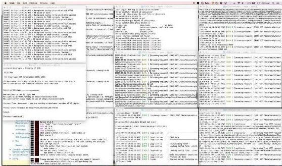

In this recipe, we're going to investigate a solution to this problem
in the form of a microservice development environment.

### Getting Ready

Fuge is a toolkit written in Node. 

It's designed specifically to help with local microservice development

Let's install Fuge with the following command:

```sh
$ npm install -g fuge
```

Our `micro` folder from the previous recipe *Consuming a Service* is our starting point for this recipe.

### How to do it

Fuge needs a simple configuration file in order to take control of our development system, let's write it now. 

We need to create a directory called `fuge` at the same level as our `webapp` and service directories.

```sh
$ cd micro
$ mkdir fuge
```

Next we need to create a file `fuge.yml` in this directory and add the following configuration code:

```yaml
fuge_global:
  tail: true
  monitor: true
  monitor_excludes:
    - '**/node_modules/**'
    - '**/.git/**'
    - '**/*.log'
adderservice:
  type: process
  path: ../adderservice
  run: 'node service.js'
  ports:
    - main=8080
webapp:
  type: process
  path: ../webapp
  run: 'npm start'
  ports:
    - main=3000
```

Fuge will provide us with an execution shell for our apps and services. 

We can enter the fuge shell environment with the following:

```sh
$ fuge shell fuge.yml
```

Fuge will read this configuration file and provide a command prompt,
as shown in the following image.

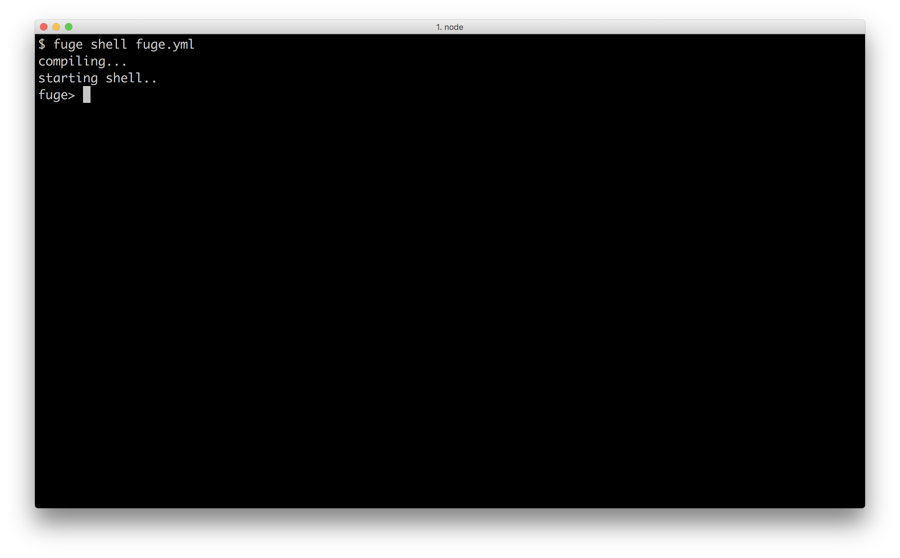

Type `help` and hit return to see the list of available commands,
the below figure shows the help output.


Let's try the `ps` command:


This shows us an a list of managed processes based on our the
earlier configuration.

We can see that `fuge` understands that it's managing our `webapp` 
and our `adderservice`. 

Let's start both with the `start all` command (still in the Fuge shell):


Once we issue the `start all` command Fuge will spin up an instance 
of each managed process and trace STDOUT and STDERR output from these 
processes into the shell console, coloring the output on a per process basis. 

We can now point our browser to http://localhost:3000/add and the system 
should work exactly as in the previous recipe.

Let's now make a change to our `adderservice` code, say by adding some 
additional logging. 

We'll add a `console.log` statement to our `respond` function, so that 
our service code looks as follows:

```js
const restify = require('restify')

function respond (req, res, next) {
  const result = (parseInt(req.params.first, 10) + 
    parseInt(req.params.second, 10)).toString()
  console.log('adding numbers!')
  res.send(result)
  next()
}

const server = restify.createServer()
server.get('/add/:first/:second', respond)

server.listen(8080, () => {
  console.log('%s listening at %s', server.name, server.url)
})

```

If we now go back to the Fuge shell we can see that the change
was detected and our `adderservice` has been restarted automatically. 

If we add some numbers through the `webapp` interface we can also see
that our new `console.log` statement is displayed in the Fuge shell.

The following image shows us loading the webapp, the `adderservice` 
restarting in response to our change, and then new log message occuring
after we fill out the HTML form and hit submit:


Now we'll shutdown our system by issuing the `stop all` command 
in the Fuge shell. Fuge will stop all managed processes. We can
check that this has completed successfully by issuing a `ps` command.

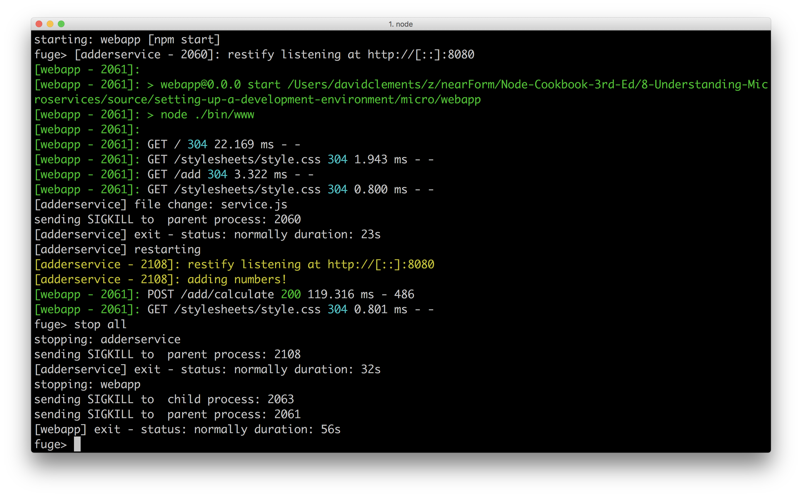

We can now exit the Fuge shell by typing `exit`.

### How it works

Building a microservice system of any significant size comes with challenges. One of the key challenges is managing a number of discrete processes in development. Tools like Fuge can help us to manage this complexity and accelerate our development experience.

Under the hood Fuge reads its configuration file to determine what processes it needs to manage. Using standard Node interfaces (like `process.stdin` and `process.stdout`) along with a variety of modules (such as `chokidar`, `chalk` and `ps-tree` and much more) Fuge provides an interactive execution environment for those processes and watches our code for changes, automatically reloading a service when a change occurs. 

Not only is this highly useful when developing systems with a significant number of microservices, it's also requires no service specific configuration on a
developers part. This is modus operandi that Fuge embraces: enhanced developer experience of microservice systems.

> #### Fuge and Docker 
> Fuge can also manage Docker containers locally for us, alongside the Node processes. This is the subject of a a recipe later in this chapter, *Using Containerized Infrastructure*

It should be noted that Fuge is a development tool, something that is used locally. Fuge should not be used for running microservices in a production environment.

> #### Microservices and Node in Production 
> Take a look at **Chapter 11 Deploying Systems** for information on 
> deploying distributed Node systems.

### There's more

As we saw by running the `help` command Fuge has a number of other useful commands. Let's try a few of them out. For the minimalist,
we'll also take a look a lightweight alternative to Fuge.

### A minimal alternative to fuge

If all we want is to an easy to start services and tail processes logs with a color scheme, and we're willing to forgo the watch and reload functionality, manage docker containers separately and avoid other bundled functionality then
the `lil-pids` may be of use to us. 

Let's install `lil-pids` so we can check it out:

```sh
$ npm install -g lil-pids
```

Let's copy our system, the `micro` folder, to a new folder called
`micro-lil-pids`, remove the `fuge` folder and create a file called
`services`:

```sh
$ cp -fr micro micro-lil-pids
$ cd micro-lil-pids
$ rm -fr fuge
$ touch services
```

In our `services` file we'll add the following:

```sh
cd webapp && npm start
cd adderservice && node service
```

We can now start our system with:

```sh
$ lil-pids services
```

The folllowing image shows us starting the system with `lil-pids`,
loading the `/add` route in a browser, and submitting a POST request
via the HTML form:

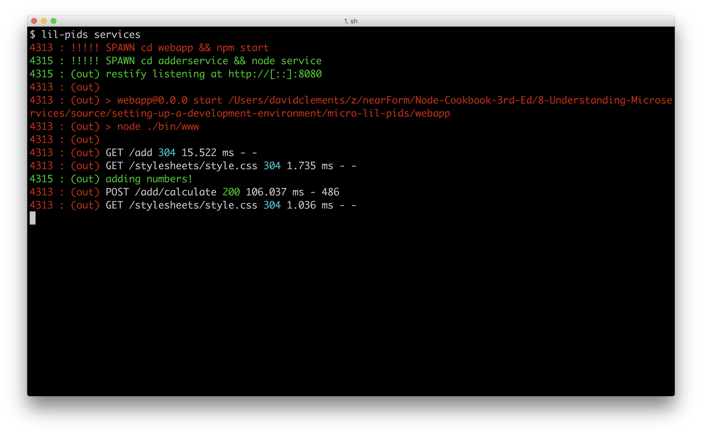

### Debug Command

Fuge allows us to start a Node process in debug mode. 

The `process` type in the Fuge configuration file (`fuge/fuge.yml`) indicates
any type of exectuable process that can be be run on the OS (Fuge is programming
language independent). 

To enable Node debugging, Fuge must be explicitly told that a service is a Node process. 

For exploration purposes, let's copy the `micro/fuge/fuge.yml` to `micro/fuge/fuge2.yml`.

```sh
$ cd micro/fuge
$ cp fuge.yml fuge2.yml
```

Then in `fuge2.yml` we'll change the `type` field for the `adderservice`  to `node` as below:

```yaml
adderservice:
  type: node
  path: ../adderservice
  run: 'node service.js'
  ports:
    - main=8080
```

Now we'll start up the Fuge shell with the new configuration file,
assuming our current working directory is `micro/fuge` we can start
the fuge shell with:

```sh
$ fuge shell fuge2.yml
```

In the shell, let's run following command:

```sh
fuge> debug adderservice
```

We should see that the debugger is starting and the process should output
a URL, similar to the following image.

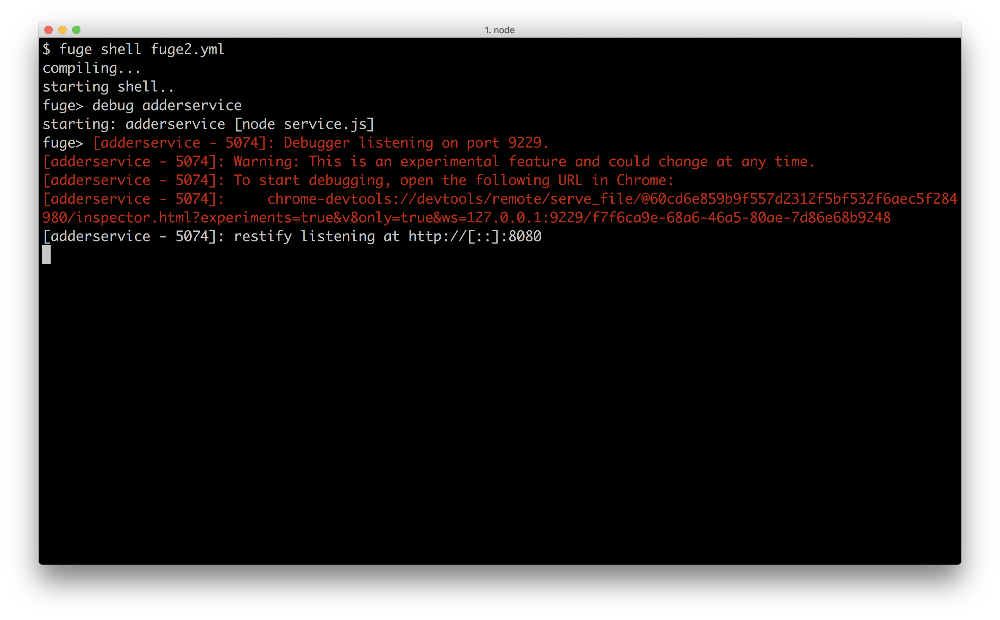

When we copy and paste the provided url into Chrome the Chrome's developer tools will open allowing us to navigate to the `adderservice` code and debug it.

> #### Debugging Node processes 
> We discuss debugging Node with Chrome Devtools in depth in the 
> the first chapter of this book **Chapter 1 Debugging Processes**, 
> see the very first recipe *Debugging Node with Chrome Devtools*.

### Shell Passthrough

Commands that Fuge does not recognise are passed through to the shell for execution. 

For example we can try the following:

```sh
fuge> start all
fuge> ps
fuge> ps aux | grep -i node
fuge> netstat -an | grep -i listen
```

This can be very useful during a development session and saves having to switch shells for simple one liners!

### Apply Command

The `apply` command allows us to execute any shell command in every directory of each named service. 

This sometimes come in very useful, but should be used carefully. 

We can try this by spinning up the fuge shell:

```sh
$ fuge shell fuge.yml # assuming working dir is micro/fuge
```

Then, in the shell we can use `apply` to (for instance) output 
the directory contents of every registered service:

```sh
fuge> apply ls -l
[adderservice]
total 16
drwxr-xr-x  52 pelger  staff  1768 24 Mar 13:33 node_modules
-rw-r--r--   1 pelger  staff   313 24 Mar 13:34 package.json
-rw-r--r--   1 pelger  staff   399 24 Mar 13:33 service.js
[webapp]
total 16
-rw-r--r--   1 pelger  staff  1313 24 Mar 13:33 app.js
drwxr-xr-x   3 pelger  staff   102 24 Mar 13:33 bin
drwxr-xr-x  98 pelger  staff  3332 24 Mar 13:33 node_modules
-rw-r--r--   1 pelger  staff   349 24 Mar 13:33 package.json
drwxr-xr-x   5 pelger  staff   170 24 Mar 13:33 public
drwxr-xr-x   5 pelger  staff   170 24 Mar 13:33 routes
drwxr-xr-x   5 pelger  staff   170 24 Mar 13:33 views
```

The utillity of this becomes apparent once we have a larger (greater than 5) number of services, particularly if they are using separate git repositories.

 For example running `apply git status` will give us an immediate view of the current changes on our local system. 
 
 Another useful example is `apply npm test` to run all of the unit tests in one go across our system, and `apply npm install` if we've checked out a fresh
 system and want to install the dependencies of each service.

### See also

* TBD

## Standardizing service boilerplate

As a system grows, any hard coded values will cause inflexibility
and cause friction and drag on development, maintenance and operations.

Additionally, introducing a standard data format for communication between
services avoids having to create specific (and likely, brittle) 
API contracts between services.

We recommend keeping service logic (which often represents business logic) separate from implementation logic. This allows us to switch out the implementation piece, without disrupting the business logic or service logic portion.

In this recipe we are going to improve the internal structure of our 
`adderservice`, decoupling service logic from `restify` framework housing.
We're going to remove hard coded urls and port numbers and switch to using 
JSON as the transmission format between services.

Our `adderservice` will then become the canonical template for any 
other services we may create.

### Getting Ready

This recipe extends the code from our last recipe *Setting up a development environment*. We'll be working on the same `micro` folder we've been building
throughout this chapter. Let's dive in!

### How to do it

Let's begin by updating our `adderservice`.  

We'll going to add an `index.js` and `wiring.js` file in the `micro/adderservice` folder: 

```sh
$ cd micro/adderservice
$ touch index.js wiring.js
```

Our `wiring.js` file should have the following code:

```js
module.exports = wiring 

function wiring (service) {
  const server = restify.createServer()

  server.get('/add/:first/:second', (req, res, next) => {
    service.add(req.params, (err, result) => {
      if (err) { 
        res.send(err)
        next()
        return 
      }
      res.send(200, result)
      next()
    })
  })

  server.listen(ADDERSERVICE_SERVICE_PORT, '0.0.0.0', () => {
    console.log('%s listening at %s', server.name, server.url)
  })
}
```

Next we'll change the code in the file `service.js` and remove the `restify` code from it as below:

```js
module.exports = service

function service () {
  function add (args, cb) {
    const {first, second} = args
    const result = (parseInt(first, 10) + parseInt(second, 10))
    cb(null, {result: result.toString()})
  }

  return { add }
}
```

Our `index.js` file ties together the wiring and service logic like so:

```js
const wiring = require('./wiring')
const service = require('./service')()

wiring(service)
```

Since the `index.js` file is now the entry point for the `adderservice`, 
we need to update the `micro/fuge/fuge.yml` configuration so it runs `index.js` instead of `service.js` 

In `micro/fuge/fuge.yml` let's update the section `run` field of the `adderservice` section like so:

```yaml
adderservice:
  type: process
  path: ../adderservice
  run: 'node index.js'
  ports:
    - main=8080
```

That takes care of the `adderservice`. 

Let's now turn our attention to the `webapp`. 

We'll modify our code in the file `micro/webapp/routes/add.js` so that it looks as below:

```js
const { Router } = require('express')
const restify = require('restify')
const router = Router()

const {
  ADDERSERVICE_SERVICE_HOST, 
  ADDERSERVICE_SERVICE_PORT
} = process.env

router.get('/', function (req, res) {
  res.render('add', { first: 0, second: 0, result: 0 })
})

router.post('/calculate', function (req, res, next) {
  const client = restify.createJSONClient({
    url: `http://${ADDERSERVICE_SERVICE_HOST}:${ADDERSERVICE_SERVICE_PORT}`
  })
  const { first, second } = req.body
  client.get(
    `/add/${first}/${second}`,
    (err, svcReq, svcRes, data) => {
      if (err) { 
        next(err)
        return 
      }
      const { result } = data
      res.render('add', { first, second, result })
    }    
  ) 
})

module.exports = router
```

We should be good to go now, so let's start our updated system:

```sh
$ cd micro
$ fuge shell fuge/fuge.yml
fuge> start all
```

The system should start up as before. If we open up a browser and point it to http://localhost:3000 we should be able to add numbers in exactly the same way as before.

### How it works

Whilst we have only made minor code changes to the system, organizationally these changes are important. 

We removed any hard coded service configuration information from the code. 

In the file `micro/adderservice/wiring.js`, we take the port assignment from
an environment variable (ADDERSERVICE_SERVICE_PORT is destructured from the 
`process.env` near the top of `wiring.js`):

```js
  server.listen(ADDERSERVICE_SERVICE_PORT, '0.0.0.0', () => {
    console.log('%s listening at %s', server.name, server.url)
  })
```

This means that the port which the service is listening on is now supplied by the environment. Whilst it might be fine to hard code this information for a small system, it quickly becomes unmanageable in a larger system so this approach to service configuration is important. 

Of course when we start the `adderservice` the environment needs to be set up correctly otherwise our process will fail to start. 

The Fuge shell provides this environment variable for us. To see this start the Fuge shell as before and run the `info` command:

```sh
fuge> info adderservice full
ADDERSERVICE_SERVICE_HOST=127.0.0.1
ADDERSERVICE_SERVICE_PORT=8080
ADDERSERVICE_PORT=tcp://127.0.0.1:8080
ADDERSERVICE_PORT_8080_TCP=tcp://127.0.0.1:8080
ADDERSERVICE_PORT_8080_TCP_PROTO=tcp
ADDERSERVICE_PORT_8080_TCP_PORT=8080
ADDERSERVICE_PORT_8080_TCP_ADDR=127.0.0.1
```

We can see that the port setting is provided by Fuge to the `adderservice` process along with a number of other environment variables. It should be noted that Fuge uses a specific format for the environment variables that it injects into a process, following the same format as deployment tools like Kubernetes and Docker Swarm. We will explore this more in the **Chapter 11 Deploying Systems** but for now it is important to realize that there is a specific non-random naming convention in play!

> #### Environment Configuration 
> Microservices should pick up any required configuration information from their environment. This should never be hard-coded.

We separated the service logic from the framework logic in the `adderservice`.

If we look again at the file `micro/adderservice/service.js` we can see that it has no external dependencies and is therefore independent of the calling context. 

> #### 12 Factor Apps 
> The code changes in the recipe are broadly inline with the principles outlined in the "12 Factor App" philosophy. See <https://12factor.net/> for more information

By this we mean that it would be perfectly possible to replace our `wiring.js` file with a similar one that used `express` instead of `restify` and our service logic would remain unchanged. This is an important principle to observe when building microservice systems, namely that a service should run independently of the context that it is called in.

> #### Execution Independent 
> Microservice business logic should execute independent of the context in which it is called. Put another way a microservice should not know anything about the context that it is executing in.

We also altered our system so it communicates using JSON. 

We did this by making our `add` function in `micro/adderservice/service.js` invoke its callback with an object containin a key (`result`) instead of passing the result as a string. This is then passed into `res.send` in `micro/adderservice/wiring.js`. At this point `restify` recognizes that `res.send` was passed an object and serializes it to send it as a response. 

On the counterpart API side, in the `micro/webapp/routes/add.js` file, 
we switch from using `restify.createStringClient` to using `restify.createJSONClient` which makes an HTTP requests, buffers the 
data into a single string and then deserializes the string (which is
expected to be a JSON string) into a JavaScript object. 

### There's more

Let's take a look at another approach to microservice communication (in the form of pattern routing) and unit testing a service.

#### Unit Testing

We've previously looked at integration testing but have yet to define what unit tests could look like in our `adderservice` (which is essentially becoming a service template). 

An additional benefit of this reorganization is that we have made our service code much simpler to test. Previously our service code was tightly coupled to the `restify` module which would have required us to call our service over a HTTP interface, even for a unit test. Happily we can now write a much simpler unit test.

Firstly lets install `tap` in our `adderservice` folder, and create a `test`  folder with an `index.js` file:

```sh
$ cd micro/adderservice
$ npm install tap --save-dev
$ mkdir test
$ touch test/index.js
```

Let's write our `test/index.js` like so:

```js
const {test} = require('tap')
const service = require('../service')()

test('test add', (t) => {
  t.plan(2)

  service.add({first: 1, second: 2}, (err, answer) => {
    t.error(err)
    t.same(answer, {result: 3})
  })
})
```

Let's change the `test` field in the `micro/adderservice/package.json` to:

```json
  "test": "tap test"
```

We can now run unit tests with:

```sh
$ npm test
```

Since `tap` is installed as a development dependency of our service,
the `package.json` test field, when executed with `npm test` will 
have access to the `tap` executable.

Of course this is a very simplistic test, however the point is that the unit test is not in anyway concerned with how the service is exposed. Becuse we extracted the wiring logic into `wiring.js` we can test out service logic independent of context.

#### Pattern Routing

Throughout this chapter we are using `restify` as our tool to create `REST` based interfaces to our microservices. However it should be stressed that this is just one approach to creating point to point connections to services.

Let's explore an innovative alternative in the form of a persistent TCP connection, combined with pattern based routing.

> #### Streams 
> This section employs advanced techniques and stream
> utility libraries. Without a fundamental understanding of 
> streams and the streams ecosystem the following code and its 
> explanation may prove difficult to comprehend. 
> See **Chapter 4 Using Streams** for background reading. 

We'll start by copying the `micro` folder from the main recipe to 
`micro-pattern-routing`.

```sh
$ cp -fr micro micro-pattern-routing
$ cd micro-pattern-routing
```

Now in the `adderservice` folder, we'll uninstall `restify` and 
install the `net-object-stream`, `pump`, `through2` and `bloomrun`
modules: 

```sh
$ cd adderservice
$ npm uninst --save restify
$ npm install --save net-object-stream pump through2 bloomrun
```

The dependencies at the top of our `micro/adderservice/wiring.js`
file should look like so:

```js
const net = require('net')
const nos = require('net-object-stream')
const through = require('through2')
const pump = require('pump')
const bloomrun = require('bloomrun')
```

Notice how `restify` has been removed, and our newly installed dependencies,
plus the core `net` module are being required.

Next let's rewrite the `wiring` function as follows:

```js
function wiring (service) {
  const patterns = createPatternRoutes(service)
  const matcher = createMatcherStream(patterns)

  const server = net.createServer((socket) => {
    socket = nos(socket)
    pump(socket, matcher, socket, failure)
  })

  server.listen(ADDERSERVICE_SERVICE_PORT, '0.0.0.0', () => {
    console.log('server listening at', ADDERSERVICE_SERVICE_PORT)
  })
}
```

Our `wiring` function references three other functions, `createPatternRoutes`,
`createMatcherStream` and `failure` (which is passed as the last argument
to `pump` in the `net.createServer` connection listener function).

Let's add these three functions to the bottom of `wiring.js`:

```js
function createPatternRoutes (service) {
  const patterns = bloomrun()

  patterns.add({role: 'adder', cmd: 'add'}, service.add)

  return patterns
}

function createMatcherStream (patterns) {
  return through.obj((object, enc, cb) => {
    const match = patterns.lookup(object)
    if (match === null) {
      cb()
      return
    }
    match(object, (err, data) => {
      if (err) {
        cb(null, {status: 'error', err: err})
        return
      }
      cb(null, data)
    })
  })
}

function failure (err) {
  if (err) console.error('Server error', err)
  else console.error('Stream pipeline ended')
}
``` 

Our `adderservice` has now been converted to have a TCP interface with a
serialization protocol as defined by the `net-object-stream` module.

So let's update the `micro/webapp/routes/add.js` to use this interface.

We need to install `net-object-stream` into the `webapp` folder:

```sh
$ cd ../webapp # assuming we're in the micro/adderservice folder
$ npm install --save net-object-stream
```

We'll alter the dependencies at the top of `micro/webapp/routes/add.js`
to look as follows:

```js
const { Router } = require('express')
const restify = require('restify')
const net = require('net')
const nos = require('net-object-stream')
const router = Router()
```

We've added the core `net` module and the recently installed `net-object-stream` module.

Let's create small utility function that creates and caches 
a TCP client wrapped in a `net-object-stream` interface:

```js
function createClient (ns, opts) {
  return createClient[ns] || (createClient[ns] = nos(net.connect(opts)))
}
```

The first time this function is called (with a particular namespace (`ns`))
a TCP connection is created, each subsequent call will return the same connection.

Finally we'll alter our `/calculate` route like so:

```js
router.post('/calculate', function (req, res, next) {
  const client = createClient('calculate', {
    host: ADDERSERVICE_SERVICE_HOST,
    port: ADDERSERVICE_SERVICE_PORT
  })

  const role = 'adder'
  const cmd = 'add'
  const { first, second } = req.body
  client.once('data', (data) => {
    const { result } = data
    res.render('add', { first, second, result })
  })
  client.write({role, cmd, first, second})
})
```

Now if we start our system:

```sh
$ cd ../fuge # assuming we're in the webapp folder
$ fuge fuge.yml
fuge> start all
```

We should be able to follow the same steps as in the recipe.

This alternative implementation uses a persistent TCP connection and
sends JSON objects back and forth over the connection. Pattern matching
is applied to these objects to determine which action to take based
on the incoming object. 

Two notable modules make this possible (and easy). The `net-object-stream`
module and the `bloomrun` module.

The `net-object-stream` module wraps a binary stream in an object
stream. On the writable side it serializes objects (as JSON, by default) written to the stream, passing them to the underlying binary stream. It prefixes each data payload with a binary header that indicates the payload's length. On the readable side, it converts incoming data, detecting and processing the payload headers in order to deserialize, then
emits the resulting object. 

This effectively allows us to transparently read and write objects to a
TCP socket (and other streams, the name `net-object-stream` is something of a misnomer).

The `bloomrun` module performs object pattern matching, which essentially means
matching keys and values in one object against those in another. For instance,
in the `createPatternRoutes` function we create an instance of `bloomrun`, named
`patterns`. Then we add a pattern `{role: 'adder', cmd: 'add'}` with the `patterns.add` method.

To explain how the pattern matching works, let's consider the following scenario.

Say we fill out the HTML form with the first input set to 1 and the seocnd input set to 3 and hit submit. The `/calculate` route handler in `micro/webapp/routes/add.js` creates an object of the form `{role: 'adder', cmd: 'add', first: 1, second: 3}`, which is then written to the
objectified TCP connection (the TCP client is wrapped by `nos`, an instance of `net-object-stream`). 

When the `adderservice` receives a connection, the `socket` stream is also objectified (passed to the `nos` function and reassigned back as the `socket`
reference). 

Then we use the `pump` module to pipe from the `socket` stream to
our `matcher` stream and back to the `socket` stream.

The `matcher` stream is created via the `createMatcherStream` function. This returns a transform object stream (using `through.obj`). 

This means as each serialized object comes through the TCP connection, it's parsed and passed on to the `matcher` stream. The function passed to `through.obj` receives the object (as `object`) and passes it to `patterns.lookup`.

The `pattern.lookup` function checks the incoming object (`{role: 'adder', cmd: 'add', first: 1, second: 3}`) and finds that there is a match (`{role: 'adder', cmd: 'add'}`). Every property in the pattern object (`{role: 'adder', cmd: 'add'}`) has to be matched by the query object (`{role: 'adder', cmd: 'add', first: 1, second: 3}`) but a match will still occur if the query object has additional keys that aren't specified in the pattern object.

If there was no match, `patterns.lookup` would return `null`, in which case we do nothing. 

Since there is a match, the function we passed as the second argument to 
`pattern.add` is returned and stored as `match`. For our given inputs this will be the `service.add` function as defined in the `micro/adderservice/service.js` file. 

So when we call the `match` function with the incoming object, the `service.add` function adds the `first` and `second` properties of the object (one plus three) together and invokes the callback function with the answer, in this case it would be `{result: 4}`. Back in `wiring.js` the `through.obj` callback (`cb`) is then called and passed that object.
Since the `matcher` stream is piped back to the objectified `socket` stream, 
this object (`{result: 4}`) will be serialized by `net-object-stream` and sent back accross the wire to the `webapp` server, where it's deserialized and emitted. We listen to the `data` event in the `/calculate` route handler of `webapp/routes/add.js` and then render a response, passing the `result` object in as the template state.

We should note here, that this is not production ready code. It's purely 
for conceptual demonstration purposes. We would need to implement 
reconnection strategies, parse error handling, and a variety of other
details before this could be production worthy. 

> #### Experimental Frameworks that use Pattern Routing 
> The Seneca (http://senecajs.org) and more minimal Mu (http://npm.im/mu)
> frameworks provide a pattern routing layer plus transport independence
> abstractions. This leads to minimal configuration services and 
> facilitates organically evolving microservice systems. 
> Frameworks such as Seneca and Mu can help in taking out a lot of the 
> boilerplate work associated with microservice construction. However we should 
> carefully consider the requirements of the system we are constructing and the 
> costs / benefits of adoption of any framework. It should be emphasised that 
> while Seneca and Mu incorporate a highly intriguing approach to Microservice 
> systems, we would consider the implementations to be experimental and outside 
> the remit of large scale production use, at the time of writing.

### See also

* TBD

## Using containerized infrastructure

Container technology has recently gained rapid adoption within the industry and for good reason. Containers provide a powerful abstraction and isolation mechanism that can lead to robust and repeatable production deployments.

The container model for software deployment has become synonymous with microservices and distributed systems in general. Largely because the architectural model is a natural fit with the underlying container model. Whilst a full discussion of the merits of containers is outside the scope of this book some of the key benefits to bear in mind are:

* Isolation - containers provide a clean isolated environment for our services to run in. The container 'brings' the correct environment with it so we can be sure that if it runs on my machine it will run on ours!

* Immutability - Once a container is built it can be treated as an immutable unit of functionality and promoted through test and staging environments to production

* Homogeneity - By applying the same abstraction to all deployable elements of a system, deployment and operations changes significantly.

* Scale - Given that we construct our services correctly, containers can be rapidly scaled up or down for a single or multiple service elements

In this recipe (and subsequent recipes in this chapter) we are going to be using prebuilt containers to gain a practical understanding of the benefits of containerization, particularly when applied to a microservice system. 

> #### Creating containers for deployment 
> In this recipe we're primarily concerned with consuming 
> containerized peer dependencies (such as as a database). 
> In the final chapter, *Chapter 11 - Deploying Systems*, we'll be
> covering how to build a deploy a containerized Node process. 

### Getting Ready

We're going to use the Docker container engine. Firstly we will need to install this and validate that it is operating correctly. To do this head over to http://www.docker.com and install the appropriate binary for our system. Docker supports Linux, Windows and Mac natively.

We can check that Docker was installed successfully by opening a shell and running the following:

```sh
$ docker run hello-world
```

This command will pull the `hello-world` image from Docker Hub - a central repository of public Docker images, create a new container from that image and run it. The executable within the container will output `hello from docker` along with some help text.

> #### Docker Installation.. 
> Docker was originally built for Linux based operating systems. Until recently running docker on Mac or Windows required the use of a virtual machine using either VirtualBox or VMWare, however Docker is now available natively on both Mac and Windows. This requires a recent version of macOs or Windows 10 or greater - so be sure to check the prerequisites when installing Docker.

Now that we have Docker installed we can press ahead. In this recipe we will be adding a new microservice that stores data into a MongoDB container to the `micro` folder from the previous recipe *Standardizing service boilerplate*.

### How to do it

There first thing we need to do is download the MongoDB container using the `docker pull` comamnd.

Let's execute the following command:

```sh
$ docker pull mongo
```

This will pull the official MongoDB image from the central Docker Hub repository.

> #### MongoDB and Node  
> We cover Mongo in detail in the *Storing and Retrieving Data with MongoDB* in 
> **Chapter 6 Persisting to Databases* holds 

Once the download has completed we can verify that the image is available by running:

```sh
$ docker images
```

This command will list all of the images that are available on the local machine. We should see the MongoDB image in this list.

Now that we have a MongoDB container available we can update our Fuge configuration file for the system. 

Let's edit the file `fuge.yml` and add the following section:

```
mongo:
  image: mongo
  type: container
  ports:
    - main=27017:27017
```

If we now start a Fuge shell and run `ps` we can see that Fuge is aware of the MongoDB container:

```sh
$ cd micro
$ fuge shell fuge/fuge.yml
fuge> ps
```


The above listing shows `mongo` with a type of `container`. Fuge will treat it accordingly as distinct to a process.

Now that we have our MongoDB container ready to go it's time to add a service to use it. We are going to write a simple auditing service that records all of the calculations submitted to our `adderservice` for later inspection. 

Let's create a folder for our new service, and initialize it as a package
and add `restify` and `mongodb`:

```sh
$ cd micro
$ mkdir auditservice
$ cd auditservice
$ npm init -y
$ npm install restify --no-optional --save
$ npm install mongodb --save
```

We'll be modelling our `auditservice` on the general structure laid 
out in the `adderservice`, so let's create `index.js`, `wiring.js`
and `service.js` files:

```sh
$ touch index.js wiring.js service.js
```

The `micro/auditservice/index.js` is the same as in our `micro/adderservice`:  

```js
const wiring = require('./wiring')
const service = require('./service')()

wiring(service)
```

Our `micro/auditservice/wiring.js` file should look like the following:

```js
const restify = require('restify')
const { AUDITSERVICE_SERVICE_PORT } = process.env

module.exports = wiring 

function wiring (service) {
  const server = restify.createServer()

  server.use(restify.bodyParser())

  server.post('/append', (req, res, next) => {
    service.append(req.params, (err, result) => {
      if (err) { 
        res.send(err) 
        return
      }
      res.send(result)
      next()
    })
  })

  server.get('/list', (req, res, next) => {
    service.list(req.params, (err, result) => {
      if (err) { 
        res.send(err)
        return 
      }
      res.send(200, result)
      next()
    })
  })

  server.listen(AUDITSERVICE_SERVICE_PORT, '0.0.0.0', () => {
    console.log('%s listening at %s', server.name, server.url)
  })
}
```

As we can see the audit service will support to endpoints.
One endpoint append to the audit log, the other list entries from the log. 

Now for our service logic, our `micro/auditservice/service.js` file should look like so:


```js
const { MongoClient } = require('mongodb')
const {
  MONGO_SERVICE_HOST,
  MONGO_SERVICE_PORT
} = process.env
const url = `mongodb://${MONGO_SERVICE_HOST}:${MONGO_SERVICE_PORT}/audit`

module.exports = service 

function service () {
  function append (args, cb) {
    MongoClient.connect(url, (err, db) => {
      if (err) {
        cb(err)
        return
      }

      const audit = db.collection('audit')
      const data = { 
        ts: Date.now(),
        calc: args.calc,
        result: args.calcResult 
      }

      audit.insert(data, (err, result) => {
        if (err) {
          cb(err)
          return
        }
        cb(null, {result: result.toString()})
        db.close()
      })
    })
  }

  function list (args, cb) {
    MongoClient.connect(url, (err, db) => {
      if (err) {
        cb(err)
        return
      }
      const audit = db.collection('audit')
      audit.find({}, {limit: 10}).toArray((err, docs) => {
        if (err) {
          cb(err)
          return
        }
        cb(null, {list: docs})
        db.close()
      })
    })
  }

  return { append, list }
}
```

Next we're going to update the `micro/webapp` so it can record and display 
calculation requests.

Let's start by creating the auditing view and route files:

```sh
$ cd ../webapp # assuming our cwd is micro/auditservice
$ touch views/audit.ejs routes/audit.js
``` 

We'll populate `micro/webapp/views/audit.ejs` with the following content:

```html
<!DOCTYPE html>
<html>
  <head>
    <title>Audit</title>
    <link rel='stylesheet' href='/stylesheets/style.css' />
  </head>
  <body>
    <h1>Calculation History</h1>
    <ul>
      <% list.forEach(function (el) { %>
      <li>at: <%= new Date(el.ts).toLocaleString() %>,
        calculated: <%= el.calc %>, result: <%= el.result %></li>
      <% }) %>
    </ul>
  </body>
</html>
```

The `micro/webapp/routes/audit.js` route will make a request
to the `micro/auditservice` `/list` endpoint and pass the response
data to the `audit.ejs` template using `res.render. The following
is the code for our `micro/webapp/routes/audit.js` file:

```js
const { Router } = require('express')
const restify = require('restify')
const router = Router()

const {
  AUDITSERVICE_SERVICE_HOST,
  AUDITSERVICE_SERVICE_PORT
} = process.env

router.get('/', (req, res, next) => {
  const url = `http://${AUDITSERVICE_SERVICE_HOST}:${AUDITSERVICE_SERVICE_PORT}`
  const client = restify.createJsonClient({ url })

  client.get('/list', (err, svcReq, svcRes, data) => {
    if (err) { 
      next(err)
      return 
    }
    res.render('audit', data)
  })
})

module.exports = router
```

We need to instrument the `/calculate` route in `micro/webapp/routes/add.js`
with an additional call to the `auditservice` microservice. The `micro/webapp/routes/add.js` should look like so:

```js
const { Router } = require('express')
const restify = require('restify')
const router = Router()

const {
  ADDERSERVICE_SERVICE_HOST,
  ADDERSERVICE_SERVICE_PORT,
  AUDITSERVICE_SERVICE_HOST,
  AUDITSERVICE_SERVICE_PORT,
} = process.env

router.get('/', function (req, res) {
  res.render('add', { first: 0, second: 0, result: 0 })
})

router.post('/calculate', function (req, res, next) {
  const clients = {
    adder: restify.createJSONClient({
      url: `http://${ADDERSERVICE_SERVICE_HOST}:${ADDERSERVICE_SERVICE_PORT}`
    }),
    audit: restify.createJSONClient({
      url: `http://${AUDITSERVICE_SERVICE_HOST}:${AUDITSERVICE_SERVICE_PORT}`
    })
  }
  const { first, second } = req.body
  clients.adder.get(
    `/add/${first}/${second}`,
    (err, svcReq, svcRes, data) => {
      if (err) {
        next(err)
        return
      }

      const { result } = data
      clients.audit.post('/append', {
        calc: first + '+' + second,
        calcResult: result
      }, (err) => {
        if (err) console.error(err)
      })
      
      res.render('add', { first, second, result })
    }
  )
})

module.exports = router
```

Finally we need to register the `micro/webapp/routes/audit.js` route in
the `micro/webapp/app.js` entry point. Near the top of `app.js` underneath
where we load various routes we add the following line:

```js
var audit = require('./routes/audit')
```

Then in the secion where we mount URI paths to route handler with `app.use`, 
we add the line: 

```js
app.use('/audit', audit);
```

Excellent! That's all of our code changes, the last thing we need to do is to tell Fuge about our new service. 

Let's add the following section to `fuge/fuge.yml`:

```yaml
auditservice:
  type: process
  path: ../auditservice
  run: 'node index.js'
  ports:
    - main=8081
```

We should be good to go! Let's fire up the Fuge shell and run a `ps` to confirm
the new `auditservice` has been registered:

```
$ fuge shell fuge/fuge.yml
fuge> ps
```

> #### Container Terminology.. 
> It is important to clearly differentiate between a container and an image. 
> An image is the serialized 'on disk' artifact that is stored 
> locally and in Docker repositories. A container is the running instantiation 
> of an image. We will be applying this terminology consistently.

We should now see `auditservice` listed as type process along with `adderservice`, `webapp` and `mongo`. 

Let's issue the `start all` command to Fuge to spin the system up.

If we now point a browser to http://localhost:3000/audit a blank audit history is displayed. We can add some history by opening http://localhost:3000/add and submitting some calculations. 

Then if we navigate to http://localhost:3000/audit againa list of the calculations will be displayed as shown below:


### How it works

In this recipe we introduced Docker containers and worked with the official MondoDB container. We could just as easily have used a MySql container or some other database. Using the MongoDB container (or indeed any other containerized infrastructure) is very simple. There's no need for compilation steps, nor installation of binaries or libraries on our local system. The MongoDB container came preconfigured with everything it needed to run in an encapsulated manner.

When a user fills out the HTML form at the `/add` route, the browser submits a POST request to to the `/add/calculate` route. The POST request is handled in 
`micro/webapp/routes/add.js`, where a request to the `adderservice` and the
`auditservice` is made. The `auditservice` is sent a POST request to the `/append`
route, and route handler in `micro/auditservice/wiring.js` calls the `service.append` method which is in the `micro/auditservice/service.js` file. 
The `service.append` function uses the `mongo` module to interface with the
MongoDB database within the `mongo` container and inserts a new record.

When the `/audit/list` route is loaded in the browser, the route handler in `micro/webapp/routes/audit.js` makes a GET request to the `auditservice` `/list` route, the route handler in `micro/auditservice/wiring.js` file calls 
`service.list` function which is written in `micro/auditservice/service.js` which in turn makes a request to MongoDB to fetch a list of entries. This list is
ultimately fed into the `micro/webapp/views/audit.ejs` template for rendering. 

Whilst this approach to using infrastructure is convenient in development, containers are a game changer when it comes to production deployment. We will investigate this topic in more detail in the **Chapter 11 Deploying Systems**.

Our audit service was able to connect to the MongoDB container in just the same way as if there were a local installation of MongoDB so no changes to the code were required in order to use the Docker container.

Whilst containers are incredibly useful for deployment and intrastructure encapsulation in development working with Node processes natively tends to allow for more rapid iteration. This is why we use Fuge to run both our container and our Node processes. 

We connected to the Mongo container using this url:

```js
const url = `mongodb://${MONGO_SERVICE_HOST}:${MONGO_SERVICE_PORT}/audit`
```

Fuge generated these environment variables from the service definition for us which means that we do not have to have a separate configuration file for our service. This is important to ensure a smooth transition for our service from development to a production environment, as should become apparent in the following recipe *Service discovery with DNS* and in **Chapter 11 Deploying Systems**.

### There's more

We are using Fuge to run our microservices in development as a convenience. This may not always be the best approach because once we exit the fuge shell the data in the container will be lost.

#### Running Containers in the background

If we would prefer to have some of our containers execute in the background whilst still using fuge we can do this by tweaking our fuge configuration. 

For demonstration purposes, we'll copy `micro/fuge/fuge.yml` to `micro/fuge/fuge2.yml`.

Let's `micro/fuge/fuge2.yml` and update the `fuge_global` section by adding the `run_containers` setting as below:

```yaml
fuge_global:
  run_containers: false
  tail: true
  monitor: true
  monitor_excludes:
    - '**/node_modules/**'
    - '**/.git/**'
    - '*.log'
```

Now we'll start up the fuge shell with the `fuge/fuge2.yml` configuration and run Fuges `ps` command:

```sh
$ cd micro
$ fuge shell fuge/fuge2.yml
fuge> ps
name                          type           status         watch          tail
adderservice                  process        stopped        yes            yes
auditservice                  process        stopped        yes            yes
webapp                        process        stopped        yes            yes
mongo                         container      not managed
```

Fuge reports that the mongo container is `not managed`.  

In another terminal window we can run the mongo container using Docker directly:

```sh
$ docker run -p 127.0.0.1:27017:27017 -d mongo
```

This will start the MongoDB container in the background and expose port `27017` from the container to the `localhost` interface. We can now connect to this using the `auditservice` or through the standard Mongodb client. We can check this by running:

```sh
$ docker ps
```

We can start the rest of our system in the Fuge shell:

```sh
fuge> start all
```

Then we can confirm that everything is running as before by navigating our browser to and using the routes we've been creating in the this and previous recipes. 

If we exit the Fuge shell the mongo container will continue to run.

The key point to note here is that we can leave our infrastructure containers running in the background and tell Fuge about them. Fuge will then generate the appropriate environment variables (and other information) to allow us to access the container but will not attempt to start/stop the container.

### See also

* TBD

## Service discovery with DNS

Once a microservice system begins to grow past a few services we typically run into the challenge of service discovery. 

By this we mean:

* How a consumer of a service determines the connection parameters to allow it to consume a downstream service. Typically this means the IP address and port number to connect to.

* How a service registers itself with the system and advertises that it is available to be consumed.

* When multiple instances of a service start up how the system will handle load balancing and state between them

* How we discover services in development and in production without having to run production infrastructure locally

So far in this chapter we have been using environment variables to connect our services together, these variables have been generated for us by the Fuge tool. The astute reader may have wondered as to the format of the variables, for instance in the last recipe we used variables of the form:

```js
const url = `mongodb://${MONGO_SERVICE_HOST}:${MONGO_SERVICE_PORT}/audit`
```

There is a reason for this format: it's the same format used by both Kubernetes and Docker Swarm; two of the current leading container deployment technologies. Kubernetes is a container deployment and orchestration system that was developed at Google. Swarm is developed by Docker. Whilst there are alternative container deployment technologies, at the time of writing Kubernetes is gaining significant adoption across the industry.

There are significant benefits to having consistency betwen development and production. Fuge facilitates parity between development and production by
reproducing the same environment variable naming scheme for port and hosts.

Kubernetes supports two methods for service discovery. One is the (now familiar) use of environment variables, the other (more flexible approach) is via the use of DNS records. Whilst Kubernetes is a very capable deployment stack, it's not optimized for local development. However, Fuge can also provide DNS using the same format as Kubernetes. This allows us to run our microservice system in development and whilst remaining confident that we can run the same code in production without any requiring any alterations to our code.

In this recipe we are going to convert our system to use DNS for service discovery.

### Getting Ready

This recipe builds on our `micro` folder from the last recipe *Using containerized infrastructure*.

### How to do it

Let's begin by installing `concordant` (a DNS lookup module) into the `webapp` folder:

```sh
$ cd micro/webapp
$ npm install --save concordant
```

Let's include the newly installed `concordant` module into `webapp/routes/audit.js`. 

The top of `webapp/routes/audit.js` should look like so:

```js
const { Router } = require('express')
const restify = require('restify')
const { dns } = require('concordant')()
const router = Router()
var client
```

Notice how we also declared an (as yet) undefined `client` variable.

We're going to use Express' routing middleware pattern to split up 
the resolving of a DNS service, and the server response. Let's
modify the GET route in `webapp/routes/audit.js` to:

```js
router.get('/', resolve, respond)
```

Our `resolve` function in `webapp/routes/audit.js` should look like so:

```js
function resolve (req, res, next) {
  if (client) {
    next()
    return
  }
  const auditservice = `_main._tcp.auditservice.micro.svc.cluster.local`
  dns.resolve(auditservice, (err, locs) => {
    if (err) {
      next(err)
      return
    }
    const { host, port } = locs[0]
    client = restify.createJSONClient(`http://${host}:${port}`)
  })
}
```

Our `respond` function in `webapp/routes/audit.js` should look as follows:

```js
function respond (req, res, next) {
  client.get('/list', (err, svcReq, svcRes, data) => {
    if (err) { 
      next(err)
      return 
    }
    res.render('audit', data)
  })
}
```

When a request comes through to the GET route handler in `webapp/routes/audit.js`, the first route middleware (`resolve`)
will check if a service client for the `auditservice` has already 
been created. If it has it calls `next` which (when called without
an error object) causes Express to invoke the next middleware
in the stack for that route. Since we've supplied a second route
middleware (`respond`) Express will call the `respond` function
with the necessary arguments (`req`, `res`, `next`) and we use
the client to make a call to the `auditservice`. If we haven't already
resolved the service endpoint and created a client, then the `resolve`
function will discover the `auditservice`, define the `client` variable
and then call `next`. 

Let's implement an equivalent approach for our `/calculate` POST route in 
`webapp/routes/add.js`.

The top of `webapp/routes/add.js` should look as follows:

```js
const { Router } = require('express')
const restify = require('restify')
const { dns } = require('concordant')()
const router = Router()
var clients
```

Next, we can update our POST route like so:

```js
router.post('/calculate', resolve, respond)
```

Let's write `webapp/routes/add.js` `resolve` function like so:

```js
function resolve (req, res, next) {
  if (clients) {
    next()
    return
  }
  const adderservice = `_main._tcp.adderservice.micro.svc.cluster.local`
  const auditservice = `_main._tcp.auditservice.micro.svc.cluster.local`
  dns.resolve(adderservice, (err, locs) => {
    if (err) {
      next(err)
      return
    }
    const { host, port } = locs[0]
    const adder = `${host}:${port}`
    dns.resolve(auditservice, (err, locs) => {
      if (err) { 
        next(err)
        return
      }
      const { host, port } = locs[0]
      const audit = `${host}:${port}`
      clients = { 
        adder: restify.createJSONClient({url: `http://${adder}`}), 
        audit: restify.createJSONClient({url: `http://${audit}`})
      }
      next()
    })
  })
}
```

The `respond` function in `webapp/routes/add.js`should be written like so:

```js
function respond (req, res, next) {
  const { first, second } = req.body
  clients.adder.get(
    `/add/${first}/${second}`,
    (err, svcReq, svcRes, data) => {
      if (err) {
        next(err)
        return
      }

      const { result } = data
      clients.audit.post('/append', {
        calc: first + '+' + second,
        calcResult: result
      }, (err) => {
        if (err) console.error(err)
      })
      
      res.render('add', { first, second, result })
    }
  )
}
```

We can also remove all the host and port constants as extracted from `process.env` in both `webapp/routes/audit.js` and `webapp/routes/add.js` files.

Notice in both routes we added the `concordant` module (extracting it's `dns` object) and perform one or more service DNS lookups on each request.

Finally let's modify our audit service so that it can discover the MongoDB database through DNS. 

We'll need the `concordant` module again, this time in the `auditservice`:

```sh
$ cd micro/auditservice
$ npm install --save concordant
```

Next we'll edit `micro/auditservice/service.js` to discover our MongoDB container using DNS, our code should look as follows:

```js
const { MongoClient } = require('mongodb')
const { dns } = require('concordant')()

module.exports = service 

function service () {

  var db

  setup()
  
  function setup () {
    const mongo = '_main._tcp.mongo.micro.svc.cluster.local'

    dns.resolve(mongo, (err, locs) => {
      if (err) { 
        console.error(err)
        return
      }
      const { host, port } = locs[0]
      const url = `mongodb://${host}:${port}/audit`
      MongoClient.connect(url, (err, client) => {
        if (err) { 
          console.log('failed to connect to MongoDB retrying in 100ms')
          setTimeout(setup, 100)
          return
        }
        db = client
        db.on('close', () => db = null)
      }) 
    })
  }

  function append (args, cb) {
    if (!db) {
      cb(Error('No database connection'))
      return
    }
    const audit = db.collection('audit')
    const data = { 
      ts: Date.now(),
      calc: args.calc,
      result: args.calcResult 
    }

    audit.insert(data, (err, result) => {
      if (err) {
        cb(err)
        return
      }
      cb(null, {result: result.toString()})
    })
  }

  function list (args, cb) {
    if (!db) {
      cb(Error('No database connection'))
      return
    }
    const audit = db.collection('audit')
    audit.find({}, {limit: 10}).toArray((err, docs) => {
      if (err) {
        cb(err)
        return
      }
      cb(null, {list: docs})
    })
  }

  return { append, list }
}
```

> #### Managing code duplication in a distributed system 
> We've duplicated the `connectTo` function across files for demonstration 
> purposes, but in a typical setup we would publish system or business specific 
> reusable modules to a shared (orgnizational) repository so that multiple 
> services can avail of them. 

That takes care of the code changes, next we need to edit our Fuge configuration file to enable DNS discovery. To do this we need to edit the `fuge_global` section so that it looks like this:

```yaml
fuge_global:
  dns_enabled: true
  dns_host: 127.0.0.1
  dns_port: 53053
  dns_suffix: svc.cluster.local
  dns_namespace: micro
  tail: true
  monitor: true
  monitor_excludes:
    - '**/node_modules/**'
    - '**/.git/**'
    - '**/*.log'
```

Those are all of the changes so we should now be good to go. 

Let's fire up the `fuge` shell:

```sh
$ fuge shell fuge/fuge.yml
fuge> start all
```

Once all of the process and containers have started up we can check that everything works as before by visiting http://localhost:3000/add and http://localhost:3000/audit. We should observe exactly the same behavior except that this time we are dynamically resolving our service endpoints rather than using environment variables.

### How it works

DNS is one of the oldest service discovery mechanisms available and has of course been around since before the Word Wide Web. DNS is primarily used for resolving host names - for example www.google.com into IP addresses but it can also be used to provide other information. For service discovery we are interested in two pieces of information, namely the IP address and also the port number that the service resides on. To find this information using DNS we need to query two types of records: `SRV` records and `A` records.

> #### DNS record types .. 
> A full list of DNS record types can be found on Wikipedia at this URL https://en.wikipedia.org/wiki/List_of_DNS_record_types

Under the hood the  `concordant` module firstly performs an `SRV` query, this returns the port number for the service and a `CNAME` record (canonical name record). It then perform a host lookup - `A` record - against the `CNAME` to obtain an IP address for the service. Once we have these two pieces of information we can proceed to connect to and consume the service. The `concordant` module takes care of all of this detail for us, however it is important to understand what is happening internally.

There's a distinct format for forming services endpoint, for instance
the `adderservice` and `auditservice` constants in the `resolve` route middleware found in the `micro/routes/add.js`file are declared like so: 

```js
const adderservice = `_main._tcp.adderservice.micro.svc.cluster.local`
const auditservice = `_main._tcp.auditservice.micro.svc.cluster.local`
```

Likewise, the `micro/auditservice/service.js` declares the `mongo` 
endpoint as:

```js
const mongo = '_main._tcp.mongo.micro.svc.cluster.local'
```

Concordant performs service discovery based on how its environment is configured. If a `DNS_HOST` environment variable is present Concordant will query this server directly. In a production environment, if this variable is not present, Concordant will use the system configured DNS infrastructure as opposed to a direct lookup. This of course means that the application code does not need to take this into account, the environment differences between development and production are encapsulated within the `concordant` module for us.

The hostname that we are passing to the Concordant module looks a little long. This is the standard format for Kubernetes DNS based lookups and it follows a well defined schema:

```
_<port name>._<protocol>.<service name>.<namespace>.svc.cluster.local
```

> #### Kubernetes naming .. 
> Full documentation on Kubernetes DNS can be found at the official Kubernetes site at this URL https://kubernetes.io/docs/admin/dns/

In we look at the mongo configuration in our Fuge configuration file, we can see that we have named our mongo port `main` and the service is called `mongo`. The underlying protocol is `tcp` so the mapping to this hostname is fairly straightforward.

Our `resolve` function is using exactly the same naming scheme to dynamically resolve the service the `adderservice`, `auditservice` and `mongo` endpoints.

In each case we cached the DNS lookups (and the database or HTTP clients).
Whilst this removes additional latency and network traffic which would occur from constant DNS requests, it doesn't allow for dynamic system
reconfiguration. In other words, by caching an endpoint forever, we lose
one of the main benefits of DNS. For the sake of simplicity we didn't 
implement a comprehensive caching strategy in this recipe. In a 
production setting a more intelligent caching approach with TTL (time to live) capabalities would be recommended. 

### There's more

Let's briefly cover other service discovery approaches and explore how Fuge is emulating Kubernetes in a little more detail:

#### Alternative service discovery mechanisms

In this recipe we have used DNS as our service discovery mechanism. We did this specifically to align our development environment with our expected production environment under Kubernetes. There are of course many ways to deploy a microservice system and also many other service discovery mechanisms that we could have used. 

Some other options for consideration are: 

* Consul.io by Hasicorp, provides a robust service discovery mechanism providing both HTTP and DNS based registration and lookup.
* etcd, distributed key value store. This is used internally by Kubernetes
* Zookeeper, distributed key value store from the Apache project
* SWIM, Scaleable Weakly consistent Infection style process group Membership protocol. Peer to peer based service discovery protocol

We will be covering service discovery further and in more detail in **Chapter 11 Deplying Systems**.

#### Viewing the environment and DNS Zone

Fuge exposes information on both environment variables and DNS for us through the `info` and `zone` commands to aid us in debugging our service discovery process. Let's try this out. Start the Fuge shell and then run the info command for a service:

```sh
$ fuge shell fuge/fuge.yml
fuge> info auditservice full
```

Fuge will display the environment that is passed into the `auditservice` which should look like the following:

```yaml
command: node index.js
directory: ...
environment:
  DNS_HOST=127.0.0.1
  DNS_PORT=53053
  DNS_NAMESPACE=micro
  DNS_SUFFIX=svc.cluster.local
  AUDITSERVICE_SERVICE_HOST=127.0.0.1
  AUDITSERVICE_SERVICE_PORT=8081
  AUDITSERVICE_PORT=tcp://127.0.0.1:8081
  AUDITSERVICE_PORT_8081_TCP=tcp://127.0.0.1:8081
  AUDITSERVICE_PORT_8081_TCP_PROTO=tcp
  AUDITSERVICE_PORT_8081_TCP_PORT=8081
  AUDITSERVICE_PORT_8081_TCP_ADDR=127.0.0.1
  WEBAPP_SERVICE_HOST=127.0.0.1
  WEBAPP_SERVICE_PORT=3000
```

All of these environment variables will be available to the service process. Note that Fuge also supplies the DNS_HOST environment variable along with a port, namespace and suffix. The `concordant` module uses these environment variables to form service lookup queries.

Let's now run the `zone` command, this should provide us with out put similar to the following:

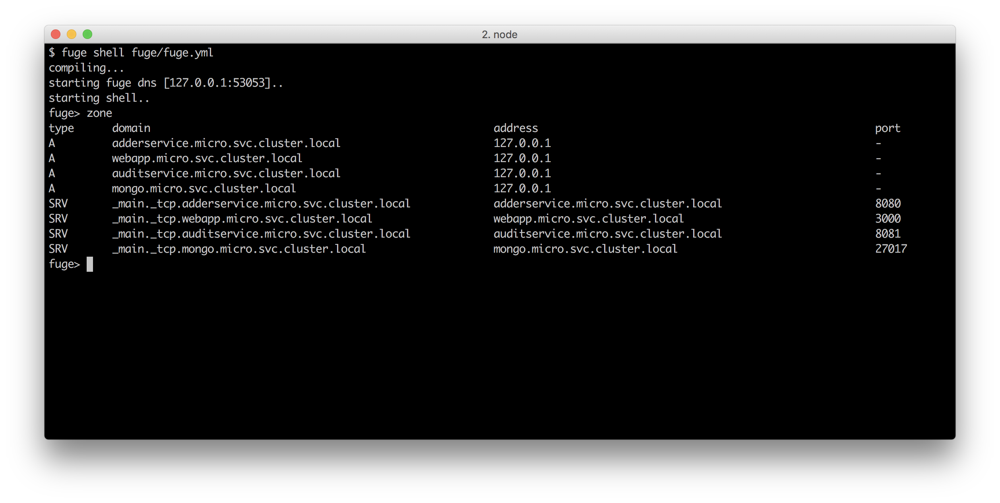

As we can see Fuge is supplying both SRV and A records for discovery which Concordant is able to lookup. It is important to note that in a Kubernetes production environment the same DNS entries will be available for service discovery.

### See also

* TBD

## Adding a Queue Based Service

In this recipe we will create a simple asynchronous event recording service. In this context asynchronous means that we will expose the service over a queue rather than a direct point to point connection. 

We will be using Redis as a our queue mechanism, specifically we're using a Redis list
structure with the `LPUSH` and `BRPOP` commands to make a FIFO queue. 

> #### Redis and Node  
> We cover using Redis with Node in the *Storing and Retrieving Data with Redis* in 
> **Chapter 6 Persisting to Databases* holds.

### Getting Ready

To prepare for this recipe we need to ensure that we have Redis available. The simplest way to do this is to use the official Docker Redis image, so, to get ready for this section we will need to pull `redis` from Docker Hub:

```sh
$ docker pull redis
```

This recipe builds on the code in the `micro` folder as we left off in previous recipe *Service discovery with DNS*. 

### How to do it

Our service is going to record events of interest in the system such as page loads. In a full system we might record this type of information against specific user ID's in order to analyze system usage patterns. However since our basic system doesn't include user context we will simply be recording events as system events. 

Let's start by creating a directory for our service and initializing it with a `package.json`, then install the `redis`, `mongodb` and `concordant` modules file:

```sh
$ cd micro
$ mkdir eventservice
$ cd eventservice
$ npm init -y
$ npm install --save redis mongodb concordant
```

Next we'll create the now familiar service structure:

```sh
$ touch index.js wiring.js service.js
``` 

Our usual service `micro/eventservice/index.js` code should look like so:

```js
const wiring = require('./wiring')
const service = require('./service')()

wiring(service)
```

Next let's add our wiring, the `wiring.js` file should look like so:

```js
const { dns } = require('concordant')()
const redis = require('redis')
const QNAME = 'eventservice'

module.exports = wiring 

function wiring (service) {
  
  const endpoint = '_main._tcp.redis.micro.svc.cluster.local'

  dns.resolve(endpoint, (err, locs) => {
    if (err) { 
      console.log(err)
      return 
    }
    const { port, host } = locs[0]
    pullFromQueue(redis.createClient(port, host))
  })

  function pullFromQueue (client) {
    client.brpop(QNAME, 5, function (err, data) {
      if (err) console.error(err)
      if (err || !data) {
        pullFromQueue(client)
        return
      }
      const msg = JSON.parse(data[1])
      const { action, returnPath } = msg
      const cmd = service[action]
      if (typeof cmd !== 'function') {
        pullFromQueue(client)
        return
      }
      cmd(msg, (err, result) => {
        if (err) { 
          console.error(err)
          pullFromQueue(client)
          return 
        }
        if (!returnPath) {
          pullFromQueue(client)
          return
        }
        client.lpush(returnPath, JSON.stringify(result), (err) => {
          if (err) console.error(err)
          pullFromQueue(client)
        })
      })
    })
  }
}
```

Finally we'll populate our `service.js` with the following code:

```js

const { MongoClient } = require('mongodb')
const { dns } = require('concordant')()

module.exports = service 

function service () {
  var db

  setup()

  function setup () {
    const mongo = '_main._tcp.mongo.micro.svc.cluster.local'

    dns.resolve(mongo, (err, locs) => {
      if (err) { 
        console.error(err)
        return
      }
      const { host, port } = locs[0]
      const url = `mongodb://${host}:${port}/events`
      MongoClient.connect(url, (err, client) => {
        if (err) { 
          console.log('failed to connect to MongoDB retrying in 100ms')
          setTimeout(setup, 100)
          return
        }
        db = client
        db.on('close', () => db = null)
      }) 
    })
  }

  function record (args, cb) {
    if (!db) {
      cb(Error('No database connection'))
      return
    }
    const events = db.collection('events')
    const data = { 
      ts: Date.now(),
      eventType: args.type,
      url: args.url 
    }
    events.insert(data, (err, result) => {
      if (err) {
        cb(err)
        return
      }
      cb(null, result)
    })
  }

  function summary (args, cb) {
    if (!db) {
      cb(Error('No database connection'))
      return
    }
    const summary = {}
    const events = db.collection('events')
    events.find({}).toArray( (err, docs) => {
      if (err) return cb(err)

      docs.forEach(function (doc) {
        if (!(summary[doc.url])) {
          summary[doc.url] = 1
        } else {
          summary[doc.url]++
        }
      })
      cb(null, summary)
    })
  }

  return {
    record: record,
    summary: summary
  }
}
```

That takes care of our events service, which is exposed over a Redis queue. 

Next we have to hook this into our web application (`webapp`). We are going to do this by adding a small piece of middleware to our express server. 

Let's enter the `webapp` folder and create a `lib` directory, with a file
called `event-logger.js`

```sh
$ cd ../webapp # assuming cwd is eventservice
$ npm i --save redis
$ mkdir lib
$ touch lib/event-logger.js
```

Our `event-logger.js` should look like so:

```js
const { dns } = require('concordant')()
const redis = require('redis')

module.exports = eventLogger

function eventLogger () {
  const QNAME = 'eventservice'
  var client

  const endpoint = '_main._tcp.redis.micro.svc.cluster.local'
  dns.resolve(endpoint, (err, locs) => {
    if (err) {
      console.error(err)
      return
    }
    const { port, host } = locs[0]
    client = redis.createClient(port, host)
  })

  function middleware (req, res, next) {
    if (!client) {
      console.log('client not ready, waiting 100ms')
      setTimeout(middleware, 100, req, res, next)
      return
    }
    const event = {
      action: 'record',
      type: 'page', 
      url: `${req.protocol}://${req.get('host')}${req.originalUrl}`
    }
    client.lpush(QNAME, JSON.stringify(event), (err) => {
      if (err) console.error(err)
      next()
    })
  }

  return middleware
}
```

Next we need to hook this into our application as a piece of middleware, open the file `micro/webapp/app.js` and add the following code to it.

At the bottom of the dependencies requiring section, we add:

```js
var eventLogger = require('./lib/event-logger')
```

At the top of the middleware section we insert:

```js
  app.use(eventLogger())
```

Now every request to our server will generate and send an event message to the Redis queue for each page load event in the system.

Finally we need something to read our recorded events for us. We implemented a `summary` method in the `eventservice` so we need something to call this. We would not normally expose this type of information to our `webapp` so let's just write a small command line application to expose this summary information for us in lieu of a full analytics system!

To do this create a new directory called `report` and initialize it with a `package.json`, install `redis`, `cli-table` and `concordant` and create an `env.js` and an `index.js` file:

```sh
$ cd micro
$ mkdir report
$ cd report
$ npm init -y
$ npm install --save redis cli-table concordant
$ touch env.js index.js
```

The `concordant` module uses environment variables to determine appropriate
DNS resolution behavior, so set a view environment variables up in the
`env.js` file like so:

```js
const env = {
  DNS_HOST: '127.0.0.1',
  DNS_PORT: '53053',
  DNS_NAMESPACE: 'micro',
  DNS_SUFFIX: 'svc.cluster.local'
}

Object.assign(process.env, env)
```

Our `micro/report/env.js` file will be required before `concordant` is initialized.


Our `micro/report/index.js` should look like so:

```js
require('./env')
const { dns } = require('concordant')()
const redis = require('redis')
const CliTable = require('cli-table')
const QNAME = 'eventservice'
const RESPONSE_QUEUE = 'summary'
const ENDPOINT = '_main._tcp.redis.micro.svc.cluster.local'

dns.resolve(ENDPOINT, report)

function report (err, locs) {
  if (err) { return console.log(err) }
  const { port, host } = locs[0]
  const client = redis.createClient(port, host)
  const event =  JSON.stringify({
    action: 'summary',
    returnPath: RESPONSE_QUEUE
  })

  client.lpush(QNAME, event, (err) => {
    if (err) { 
      console.error(err)
      return  
    }

    client.brpop(RESPONSE_QUEUE, 5, (err, data) => {
      if (err) { 
        console.error(err)
        return  
      }
      const summary = JSON.parse(data[1])
      const cols = Object.keys(summary).map((url) => [url, summary[url]])
      const table = new CliTable({
        head: ['url', 'count'],
        colWidths: [50, 10]
      })
      table.push(...cols)
      console.log(table.toString())
      client.quit()
    })
  })
}
```

Finally we need to add the Redis container and our new `eventservice` to our Fuge configuration.

Let's edit the `fuge/fuge.yml`, adding the following two entries:

```yaml
eventservice:
  type: process
  path: ../eventservice
  run: 'node index.js'

redis:
  image: redis
  type: container
  ports:
    - main=6379:6379
```

Let's start up the system in our Fuge shell:

```sh
$ fuge shell fuge/fuge.yml
fuge> start all
```

We should be able to see that along with the rest of our system the Redis container and `eventservice` have also started up. As before we can browse the application add some numbers and look at the audit log. However this time every page load is being recorded. 

Let's confirm this by running a report. Open up another shell - leaving Fuge running and execute the following:

```sh
$ cd micro/report
$ node index.js
```

Output similar to the following should be displayed:


### How it works

In this recipe we created a queue based microservice that used Redis as a lightweight queueing mechanism. We used a Redis container and discovered this container using DNS. It is interesting to note that in this case, neither the service or consumer end had direct knowledge of each other, rather each simply placed messages onto an intermediary queue.

Our event service again used `concordant` DNS to discover the Redis service as before, supplying the portName and service name for discovery. We are also supplying the name of the internal list structure that Redis should use for these messages, in this case the queue is called `eventservice`.

The `eventservice` simply records each event into a MongoDB database and provides a simple report function on this database when requested.

Now that we have constructed a system with several services, a frontend and an offline reporting tool let's take a look at the overall architecture:

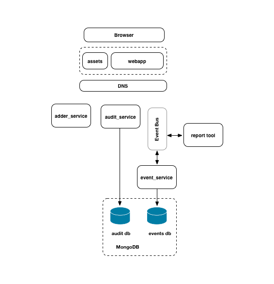

As can be seen, this corresponds very closely to the idealized system architecture that we reviewed at the start of this chapter. We should also note that the system adheres to some key microservice principals:

#### Single responsibility
Each service in our system is tasked with a single area. The `adderservice` adds numbers, the `eventservice` records and reports on events. Holding to the principle of single responbility as a system grows naturally facilitates decisions of where boundaries between services should be.

#### Loose coupling
Each of our point to point services (`adderservice` and `auditservice`) must be accessed using a clearly defined message structure. As capability is added to a service, additional messages may be added but the code in the service is never directly accessible by the consumer. For our bus based service (`eventservice`) the consumer is not even directly connected, it simply passes a message and forgets.

#### Vertical separation
Our services are maintain strong vertical bounds. This includes keeping state separate at the data layer. This is an important concept. Notice that whilst the same MongoDB container is being used the `auditservice` and the `eventservice` use completely separate collections. No two services should modify the same collection/table. If data from one area is needed by another service, lateral communication happens between services.

For instance the reporting tool (a symbolic service) does not connect to MongoDB to extract data. Rather it asks the `eventservice` to perform this task. As a system grows in functionality it's important that this vertical separation always be maintained. If the discipline of full stack vertical separation is not adhered to, the usual result is a distributed monolith. This typically leads to a terrible combination of the negative tradeoffs of both large monolithic applications and distributed systems.

#### Stateless
Notice that (other than DNS and client caching) all of our services are stateless. Whist this is a simple example system, we should always strive to make our services stateless. Practically this usually means loading user context on demand or passing user state information through from the client. Keeping our services stateless means that we can scale each service horizontally as demand requires.

#### A Note on Security
A full discussion of security as pertaining to microservices is outside the scope of this chapter. However it's important to note that all the usual rules pertaining to online application security apply. In our reference architecture we have applied what is sometimes referred to as the API gateway pattern. We avoid exposing microservices directly to public networks, and only expose the minimal API surface area required. We suggest at a minimum that the following practices be given consideration when implementing a microservice system:

* Use the API gateway pattern and minimize the exposed application surface area

* Never expose internal service details in client code. For instance frontend code that runs in web browsers or on mobile devices should not have any awareness services. Frontend code should communicate via an API only. This means that we should avoid using inherently insecure architectural patterns such as client side service discovery.

* Identify and classify services based on the sensitivity of the data that they handle. Consider the deployment and management policy for services based on this classification.

* Ensure that regular and robust security and penetration testing is carried out by an expert third party.

* Be familiar and ensure that our team is familiar with the OWASP top ten security risks [https://www.owasp.org/index.php/Category:OWASP_Top_Ten_Project](https://www.owasp.org/index.php/Category:OWASP_Top_Ten_Project)

> #### Security 
> For more details on security and Node see **Chapter 8 Dealing with Security**

### There's more

For the recipes in this chapter we have been using Docker containers. In the **Chapter 11 Deploying Systems** we'll investigate building our own containers. In the meantime, here are some useful container techniques that may help us as we experiment with Docker.

#### Entering a containers shell environment 

Sometimes it's necessary to open up a shell into a container for debugging purposes. This should really never be needed in production, but sometimes needs must. 

We already have a `mongo` container, so to begin with let's start it:

```sh
$ docker run --name=gazorpzorp -p 127.0.0.1:27017:27017 -d mongo
```

We gave the container a name (`gazorpzorp`), so now we can open
a shell within the container and log into like so:

```sh
$ docker exec -ti gazorpzorp /bin/bash
```

> #### Container IDs 
> Another way to reference a container (especially if we've neglected to 
> name it) is using the container identifer, which can be located in the 
> output of the `docker ps` command. 

This will drop us into a root prompt inside the container and we can now run commands to diagnose issues. 

For example:

```sh
root@88d2d16c08fe:/# ps aux
USER       PID %CPU %MEM    VSZ   RSS TTY      STAT START   TIME COMMAND
mongodb      1  0.9  2.8 268452 57632 ?        Ssl  12:41   0:00 mongod
root        28  0.0  0.1  20248  3196 ?        Ss   12:41   0:00 /bin/bash
root        32  0.0  0.1  17500  2064 ?        R+   12:42   0:00 ps aux
root@88d2d16c08fe:/# netstat -an
bash: netstat: command not found
```

We can see that the Mongo daemon is running, however netstat isn't (whereas it usually would be). Most containers are stripped down since they don't require the usual command line tools. 

We can alter containers on the fly:

```sh
root@88d2d16c08fe:/# apt-get update
root@88d2d16c08fe:/# apt-get install net-tools
root@88d2d16c08fe:/# netstat -an | grep -i listen
tcp        0      0 0.0.0.0:27017           0.0.0.0:*               LISTEN
unix  2      [ ACC ]     STREAM     LISTENING     22078    /tmp/mongodb-27017.sock
```

We can use the containers package manager to install software packages while the container is running to debug, understand and solve issues. 

Once we kill and start a fresh container from the mongo image our changes will disappear of course.

#### Saving container state

What if we want to persist our changes to a container? We can do that too. 

Assuming we've been following along in the previous section (*Entering a containers shell environment*) let's exit from the Mongo container and execute the following commands on the host system:

```sh
$ docker commit <container id> mymongo
$ docker images
```

We can now see a fresh container image `mymongo` in the docker image list. This technique has can be useful. For example creating a database container with pre-populated test data for sharing amongst a development team.

#### Cleaning up containers

Once a container has stopped running, it doesn't just disappear. 

We can stop all running containers with:

```sh
$ docker kill $(docke ps -a -q)
```

Next, to view all containers run:

```sh
$ docker ps -a
```

This will list all containers both running and stopped. We can restart a stopped container by running `docker start <container id>`, but normally we start containers using the `run` command which instantiates a container from an image. 

We can free up disk space and remove all of stopped containers by running:

```sh
$ docker rm $(docker ps -a -q)
```

If we now run a second `docker ps -a` command we can see that the stopped containers have indeed been removed.

### See also

* TBD
