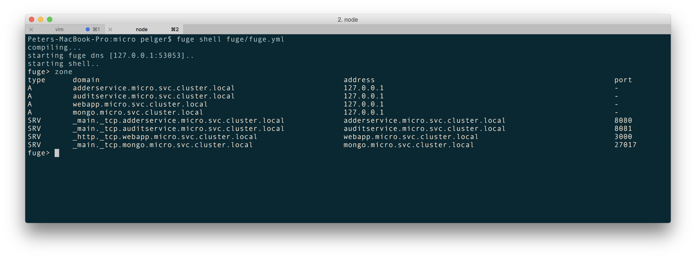

# 8 Understanding Microservices
This chapter covers the following topics

* Creating a simple RESTful microservice
* Consuming a Service
* Setting up a Development Environment
* Dealing with Configuration
* Using Containerized Infrastructure
* Service discovery with DNS
* Adding a queue based service

## Introduction

In recent years, microservices and distributed systems have become increasingly popular.  

Not only does breaking a system into small independent processes suit a single-threaded
event-loop platform such as Node, but there can be significant advantages in 
adopting a microservices architecture such as:

* Focus - Each service should do one thing only and do it well. This means that an individual microservice should contain a small amount of code that is easy for an individual developer to reason about.

* Decoupling - Services run in their own process space and are therefore decoupled from the rest of the system. This makes it easy to replace an individual microservice without greatly perturbing the rest of the system.

* Fine Grained Continuous Delivery / Deployment - Services are individually deployable, this leads to a model whereby deployment can be an ongoing process. thus removing the need for 'Big Bang' deployments.

* Individually scalable - systems may be scaled at the service level leading to more efficient use of compute resources.

* Language independent - microservice systems may be composed of services written in multiple languages, allowing developers to select the most appropriate tool for each specific job.

Of course it is not always appropriate to use microservices, certainly the 'golden hammer' anti-pattern should be avoided at all costs. However it is a powerful approach when applied correctly. 

In this chapter we will learn how to construct a simple RESTful microservice as well as how this service might be consumed. We will also look at how to set up a local development environment using the Fuge toolkit. Then we'll advance to building services that communicate over protocols other than simple HTTP. Finally we will create a simple service discovery mechanism to allow us to consume our services without hard coding system configuration into each service.

Before diving into let's take a brief moment to review our definition of a microservice and how this concept plays into a reference architectural frame. 

The following figure depicts a typical microservice system.


Our reference architecture contains the following elements that are typical to most microservice style systems:

* Clients - typically web based or mobile applications, make HTTP connections to an API layer.

* Static assets - such as images, style sheets and other elements that are used to render the user interface.

* API layer - This is usually a thin layer that provides the routing between client requests and microservices that ultimately respond to these requests.

* Service Discovery - A mechanism for discovering and routing to microservices. This can be as simple as a shared configuration file or a more dynamic mechanism such as DNS

* Direct response services - These types of services are typically reached via a point to point protocol such as HTTP or raw TCP and will usually perform a distinct action and return a result.

* Async services - These types of services are typically invoked via a bus based technology such as RabbitMQ or Apache Kafka. These may or may not return a response to the caller.

* Data sources and External APIs - Services will usually interact with one or more data sources or external systems in order to generate responses to requests

Based on this logical architecture we will use the following definition for a microservice:

*A microservice is a small, highly cohesive unit of code that has responsibility for a small functional area of a system. It should be independently deployable and should be of a size that it could be rewritten by a single developer in two weeks at maximum.*

To break this down further, a microservice has the following qualities:

* Limited, focused responsibility
* Highly cohesive, tightly scoped functionality
* Independently deployable
* Small enough to be rewritten by a single developer in under two weeks

In the following recipes we will look at how microservices operate in the context of an example system, how to set up an effective development environment for this style of coding and also look microservice messaging and communication protocols.

## Creating a simple RESTful microservice
In this recipe we will build a simple microservice using the `restify` module. Restify is an easy to use middleware-centric framework (similar in API to Express) that is designed to help us rapidly build services that can be consumed over HTTP. 

Once we have built our first service we will test our service using the `curl` command.

### Getting Ready
To get let's create a fresh empty directory we'll call it `micro`.

```sh
$ mkdir micro
$ cd micro
```

### How to do it

We're going to create a service that adds two numbers together. 

A service is simply a Node process, so let's go ahead and create an `adderservice` folder inside our `micro` directory, initialize our new folder as a package and create a `service.js` file:

```sh
$ mkdir adderservice
$ cd adderservice
$ npm init -y
$ touch service.js
```

This will create a fresh `package.json` for us. 

Next let's add in the `restify` module for our service with the followiung command:

```sh
npm install restify --save --no-optional
```

This will install the `restify` module and also add the dependency to `package.json`

> #### --no-optional.. 
> By default `restify` installs DTrace probes, this can be disabled during install with the --no-optional flag. Whilst DTrace is great not all systems support it which is why we have chosen to disable it in this example. You can find out more about dtrace here: http://dtrace.org/blogs/about/

Now it's time to actually write our service. Using our favorite editor 
let's add the following code to the `service.js` file:

```js
const restify = require('restify')

function respond (req, res, next) {
  const result = (parseInt(req.params.first, 10) + 
    parseInt(req.params.second, 10)).toString()
  res.send(result)
  next()
}

const server = restify.createServer()
server.get('/add/:first/:second', respond)

server.listen(8080, () => {
  console.log('%s listening at %s', server.name, server.url)
})
```

To see if everything is working we'll start the `service.js` file:

```sh
$ node service.js
```

Which should give the following output:

```sh
restify listening at http://[::]:8080
```

Let's test our service using `curl`. 

Open a fresh terminal and type the following:

```sh
$ curl http://localhost:8080/add/1/2
```

The service should respond with the answer 3. 

We have just built our first RESTful microservice.

> #### `curl` 
> `curl` is a command line HTTP client program that works much like a web browser. If you don't have `curl` available on our system you can test the service by putting the url into our web browser.

### How it works

When we executed the microservice, `restify` opened up tcp port 8080 and began listening for requests. The `curl` command opened a socket on localhost and connected to port 8080. The `curl` tool then sent an HTTP `GET` request for the url `/add/1/2`. 

Our code configured `restify` to serve `GET` requests matching a specific url pattern:

```js
server.get('/add/:first/:second', respond)
```

The `:first` and `:second` placeholders instruct `restify` to match path elements in these positions to parameters with are added to `req.params`. We can see this working in the respond function where we were able to access the parameters using the form `req.params.first`

Finally our service sent a response using the `res.send` function.

> #### Restify and Express 
> Restify and Express have very similar API's. We can learn more about 
> `req.params` and `res.send` in the *Creating an Express Web App* 
> recipe in **Chapter 7 Working with Web Frameworks** 

Whilst this is a trivial service it should serve to illustrate the fact that a microservice is really nothing more than a Node module that runs as an independent process. 

A microservice system is a collection of these co-operating processes. Of course it gets more complicated in a real system where you have lots of services and have to manage problems such as service discovery and deployment, however keep in mind that the core concept is really very simple.

### There's more

Let's look at alternative ways to create and test a RESTful microservice.

#### Using the Core HTTP Module

Whilst we have used `restify` to create this simple service, there are several alternative approaches that we could have used such as:

* The Node core `http` module
* The `Express` framework [http://expressjs.com/](http://expressjs.com/)
* The `HAPI` framework [https://hapijs.com/](https://hapijs.com/)

Let's create an alternative implementation using the Node core HTTP module. Let's copy the `micro` folder to `micro-core-http` and alter the `service.js` file in the `micro-core-http/adderservice` folder to the following:

```js
const http = require('http')

const server = http.createServer(respond)

server.listen(8080, function () {
  console.log('listening on port 8080')
})

function respond (req, res) {
  const [cmd, first, second] = req.url.split('/').slice(1)
  const notFound = cmd !== 'add' || 
    first === undefined || 
    second === undefined

  if (notFound) {
    error(404, res)
    return
  }

  const result = parseInt(first, 10) + parseInt(second, 10)
  res.end(result)
}

function error(code, res) {
  res.statusCode = code
  res.end(http.STATUS_CODES[code])
}
```

We can start our service, as in the main recipe, with:

```sh
$ node service.js
```

We can use `curl` as before to test our service:

```sh
$ curl http://localhost:8080/add/1/2
```

Whilst using the core `http` module can give us the same results, we
have to implement additional lower level logic. Neglecting edge cases or misunderstanding fundamentals can lead to brittle code. The framework support provided by the `restify` module also supplies us with conveniences such as parameter parsing, automated error handling, middleware support and so forth.

#### Testing Microservices with a Browser 

We don't necessarily need to use the `curl` command to test our microservices, We can test out HTTP GET requests just using a web browser. For example we could open the default browser on our system and type the url into the address bar. Our service will return a response and the browser should render it as text for us. Bear in mind that some browsers will treat the response as a file download depending on how they have been configured.

### See also

* TBD

## Consuming a Service

In this recipe we are going to create a web application layerthat will consume our microservice. This is the API and client tier in our reference architecture depicted in the figure in the introduction to the chapter. 

We will be using the Express web framework to do this and also the Express Generator to create an application skeleton.

> #### Express
> Fro an introduction to Express see the *Creating an Express Web App* 
> recipe in **Chapter 7 Working with Web Frameworks**

### Getting Ready

This recipe builds on the code from our last recipe *Creating a simple RESTful microservice*. We'll be using the `micro` folder from the previous recipe as a starting point. 

> #### Previous Code ... 
> Code from the previous recipe is available in the source files
> for this chapter.

Let's install the `express-generator`, which we'll be using
to rapidly generate Express scaffolding, and the `standard` 
linter (and formatter) which we'll use to reformat the generated
code the lint rules used in this book.

To do this run:

```sh
$ npm install -g express-generator standard
```

Now, let's build our web app.

### How to do it

First let's open a terminal and `cd` into the directory we created in the first recipe.

```sh
$ cd micro
```

Next we'll generate the application skeleton using the `express` command line tool, and then use `standard --fix` to confirm the code to our lint
rules:

```sh
$ express --view=ejs ./webapp
$ cd webapp
$ standard --fix
```

This will create a skeletal web application using `ejs` templates in a new directory called `webapp`.

> #### `ejs`.. 
> The `ejs` module provide EJS templating capabilities. To learn more EJS and template engines see the *Adding a View Layer* recipe in **Chapter 7 Working with Web Frameworks**


We'll also create a few files, and add an additional dependency:

```sh
$ touch routes/add.js views/add.ejs
$ npm install --save --no-optional restify 
```

We'll be using `express` for the web application, and `restify`
(in this case) to create a RESTful client.

To install the rest of our dependencies (as speicifed in the `package.json` that was generated by `express-generator`) we run:

```sh
$ npm install
```

Once this has completed we can run the application with the following:

```sh
$ npm start
```

If we now point a browser to `http://localhost:3000` we should see a page rendered by our application as in the figure below:


Now that we have our web application skeleton it's time to wire it up to our microservice. 

Let's begin by creating a route and a frontend to interact with our service. 

We'll start with routing. 

The `webapp/routes/add.js` should look like so:

```js
const { Router } = require('express')
const restify = require('restify')
const router = Router()

router.get('/', function (req, res) {
  res.render('add', { first: 0, second: 0, result: 0 })
})

router.post('/calculate', function (req, res, next) {
  const client = restify.createStringClient({
    url: 'http://localhost:8080'
  })
  const {first, second} = req.body
  client.get(
    `/add/${first}/${second}`,
    (err, svcReq, svcRes, result) => {
      if (err) { 
        next(err)
        return 
      }
      res.render('add', { first, second, result })
      next()
    }    
  ) 
})

module.exports = router

```

Next we need to create a template to provide users of the app with access to the service.

Let's make `webapp/views/add.ejs` look as follows:

```html
<!DOCTYPE html>
<html>
  <head>
    <title>Add</title>
    <link rel='stylesheet' href='/stylesheets/style.css' />
  </head>
  <body>
    <h1>Add it up!</h1>
    <form id='calc-form' action='/add/calculate' method='post'>
      <input type='text' id='first', name='first'
        value=<%= first %>></input>
      <input type='text' id='second', name='second'
        value=<%= second %>></input>
    </form>
    <button type="submit" form="calc-form"
      value="Submit">Submit</button>
    <h2>result = <%= result %></h2>
  </body>
</html>
```

We then need to update the file `webapp/app.js` to wire in the template and route. 

Near the top of `webapp/app.js`, underneath where the other routes are required we can insert the following line:

```js
var add = require('./routes/add')
```

Finally towards the bottom of the `webapp/app.js` file, we'll mount
our `add` route at the `/add` path with the following line:

```js
app.use('/add', add)
```

Now it's time to test our application and service together! 

We open up one terminal and start our adding service:

```sh
$ cd micro/adderservice
$ node service.js
```

Then we open a second terminal and start the webapp:

```sh
$ cd micro/webapp
$ npm start
```

Now that we have our webapp and service running, open a browser and point it to `http://localhost:3000/add`. 

This will render the template that we created above and should look as depicted below:


If we type a number into each of the input fields and hit the calculate button to verify that the service is called and returns the correct result. 

For instance typing "1" in the first input, and "2" in the other and
pressing the submit button should produce a response as shown in the following image: 


### How it works

The elements of our reference architecture that we have touched on so far are illustrated below:


We have implemented a frontend web layer with a single backend service. 

When our frontend page renders the user is presented with a standard web form. When they press submit a standard HTTP post request is made to our API tier, which is implemented using the Express framework.

We implemented a route in our API tier that uses `restify` to make a connection to our microservice. This route marshals parameters from the original form `POST` request and sends them onto our microservice via a HTTP `GET` request. Once the service has returned a result, our Express application renders it using our EJS template.

Of course, for a small system like this it is hardly worth going to the trouble. However this is just for illustrative purposes. As a system grows in functionality the benefits of this type of architectural approach become more apparent.

It's also important to note the reason for the API tier (the Express application): minimizing the public API surface area. 

We strongly recommended that microservices are *never* directly exposed to the client tier, even on protected networks. Instead prefer to use an API gateway pattern (like we've built in this recipe) to minimize the attack surface.

The following recipes will go on to build on more elements of our system however before we do so our next recipe will look at how we can configure an effective local development environment.

### There's more

Let's write an integration test for our system

#### Integration testing

So far we have omitted unit and integration testing from our code.
 
Whilst testing is not the focus of this chapter, robust testing is an absolute requirement for any system. 

Let's create a quick integration test for our `webapp` and `adderservice`. To do this we will use the `superagent` and `tap` modules. 

Let's get setup by creating a fresh directory for our tests:

```sh
$ cd micro
$ mkdir inttest
$ cd inttest
$ npm init -y
$ npm install superagent --save-dev
$ npm install tap --save-dev
$ npm install -g tap
```

Next let's create a test script in a file `addtest.js`:

```js
var request = require('superagent')
var test = require('tap').test

test('add test', function (t) {
  t.plan(2)

  request
    .post('http://localhost:3000/add/calculate')
    .send('first=1')
    .send('second=2')
    .end(function (err, res) {
      t.equal(err, null)
      t.ok(/result = 3/ig.test(res.text))
    })
})
```

> #### TAP 
> TAP stands for Test Anything Protocol and has implementations in many languages. Find out more about TAP here: `https://testanything.org/`

To run the integration test, the system needs be running.

Let's open three terminals (each with the working directory set to the `micro` folder).

In the first terminal we run:

```sh
$ cd micro/adderservice
$ node service.js
```

In the second terminal we run:

```sh
$ cd micro/webapp
$ npm start
```

In the third we're going to run our integration test.

Since we installed the `tap` command globally we can run this test using the `tap` executable which `npm` has installed on our system. We can actually run our tests directly with Node (`tap` doesn't need a test runner) but the `tap` executable provides a more visual UI. 

In our third terminal we can run our test like so:

```sh
$ cd inttest
$ tap addtest.js
addtest.js ............................................ 2/2
total ................................................. 2/2
  2 passing (328.645ms)
  ok
```

Our simple test exercises both our frontend `webapp` and also our `adderservice`. 

This of course is no sustitute for robust unit testing which should be implemented for all services and frontend pieces. On a side note, the `tap` module is excellent for unit testing as well.

### See also

* TBD

## Setting up a development environment
Microservice systems have many advantages to traditional monolithic systems, however this style of development does present it's own challenges. One of these has been termed Shell Hell. This occurs when we have many microservices to spin up and down on a local development machine in order to run integration and regression testing against the system, as illustrated in the image below:


### Getting Ready
In order to avoid the problems of shell hell we are going to install and configure `fuge` in this recipie. Fuge is a Node module designed specifically to help with local microservice development, to install it run the following command:

```sh
npm install -g fuge
```

This recipe builds on the code from our last recipe `Consuming a Service` and we will be using from this as our starting point. The code is available in the accompanying source under the directory `source/Consuming_Service`.

### How to do it
Fuge needs a simple configuration file in order to take control of our development system, let's write it now. Firstly we need to create a directory called `fuge` at the same level as our `webapp` and service directories.

```sh
$ cd micro
$ mkdir fuge
```

Next we need to create a file `fuge.yml` in this directory and add the following code:

```
fuge_global:
  tail: true
  monitor: true
  monitor_excludes:
    - '**/node_modules/**'
    - '**/.git/**'
    - '**/*.log'
adderservice:
  type: process
  path: ../adderservice
  run: 'node service.js'
  ports:
    - main=8080
webapp:
  type: process
  path: ../webapp
  run: 'npm start'
  ports:
    - http=3000
```

Fuge will provide us with an execution shell for our apps and services. To start this up run the following command:

```sh
$ fuge shell fuge.yml
```

Fuge will read this configuration file and provide us with a command prompt:

```sh
fuge>
```

Type help to see the list of available commands:


If we now give `fuge` the ps command it will show us the list of managed processes:


We can see from this that `fuge` understands that it is managing our webapp and our adderservice. Let's start these up using the `fuge` shell by issuing the `start all` command:


Once we issue the start all command Fuge will spin up an instance of all managed processes. Fuge will trace output from these process to the console and color the output on a per process basis. We can now point our browser to `http://localhost:3000/add` and the system should work as before. Let's now make a change to our service code, say by adding some additional logging. Let's add a `console.log` statement to our respond function, so that our service code looks as follows:

```js
var restify = require('restify')

function respond (req, res, next) {
  var result = parseInt(req.params.first, 10) +
               parseInt(req.params.second, 10)

  // add some logging...
  console.log('adding numbers!')
  res.send('' + result)
  next()
}

var server = restify.createServer()
server.get('/add/:first/:second', respond)

server.listen(8080, function () {
  console.log('%s listening at %s', server.name, server.url)
})
```

If we now go back to the Fuge shell we can see that Fuge detected this change and has restarted our service for us automatically. If we add some numbers through the `webapp` interface we can also see that our new `console.log` statement is displayed in the Fuge shell.


Finally let's shutdown our system by issuing the `stop all` command in the Fuge shell. Fuge will stop all managed processes. We can check that this has completed successfully by issuing a `ps` command.


We can now exit the Fuge shell by typing `exit`.

### How it works
Building a microservice system of any significant size comes with challenges, one of the key challenges is managing a number of discreet processes in development. Tools like Fuge can help us to manage this complexity and accelerate our development experience.

Under the hood Fuge reads its configuration file to determine what processes it needs to manage it then provides an execution environment for those processes. Fuge also watches our code for changes and will automatically restart a service as changes are made. This is very useful when developing systems with a significant number of microservices as Fuge takes care of a lot of the grunt process management work for us.

Fuge can also manage Docker containers locally for us and that will be a subject for one of our later recipes.

It should be noted that Fuge is a development tool, something that is used locally. Fuge should not be used for running microservices in a production environment.

### There's more
As we saw by running the `help` command Fuge has a number of other useful commands let's try a few of them out.

### Apply Command
The `apply` command allows us to execute any shell command in the directory of each named service. This sometimes come in very useful, but should be used carefully. Spin up the fuge shell as before and run:

```sh
fuge> apply ls -l
[adderservice]
total 16
drwxr-xr-x  52 pelger  staff  1768 24 Mar 13:33 node_modules
-rw-r--r--   1 pelger  staff   313 24 Mar 13:34 package.json
-rw-r--r--   1 pelger  staff   399 24 Mar 13:33 service.js
[webapp]
total 16
-rw-r--r--   1 pelger  staff  1313 24 Mar 13:33 app.js
drwxr-xr-x   3 pelger  staff   102 24 Mar 13:33 bin
drwxr-xr-x  98 pelger  staff  3332 24 Mar 13:33 node_modules
-rw-r--r--   1 pelger  staff   349 24 Mar 13:33 package.json
drwxr-xr-x   5 pelger  staff   170 24 Mar 13:33 public
drwxr-xr-x   5 pelger  staff   170 24 Mar 13:33 routes
drwxr-xr-x   5 pelger  staff   170 24 Mar 13:33 views
```

The utillity of this becomes apparent once we have a larger (greater than 5) number of services, particularly if they are using different git repositories. For example running `apply git status` will give us an immediate view of the current changes on our local system. Another useful example is `apply npm test` to run all of the unit tests in one go across our system.

### Debug Command
Fuge allows us to start a node.js process in debug mode. To enable this we need to tell fuge that a service is a node.js process. Open up the file `micro/fuge/fuge.yml` and change the `type` field to `node` as below:

```
adderservice:
  type: node
  path: ../adderservice
  run: 'node service.js'
  ports:
    - http=8080
```

Now start up the Fuge shell again and run the following:

```sh
fuge> debug adderservice
[adderservice - 7115]: Debugger listening on port 9229.
[adderservice - 7115]: Warning: This is an experimental feature and could change at any time.
[adderservice - 7115]: To start debugging, open the following URL in Chrome:
[adderservice - 7115]:     chrome-devtools://devtools/remote/serve_file/@60cd6e859b9f557d2312f5bf532f6aec5f284980/inspector.html?experiments=true&v8only=true&ws=127.0.0.1:9229/4dacb476-3942-4ed2-b281-7659feca6fe3
[adderservice - 7115]: restify listening at http://[::]:8080
```

Copy and paste the provided `url` into Chrome and the developer tools will open allowing us to navigate to the `adderservice` code and debug it.

### Shell Passthrough
Commands that Fuge does not recognise are passed through to the shell for execution, for example try the following:

```sh
fuge> start all
fuge> ps
fuge> ps aux | grep -i node
fuge> netstat -an | grep -i listen
```

This can be very useful during a development session and saves having to switch shells for simple one liners!

### See also
**TODO DMC**

## Dealing with Configuration
In this recipe we are going to improve our service and calling code by removing hard coded urls and port numbers. We will also switch to the `restify` JSON client as a more natural way to invoke and receive data from our services.

### Getting Ready
This recipe extends the code from our last recipe `Setting up a Development Environment` and we will be using the code from this as a starting point. The code is available in the accompanying source in the directory `source/Development_Environment`. Starting from this point, let's dive in and fix the code!

### How to do it
Firstly let's update our `adderservice`. This code is a little tangled at the moment in that the service logic is wrapped up with the `restify` framework code. In addition the port number that this service listens on is hardcoded. To fix this, firstly create a file `wiring.js` in the directory `micro/adderservice` and add the following code to it:

```js
var restify = require('restify')

module.exports = function (service) {
  var server = restify.createServer()

  server.get('/add/:first/:second', function (req, res, next) {
    service.add(req.params, function (err, result) {
      if (err) { return res.send(err) }
      res.send(200, {result: result})
      next()
    })
  })

  server.listen(process.env.ADDERSERVICE_SERVICE_PORT, '0.0.0.0',
  function () {
    console.log('%s listening at %s', server.name, server.url)
  })
}
```

Next change the code in the file `service.js` and remove the `restify` code from it as below:

```js
module.exports = function () {

  function add (args, cb) {
    var result = parseInt(args.first, 10) + parseInt(args.second, 10)
    cb(null, result)
  }

  return {
    add: add
  }
}
```

Finally for this service, we need to connect the service logic to the wiring that exposes it, to do this add a file `index.js` to the service and add the code below:

```js
var wiring = require('./wiring')
var service = require('./service')()
wiring(service)
```

That takes care of the service. Let's now turn our attention to the `webapp`. Modify the code in the file `micro/webapp/routes/add.js` so that it looks as below:

```js
var express = require('express')
var router = express.Router()
var restify = require('restify')

router.get('/', function (req, res, next) {
  res.render('add', { first: 0, second: 0, result: 0 })
})

router.post('/calculate', function (req, res, next) {
  var addClient = restify.createJsonClient({url: 'http://' +
    process.env.ADDERSERVICE_SERVICE_HOST + ':' +
    process.env.ADDERSERVICE_SERVICE_PORT})

  addClient.get('/add/' + req.body.first + '/' + req.body.second,
  function (err, serviceReq, serviceRes, resultObj) {
    if (err) { console.log(err) }
    res.render('add', {first: req.body.first, second: req.body.second,
                       result: resultObj.result})
  })
})

module.exports = router
```

Finally we need to update our Fuge configuration. Edit the file `micro/fuge/fuge.yml` and update the section for the `adderservice` so that it now starts by running `index.js` as below:

```
adderservice:
  type: process
  path: ../adderservice
  run: 'node index.js'
  ports:
    - main=8080
```

We should be good to go now, so let's start our updated system:

```sh
$ cd micro
$ fuge shell fuge/fuge.yml
fuge> start all
```

The system should start up as before. If we open up a browser and point it to `http://localhost:3000` we should be able to add numbers in exactly the same way as before.

### How it works
Whilst we have only made minor code changes to the system, organizationally these changes are important. Our first change was to remove any hard coded service configuration information from the code. In the file `micro/adderservice/wiring.js`, we changed the listen code to:

```js
  server.listen(process.env.ADDERSERVICE_SERVICE_PORT, '0.0.0.0',
  function () {
    console.log('%s listening at %s', server.name, server.url)
  })
```

This means that the port that the service is listening on is now supplied by the environment. Whilst it might be fine to hard code this information for a small system, it quickly becomes unmanageable in a larger system so this approach to service configuration is important. Of course when we start the `adderservice` the environment needs to be set up correctly otherwise our process will fail to start. The Fuge shell provides this environment variable for us. To see this start the Fuge shell as before and run the `info` command:

```sh
fuge> info adderservice full
ADDERSERVICE_SERVICE_HOST=127.0.0.1
ADDERSERVICE_SERVICE_PORT=8080
ADDERSERVICE_PORT=tcp://127.0.0.1:8080
ADDERSERVICE_PORT_8080_TCP=tcp://127.0.0.1:8080
ADDERSERVICE_PORT_8080_TCP_PROTO=tcp
ADDERSERVICE_PORT_8080_TCP_PORT=8080
ADDERSERVICE_PORT_8080_TCP_ADDR=127.0.0.1
```

We can see that the port setting is provided by Fuge to the `adderservice` process along with a number of other environment variables. It should be noted that Fuge uses a specific format for the environment variables that it injects into a process, following the same format as deployment tools like Kubernetes and Docker Swarm. We will explore this more in the chapter on deployment but for now it is important to realize that there is a specific non-random naming convention in play!

> #### Environment Configuration 
> Microservices should pick up any required configuration information from their environment. This should never be hardcoded.

Our second change was to separate the service logic from the framework logic in the `adderservice`. If we look again at the file `micro/adderservice/service.js` we can see that it has no external dependencies and is therefore independent of the calling context. By this we mean that it would be perfectly possible to replace our `wiring.js` file with a similar one that used `express` instead of `restify` and our service logic would remain unchanged. This is an important principle to observe when building microservice systems, namely that a service should run independently of the context that it is called in.

> #### Execution Independent 
> Microservice business logic should execute independent of the context in which it is called. Put another way a microservice should not know anything about the context that it is executing in.

The code changes in the recipe are broadly inline with the principles outlined in the `12 factor app`. If you are not familiar with these you can read about them in more detail here here: `https://12factor.net/`

### There's more
Throughout this chapter we are using `restify` as our tool to create `REST` based interfaces to our microservices. However it should be stressed that this is just one approach to creating point to point connections to services, there are of course several other approaches that one might use. It is of course perfectly possible to use other HTTP based frameworks to accomplish the same end, however there are other approaches which are certainly worth considering.

#### The Seneca Framework
The Seneca framework `http://senecajs.org` provides an interesting approach to microservice construction. Rather than using explicit point to point connections, Seneca provides is layered over two key ideas: Pattern matching and transport independence. This means that rather than explicitly wiring service together, using Seneca, we define a pattern routing network overlay and allow this network overlay determine how services are invoked.

We can think of this operating in much the same way that an IP network functions except that in place of IP addresses Seneca uses patterns to route messages to services. In a Seneca based microservice system every participating entity has a pattern routing table at its core.

> #### Pattern Routing 
> Seneca  uses pattern routing to build an overlay network for message passing that is independent of the underlying transport mechanisms.

Consider an example system with a consumer process and two services, a user service and a basket service which could occur as part of some larger e-commerce system. As illustrated below the consumer simple dispatches a message asking for a user or basket operation, in this case to create a user or to add something to the basket. The pattern router figures out how to route these messages to the appropriate service based on matching the request - in this case `{role: "user", cmd: "create"` to the appropriate service.


The receiving router within the user service then figures out the appropriate handler to call based again on the message pattern. Once the handler has executed a response message is passed through both routers to end up at the initiating call site within the consumer process. This  approach is sometimes known as an overlay network, because it creates a logical network structure over the lower level network fabric.

Frameworks such as Seneca can help in taking out a lot of the boilerplate work associated with microservice construction, however you should carefully consider the requirements of the system you are constructing and the costs / benefits of adoption of any framework before diving in!

#### Unit Testing
An additional benefit of this reorganization is that we have made our service code much simpler to test. Previously our service code was tightly coupled to the `restify` module which would have required us to call our service over a HTTP interface, even for a unit test. Happily we can now write a much simpler unit test.

Firstly lets install `tap`:

```sh
$ cd micro/adderservice
$ npm install tap --save-dev
```

Next create a `test` directory and a file `addtest.js` inside it. Add the following code:

```js
var test = require('tap').test
var service = require('../service')()

test('test add', function (t) {
  t.plan(2)

  service.add({first: 1, second: 2}, function (err, result) {
    t.equal(err, null)
    t.equal(result, 3)
  })
})
```

We can execute the test by running `tap addtest.js`. Of course this is a very simplistic test, however the point is that the unit test is not in anyway concerned with how the service is exposed. Becuse we extracted the wiring logic into `wiring.js` we can test out service logic independent of context.

### See also
**TOD DMC**

## Using Containerized Infrastructure
Container technology has recently gained rapid adoption within the industry and for good reason. Containers provide a powerful abstraction and isolation mechanism to that can lead to robust and repeatable production deployments.

The container model for software deployment has become synonymous with microservice and distributed systems in general, largely because the architectural model is a natural fit with the underlying container model. Whilst a full discussion of the merits of containers is outside the scope of this book some of the key benefits to bear in mind are:

* Isolation - containers provide a clean isolated environment for our services to run in. The container 'brings' the correct environment with it so we can be sure that if it runs on my machine it will run on yours!

* Immutability - Once a container is built it can be treated as an immutable unit of functionality and promoted through test and staging environments to production

* Homogeneity - By applying the same abstraction to all deployable elements of a system, deployment and operations changes significantly.

* Scale - Given that we construct our services correctly, containers can be rapidly scaled up or down for a single or multiple service elements

In this recipe and subsequent ones in this chapter we are going to be using prebuilt containers to gain a practical understanding of the benefits of containerization, particularly when applied to a microservice system. We will be building our own container in the deployment chapter later in the book.

### Getting Ready
For this recipe we will be using the Docker container engine. Firstly we will need to install this and validate that it is operating correctly. To do this head over to `http://www.docker.com` and install the appropriate binary for our system. Docker supports Linux, Windows and Mac natively.

We can check that Docker was installed successfully by opening a shell and running the following:

```sh
$ docker run hello-world
```

This command will pull the `hello-world` image from Docker Hub - a central repository of public Docker images, create a new container from that image and run it. The executable within the container will output `hello from docker` along with some help text.

> #### Docker Installation.. 
> Docker was originally built for Linux based operating systems. Until recently running docker on Mac or Windows required the use of a virtual machine using either > VirtualBox or VMWare, however Docker is now available natively on both Mac and Windows. This requires a recent version of OSX or Windows so be sure to check the
> prerequisites when installing Docker.

Now that we have Docker installed we can press ahead. In this recipe we will be adding a new microservice that stores data into a MongoDB container to our microservice system from the last recipe `Dealing with Configuration`. If you skipped this recipe, the code is available in the accompanying source in the directory `source/Dealing_With_Configuration`.

### How to do it
Firstly we need to pull the MongoDB container. We can do this using Docker to pull the official Docker MongoDB container, to do this run:

```sh
$ docker pull mongo
```

This will pull the official MongoDB image from the central Docker Hub repository. Once the download has completed we can verify that the image is available by running:

```sh
$ docker images
```

This command will list all of the images that are available on the local machine. We should see the MongoDB image in this list.

Now that we have a MongoDB container available we can update our Fuge configuration file for the system. Edit the file `fuge.yml` and add the following section:

```
mongo:
  image: mongo
  type: container
  ports:
    - main=27017:27017
```

If we now run start up a Fuge shell and run a ps command we can see that Fuge is aware of the MongoDB container:

```sh
$ cd micro
$ fuge shell fuge/fuge.yml
fuge> ps
```


The above listing shows `mongo` as type container, Fuge will treat this as a container and run it accordingly as distinct to a process.

Now that we have our mongo container ready to go it's time to add a service to use it. We are going to write a simple auditing service that records all of the calculations submitted to our adder service for later inspection. Firstly let's create a folder for our service:

```sh
$ cd micro
$ mkdir auditservice
```

Next let's add a package.json for our `auditservice`:

```sh
$ cd auditservice
$ npm init -y
```

This will create a fresh `package.json` for us. Next let's add in the `restify` and `mongodb` modules for our service, run:

```sh
$ npm install --save restify  --no-opitional
$ npm install mongodb --save
```

Next let's add in our wiring file and and service entry point. Firstly create a file `index.js` and add the following code:

```js
var wiring = require('./wiring')
var service = require('./service')()
wiring(service)
```

Secondly create a file `wiring.js` and add this code to it:

```js
var restify = require('restify')

module.exports = function (service) {
  var server = restify.createServer()

  server.use(restify.bodyParser())

  server.post('/append', function (req, res, next) {
    service.append(req.params, function (err, result) {
      if (err) { return res.send(err) }
      res.send('' + result)
      next()
    })
  })


  server.get('/list', function (req, res, next) {
    service.list(req.params, function (err, result) {
      if (err) { return res.send(err) }
      res.send(200, result)
      next()
    })
  })


  server.listen(process.env.AUDITSERVICE_SERVICE_PORT, '0.0.0.0',
  function () {
    console.log('%s listening at %s', server.name, server.url)
  })
}
```

As we can see the audit service will support two operations, one to append to our audit log and a second to list entries from the log. Now we have the boilerplate out of the way, it's time to actually write our service logic!

Create a file `service.js` and add the following code to it:

```js
var MongoClient = require('mongodb').MongoClient
var url = 'mongodb://' + process.env.MONGO_SERVICE_HOST + ':' +
          process.env.MONGO_SERVICE_PORT + '/audit'

module.exports = function () {

  function append (args, cb) {
    MongoClient.connect(url, function (err, db) {
      if (err) return cb(err)
      var audit = db.collection('audit')
      var data = { ts: Date.now(),
                   calc: args.calc,
                   result: args.calcResult }

      audit.insert(data, function (err, result) {
        if (err) return cb(err)
        cb(null, result)
        db.close()
      })
    })
  }

  function list (args, cb) {
    MongoClient.connect(url, function (err, db) {
      if (err) return cb(err)
      var audit = db.collection('audit')
      audit.find({}, {limit: 10}).toArray(function (err, docs) {
        if (err) return cb(err)
        cb(null, {list: docs})
        db.close()
      })
    })
  }

  return {
    append: append,
    list: list
  }
}
```

Now that we have our service, the final thing that we need to do is to add a frontend to display the content of our audit log. Firstly `cd` into the `webapp` directory and create two files: `views/audit.ejs` and `routes/audit.js`. Open audit.ejs in an editor and add the following code:

```html
<!DOCTYPE html>
<html>
  <head>
    <title>Audit</title>
    <link rel='stylesheet' href='/stylesheets/style.css' />
  </head>
  <body>
    <h1>Calculation History</h1>
    <ul>
      <% list.forEach(function (el) { %>
      <li>at: <%= new Date(el.ts).toLocaleString() %>,
        calculated: <%= el.calc %>, result: <%= el.result %></li>
      <% }) %>
    </ul>
  </body>
</html>
```

Next add the following code to `routes/audit.js`:

```js
var express = require('express')
var router = express.Router()
var restify = require('restify')

router.get('/', function (req, res, next) {
  var client = restify.createJsonClient({url: 'http://' +
               process.env.AUDITSERVICE_SERVICE_HOST + ':' +
               process.env.AUDITSERVICE_SERVICE_PORT})
  client.get('/list', function (err, serviceReq, serviceRes, obj) {
    if (err) { console.log(err) }
    res.render('audit', obj)
  })
})
```

Now that we have our view and a route to exercise it we need to add the route into the `webapp`. To do this open the file `app.js` and hook the audit route in a similar manner to the add route by adding the following two lines at the appropriate point:

```js
var audit = require('./routes/audit');
.
.
app.use('/audit', audit);
```

So we now have an audit route that will display our audit log, the last thing we need to do is to call the audit service to log entries each time a calculation occurs, to do this open the file `routes/add.js` and modify it by adding a call to the audit service as shown below:

```js
var express = require('express')
var router = express.Router()
var restify = require('restify')

router.get('/', function (req, res, next) {
  res.render('add', { first: 0, second: 0, result: 0 })
})

router.post('/calculate', function (req, res, next) {
  var addClient = restify.createJsonClient({url: 'http://' +
                  process.env.ADDERSERVICE_SERVICE_HOST + ':' +
                  process.env.ADDERSERVICE_SERVICE_PORT})
  var auditClient = restify.createJsonClient({url: 'http://' +
                    process.env.AUDITSERVICE_SERVICE_HOST + ':' +
                    process.env.AUDITSERVICE_SERVICE_PORT})

  addClient.get('/add/' + req.body.first + '/' + req.body.second,
  function (err, serviceReq, serviceRes, resultObj) {
    if (err) { console.log(err) }

    res.render('add', {first: req.body.first, second: req.body.second,
                       result: resultObj.result})

    var calcString = '' + req.body.first + ' + ' + req.body.second
    auditClient.post('/append', {calc: calcString,
                                 calcResult: resultObj.result},
    function (err, req, res, obj) {
      if (err) { console.log(err) }
    })
  })
})

module.exports = router
```

Excellent! thats all of our code changes, the final thing we need to do is to tell Fuge about our new service. To do this open the Fuge config file `fuge/fuge.yml` and add the following section:

```
auditservice:
  type: process
  path: ../auditservice
  run: 'node index.js'
  ports:
    - main=8081
```

We should be good to go! Let's fire up the Fuge shell and run a ps to confirm:

```
$ fuge shell fuge/fuge.yml
fuge> ps
```

> #### Container Terminology.. 
> It is important to clearly differentiate between a container and an image. An image is the
> serialized 'on disk' artifact that is stored on our disks locally and in Docker
> repositories. A container is the running instantiation of an image. We will be applying
> this terminology consistently.

You should now see `auditservice` listed as type process along with `adderservice`, `webapp` and `mongo`. Issue the `start all` command to Fuge to spin the system up. As before we can now see that Fuge has started our mongo container, both services and our frontend:


If we now point a browser to `http://localhost:3000/audit` a blank audit history is displayed. We can add some history by opening `http://localhost:3000/add` and submitting some calculations. Once this is done open `http://localhost:3000/audit` again and a list of the calculations will be displayed as shown below:


### How it works
In this recipe we introduced Docker containers and worked with the official MondoDB container. We could just as easily have used a MySql container or some other database. It should be clear that using the mongo container was very simple, there was no need for a compilation or installation of binaries on our local machine. The MongoDB container came preconfigured with everything it needed to run already encapsulated.

Whilst this approach to using infrastructure is convenient in development, containers are a game changer when it comes to production deployment. We will investigate this topic in more detail in the Deployment Chapter, for now just keep in mind that containers are a neat way of encapsulating a service and its environment solving the 'it runs on my machine' problem!

Our audit service was able to connect to the MongoDB container in just the same way as if there were a local installation of MongoDB so no changes to the code were required in order to use the Docker container.

We used Fuge to run both our container and also our system as processes. Whilst containers are incredibly useful for deployment during development of a microservice system it is much faster to work with processes which is the reason why Fuge was developed to support execution of both containers and processes.

We connected to the Mongo container using this url:

```js
'mongodb://' + process.env.MONGO_SERVICE_HOST + ':' +
               process.env.MONGO_SERVICE_PORT + '/audit'
```

Fuge generated these environment variables from the service definition for us which means that we do not have to have a separate configuration file for our service. We will see in the next recipe on service discovery and in the following chapter on deployment how this is important to ensure a smooth transition for our service from development to a production environment.

### There's more
We are using Fuge to run our microservices in development as a convenience. This may not always be the best approach because once we exit the fuge shell the data in the container will be lost.

#### Running Containers in the Background
If we would prefer to have some of our containers execute in the background whilst still using fuge we can do this by tweaking our fuge configuration. Open up `micro/fuge/fuge.yml` and update the `fuge_global` section by adding the `run_containers` setting as below:

```
fuge_global:
  run_containers: false
  tail: true
  monitor: true
  monitor_excludes:
    - '**/node_modules/**'
    - '**/.git/**'
    - '*.log'
```

Now start up the fuge shell and run a ps

```
$ cd micro
$ fuge shell fuge/fuge.yml
fuge> ps
name                          type           status         watch          tail
adderservice                  process        stopped        yes            yes
auditservice                  process        stopped        yes            yes
webapp                        process        stopped        yes            yes
mongo                         container      not managed
```

Fuge reports that the mongo container is `not managed`.  In another shell run the mongo container using Docker directly:

```sh
$ docker run -p 127.0.0.1:27017:27017 -d mongo
```

This will start the MongoDB container in the background and expose port `27017` from the container to the `localhost` interface. We can now connect to this using the `auditservice` or through the standard Mongodb client. We can check this by running:

```sh
$ docker ps
```

Next start the rest of our system in the Fuge shell:

```sh
fuge> start all
```

We can confirm that everything is running as before by accessing the `webapp` through a browser. We can now exit the Fuge shell and our mongo container will continue to run.

The key point to note here is that we can leave our infrastructure containers running in the background and tell Fuge about them. Fuge will then generate the appropriate environment variables (and other information) to allow us to access the container but will not attempt to start/stop the container.

### See also
**TODO DMC**

## Service Discovery with DNS
Once a microservice system begins to grow past a few services we typically run into the challenge of service discovery. By this we mean:

* How a consumer of a service determines the connection parameters to allow it to consume a downstream service, typically this means the IP address and port number to connect to.

* How a service registers itself with the system and advertises that it is available to be consumed.

* When multiple instances of a service start up how the system will handle load balancing and state between them

* How we discover services in development and in production without having to run production infrastructure locally

So far in this chapter we have been using environment variables to connect our services together, these variables have been generated for us by the Fuge tool. The astute reader may have wondered as to the format of the variables, for instance in the last recipe we used variables of the form:

```js
var addClient = restify.createJsonClient({url: 'http://' +
                process.env.ADDERSERVICE_SERVICE_HOST + ':' +
                process.env.ADDERSERVICE_SERVICE_PORT})
```

There is a reason for this format and that is that it is the same format that is used by both Kubernetes and Docker Swarm, two of the current leading container deployment technologies. Kubernetes is a container deployment and orchestration system that was developed at Google, Swarm is developed by Docker. Whilst there are alternative container deployment technologies, Kubernetes is currently gaining the most adoption across the industry.

It clearly makes sense that our development environment should behave as much like our production environment as possible so to this end we are using Fuge to make our development environment match our expected production environment as closely as possible through injecting the same environment.

Kubernetes supports two methods for service discovery firstly the use of environment variables and secondly the use of DNS records. Whist Kubernetes is a very capable deployment stack, it is not optimized for local development, however, thankfully the Fuge tool also supports DNS using the same format as Kubernetes. This means that we can use a lightweight tool like Fuge to run our microservice system in development and be confident that we can run the same code in production without change.

In this recipe we are going to convert our system to use DNS for service discovery.

### Getting Ready
This recipe builds on the code from the last recipe `Using Containerize Infrastructure`. If you skipped this recipe, the code is available in the accompanying source in the directory `source/Using_Containers`.

As we already have everything required for this recipe let's dive right in and covert our code. To do this we are going to use a module called `concordant`. This is a small module that performs DNS lookups for us in oderer to determine the host and port information for a service. We will need to change the code in our service consumer, which is in the `webapp` project, the service code itself will remain largely unchanged.

### How to do it
Firstly we need to install the `concordant` module in the `webapp` project:

```sh
$ cd micro/webapp
$ npm install --save concordant
```

Next let's make the code changes. In the `webapp` directory create a file `helper.js` that contains the following code:

```js
var restify = require('restify')
var conc = require('concordant')()

module.exports = function () {

  function createClient (name, cb) {
    conc.dns.resolve('_main._tcp.' + name + '.micro.svc.cluster.local',
    function (err, result) {
      if (err) { console.log(err) }
      cb(err, restify.createJsonClient({url: 'http://' +
              result[0].host + ':' + result[0].port}))
    })
  }

  return {
    createClient: createClient
  }
}
```

Next open the file `webapp/routes/add.js`. We need to edit the following lines:

```js
var addClient = restify.createJsonClient({url: 'http://' +
                process.env.ADDERSERVICE_SERVICE_HOST + ':' +
                process.env.ADDERSERVICE_SERVICE_PORT})
var auditClient = restify.createJsonClient({url: 'http://' +
                  process.env.AUDITSERVICE_SERVICE_HOST + ':' +
                  process.env.AUDITSERVICE_SERVICE_PORT})
```

We also need to require our `helper.js` module, edit the file so that it looks like the code below:

```js
var express = require('express')
var router = express.Router()
var helper = require('../helper')()


router.get('/', function (req, res, next) {
  res.render('add', { first: 0, second: 0, result: 0 })
})


router.post('/calculate', function (req, res, next) {
  helper.createClient('adderservice', function (err, addClient) {
    if (err) { console.log(err) }

    addClient.get('/add/' + req.body.first + '/' + req.body.second,
    function (err, serviceReq, serviceRes, resultObj) {
      if (err) { console.log(err) }

      res.render('add', {first: req.body.first,
                         second: req.body.second,
                         result: resultObj.result})
      var calcString = '' + req.body.first + ' + ' + req.body.second
      helper.createClient('auditservice',
      function (err, auditClient) {
        if (err) { console.log(err) }
        auditClient.post('/append', {calc: calcString,
                                     calcResult: resultObj.result},
        function (err, req, res, obj) {
          if (err) { console.log(err) }
        })
      })
    })
  })
})

module.exports = router
```

We also need to modify the file `routes/audit.js` in a similar manner:

```js
var express = require('express')
var router = express.Router()
var helper = require('../helper')()

router.get('/', function (req, res, next) {
  helper.createClient('auditservice', function (err, client) {
    if (err) { console.log(err) }

    client.get('/list', function (err, serviceReq, serviceRes, obj) {
      if (err) { console.log(err) }
      res.render('audit', obj)
    })
  })
})

module.exports = router
```

Finally let's modify our audit service so that it can discover the Mongodb database through dns. To do this firstly let's install the `concordant` module to the project:

```sh
$ cd micro/auditservice
$ npm install --save concordant
```

Then edit the file `micro/auditservice/service.js` to discover our MongoSB container using DNS:

```js
var MongoClient = require('mongodb').MongoClient
var conc = require('concordant')()

module.exports = function () {
  var url

  function init () {
    conc.dns.resolve('_main._tcp.mongo.micro.svc.cluster.local',
    function (err, result) {
      if (err) { console.log(err) }
      url = 'mongodb://' + result[0].host + ':' +
            result[0].port + '/audit'
    })
  }

  function append (args, cb) {
    MongoClient.connect(url, function (err, db) {
      if (err) return cb(err)

      var audit = db.collection('audit')
      var data = { ts: Date.now(),
        calc: args.calc,
        result: args.calcResult }

      audit.insert(data, function (err, result) {
        if (err) return cb(err)
        cb(null, result)
        db.close()
      })
    })
  }

  function list (args, cb) {
    MongoClient.connect(url, function (err, db) {
      if (err) return cb(err)

      var audit = db.collection('audit')
      audit.find({}, {limit: 10,
        sort: [['ts', 'desc']]}).toArray(function (err, docs) {
        if (err) return cb(err)
        cb(null, {list: docs})
        db.close()
      })
    })
  }

  init()
  return {
    append: append,
    list: list
  }
}
```

That takes care of the code changes, next we need to edit our Fuge configuration file to enable DNS discovery. To do this we need to edit the `fuge_global` section so that it looks like this:

```
fuge_global:
  dns_enabled: true
  dns_host: 127.0.0.1
  dns_port: 53053
  dns_suffix: svc.cluster.local
  dns_namespace: micro
  tail: true
  monitor: true
  monitor_excludes:
    - '**/node_modules/**'
    - '**/.git/**'
    - '**/*.log'
```

Those are all of the changes so we should now be good to go. Let's fire up the `fuge` shell:

```sh
$ fuge shell fuge/fuge.yml
fuge> start all
```

Once all of the process and containers have started up let's check that everything works as before by visiting `http://localhost:3000/add` and `http://localhost:3000/audit`. We should observe exactly the same behavior except that this time we are dynamically resolving our service endpoints rather than using environment variables.

### How it works
DNS is one of the oldest service discovery mechanisms available and has of course been around since before the Word Wide Web. DNS is primarily used for resolving host names - for example `www.google.com` into IP addresses but it can also be used to provide other information. For service discovery we are interested in two pieces of information, namely the IP address and also the port number that the service resides on. To find this information using DNS we need to query two types of records: `SRV` records and `A` records.

> #### DNS record types .. 
> A full list of DNS record types can be found on Wikipedia at this URL `https://en.wikipedia.org/wiki/List_of_DNS_record_types`

Under the hood the  `concordant` module firstly performs an `SRV` query, this returns the port number for the service and a `CNAME` record (canonical name record). It then perform a host lookup - `A` record - against the `CNAME` to obtain an IP address for the service. Once we have these two pieces of information we can proceed to connect to and consume the service. The `concordant` module takes care of all of this detail for us, however it is important to understand what is happening internally.

If we look at the code in the Audit service, we can see that the service is using the following code to resolve a hostname and port number for the `mongodb` database:

```js
  conc.dns.resolve('_main._tcp.mongo.micro.svc.cluster.local',
  function (err, result) {
    url = 'mongodb://' + result[0].host + ':' +
          result[0].port + '/audit'
  })
```

Concordant performs service discovery based on how it's environment is configured. If a DNS_HOST environment variable is present Concordant will query this server directly. In a production environment, if this variable is not present, Concordant will use the system configured DNS infrastructure as opposed to a direct lookup. This of course means that the application code does not need to take this into account, the environment differences between development and production are encapsulated within the `concordant` module for us.

The hostname that we are passing to the Concordant module looks a little long. This is the standard format for Kubernetes DNS based lookups and it follows a well defined schema:

```
_<port name>._<protocol>.<service name>.<namespace>.svc.cluster.local
```

> #### Kubernetes naming .. 
> Full documentation on Kubernetes DNS can be found at the official Kubernetes site at this URL `https://kubernetes.io/docs/admin/dns/`

In we look at the mongo configuration in our Fuge configuration file, we can see that we have named our mongo port `main` and the service is called `mongo`. The underlying protocol is of course `tcp`. So the mapping to this hostname is fairly straightforward.

Let's take a look at how the `webapp` code is consuming the `adder` and `audit` services, in the file `webapp/helper.js` we can see that the `createClient` function is using exactly the same naming scheme to dynamically resolve the service end points.

### There's more
In this recipe we have used DNS as our service discovery mechanism. We did this specifically to align our development environment with our expected production environment under Kubernetes. There are of course many ways to deploy a microservice system and also many other service discovery mechanisms that we could have used. We will cover these options in more detail in the chapter on deployment, however for now some of the options that you should consider researching are listed below. Firstly for service discovery:

* Consul.io by Hasicorp, provides a robust service discovery mechanism providing both HTTP and DNS based registration and lookup.
* etcd, distributed key value store. This is used internally by Kubernetes
* Zookeeper, distributed key value store from the Apache project
* SWIM, Scaleable Weakly consistent Infection style process group Membership protocol. Peer to peer based service discovery protocol

Let's explore how Fuge is emulating Kubernets in a little more detail:

#### Viewing the Environment and DNS Zone
Fuge exposes information on both environment variables and DNS for us through the `info` and `zone` commands to aid us in debugging our service discovery process. Let's try this out. Start the Fuge shell and then run the info command for a service:

```sh
$ fuge shell fuge/fuge.yml
fuge> info auditservice full
```

Fuge will display the environment that is passed into the `auditservice` which should look like the following:

```
command: node index.js
directory: ...
environment:
  DNS_HOST=127.0.0.1
  DNS_PORT=53053
  DNS_NAMESPACE=micro
  DNS_SUFFIX=svc.cluster.local
  AUDITSERVICE_SERVICE_HOST=127.0.0.1
  AUDITSERVICE_SERVICE_PORT=8081
  AUDITSERVICE_PORT=tcp://127.0.0.1:8081
  AUDITSERVICE_PORT_8081_TCP=tcp://127.0.0.1:8081
  AUDITSERVICE_PORT_8081_TCP_PROTO=tcp
  AUDITSERVICE_PORT_8081_TCP_PORT=8081
  AUDITSERVICE_PORT_8081_TCP_ADDR=127.0.0.1
  WEBAPP_SERVICE_HOST=127.0.0.1
  WEBAPP_SERVICE_PORT=3000
```

All of these environment variables will be available to the service process. Note that Fuge also supplies the DNS_HOST environment variable along with a port, namespace and suffix. The `concordant` module uses these environment variables to form service lookup queries.

Let's now run the `zone` command, this should provide us with out put similar to the following:



As we can see Fuge is supplying both SRV and A records for discovery which Concordant is able to lookup. It is important to note that in a Kubernetes production environment the same DNS entries will be available for service discovery.

### See also
**TODO DMC**

## Adding a Queue Based Service
In this recipe we will create a simple asynchronous event recording service. In this context asynchronous means that we will expose the service over a queue rather than a direct point to point connection. We will be using Redis as a our queue mechanism for this recipe as it is simple and lightweight to use.

### Getting Ready
To prepare for this recipe we need to ensure that we have Redis available. The simplest way to do this is to use the official Docker Redis image, so, to get ready for this section you will need to pull this image:

```sh
$ docker pull redis
```

This recipe builds on the code from the last recipe `Service Discovery with DNS`. The code for this recipe is available in the accompanying source in the directory under `source/Service_Discovery_DNS`.

### How to do it
Our service is going to record events of interest in the system such as page loads. In a full system we might record this type of information against specific user ID's in order to analyze system usage patterns, however for our system where we don't have a user context we will simply be recording the events. Let's start by creating a directory for our service and initializing it with a `package.json` file:

```sh
$ cd micro
$ mkdir eventservice
$ cd eventservice
$ npm init -y
$ npm install --save redis
$ npm install --save mongo
$ npm install --save concordant
```

Now, following the same pattern as before, let's create our `index.js` file and add the following code:

```js
var wiring = require('./wiring')
var service = require('./service')()
wiring(service)
```

Next let's add our wiring, create a file `wiring.js` and add the following:

```js
var conc = require('concordant')()
var Redis = require('redis')
var QNAME = 'eventservice'

module.exports = function (service) {
  var redis

  var receive = function (cb) {
    redis.brpop(QNAME, 5, function (err, data) {
      if (cb && err) { return cb(err) }

      if (data) {
        var message = JSON.parse(data[1])
        service[message.action](message, function (err, result) {
          if (err) { console.log(err) }
          if (message.returnPath) {
            redis.lpush(message.returnPath, JSON.stringify(result),
            function (err) {
              if (err) { console.log(err) }
              receive()
            })
          } else {
            receive()
          }
        })
      } else {
        receive()
      }
    })
  }

  function init () {
    conc.dns.resolve('_main._tcp.redis.micro.svc.cluster.local',
    function (err, result) {
      if (err) { return console.log(err) }
      redis = Redis.createClient(result[0].port, result[0].host)
      receive()
    })
  }

  init()
}
```

Now let's add our implementation, create a file `service.js` and add the code below:

```js
var MongoClient = require('mongodb').MongoClient
var conc = require('concordant')()

module.exports = function () {
  var url

  function init () {
    conc.dns.resolve('_main._tcp.mongo.micro.svc.cluster.local',
    function (err, result) {
      if (err) { console.log(err) }
      url = 'mongodb://' + result[0].host + ':' +
            result[0].port + '/events'
    })
  }

  function record (args, cb) {
    MongoClient.connect(url, function (err, db) {
      if (err) return cb(err)
      var events = db.collection('events')
      var data = { ts: Date.now(),
        eventType: args.type,
        url: args.url }

      events.insert(data, function (err, result) {
        if (err) return cb(err)
        cb(null, result)
        db.close()
      })
    })
  }

  function summary (args, cb) {
    var summary = {}

    MongoClient.connect(url, function (err, db) {
      if (err) { return cb(err) }

      var events = db.collection('events')
      events.find({}).toArray(function (err, docs) {
        if (err) return cb(err)

        docs.forEach(function (doc) {
          if (!(summary[doc.url])) {
            summary[doc.url] = 1
          } else {
            summary[doc.url]++
          }
        })
        cb(null, summary)
        db.close()
      })
    })
  }

  init()
  return {
    record: record,
    summary: summary
  }
}
```

Lastly we need to add our index file and install dependencies. Create a file `index.js` and add the following code:

```js
var wiring = require('./wiring')
var service = require('./service')()
wiring(service)
```

That takes care of our events service, which is exposed over a Redis queue. Next we have to hook this into our web application. We are going to do this by adding a small piece of middleware to our express server. Firstly create a file `webapp/eventLogger.js` and add this code to it:

```js
var conc = require('concordant')()
var Redis = require('redis')
var QNAME = 'eventservice'

module.exports = function () {
  var redis

  function logEvent (evt) {
    evt.action = 'record'
    redis.lpush(QNAME, JSON.stringify(evt), function (err) {
      if (err) { console.log(err) }
    })
  }

  function init () {
    conc.dns.resolve('_main._tcp.redis.micro.svc.cluster.local',
    function (err, result) {
      if (err) { return console.log(err) }
      redis = Redis.createClient(result[0].port, result[0].host)
    })
  }

  init()
  return {
    logEvent: logEvent
  }
}
```

Next we need to hook this into our application as a piece of middleware, open the file `webapp/app.js` and add the following code to it:

```js
var evt = require('./eventLogger')()

  app.use(function (req, res, next) {
    next()
    evt.logEvent({type: 'page', url: req.protocol + '://' +
                  req.get('host') + req.originalUrl})
  })
```

This will send an event message to the Redis queue for each page load event in the system.

Finally we need something to read our recorded events for us. We implemented a `summary` method in the `eventservice` so we need something to call this. We would not normally expose this type of information to our `webapp` so let's just write a small command line application to expose this summary information for us in lieu of a full analytics system!

To do this create a new directory called `report` and initialize it with a `package.json`:

```sh
$ cd micro
$ mkdir report
$ cd report
$ npm init -y
$ npm install --save redis
$ npm install --save cli-table
$ npm install --save concordant
```

Next create a file `index.js` and add the following code:

```js
var conc = require('concordant')()
var Redis = require('redis')
var CliTable = require('cli-table')
var QNAME = 'eventservice'
var RESPONSE_QUEUE = 'sumary'

conc.dns.resolve('_main._tcp.redis.micro.svc.cluster.local',
function (err, result) {
  if (err) { return console.log(err) }

  var redis = Redis.createClient(result[0].port, result[0].host)
  redis.lpush(QNAME, JSON.stringify({action: 'summary',
                                     returnPath: RESPONSE_QUEUE}),
  function (err) {
    if (err) { return console.log(err) }

    redis.brpop(RESPONSE_QUEUE, 5, function (err, data) {
      if (err) { return console.log(err) }

      var display = JSON.parse(data[1])
      var table = new CliTable({head: ['url', 'count'],
                                colWidths: [50, 10]})
      Object.keys(display).forEach(function (key) {
        table.push([key, display[key]])
      })
      console.log(table.toString())
      redis.quit()
    })
  })
})

```

We also need to create a small shell script to run this code as we will be running it outside of the context of the main system, so let's create a file report.sh and add this code to it:

```sh
#!/bin/bash
export DNS_HOST=127.0.0.1
export DNS_PORT=53053
export DNS_NAMESPACE=micro
export DNS_SUFFIX=svc.cluster.local
node index.js
```

Finally we need to add the Redis container and our new `eventservice` to our Fuge configuration. Edit the file `fuge/fuge.yml` and add the following two entries:

```
eventservice:
  type: process
  path: ../eventservice
  run: 'node index.js'

redis:
  image: redis
  type: container
  ports:
    - main=6379:6379
```

OK we should be good to go now! Let's start up the system in our Fuge shell:

```sh
$ fuge shell fuge/fuge.yml
fuge> start all
```

We can now see that along with the rest of our system the Redis container and `eventservice` have also started up. As before we can browse the application add some numbers and look at the audit log. However this time every page load is being recorded. Let's confirm this by running a report. Open up another shell - leaving Fuge running and execute the following:

```sh
$ cd micro/report
$ sh report.sh
```

Output similar to the following should be displayed:


### How it works
In this recipe we created a queue based microservice that used Redis as a lightweight queueing mechanism. We used a Redis container and discovered this container using DNS. It is interesting to note that in this case, neither the service or consumer end had direct knowledge of each other, rather each simply placed messages onto an intermediary queue.

Our event service again used `concordant` DNS to discover the Redis service as before, supplying the portName and service name for discovery. We are also supplying the name of the internal list structure that Redis should use for these messages, in this case the queue is called `eventservice`.

The `eventservice` simply records each event into a MongoDB database and provides a simple report function on this database when requested.

Now that we have constructed a system with several services, a frontend and an offline reporting tool let's take a look at the overall architecture:


As can be seen, this corresponds very closely to the idealized system architecture that we reviewed at the start of this chapter. We should also note that the system adheres to some key microservice principals:

#### Single Responsibility
Each service in our system is tasked with a single area. The `adderservice` adds numbers, the event service records and reports on events. It is important to keep this principal in mind as a system grows as it helps to naturally decide the boundaries between services.

#### Low Coupling
Each of our point to point services (`adderservice` and `auditservice`) must be accessed using a clearly defined message structure. As capability is added to a service, additional messages may be added but the code in the service is never directly accessible by the consumer. For our bus based service (`eventservice`) the consumer is not even directly connected, it simply passes a message and forgets.

#### Vertical separation
Our services are clearly separated right into the data layer. This is an important concept. Notice that whilst the same MongoDB container is being used the `auditservice` and the `eventservice` use completely separate databases. Also notice that the reporting service does not connect to MongoDB to extract data, rather it asks the `eventservice` to perform this task. As a system grows in functionality it is important that this vertical separation always be maintained, otherwise we end up with a distributed monolith which is not a good place to be!

#### Stateless
Notice that all of our services are stateless. Whist this is a simple example system, we should always strive to make our services stateless. Practically this usually means loading user context on demand or passing user state information through from the client. Keeping our services stateless means that we can scale each service horizontally as demand requires.

#### A Note on Security
A full discussion of security as pertaining to microservices is outside the scope of this chapter, however it is important to note that of course all of the usual rules pertaining to online application security apply. In our reference architecture we have applied what is sometimes referred to as the API gateway pattern. Simply put this means do not expose microservices directly to public networks, instead only expose the minimal API surface area required. We suggest at a minimum that the following practices be given consideration when implementing a microservice system:

* Always use the API gateway pattern and minimize the exposed application surface area

* Never expose internal service details in client code - i.e. frontend code that runs in web browsers or on mobile devices. Frontend code should communicate via an API only. This means that you should avoid using inherently insecure architectural patterns such as `client side service discovery`.

* Identify and classify services based on the sensitivity of the data that they handle. Consider the deployment and management policy for services based on this classification.

* Ensure that regular and robust security and penetration testing is carried out by an expert third party.

* Be familiar and ensure that your team is familiar with the OWASP top ten security risks [https://www.owasp.org/index.php/Category:OWASP_Top_Ten_Project](https://www.owasp.org/index.php/Category:OWASP_Top_Ten_Project)

### There's more
For the recipes in this chapter we have been using Docker containers, in the chapter on deployment we will investigate building our own containers. There are some useful container techniques that we should be aware of, lets explore a few here:

#### Getting a Shell
Sometimes it is necessary to open up a shell into a container to see what is happening internally for debugging purposes. This should really never be needed in production, but sometimes needs must. Let's do this on our mongo container. Firstly start the container:

```sh
$ docker run -p 127.0.0.1:27017:27017 -d mongo
```

Next connect to it using the container ID which we can obtain through running `docker ps`

```sh
$ docker exec -ti <container id> /bin/bash
```

This will drop us into a root prompt inside the container and we can now run commands to diagnose issues. For example:

```sh
root@88d2d16c08fe:/# ps aux
USER       PID %CPU %MEM    VSZ   RSS TTY      STAT START   TIME COMMAND
mongodb      1  0.9  2.8 268452 57632 ?        Ssl  12:41   0:00 mongod
root        28  0.0  0.1  20248  3196 ?        Ss   12:41   0:00 /bin/bash
root        32  0.0  0.1  17500  2064 ?        R+   12:42   0:00 ps aux
root@88d2d16c08fe:/# netstat -an
bash: netstat: command not found
```

We can see that the Mongo daemon is running, however netstat is missing. This is because most containers are stripped down as they don't require all of the normal command line tools. We can fix this on the fly:

```sh
root@88d2d16c08fe:/# apt-get update
root@88d2d16c08fe:/# apt-get install net-tools
root@88d2d16c08fe:/# netstat -an | grep -i listen
tcp        0      0 0.0.0.0:27017           0.0.0.0:*               LISTEN
unix  2      [ ACC ]     STREAM     LISTENING     22078    /tmp/mongodb-27017.sock
```

We can use the containers package manager to install software packages on the fly to solve issues in our running container. Once we kill and start a fresh container from the mongo image our changes will disappear of course.

#### Saving Container State
What if we want to persist our changes to a container? We can do that too. Exit from the Mongo container and run the following:

```sh
$ docker commit <container id> mymongo
$ docker images
```

We can now see a fresh container image `mymongo` in the docker image list. It can sometimes be useful to use this approach for example creating a databse conatiner with pre-populated test data for sharing amongst a development team.

#### Cleaning up Containers
Once a container has stopped running, it doesn't just disappear. Lets stop all of our running containers with:

```sh
$ docker kill $(docke ps -a -q)
```

Next, to view all containers run:

```sh
$ docker ps -a
```

This will list all containers both running and stopped. We can restart a stopped container by running `docker start <container id>`, but normally we start containers using the `run` command which instantiates a container from an image. We can remove all of these stopped containers by running:

```sh
$ docker rm $(docker ps -a -q)
```

If we now run a second `docker ps -a` command we can see that the stopped containers have indeed been removed

### See also
**TODO DMC**
