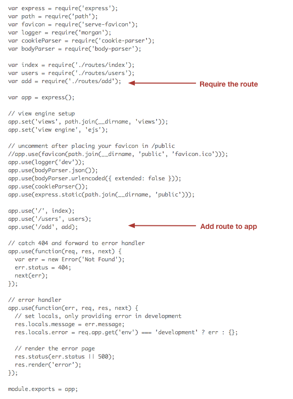
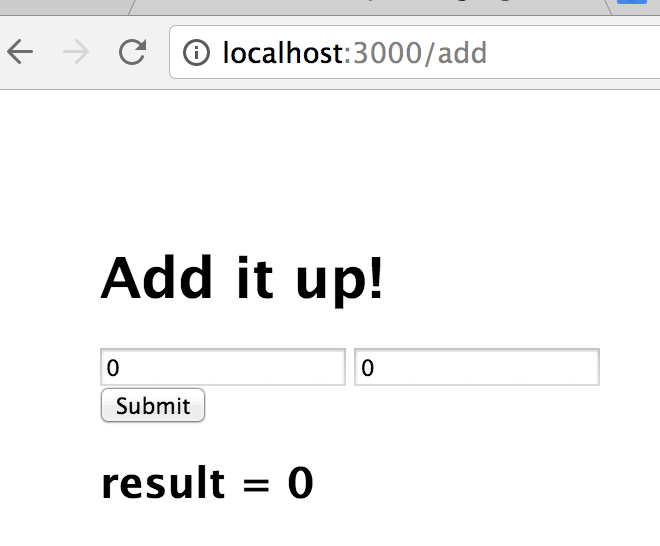
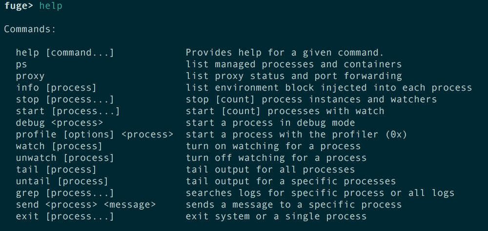
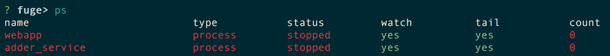
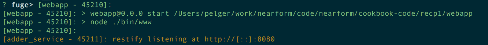
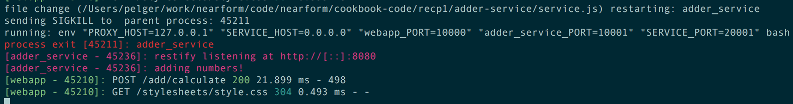
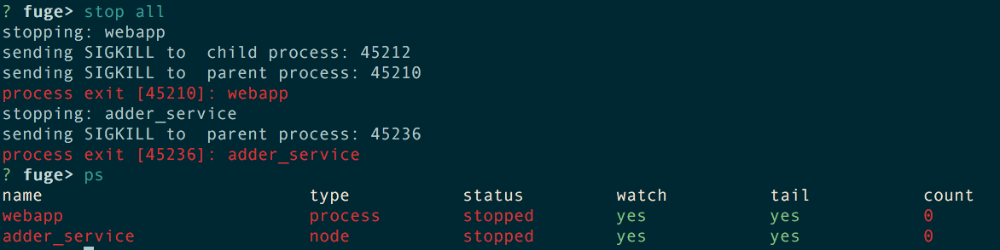
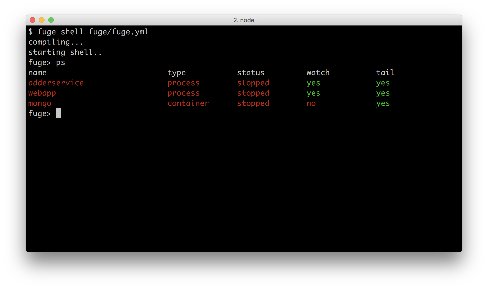
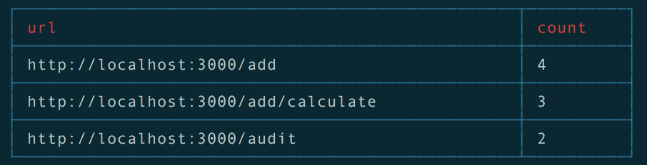

# 8 Understanding Microservices
This chapter covers the following topics

* Building a simple RESTful microservice
* Creating the context
* Setting up a development environment
* Improving the service code
* Using Containers
* Service discovery with DNS
* Adding a queue based service

## Introduction

Microservices are very much in vogue at the moment and for good reason. There are many benefits to adopting a microservices architecture such as:

* Focus - Each service should do one thing only and do it well. This means that an individual microservice should contain a small amount of code that is easy for an individual developer to reason about.

* Decoupled - Services run in their own process space and are therefore decoupled from the rest of the system. This makes it easy to replace an individual microservice without greatly perturbing the rest of the system.

* Continuous Delivery / Deployment - Services are individually deployable, this leads to a model whereby deployment can be an ongoing process. thus removing the need for 'Big Bang' deployments.

* Individually scaleable - systems may be scaled at the service level leading to more efficient use of compute resources.

* Language independent - microservice systems may be composed of services written in multiple languages, allowing developers to select the most appropriate tool for each specific job.

Of course it is not always appropriate to use microservices, certainly the 'golden hammer' anti-pattern should be avoided at all costs, however in our experience it is a powerful approach when applied correctly. In this chapter we will learn how to construct a simple RESTful microservice and also how this might be consumed. We will also look at how to set up a clean local development environment using the Fuge toolkit and then look at how to build services that communicate over protocols other than simple HTTP. Finally we will build in a simple service discovery mechanism to allow us to consume our services without hard coding.

Before diving into code, however, we should take a moment to review what we mean by a microservice and how this concept plays into a reference architectural frame. Figure 7.1 below depicts a typical microservice system.


**Figure 7.1 Microservice reference architecture**

Our reference architecture contains the following elements that are typical to most microservice style systems:

* Clients - typically web web based or mobile applications, make HTTP connections to an API layer.

* Static assets - such as images, style sheets and other elements that are used to render the user interface.

* API layer - This is usually a thin layer that provides the routing between client requests and microservices that ultimately respond to these requests.

* Service Discovery - Some mechanism for discovering and routing to microservices. This can be as simple as a shared configuration file or a more dynamic mechanism such as DNS

* Direct response services - These types of services are typically reached via a point to point protocol such as HTTP or raw TCP and will usually perform a distinct action and return a result.

* Async services - These types of services are typically invoked via some bus based technology such as RabbitMQ or Apache Kafka and may or may not return a response to the caller.

* Data sources and External APIs - Services will usually interact with some data source or external system in order to generate responses to requests

Based on this logical architecture we will use the following definition for a microservice:

*A microservice is a small, highly cohesive unit of code that has responsibility for a small functional area of a system. It should be independently deployable and should be of a size that it could be rewritten by a single developer in two weeks at maximum.*

## Creating a simple RESTful microservice

### Getting Ready
In this recipe we will build a simple microservice using the `restify` module. Restify is an easy to use web framework that helps us to rapidly build services that can be consumed over HTTP. We will test our service using the `curl` command. To get started open a command prompt and create a fresh empty directory, lets call it `micro` and also a subdirectory called `adderservice`

```sh
$ mkdir micro
$ cd micro
$ mkdir adderservice
$ cd adderservice
```

### How to do it
Our microservice will add two numbers together. The service is simply a Node module, so let's go ahead and create a fresh module in the `adderservice` directory, run:

```sh
$ npm init -y
```

This will create a fresh `package.json` for us. Next let's add in the `restify` module for our service run:

```sh
npm install restify --save --no-optional
```

This will install the `restify` module and also add the dependency to `package.json`

> #### --no-optional.. 
> By default `restify` installs DTrace probes, this can be disabled during install with the --no-optional flag. Whilst DTrace is great not all systems support it which is why we have chosen to disable it in this example. You can find out more about dtrace here: http://dtrace.org/blogs/about/

Now it's time to actually write our service. Using your favorite editor create a file `service.js` in the `adderservice` folder. Add the following code:

```javascript
var restify = require('restify')

function respond (req, res, next) {
  var result = parseInt(req.params.first, 10) + parseInt(req.params.second, 10)
  res.send('' + result)
  next()
}

var server = restify.createServer()
server.get('/add/:first/:second', respond)

server.listen(8080, function () {
  console.log('%s listening at %s', server.name, server.url)
})
```

Once you have added the code and saved the file we can run and test our service. In the command prompt `cd` to the service folder and run the service as follows:

```sh
$ cd micro/adderservice
$ node service.js
```

The service gives the following output:

```sh
restify listening at http://[::]:8080
```

Let's test our service using `curl`. Open a fresh command window and type the following:

```sh
curl http://localhost:8080/add/1/2
```

The service should respond with the answer 3. We have just built our first RESTful microservice.

> #### `curl` 
> `curl` is a command line HTTP client program that works much like a web browser. If you don't have `curl` available on your system you can test the service by putting the url into your web browser.

### How it works
When we executed the microservice, `restify` opened up tcp port 8080 and began listening for requests. The `curl` command opened a socket on local host and connected to port 8080. `curl` then sent a HTTP `GET` request for the url `/add/1/2`. In the code we had told `restify` to service `GET` requests matching a specific url pattern:

```javascript
server.get('/add/:first/:second', respond)
```

The :first, :second parts of this tell `restify` to match path elements in these positions to parameters. You can see this working in the respond function where we were able to access the parameters using the form `req.params.first`

Finally our service sent a response using the `res.send` function.

### There's more
Whilst this is a trivial service it should serve to illustrate the fact that a microservice is really nothing more than a Node module that runs as an independent process. A microservice system is a collection of these co-operating processes. Of course it gets more complicated in a real system where you have lots of services and have to manage problems such as service discovery and deployment, however keep in mind that the core concept is really very simple.

In the following recipes we will look at how microservices operate in the context of an example system, how to set up an effective development environment for this style of coding and also introduce other messaging and communication protocols

### See also
Whilst we have used `restify` to create this simple service, we could also have just used the node core HTTP module to create our service or one of the other popular web frameworks such as `Express` [http://expressjs.com/](http://expressjs.com/) or `HAPI` [https://hapijs.com/](https://hapijs.com/). We will be using the Express framework to build a front end to our services in the following recipes but bear in mind that it can also be used for service creation.

## Creating the context

### Getting Ready
In this recipe we are going to create a web application that will consume our microservice. This is the API and client tier in our reference architecture depicted in figure 7.1. We will be using the Express web framework to do this. We will be using the Express Generators to create an application skeleton for us so we first need to install the Generators. To do this run.

```sh
npm install -g express-generator
```

Lets build our web app.

### How to do it
First let's open a command prompt and `cd` into the directory we created in the first recipe.

```sh
$cd micro
```

Next generate the application skeleton using the `express` command line tool

```sh
$ express --view=ejs ./webapp
```

This will create a skeletal web application using Ejs templates in a new directory called `webapp`.

> #### ejs.. 
>
> Express supports multiple template engines including Jade, Ejs and Handlebars. If you would prefer to use a different engine simply supply a different option to the --view switch. More information is available by running ```express --help```

Next we need to install the dependencies for our application:

```sh
$ cd webapp
$ npm install
```

Once this has completed we can run the application:

```sh
$ npm start
```

If we now point a browser to `http://localhost:3000` we should see a page rendered by our application as in figure 7.2 below:


**Figure 7.2 express application**

Now that we have our web application skeleton its time to wire it up to our microservice. Let's begin by creating a route and a front end to interact with our service. Firstly the route, using your favorite editor create a file `add.js` in the directory `webapp/routes` and add the following code:

```javascript
var express = require('express')
var router = express.Router()
var restify = require('restify')


router.get('/', function (req, res, next) {
  res.render('add', { first: 0, second: 0, result: 0 })
})


router.post('/calculate', function (req, res, next) {
    var client = restify.createClient({url: 'http://localhost:8080'})
    client.get('/add/' + req.body.first + '/' + req.body.second, function (err, serviceReq) {
      if (err) { console.log(err) }

      serviceReq.on('result', function (err, serviceRes) {
        if (err) { console.log(err) }
        serviceRes.body = ''
        serviceRes.setEncoding('utf8')
        serviceRes.on('data', function (chunk) {
          serviceRes.body += chunk
        })
        serviceRes.on('end', function () {
          res.render('add', { first: req.body.first, second: req.body.second, result: serviceRes.body })
        })
      })
    })
  })

  module.exports = router
```

Next we need to create a template to provide users of the app with access to the service, so we need to create a file `add.ejs` in the directory `webapp/views` with the following code:

```html
<!DOCTYPE html>
<html>
  <head>
    <title>Add</title>
    <link rel='stylesheet' href='/stylesheets/style.css' />
  </head>
  <body>
    <h1>Add it up!</h1>
    <form id='calc-form' action='/add/calculate' method='post'>
      <input type='text' id='first', name='first' value=<%= first %>></input>
      <input type='text' id='second', name='second' value=<%= second %>></input>
    </form>
    <button type="submit" form="calc-form" value="Submit">Submit</button>
    <h2>result = <%= result %></h2>
  </body>
</html>
```

We then need to update the file `webapp/app.js` to wire in the template and route. We need to make the following changes:




**Figure 7.3 changes to app.js**

Finally we need to install the `restify` module into our webapp project. To do this run:

```sh
$ cd webapp
$ npm install --save restify --no-opional
```

Now that we have the code changes done, it's time to test our application and service together. to do this open a command prompt and start up the service:

```sh
$ cd micro/adderservice
$ node service.js
```

Now open a second command prompt and start up the webapp:

```sh
$ cd micro/webapp
$ npm start
```

> #### npm start 
> the Express Generator adds in a connivence script to `package.json`, in this case a start script. If we open up `package.json` we can see that this simply uses Node to execute the `./bin/www` script under the `webapp` project.

Now that we have our webapp and service running, open a browser and point it to `http://localhost:3000/add`. This will render the template that we created above and should look as depicted as in figure 7.4.




**Figure 7.4 addition front end**

Type a number into each of the input fields and hit the calculate button to verify that the service is called and returns the correct result:

### How it works
Figure 7.5 depicts the elements of our reference architecture that we have touched on so far.


**Figure 7.5 our system so far**

As can been seen we have implemented a front end and a single back end service. When our front end page renders the user is presented with a standard web form. When our use hits submit a standard HTTP post request is made to our API tier, which is implemented using the Express framework.

We implemented a route in our API tier that uses `restify` to make a connection to our microservice. This route marshals parameters from the original form `POST` request and sends them onto our microservice via a HTTP `GET` request. Once the service has returned a result, our Express application renders it using our Ejs template.

### There's more
Of course, for a small system like this it is hardly worth going to the trouble of building a microservice, however this is just for illustrative purposes. As a system grows in functionality the benefits of this type of architectural approach become more apparent.

It is also important to note the reason for the API tier (the Express application). Microservice systems tend to be architected in this manner in order to minimize the public API surface area. It is highly recommended that you never expose microservices directly to the client tier, even on protected networks, preferring instead to use this type of API gateway pattern to minimize the attack surface.

The following recipes will go on to build on more elements of our system however before we do so our next recipe will look at how we can configure an effective local development environment.

### See also
A full discussion of security as pertaining to microservices is outside the scope of this chapter, however it is important to note that of course all of the usual rules pertaining to online application security apply. In our reference architecture we have applied what is sometimes referred to as the API gateway pattern. Simply put this means do not expose microservices directly to public networks, instead only expose the minimal API surface area required. We suggest at a minimum that the following practices be given consideration when implementing a microservice system:

* Always use the API gateway pattern and minimize the exposed application surface area

* Never expose internal service details in client code - i.e. front end code that runs in web browsers or on mobile devices. Front end code should communicate via an API only. This means that you should avoid using inherently insecure architectural patterns such as `client side service discovery`.

* Identify and classify services based on the sensitivity of the data that they handle. Consider the deployment and management policy for services based on this classification.

* Ensure that regular and robust security testing is carried out.

* Be familiar with the OWASP top ten security risks [https://www.owasp.org/index.php/Category:OWASP_Top_Ten_Project](https://www.owasp.org/index.php/Category:OWASP_Top_Ten_Project)

## Setting up a development environment

### Getting Ready
Microservice systems have many advantages to traditional monolithic systems, however this style of development does present it's own challenges. One of these has been termed Shell Hell. This occurs when we have many microservices to spin up and down on a local development machine in order to run integration and regression testing against the system.


**Figure 7.6 Shell Hell**

As depicted in figure 7.6 above, things can get out of control quite quickly. In order to avoid the problems of shell hell we are going to install and configure `fuge` in this recipie. Fuge is a node module designed specifically to help with local microservice development, to install it run the following command:

```sh
npm install -g fuge
```

### How to do it
Fuge needs a simple configuration file in order to take control of our development system, lets write it now. Firstly we need to create a directory called `fuge` at the same level as our `webapp` and service directories.

```sh
$ cd micro
$ mkdir fuge
```

Next we need to create a file `fuge.yml` in this directory and add the following code:

```
fuge_global:
  tail: true
  monitor: true
  monitor_excludes:
    - '**/node_modules/**'
    - '**/.git/**'
    - '**/*.log'
adderservice:
  type: process
  path: ../adderservice
  run: 'node service.js'
  ports:
    - main=8080
webapp:
  type: process
  path: ../webapp
  run: 'npm start'
  ports:
    - http=3000
```

Fuge will provide us with an execution shell for our apps and services. To start this up run the following command:

```sh
$ fuge shell fuge.yml
```

Fuge will read this configuration file and provide us with a command prompt:

```sh
fuge >
```

Type help to see the list of available commands:



If we now give `fuge` the ps command it will show us the list of managed processes:



We can see from this that `fuge` understands that it is managing our webapp and our adderservice. Lets start these up using the `fuge` shell by issuing the `start all` command:



Once we issue the start all command Fuge will spin up an instance of all managed processes. Fuge will trace output from these process to the console and color the output on a per process basis. We can now point our browser to `http://localhost:3000/add` and the system should work as before. Let's now make a change to our service code, say by adding some additional logging. Let's add a `console.log` statement to our respond function, so that our service code looks as follows:

```javascript
var restify = require('restify')

function respond (req, res, next) {
  var result = parseInt(req.params.first, 10) + parseInt(req.params.second, 10)

  // add some logging...
  console.log('adding numbers!')
  res.send('' + result)
  next()
}

var server = restify.createServer()
server.get('/add/:first/:second', respond)

server.listen(8080, function () {
  console.log('%s listening at %s', server.name, server.url)
})
```

If we now go back to the Fuge shell we can see that Fuge detected this change and has restarted our service for us automatically. If we add some numbers through the `webapp` interface we can also see that our new `console.log` statement is displayed in the Fuge shell.




Finally lets shutdown our system by issuing the `stop all` command in the Fuge shell. fuge will stop all managed processes. We can check that this has completed successfully by issuing a `ps` command.




We can now exit the Fuge shell by typing `exit`.

### How it works
Building a microservice system of any significant size comes with challenges, one of the key challenges is managing a number of discreet processes in development. Tools like Fuge can help us to manage this complexity and accelerate our development experience.

Under the hood Fuge reads its configuration file to determine what processes it needs to manage it then provides an execution environment for those processes. Fuge also watches our code for changes and will automatically restart a service as changes are made. This is very useful when developing systems with a significant number of microservices as Fuge takes care of a lot of the grunt process management work for us.

Fuge can also manage Docker containers locally for us and that will be a subject for one of our later recipes.

### There's more
As we saw by running the `help` command Fuge has a number of other useful commands for example:

* pull - to pull fresh code for each managed project
* grep - to search logs of all running processes
* test - to run a nominated test script for each managed project
* stop/start - to stop/start processes individually
* watch/unwatch - to toggle process restart watching individually
* tail/untail - to toggle log tailing for all processes
* info - to display process environment information
* debug - attach a debugger to a specific process

It should be noted that Fuge is a development tool, something that is used locally. Fuge should not be used for running microservices in a production environment.

### See also
Fuge is just one tool for managing microservices in development. There are of course other approaches. For example:

* Docker Compose - provides a container based approach to configuring and running a microservice system. Compose is limited because a fresh container needs to be constructed for each code change which limits development speed

* Otto - from Hasicorp provides a similar abstraction to Fuge, however we feel that Otto tries to cover too much in that it also targets production deployment.

The other advantage of Fuge is of course that it is fully open sourced and implemented entirely in node.js.

> #### Full Discolsure.. 
> In the interests of full disclosure it should be noted that Fuge is implemented by the authors of this book!

## Improving the Code

### Getting Ready
In this recipe we are going to improve our service and calling code by removing hard coded urls and port numbers and also switch to the `restify` JSON client as a more natural way to invoke and recieve data from our services. We already have everything we need in our codebase so lets dive in and fix the code!

### How to do it
Firstly lets update our `adderservice`. This code is a little tangled at the moment in that the service logic is wrapped up with the `restify` framework code. In addition the port number that this service listens on is hardcoded. To fix this, firstly create a file `wiring.js` in the directory `micro/adderservice` and add the following code to it:

```javascript
var restify = require('restify')

module.exports = function (service) {
  var server = restify.createServer()

  server.get('/add/:first/:second', function (req, res, next) {
    service.add(req.params, function (err, result) {
      if (err) { return res.send(err) }
      res.send(200, {result: result})
      next()
    })
  })

  server.listen(process.env.ADDERSERVICE_SERVICE_PORT, '0.0.0.0', function () {
    console.log('%s listening at %s', server.name, server.url)
  })
}
```

Next change the code in the file `service.js` and remove the restify code from it as below:

```javascript
module.exports = function () {

  function add (args, cb) {
    var result = parseInt(args.first, 10) + parseInt(args.second, 10)
    cb(null, result)
  }

  return {
    add: add
  }
}
```

Finally for this service, we need to connect the service logic to the wiring that exposes it, to do this add a file `index.js` to the service and add the code below:

```javascript
var wiring = require('./wiring')
var service = require('./service')()
wiring(service)
```

That takes care of the service. Let's now turn our attention to the `webapp`. Modify the code in the file `micro/webapp/routes/add.js` so that it looks as below:

```javascript
var express = require('express')
var router = express.Router()
var restify = require('restify')

router.get('/', function (req, res, next) {
  res.render('add', { first: 0, second: 0, result: 0 })
})

router.post('/calculate', function (req, res, next) {
  var addClient = restify.createJsonClient({url: 'http://' + process.env.ADDERSERVICE_SERVICE_HOST + ':' + process.env.ADDERSERVICE_SERVICE_PORT})

  addClient.get('/add/' + req.body.first + '/' + req.body.second, function (err, serviceReq, serviceRes, resultObj) {
    if (err) { console.log(err) }
    res.render('add', {first: req.body.first, second: req.body.second, result: resultObj.result})
  })
})

module.exports = router
```

Finally we need to update our Fuge configuration. Edit the file `micro/fuge/fuge.yml` and update the section for the `adderservice` so that it now starts by running `index.js` as below:

```
adderservice:
  type: process
  path: ../adderservice
  run: 'node index.js'
  ports:
    - main=8080
```

We should be good to go now, so lets start our updated system:

```sh
$ cd micro
$ fuge shell fuge/fuge.yml
fuge> start all
```

The system should start up as before. If we open up a browser and point it to `http://localhost:3000` we should be able to add numbers in exactly the same way as before.

### How it works
Whilst we have only made minor code changes to the system, organizationally these changes are important. Our first change was to remove any hard coded service configuration information from the code. In the file `micro/adderservice/wiring.js`, we changed the listen code to:

```javascript
.
  server.listen(process.env.ADDERSERVICE_SERVICE_PORT, '0.0.0.0', function () {
    console.log('%s listening at %s', server.name, server.url)
  })
.
```

This means that the port that the service is listening on is now supplied by the environment. Whilst it might be fine to hard code this information for a small system, it quickly becomes unmanageable in a larger system so this approach to service configuration is important. Of course when we start the `adderservice` the environment needs to be set up correctly otherwise our process will fail to start. The Fuge shell provides this environment variable for us. To see this start the fuge shell as before and run the `info` command:

```sh
fuge> info adderservice full
.
.
ADDERSERVICE_SERVICE_HOST=127.0.0.1
ADDERSERVICE_SERVICE_PORT=8080
ADDERSERVICE_PORT=tcp://127.0.0.1:8080
ADDERSERVICE_PORT_8080_TCP=tcp://127.0.0.1:8080
ADDERSERVICE_PORT_8080_TCP_PROTO=tcp
ADDERSERVICE_PORT_8080_TCP_PORT=8080
ADDERSERVICE_PORT_8080_TCP_ADDR=127.0.0.1
.
```

We can see that the port setting is provided by Fuge to the `adderservice` process along with a number of other environment variables. It should be noted that Fuge uses a specific format for the environment variables that it injects into a process, following the same format as deployment tools like Kubernetes and Docker Swarm. We will explore this more in the chapter on deployment but for now it is important to realize that there is a specific non-random naming convention in play!

> #### Environment Configuration 
> Microservices should pick up any required configuration information from their environment. This should never be hardcoded.

Our second change was to separate the service logic from the framework logic in the `adderservice`. If we look again at the file `micro/adderservice/service.js` we can see that it has no external dependencies and is therefore independent of the calling context. By this we mean that it would be perfectly possible to replace our `wiring.js` file with a similar one that used `express` instead of `restify` and our service logic would remain unchanged. This is an important principle to observe when building microservice systems, namely that a service should run independently of the context that it is called in.

> #### Transport Independent 
> Microservice business logic should execute independent of the context in which it is called. Put another way a microservice should not know anything about the context that it is executing in.


### There's more
Throughout this chapter we are using `restify` as our tool to create `REST` based interfaces to our microservices. However it should be stressed that this is just one approach to creating point to point connections to services, there are of course several other approaches that one might use. It is of course perfectly possible to use other HTTP based frameworks to accomplish the same end, however there are other approaches which are certainly worth considering.

The Seneca framework `http://senecajs.org` provides an interesting approach to microservice construction. Rather than using explicit point to point connections, Seneca provides is layered over two key ideas: Pattern matching and transport independence. This means that rather than explicitly wiring service together, using Seneca, we define a pattern routing network overlay and allow this network overlay determine how services are invoked.

We can think of this operating in much the same way that an IP network functions except that in place of IP addresses Seneca uses patterns to route messages to services. In a Seneca based microservice system every participating entity has a pattern routing table at its core.

> #### Pattern Routing 
> Seneca  uses pattern routing to build an overlay network for message passing that is independent of the underlying transport mechanisms.

Consider an example system with a consumer process and two services, a user service and a basket service which could occur as part of some larger e-commerce system. As illustrated in Figure 7.7 below the consumer simple dispatches a message asking for a user or basket operation, in this case to create a user or to add something to the basket. The pattern router figures out how to route these messages to the appropriate service based on matching the request - in this case `{role: "user", cmd: "create"` to the appropriate service.


**Figure 7.7 Pattern Routing**

The receiving router within the user service then figures out the appropriate handler to call based again on the message pattern. Once the handler has executed a response message is passed through both routers to end up at the initiating call site within the consumer process. This  approach is sometimes known as an overlay network, because it creates a logical network structure over the lower level network fabric.

Frameworks such as Seneca can help in taking out a lot of the boilerplate work associated with microservice construction, however you should carefully consider the requirements of the system you are constructing and the costs / benefits of adoption of any framework before diving in!

### See also
The code changes in the recipe are broadly inline with the principles outlined in the `12 factor app`. If you are not familiar with these you can read about them in more detail here here: `https://12factor.net/`

## Using Containers
Container technology has recently gained rapid adoption within the industry and for good reason. Containers provide a powerful abstraction and isolation mechanism to that can lead to robust and repeatable production deployments.

Then container model for software deployment has become synonymous with microservice and distributed systems in general, largely because the architectural model is a natural fit with the underlying container model. Whilst a full discussion of the merits of containers is outside the scope of this book some of the key benefits to bear in mind are:

* Isolation - containers provide a clean isolated environment for our services to run in. The container 'brings' the correct environment with it so we can be sure that if it runs on my machine it will run on yours!

* Immutability - Once a container is built it can be treated as an immutable unit of functionality and promoted through test and staging environments to production

* Homogeneity - By applying the same abstraction to all deployable elements of a system, deployment and operations changes significantly.

* Scale - Given that we construct our services correctly, containers can be rapidly scaled up or down for a single or multiple service elements

By following this recipe and some of the subsequent ones in this chapter we should begin to gain a practical understanding of the benefits or containerization, particularly when applied to a microservice system.


### Getting Ready
For this recipe we will be using the Docker container engine. Firstly we will need to install this and validate that it is operating correctly. To do this head over to `http://www.docker.com` and install the appropriate binary for your system. Docker supports Linux, Windows and Mac natively.

We can check that Docker was installed successfully by opening a shell and running the following:

```sh
$ docker run hello-world
```

This command will pull the `hello-world` image from Docker Hub - a central repository of public Docker images, create a new container from that image and run it. The executable within the container will output `hello from docker` along with some help text.

> #### Docker Installation.. 
> Docker was originally built for Linux based operating systems. Until recently running docker on Mac or Windows required the use of a virtual machine using either > VirtualBox or VMWare, however Docker is now available natively on both Mac and Windows. This requires a recent version of OSX or Windows so be sure to check the
> prerequisites when installing Docker.

Now that we have Docker installed we can press ahead. In this recipe we will be adding a new microservice that stores data into a MongoDB container.

### How to do it

#### Mongo
Firstly lets get MongoDB setup. We can do this using Docker to pull the official Docker MongoDB container, to do this run:

```sh
$ docker pull mongo
```

This will pull the official MongoDB image from the central Docker Hub repository. Once the download has completed we can verify that the image is available by running:

```sh
$ docker images
```

This command will list all of the images that are available on the local machine. We should see the MongoDB image in this list.

Now that we have a MongoDB container available we can update our Fuge configuration file for the system. Edit the file `fuge.yml` and add the following section:

```
mongo:
  image: mongo
  type: container
  ports:
    - main=27017:27017
```

If we now run start up a Fuge shell and run a ps command we can see that Fuge is aware of the MongoDB container:

```sh
$ cd micro
$ fuge shell fuge/fuge.yml
fuge> ps
```



The above listing shows `mongo` as type container, Fuge will treat this as a container and run it accordingly as distinct to a process.

Now that we have our mongo container ready to go it's time to add a service to use it. We are going to write a simple auditing service that records all of the calculations submitted to our adder service for later inspection. Firstly lets create a folder for our service:

```sh
$ cd micro
$ mkdir auditservice
```

Next let's add a package.json for our `auditservice`:

```sh
$ cd auditservice
$ npm init -y
```

This will create a fresh `package.json` for us. Next let's add in the `restify` and `mongodb` modules for our service, run:

```sh
$ npm install --save restify  --no-opitional
$ npm install mongodb --save
```

Next let's add in our wiring file and and service entry point. Firstly create a file `index.js` and add the following code:

```javascript
var wiring = require('./wiring')
var service = require('./service')()
wiring(service)
```

Secondly create a file `wiring.js` and add this code to it:

```javascript
var restify = require('restify')

module.exports = function (service) {
  var server = restify.createServer()

  server.use(restify.bodyParser())

  server.post('/append', function (req, res, next) {
    service.append(req.params, function (err, result) {
      if (err) { return res.send(err) }
      res.send('' + result)
      next()
    })
  })


  server.get('/list', function (req, res, next) {
    service.list(req.params, function (err, result) {
      if (err) { return res.send(err) }
      res.send(200, result)
      next()
    })
  })


  server.listen(process.env.AUDITSERVICE_SERVICE_PORT, '0.0.0.0', function () {
    console.log('%s listening at %s', server.name, server.url)
  })
}
```

As we can see the audit service will support two operations, one to append to our audit log and a second to list entries from the log. Now we have the boilerplate out of the way, it's time to actually write our service logic!

Create a file `service.js` and add the following code to it:

```javascript
var MongoClient = require('mongodb').MongoClient
var url = 'mongodb://' + process.env.MONGO_SERVICE_HOST + ':' + process.env.MONGO_SERVICE_PORT + '/audit'

module.exports = function () {

  function append (args, cb) {
    MongoClient.connect(url, function (err, db) {
      if (err) return cb(err)
      var audit = db.collection('audit')
      var data = { ts: Date.now(),
                   calc: args.calc,
                   result: args.calcResult }

      audit.insert(data, function (err, result) {
        if (err) return cb(err)
        cb(null, result)
        db.close()
      })
    })
  }

  function list (args, cb) {
    MongoClient.connect(url, function (err, db) {
      if (err) return cb(err)
      var audit = db.collection('audit')
      audit.find({}, {limit: 10}).toArray(function (err, docs) {
        if (err) return cb(err)
        cb(null, {list: docs})
        db.close()
      })
    })
  }

  return {
    append: append,
    list: list
  }
}
```

Now that we have our service, the final thing that we need to do is to add a front end to display the content of our audit log. Firstly `cd` into the `webapp` directory and create two files: `views/audit.ejs` and `routes/audit.js`. Open audit.ejs in an editor and add the following code:

```html
<!DOCTYPE html>
<html>
  <head>
    <title>Audit</title>
    <link rel='stylesheet' href='/stylesheets/style.css' />
  </head>
  <body>
    <h1>Calculation History</h1>
    <ul>
      <% list.forEach(function (el) { %>
      <li>at: <%= new Date(el.ts).toLocaleString() %>, calculated: <%= el.calc %>, result: <%= el.result %></li>
      <% }) %>
    </ul>
  </body>
</html>
```

Next add the following code to `routes/audit.js`:

```javascript
var express = require('express')
var router = express.Router()
var restify = require('restify')

router.get('/', function (req, res, next) {
  var client = restify.createJsonClient({url: 'http://' + process.env.AUDITSERVICE_SERVICE_HOST + ':' + process.env.AUDITSERVICE_SERVICE_PORT})
  client.get('/list', function (err, serviceReq, serviceRes, obj) {
    if (err) { console.log(err) }
    res.render('audit', obj)
  })
})
```

Now that we have our view and a route to exercise it we need to add the route into the `webapp`. To do this open the file `app.js` and hook the audit route in a similar manner to the add route by adding the following two lines at the appropriate point:

```javascript
.
.
var audit = require('./routes/audit');
.
.
app.use('/audit', audit);
.
.
```

So we now have an audit route that will display our audit log, the last thing we need to do is to call the audit service to log entries each time a calculation occurs, to do this open the file `routes/add.js` and modify it by adding a call to the audit service as shown below:

```javascript
var express = require('express')
var router = express.Router()
var restify = require('restify')

router.get('/', function (req, res, next) {
  res.render('add', { first: 0, second: 0, result: 0 })
})

router.post('/calculate', function (req, res, next) {
  var addClient = restify.createJsonClient({url: 'http://' + process.env.ADDERSERVICE_SERVICE_HOST + ':' + process.env.ADDERSERVICE_SERVICE_PORT})
  var auditClient = restify.createJsonClient({url: 'http://' + process.env.AUDITSERVICE_SERVICE_HOST + ':' + process.env.AUDITSERVICE_SERVICE_PORT})

  addClient.get('/add/' + req.body.first + '/' + req.body.second, function (err, serviceReq, serviceRes, resultObj) {
    if (err) { console.log(err) }

    res.render('add', {first: req.body.first, second: req.body.second, result: resultObj.result})

    var calcString = '' + req.body.first + ' + ' + req.body.second
    auditClient.post('/append', {calc: calcString, calcResult: resultObj.result}, function (err, req, res, obj) {
      if (err) { console.log(err) }
    })
  })
})

module.exports = router
```

Excellent! thats all of our code changes, the final thing we need to do is to tell Fuge about our new service. To do this open the Fuge config file `fuge/fuge.yml` and add the following section:

```
auditservice:
  type: process
  path: ../auditservice
  run: 'node index.js'
  ports:
    - main=8081
```

We should be good to go! Let's fire up the Fuge shell and run a ps to confirm:

```
$ fuge shell fuge/fuge.yml
$ ps
```

> #### Container Terminology.. 
> It is important to clearly differentiate between a container and an image. An image is the
> serialized 'on disk' artifact that is stored on our disks locally and in Docker
> repositories. A container is the running instantiation of an image. We will be applying
> this terminology consistently.

You should now see `auditservice` listed as type process along with `adderservice`, `webapp` and `mongo`. Issue the `start all` command to Fuge to spin the system up. As before we can now see that Fuge has started our mongo container, both services and our front end:


If we now point a browser to `http://localhost:3000/audit` a blank audit history is displayed. We can add some history by opening `http://localhost:3000/add` and submitting some calculations. Once this is done open `http://localhost:3000/audit` again and a list of the calculations will be displayed as shown below:


### How it works
In this recipe we introduced Docker containers and worked with the official MondoDB container. We could just as easily have used a MySql container or some other database. It should be clear that using the mongo container was very simple, there was no need for a compilation or installation of binaries on our local machine. The MongoDB container came preconfigured with everything it needed to run already encapsulated.

Whilst this approach to using infrastructure is convenient in development, containers are a game changer when it comes to production deployment. We will investigate this topic in more detail in the Deployment Chapter, for now just keep in mind that containers are a neat way of encapsulating a service and its environment solving the 'it runs on my machine' problem!

Our audit service was able to connect to the MongoDB container in just the same way as if there were a local installation of MongoDB so no changes to the code were required in order to use the Docker container.

We used Fuge to run both our container and also our system as processes. Whilst containers are incredibly useful for deployment during development of a microservice system it is much faster to work with processes which is the reason why Fuge was developed to support execution of both containers and processes.

We connected to the Mongo container using this url:

```javascript
'mongodb://' + process.env.MONGO_SERVICE_HOST + ':' + process.env.MONGO_SERVICE_PORT + '/audit'
```

Fuge generated these environment variables from the service definition for us which means that we do not have to have a separate configuration file for our service. We will see in the next recipe on service discovery and in the following chapter on deployment how this is important to ensure a smooth transition for our service from development to a production environment.

### There's more
We are using Fuge to run our microservices in development as a convenience. However another approach would be to run the container manually with Docker and remove it from the Fuge config file. To run the MongoDB container with Docker execute the following command:

```sh
$ docker run -p 127.0.0.1:27017:27017 -d mongo
```

This will start the MongoDB container in the background and expose port `27017` from the container to the `localhost` interface. We can now connect to this using the audit service or through the standard Mongodb client. Fuge supplies all of this configuration for us by interpreting the configuration file but it is good to understand the underlying command structure.

### See also
In this chapter we have been using Fuge as our development system runner, another approach is to use Docker Compose. Compose allows us to use a configuration file similar to the Fuge configuration to specify how our services should be run. However Compose only works with containers this means that for every code change a fresh container must be built and executed or we must use Container Volumes which allow us to mount a portion our local storage inside the container.

> #### Docker Compose .. 
> You can find out more about Docker Compose from the offical Docker documentation site here: `https://docs.docker.com/compose/`

## Service Discovery with DNS
Once a microservice system begins to grow past a few services we typically run into the challenge of service discovery. By this we mean:

* How a consumer of a service determines the connection parameters to allow it to consume a downstream service, typically this means the IP address and port number to connect to.

* How a service registers itself with the system and advertises that it is available to be consumed.

* When multiple instances of a service start up how the system will handle load balancing and state between them

* How we discover services in development and in production without having to run production infrastructure locally

So far in this chapter we have been using environment variables to connect our services together, these variables have been generated for us by the Fuge tool. The astute reader may have wondered as to the format of the variables, for instance in the last recipe we used variables of the form:

```javascript
var addClient = restify.createJsonClient({url: 'http://' + process.env.ADDERSERVICE_SERVICE_HOST + ':' + process.env.ADDERSERVICE_SERVICE_PORT})
```

There is a reason for this format and that is that it is the same format that is used by both Kubernetes and Docker Swarm, two of the current leading container deployment technologies. Kubernetes is a container deployment and orchestration system that was developed at Google, Swarm is developed by Docker. Whilst there are alternative container deployment technologies, Kubernetes is currently gaining the most adoption across the industry.

It clearly makes sense that our development environment should behave as much like our production environment as possible so to this end we are using Fuge to make our development environment match our expected production environment as closely as possible through injecting the same environment.

Kubernetes supports two methods for service discovery firstly the use of environment variables and secondly the use of DNS records. Whist Kubernetes is a very capable deployment stack, it is not optimized for local development, however, thankfully the Fuge tool also supports DNS using the same format as Kubernetes. This means that we can use a lightweight tool like Fuge to run our microservice system in development and be confident that we can run the same code in production without change.

In this recipe we are going to convert our system to use DNS for service discovery.

### Getting Ready
As we already have everything required for this recipe lets dive right in and covert our code. To do this we are going to use a module called Concordant. This is a small module that performs DNS lookups for us in oderer to determine the host and port information for a service. We will need to change the code in our service consumer, which is in the `webapp` project, the service code itself will remain largely unchanged.

### How to do it
Firstly we need to install the Concordant module in the `webapp` project:

```sh
$ cd micro/webapp
$ npm install --save concordant
```

Next let's make the code changes. In the `webapp` directory create a file `helper.js` that contains the following code:

```javascript
var restify = require('restify')
var conc = require('concordant')()

module.exports = function () {

  function createClient (name, cb) {
    conc.dns.resolve('_main._tcp.' + name + '.micro.svc.cluster.local', function (err, result) {
      if (err) { console.log(err) }
      cb(err, restify.createJsonClient({url: 'http://' + result[0].host + ':' + result[0].port}))
    })
  }

  return {
    createClient: createClient
  }
}
```

Next open the file `webapp/routes/add.js`. We need to edit the following lines:

```javascript
var addClient = restify.createJsonClient({url: 'http://' + process.env.ADDERSERVICE_SERVICE_HOST + ':' + process.env.ADDERSERVICE_SERVICE_PORT})
var auditClient = restify.createJsonClient({url: 'http://' + process.env.AUDITSERVICE_SERVICE_HOST + ':' + process.env.AUDITSERVICE_SERVICE_PORT})
```

We also need to require our `helper.js` module, edit the file so that it looks like the code below:

```javascript
var express = require('express')
var router = express.Router()
var helper = require('../helper')()


router.get('/', function (req, res, next) {
  res.render('add', { first: 0, second: 0, result: 0 })
})


router.post('/calculate', function (req, res, next) {
  helper.createClient('adderservice', function (err, addClient) {
    if (err) { console.log(err) }

    addClient.get('/add/' + req.body.first + '/' + req.body.second, function (err, serviceReq, serviceRes, resultObj) {
      if (err) { console.log(err) }

      res.render('add', {first: req.body.first, second: req.body.second, result: resultObj.result})
      var calcString = '' + req.body.first + ' + ' + req.body.second
      helper.createClient('auditservice', function (err, auditClient) {
        if (err) { console.log(err) }
        auditClient.post('/append', {calc: calcString, calcResult: resultObj.result}, function (err, req, res, obj) {
          if (err) { console.log(err) }
        })
      })
    })
  })
})

module.exports = router
```

We also need to modify the file `routes/audit.js` in a similar manner:

```javascript
var express = require('express')
var router = express.Router()
var helper = require('../helper')()

router.get('/', function (req, res, next) {
  helper.createClient('auditservice', function (err, client) {
    if (err) { console.log(err) }

    client.get('/list', function (err, serviceReq, serviceRes, obj) {
      if (err) { console.log(err) }
      res.render('audit', obj)
    })
  })
})

module.exports = router
```

Finally lets modify our audit service so that it can discover the Mongodb database through dns. To do this firstly lets install the Concordant module to the project:

```sh
$ cd micro/auditservice
$ npm install --save concordant
```

Then edit the file `micro/auditservice/service.js` to discover our MongoSB container using DNS:

```javascript
var MongoClient = require('mongodb').MongoClient
var conc = require('concordant')()

module.exports = function () {
  var url

  function init () {
    conc.dns.resolve('_main._tcp.mongo.micro.svc.cluster.local', function (err, result) {
      if (err) { console.log(err) }
      url = 'mongodb://' + result[0].host + ':' + result[0].port + '/audit'
    })
  }

  function append (args, cb) {
    MongoClient.connect(url, function (err, db) {
      if (err) return cb(err)

      var audit = db.collection('audit')
      var data = { ts: Date.now(),
        calc: args.calc,
        result: args.calcResult }

      audit.insert(data, function (err, result) {
        if (err) return cb(err)
        cb(null, result)
        db.close()
      })
    })
  }

  function list (args, cb) {
    MongoClient.connect(url, function (err, db) {
      if (err) return cb(err)

      var audit = db.collection('audit')
      audit.find({}, {limit: 10, sort: [['ts', 'desc']]}).toArray(function (err, docs) {
        if (err) return cb(err)
        cb(null, {list: docs})
        db.close()
      })
    })
  }

  init()
  return {
    append: append,
    list: list
  }
}
```

That takes care of the code changes, next we need to edit our Fuge configuration file to enable DNS discovery. To do this we need to edit the `fuge_global` section so that it looks like this:

```
fuge_global:
  dns_enabled: true
  dns_host: 127.0.0.1
  dns_port: 53053
  dns_suffix: svc.cluster.local
  dns_namespace: micro
  tail: true
  monitor: true
  monitor_excludes:
    - '**/node_modules/**'
    - '**/.git/**'
    - '**/*.log'
```

Those are all of the changes so we should now be good to go. Let's fire up the `fuge` shell:

```sh
$ fuge shell fuge/fuge.yml
fuge> start all
```

Once all of the process and containers have started up let's check that everything works as before by visiting `http://localhost:3000/add` and `http://localhost:3000/audit`. We should observe exactly the same behavior except that this time we are dynamically resolving our service endpoints rather than using environment variables.

### How it works
DNS is one of the oldest service discovery mechanisms available and has of course been around since before the Word Wide Web. DNS is primarily used for resolving host names - for example `www.google.com` into IP addresses but it can also be used to provide other information. For service discovery we are interested in two pieces of information, namely the IP address and also the port number that the service resides on. To find this information using DNS we need to query two types of records: `SRV` records and `A` records.

> #### DNS record types .. 
> A full list of DNS record types can be found on Wikipedia at this URL `https://en.wikipedia.org/wiki/List_of_DNS_record_types`

Under the hood the  Concordant module firstly performs an `SRV` query, this returns the port number for the service and a `CNAME` record (canonical name record). It then perform a host lookup - `A` record - against the `CNAME` to obtain an IP address for the service. Once we have these two pieces of information we can proceed to connect to and consume the service. The concordant module takes care of all of this detail for us, however it is important to understand what is happening internally.

If we look at the code in the Audit service, we can see that the service is using the following code to resolve a hostname and port number for the `mongodb` database:

```javascript
  conc.dns.resolve('_main._tcp.mongo.micro.svc.cluster.local', function (err, result) {
    url = 'mongodb://' + result[0].host + ':' + result[0].port + '/audit'
  })
```

Concordant performs service discovery based on how it's environment is configured. If a DNS_HOST environment variable is present `concordant` will query this server directly. In a production environment, if this variable if not present, Concordant will use the system configured DNS infrastructure as opposed to a direct lookup. This of course means that the application code does not need to take this into account, the environment differences between development and production are encapsulated within the Concordant module for us.

The hostname that we are passing to the Concordant module looks a little long. This is the standard format for Kubernetes DNS based lookups and it follows a well defined schema:

```
_<port name>._<protocol>.<service name>.<namespace>.svc.cluster.local
```

> #### Kubernetes naming .. 
> Full documentation on Kubernetes DNS can be found at the official Kubernetes site at this URL `https://kubernetes.io/docs/admin/dns/`

In we look at the mongo configuration in our Fuge configuration file, we can see that we have named our mongo port `main` and the service is called `mongo`. The underlying protocol is of course `tcp`. So the mapping to this hostname is fairly straightforward.

Let's take a look at how the `webapp` code is consuming the `adder` and `audit` services, in the file `webapp/helper.js` we can see that the `createClient` function is using exactly the same naming scheme to dynamically resolve the service end points.

### There's more
Fuge exposes information on both environment variables and DNS for us through the `info` and `zone` commands to aid us in debugging our service discovery process. Lets try this out. Start the fuge shell and then run the info command for a service:

```sh
$ fuge shell fuge/fuge.yml
fuge> info auditservice full
```

Fuge will display the environment that is passed into the `auditservice` which should look like the following:

```
command: node index.js
directory: ...
environment:
  DNS_HOST=127.0.0.1
  DNS_PORT=53053
  DNS_NAMESPACE=micro
  DNS_SUFFIX=svc.cluster.local
  AUDITSERVICE_SERVICE_HOST=127.0.0.1
  AUDITSERVICE_SERVICE_PORT=8081
  AUDITSERVICE_PORT=tcp://127.0.0.1:8081
  AUDITSERVICE_PORT_8081_TCP=tcp://127.0.0.1:8081
  AUDITSERVICE_PORT_8081_TCP_PROTO=tcp
  AUDITSERVICE_PORT_8081_TCP_PORT=8081
  AUDITSERVICE_PORT_8081_TCP_ADDR=127.0.0.1
  WEBAPP_SERVICE_HOST=127.0.0.1
  WEBAPP_SERVICE_PORT=3000
  .
  .
  ```

All of these environment variables will be available to the service process. Note that Fuge also supplies the DNS_HOST environment variable along with a port, namespace and suffix. The Concordant module uses these environment variables to form service lookup queries.

Let's now run the `zone` command, this should provide us with out put similar to the following:

```
type      domain                                                address                                  port
A         adderservice.micro.srv.cluster.local                  127.0.0.1                                -
A         auditservice.micro.srv.cluster.local                  127.0.0.1                                -
A         webapp.micro.srv.cluster.local                        127.0.0.1                                -
A         mongo.micro.srv.cluster.local                         127.0.0.1                                -
SRV       _main._tcp.adderservice.micro.srv.cluster.local       adderservice.micro.srv.cluster.local     8080
SRV       _main._tcp.auditservice.micro.srv.cluster.local       auditservice.micro.srv.cluster.local     8081
SRV       _http._tcp.webapp.micro.srv.cluster.local             webapp.micro.srv.cluster.local           3000
SRV       _main._tcp.mongo.micro.srv.cluster.local              mongo.micro.srv.cluster.local            27017
```

As we can see Fuge is supplying both SRV and A records for discovery.

### See also
In this recipe we have used DNS as our service discovery mechanism. We did this specifically to align our development environment with our expected production environment under Kubernetes. There are of course many ways to deploy a microservice system and also many other service discovery mechanisms that we could have used. We will cover these options in more detail in the chapter on deployment, however for now some of the options that you should consider researching are listed below. Firstly for service discovery:

* Consul.io by Hasicorp, provides a robust service discovery mechanism providing both http and DNS based registration and lookup.
* etcd, distributed key value store. This is used internally by Kubernetes
* Zookeeper, distributed key value store from the Apache project
* SWIM, Scaleable Weakly consistent Infection style process group Membership protocol. Peer to peer based service discovery protocol

For deployment you should review:

* Kubernetes - container orchestration platform from Google.
* Swarm - from Docker, provides a distributed container deployment service similar to Kubernetes
* AWS Container Services - Cloud based container deployment platform from Amazon
* OpenShift - Kubenetes based hybrid container deployment platform from RedHat
* Triton - Container orchestration from Joyent (now Samsung) layered on top of SmartOS

## Adding a Queue Based Service
In this recipe we will create a simple asynchronous event recording service. In this context asynchronous means that we will expose the service over a queue rather than a direct point to point connection. We will be using Redis as a our queue mechanism for this recipe as it is simple and lightweight to use.

### Getting Ready
To prepare for this recipe we need to ensure that we have Redis available. The simplest way to do this is to use the official Docker Redis image, so, to get ready for this section you will need to pull this image:

```sh
$ docker pull redis
```

Once this image is downloaded we are good to get started.

### How to do it
Our service is going to record events of interest in the system such as page loads. In a full system we might record this type of information against specific user ID's in order to analyze system usage patterns, however for our system where we don't have a user context we will simply be recording the events. Let's start by creating a directory for our service and initializing it with a `package.json` file:

```sh
$ cd micro
$ mkdir eventservice
$ cd eventservice
$ npm init -y
$ npm install --save redis
$ npm install --save mongo
$ npm install --save concordant
```

Now, following the same pattern as before, let's create our `index.js` file and add the following code:

```javascript
var wiring = require('./wiring')
var service = require('./service')()
wiring(service)
```

Next let's add our wiring, create a file `wiring.js` and add the following:

```javascript
var conc = require('concordant')()
var Redis = require('redis')
var QNAME = 'eventservice'

module.exports = function (service) {
  var redis

  var receive = function (cb) {
    redis.brpop(QNAME, 5, function (err, data) {
      if (cb && err) { return cb(err) }

      if (data) {
        var message = JSON.parse(data[1])
        service[message.action](message, function (err, result) {
          if (err) { console.log(err) }
          if (message.returnPath) {
            redis.lpush(message.returnPath, JSON.stringify(result), function (err) {
              if (err) { console.log(err) }
              receive()
            })
          } else {
            receive()
          }
        })
      } else {
        receive()
      }
    })
  }

  function init () {
    conc.dns.resolve('_main._tcp.redis.micro.svc.cluster.local', function (err, result) {
      if (err) { return console.log(err) }
      redis = Redis.createClient(result[0].port, result[0].host)
      receive()
    })
  }

  init()
}
```

Now lets add our implementation, create a file `service.js` and add the code below:

```javascript
var MongoClient = require('mongodb').MongoClient
var conc = require('concordant')()

module.exports = function () {
  var url

  function init () {
    conc.dns.resolve('_main._tcp.mongo.micro.svc.cluster.local', function (err, result) {
      if (err) { console.log(err) }
      url = 'mongodb://' + result[0].host + ':' + result[0].port + '/events'
    })
  }

  function record (args, cb) {
    console.log('record')
    MongoClient.connect(url, function (err, db) {
      if (err) return cb(err)
      var events = db.collection('events')
      var data = { ts: Date.now(),
        eventType: args.type,
        url: args.url }

      events.insert(data, function (err, result) {
        if (err) return cb(err)
        cb(null, result)
        db.close()
      })
    })
  }

  function summary (args, cb) {
    var summary = {}

    MongoClient.connect(url, function (err, db) {
      if (err) { return cb(err) }

      var events = db.collection('events')
      events.find({}).toArray(function (err, docs) {
        if (err) return cb(err)

        docs.forEach(function (doc) {
          if (!(summary[doc.url])) {
            summary[doc.url] = 1
          } else {
            summary[doc.url]++
          }
        })
        cb(null, summary)
        db.close()
      })
    })
  }

  init()
  return {
    record: record,
    summary: summary
  }
}
```

Lastly we need to add our index file and install dependencies. Create a file `index.js` and add the following code:

```javascript
var wiring = require('./wiring')
var service = require('./service')()
wiring(service)
```

That takes care of our events service, which is exposed over a Redis queue. Next we have to hook this into our web application. We are going to do this by adding a small piece of middleware to our express server. Firstly create a file `webapp/eventLogger.js` and add this code to it:

```javascript
var conc = require('concordant')()
var Redis = require('redis')
var QNAME = 'eventservice'

module.exports = function () {
  var redis

  function logEvent (evt) {
    evt.action = 'record'
    redis.lpush(QNAME, JSON.stringify(evt), function (err) {
      if (err) { console.log(err) }
    })
  }

  function init () {
    conc.dns.resolve('_main._tcp.redis.micro.svc.cluster.local', function (err, result) {
      if (err) { return console.log(err) }
      redis = Redis.createClient(result[0].port, result[0].host)
    })
  }

  init()
  return {
    logEvent: logEvent
  }
}
```

Next we need to hook this into our application as a piece of middleware, open the file `webapp/app.js` and add the following code to it:

```javascript
var evt = require('./eventLogger')()
  .
  .
  app.use(function (req, res, next) {
    next()
    evt.logEvent({type: 'page', url: req.protocol + '://' + req.get('host') + req.originalUrl})
  })
  .
  .
```

This will send an event message to the Redis queue for each page load event in the system.

Finally we need something to read our recorded events for us. We implemented a `summary` method in the `eventservice` so we need something to call this. We would not normally expose this type of information to our `webapp` so let's just write a small command line application to expose this summary information for us in lieu of a full analytics system!

To do this create a new directory called `report` and initialize it with a `package.json`:

```sh
$ cd micro
$ mkdir report
$ cd report
$ npm init -y
$ npm install --save redis
$ npm install --save cli-table
$ npm install --save concordant
```

Next create a file `index.js` and add the following code:

```javascript
var conc = require('concordant')()
var Redis = require('redis')
var CliTable = require('cli-table')
var QNAME = 'eventservice'
var RESPONSE_QUEUE = 'sumary'

conc.dns.resolve('_main._tcp.redis.micro.svc.cluster.local', function (err, result) {
  if (err) { return console.log(err) }

  var redis = Redis.createClient(result[0].port, result[0].host)
  redis.lpush(QNAME, JSON.stringify({action: 'summary', returnPath: RESPONSE_QUEUE}), function (err) {
    if (err) { return console.log(err) }

    redis.brpop(RESPONSE_QUEUE, 5, function (err, data) {
      if (err) { return console.log(err) }

      var display = JSON.parse(data[1])
      var table = new CliTable({head: ['url', 'count'], colWidths: [50, 10]})
      Object.keys(display).forEach(function (key) {
        table.push([key, display[key]])
      })
      console.log(table.toString())
      redis.quit()
    })
  })
})

```

We also need to create a small shell script to run this code as we will be running it outside of the context of the main system, so let's create a file report.sh and add this code to it:

```sh
#!/bin/bash
export DNS_HOST=127.0.0.1
export DNS_PORT=53053
export DNS_NAMESPACE=micro
export DNS_SUFFIX=svc.cluster.local
node index.js
```

Lastly for our report utility we need to install dependencies:

Finally we need to add the Redis container and our new `eventservice` to our Fuge configuration. Edit the file `fuge/fuge.yml` and add the following two entries:

```
eventservice:
  type: process
  path: ../eventservice
  run: 'node index.js'
.
.
redis:
  image: redis
  type: container
  ports:
    - main=6379:6379
```

OK we should be good to go now! Let's start up the system in our Fuge shell:

```sh
$ fuge shell fuge/fuge.yml
fuge> start all
```

We can now see that along with the rest of our system the Redis container and `eventservice` have also started up. As before we can browse the application add some numbers and look at the audit log. However this time every page load is being recorded. Lets confirm this by running a report. Open up another shell - leaving Fuge running and execute the following:

```sh
$ cd micro/report
$ sh report.sh
```

Output similar to the following should be displayed:



### How it works
In this recipe we created a queue based microservice that used Redis as a lightweight queueing mechanism. We used a Redis container and discovered this container using DNS. It is interesting to note that in this case, neither the service or consumer end had direct knowledge of each other, rather each simply placed messages onto an intermediary queue.

Our event service again used concordant DNS to discover the Redis service as before, supplying the portName and service name for discovery. We are also supplying the name of the internal list structure that Redis should use for these messages, in this case the queue is called `eventservice`.

The `eventservice` simply records each event into a MongoDB database and provides a simple report function on this database when requested.

Now that we have constructed a system with several services, a front end and an offline reporting tool lets take a look at the overall architecture:


As can be seen, this corresponds very closely to the idealized system architecture that we reviewed at the start of this chapter. We should also note that the system adheres to some key microservice principals:

#### Single Responsibility
Each service in our system is tasked with a single area. The `adderservice` adds numbers, the event service records and reports on events. It is important to keep this principal in mind as a system grows as it helps to naturally decide the boundaries between services.

#### Low Coupling
Each of our point to point services (`adderservice` and `auditservice`) must be accessed using a clearly defined message structure. As capability is added to a service, additional messages may be added but the code in the service is never directly accessible by the consumer. For our bus based service (`eventservice`) the consumer is not even directly connected, it simply passes a message and forgets.

#### Vertical separation
Our services are clearly separated right into the data layer. This is an important concept. Notice that whilst the same MongoDB container is being used the `auditservice` and the `eventservice` use completely separate databases. Also notice that the reporting service does not connect to MongoDB to extract data, rather it asks the `eventservice` to perform this task. As a system grows in functionality it is important that this vertical separation always be maintained, otherwise we end up with a distributed monolith which is not a good place to be!

#### Stateless
Notice that all of our services are stateless. Whist this is a simple example system, we should always strive to make our services stateless. Practically this usually means loading user context on demand or passing user state information through from the client. Keeping our services stateless means that we can scale each service horizontally as demand requires.

### There's more
During these recipes we have been starting and stopping both processes and Docker containers. Restarting containers is sometimes not the ideal solution, this is because container storage is ephemeral and once a container is stopped any changes are lost, for example the astute reader will have noted that each time the system is restarted all of the data is removed from the MongoDB database. Also stopped containers are still left on disk and will eventually need to be cleaned up. To see this open up a command prompt and run:

```sh
$ docker ps -a
```

A list of stopped containers will be displayed. We can restart a stopped container by running `docker start <container id>`, but normally we start containers using the `run` command which instantiates a container from an image. We can remove all of these stopped containers by running:

```sh
$ docker rm $(docker ps -a -q)
```

It is perfectly possible to just leave containers running in the background and this is often useful for databases and other infrastructure. To do this with our microservice system edit the Fuge configuration file and add the following entry into the global section:

```
fuge_global:
  .
  .
  run_containers: false
  .
  .
```

This tells fuge not to start up any containers. If we open up a shell prompt we can start both of our containers manually by running:

```sh
$ docker run -p 27107:27017 -d mongo
$ docker run -p 6379:6379 -d redis
```

If we now start up our system using fuge:

```sh
$ fuge shell fuge/fuge.yml
fuge> ps
```

We can see that the containers are grayed out and will not be managed by fuge. Note that we still need to tell our system about these containers so that our services can resolve them via DNS. Lets go ahead and start the system as before:

```sh
fuge> start all
```

The system should function normally except that once we stop all of the managed processes with Fuge our container will keep running in the background.

### See also
In this chapter we have explored some techniques and approaches to building microservices using Node. In the next chapter we will look at some strategies for deploying these types of systems to production.
