# 9 Debugging Processes

This chapter covers the following topics

* Using Chrome Devtools to debug Node
* Turning on internal debug flags
* Instrumenting code with debug logs
* Debugging Core Node libraries
* Enhancing stack traces
* Tracing asynchronous operations
* Postmortems

## Introduction

Debugging JavaScript has traditionally been non-trivial, 
this is partly to do with evented asynchronous paradigms
inherent in the programming model and partly to do with
tooling (and the difficulties in creating tooling that is
well matched to JavaScripts programming model). 

In recent years, however, as JavaScript usage has exponentially
increased in both browser and server side development, tooling
has improved and continues to improve.

In this chapter, we talk about how to use fundamental debugging tools,
discuss helpful techniques, introduce some additional useful 
introspection resources and delve deeper into advanced production
debugging tools and techniques such as async tracing and postmortems.

## Debugging Node with Chrome Devtools

Node 6.3.0 onwards provides us with the `--inspect` flag which 
we can use to debug the Node runtime with Google Chrome's Devtools.

> #### Debugging Legacy Node 
> This recipe can be followed with older versions of Node
> prior to Node 6.3.0 - it just requires a little more set up.
> To follow this recipe in a legacy Node version, jump to 
> **Using `node-inspector` with Older Node Versions** in the 
> **There's More** section of this recipe first.  

In this recipe we're going to diagnose and solve a problem in a simple
Express application.

### Getting Ready


We're going to debug a small web server, 
so let's create that real quick.

On the command line we execute the following commands: 

```sh
$ mkdir app
$ cd app
$ npm init -y
$ npm install --save express
$ touch index.js future.js past.js
``` 

Our `index.js` file should contain the following:

```js
const express = require('express')
const app = express()
const past = require('./past')
const future = require('./future')

app.get('/:age', (req, res) => {
  res.send(past(req.params.age, 10) + future(req.params.future, 10))
})

app.listen(3000)
```

Our `past.js` should look like:

```js
module.exports = (age, gap) => {
  return `${gap} years ago you were ${Number(age) - gap}<br>`
}
```

And our `future.js` file should be:

```js
module.exports = (age, gap) => {
  return `In ${gap} years you will be ${Number(age) + gap}<br>`
}
```


> #### Web Frameworks 
> We're only using express here as an example,
> to learn more about Express and other Frameworks
> see **Chapter 7 Working With Web Frameworks** 

### How to do it

When we run our server (which we created in the Getting Ready section) 
normally, and navigate our browser to (for instance) `http://localhost:3000/31`
the output is as follows: 

```
10 years ago you were 21
In 10 years you will be NaN
```

Looks like we have a Not a Number problem.

Let's start our server in inspection mode:

```sh
$ node --inspect index.js
```

We should see output that's something like the following:

```sh
Debugger listening on port 9229.
To start debugging, open the following URL in Chrome:
    chrome-devtools://devtools/remote/serve_file/@60cd6e859b9f557d2312f5bf532f6aec5f284980/inspector.html?experiments=true&v8only=true&ws=127.0.0.1:9229/902baf9e-beb3-4d7f-9872-3b395b6578ee
``` 

Let's copy and paste full the URL with the `chrome-devtools://` protocol,
into you Chromes location bar.

We should then see something like the following:


*Chrome Devtools Running in Chrome Browser*

> #### The Module Wrapper 
> Notice that the Devtools Code section shows an additional
> outer function wrapping the code we placed into `index.js`. 
> This outer function is added at run time to each code file loaded
> into the process (either by directly starting the file with `node` or
> by using `require` to load it). This outer function is the Module
> Wrapper, it's the mechanism Node uses to supply local references
> like `module` and `__filename` that are unique to our module without
> polluting global scope. 

Now let's set a break inside our route handler, on line 7. 

If we click the number 7 in the LOC column to the left of the code,
it should an arrow like shape over and around the number, also making color
the color of the 7 white. Over on the right hand column, in the Breakpoints
pane we should also see a checkbox with "index.js:7" next to it, while beneath
that is the code from the line we've set a breakpoint on.

In short, the Devtools GUI should now something look like the following:

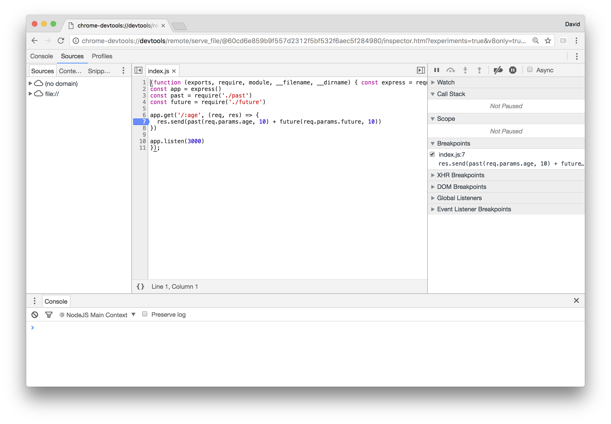

Now let's open a new tab, and navigate to `http://localhost:3000/31`


This will cause the breakpoint to trigger, and Devtools will immediately
grab focus. 

The next thing we see should look like the following:

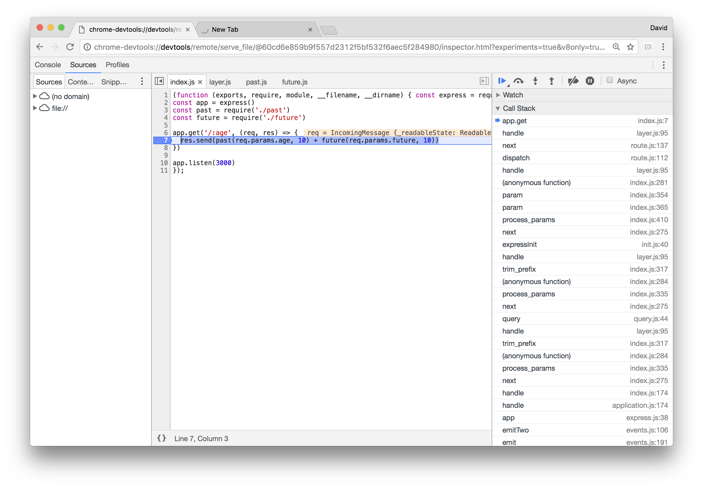

We can see line 7 is now highlighted, and there's a sort of tooltip 
showing us the values of of the `req` and `res` objects on the line above. 

Over in the right column the Call Stack panel is full of Call Frames 
(the functions in the stack), and there's now a blue play button in 
the control icons at the top of the right column. If we we're to scroll
the right column, we'd also see the Scope pane is populated with references.

The debugger is waiting for us to allow execution to proceed, and we can chose
whether to step over, in or out of the next instruction.

Let's try stepping in, this is the down arrow pointing to a dot, 
third icon from the left in the controls section:


When we press this, we step into the `past` function, which is in the
`past.js` file, so Devtools will open a new tab in the above center code panel,
and highlight the line which is about to execute (in our case, line 2).


So let's step out of the `past` function, by pressing the arrow pointing up
and away from a dot, next to the step in icon:


The second line of the output seems to have the issue, which is our `future`
function. 

Now that we've stepped out, we can see that the call to `future`
is highlighted in a darker shade of blue:


Then we'll press the step in icon again, which will take us into the
`future` function in the `future.js` file:


Okay, this is the function that generates that particular sentence
with the `NaN` in it. A `NaN` can be generated for all sort of reasons,
dividing zero by itself, substracting `Infinity` from `Infinity`
trying coerce a string to a number when the string does not hold a valid number, 
to name a few. At any rate, it's probably something to do with the values
in our `future` function.

Let's hover over the `gap` variable, we should see:


Seems fine, now let's hover over the `age` variable: 

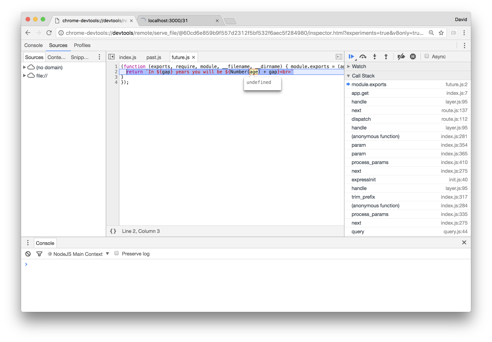

Wait why does that say `undefined`, we vicariously passed `31`
by navigating to the `http://localhost:3000/31`.

To be sure our eyes aren't deceiving us, we can double check by
collapsing the Call Stack column (by clicking the small downwards
arrow next to the C of Call Stack). We should see:

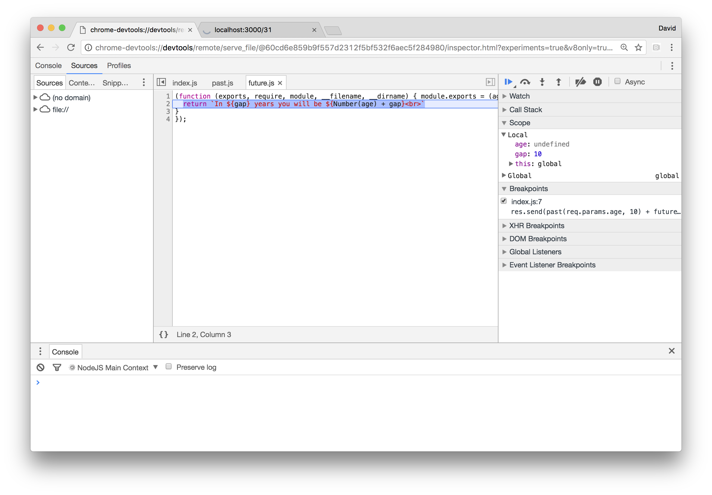

Well `Number(undefined)` is `NaN`, and `NaN + 10` is also `NaN`.

Why is `age` set to `undefined`? 

Let's open up the Call Stack bar again, and click the second 
row from the top (which says `app.get`). 

We should be back in the `index.js` file again (but still frozen
on line 2 of `future.js`). Like so:


Now let's hover over the value we're passing in to `future`:

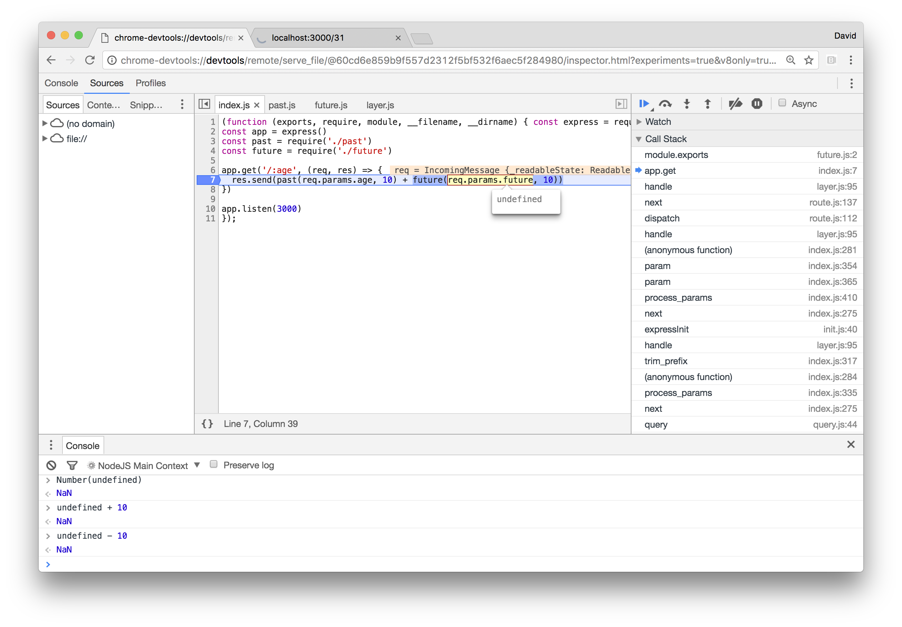

That's `undefined` too, why is it `undefined`?!

Oh. That should be `req.params.age` not `req.params.future`. Oops.

To be absolutely sure, let's fix it while the server is running,
if we hit the blue play button twice we should see something like:

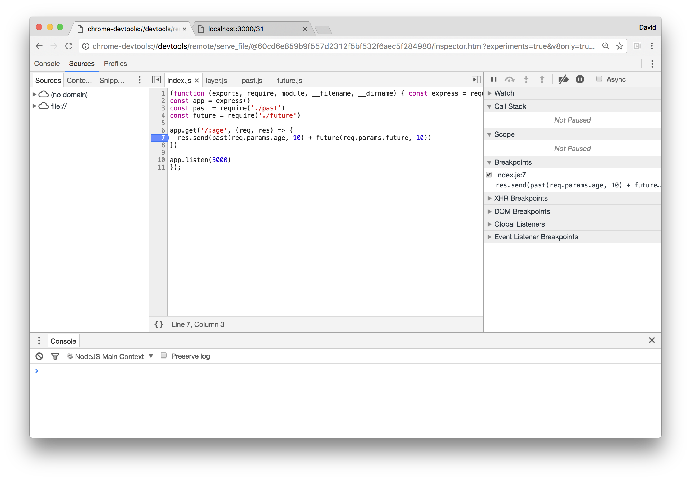

Now let's click line 7 again to remove the breakpoint, we should
be seeing:

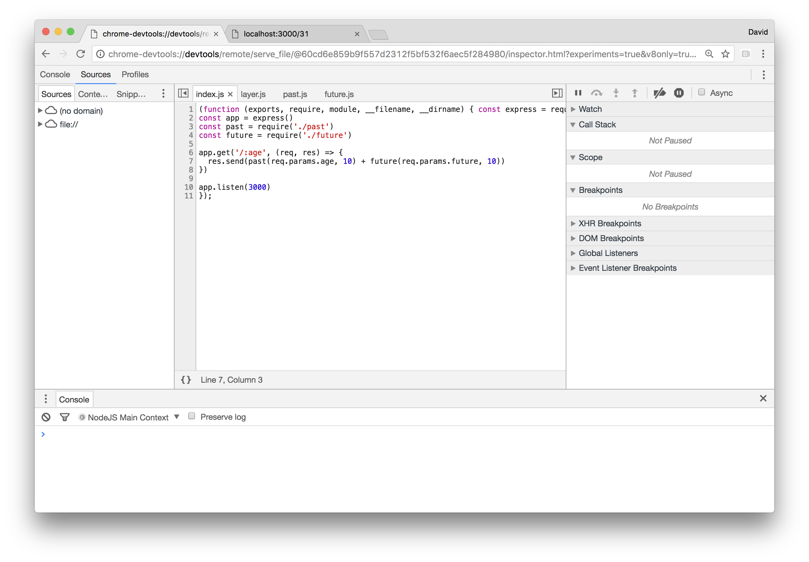

Now if we click immediately after the `e` in `req.params.future` we 
should get a blink cursor, we backspace out the word `future` and
type the word `age`, making our code look like so:


Finally we can live save those changes in our running server
by pressing CMD + s on MacOS or Ctrl + s on Windows and Linux.

The code panel will then change background color, like so:

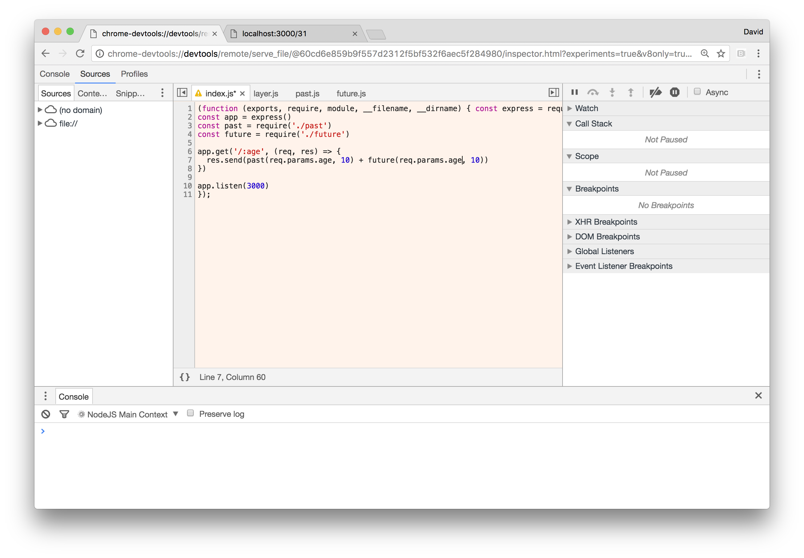

Finally, let's check our route again:


Ok we've definitely found the problem, and verified a solution.

### How it works

We don't really need to know how debugging Node with devtools
is made possible in order to avail of the tool, however,
for the curious here's a high level overview.

Debugging ability is ultimately provided by v8, the
JavaScript engine used by Node. When we run `node` with 
the `--inspect` flag the v8 inspector opens a port,
that accepts WebSocket connections. Once a connection is 
established commands in the form of JSON packets 
are sent back and forth between the inspector and a client.

The `chrome-devtools://` URI is a special protocol recognized
by the chrome browser that loads the Devtools UI (which is
written in HTML, CSS and JavaScript, so can be loaded directly
into a normal browser tab). The Devtools UI is loaded in a special
mode (remote mode), where a WebSocket endpoint is supplied via the URL.

The WebSocket connection allows for bi-directional communication
between the inspector and the client. The tiny Inspector WebSocket
server is written entirely in C and runs on a separate thread
so that when the process is paused, the inspector can continue to 
receive and send commands.

In order to achieve the level of control we're afforded in debug mode
(ability to pause, step, inspect state, view callstack, live edit) 
v8 operations are instrumented throughout with Inspector C++ functions 
that can control the flow, and change state in place.

For instance, if we've set a breakpoint, once that line is encountered
a condition will match in the C++ level that triggers a 
function which pauses the event loop (the JavaScript thread). 
The Inspector then sends a message to the client over the WebSocket 
connection telling it that the process is paused on a particular line 
and the client updates its state. Like wise, if the user chooses to 
"step into" a function, this command is sent to the Inspector, which 
can briefly unpause and repause the event loop in the appropriate place, 
then sends a message back with the new position and state.   

### There's more

Let's find out how to debug older versions of Node, 
make a process start with a paused runtime and learn to use the 
builtin command line debugging interface.

#### Using `node-inspector` with Older Node Versions

The `--inspect` flag and protocol were introduced in Node 6.3.0, 
primarily because the v8 engine had changed the debugging 
protocol. In Node 6.2.0 and down, there's a legacy debugging protocol
enabled with the `--debug` flag but this isn't compatible with the 
native Chrome Devtools UI. 

Instead we can use the `node-inspector` tool, as a client for the
legacy protocol.

The `node-inspector` tool essentially wraps an older version of
Devtools that interfaces with the legacy debug API, and then hosts it locally. 

Let's install `node-inspector`:

```sh
$ npm i -g node-inspector
```

This will add a global executable called `node-debug` which we can
use as shorthand to start out process in debug mode. 

If we run our process like so

```sh
$ node-debug index.js
```

We should see output something like the following:

```sh
Node Inspector v0.12.10
Visit http://127.0.0.1:8080/?port=5858 to start debugging.
Debugging `index.js`

Debugger listening on [::]:5858
```

When we load the url http://127.0.0.1:8080/?port=5858 in our 
browser we'll again see the familiar Devtools interface. 

By default, the `node-debug` command start our process 
in a paused state, after pressing run (the blue play button), 
we should now be able to follow the main recipe in it's entirety using
a legacy version of Node.  

#### Immediately pausing a process on start

In many cases we want to debug a process from initialization,
or we may want to set up breakpoints before anything can happens.

From Node 8 onwards we use the following to start Node in an 
immediately paused state: 

```sh
$ node --inspect-brk index.js
```

In Node 6 (at time of writing 6.10.0), `--inspect` is supported 
but `--inspect-brk` isn't. Instead we can use the legacy `--debug-brk`
flag in conjunction with `--inspect` like so:

```sh
$ node --debug-brk --inspect index.js
```

In Node v4 and lower, we'd simply use `--debug-brk` instead of `--debug`
(in conjunction with another client, see **Using Node Inspector with Older Node Versions**)


#### node debug

There may be rare occasions when don't have easy access to a GUI, 
in these scenarios command line abilities become paramount.

Let's take a look at Nodes built in command line debugging interface.

Let's run our app from the main recipe like so:

```sh
$ node debug index.js
```

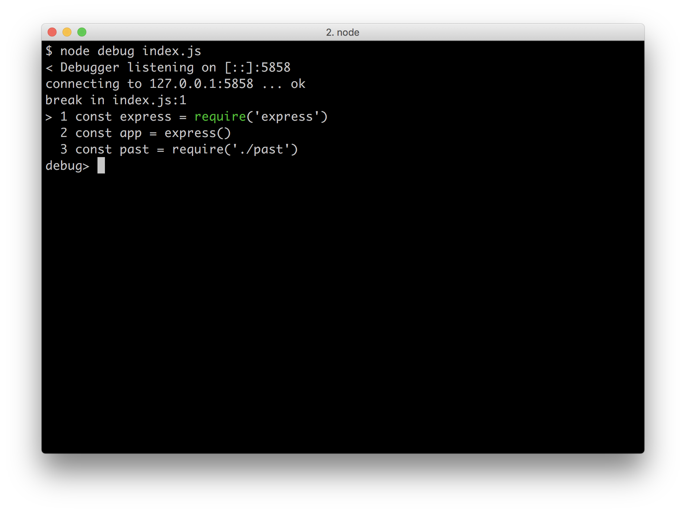

When we enter debug mode, we see the first three lines of our entry
point (`index.js`). 

Upon entering debug mode, the process is paused on the first line
of the entry point. By default, when a breakpoint occurs
the debugger shows 2 lines before and after the current line of code, 
since this is the first line we only see two lines after.

The debug mode provides several commands in the form of functions,
or sometimes as magic getter/setters (we can view these commands 
by typing `help` and hitting enter)

Let's get a little context using the `list` function, 

```sh
debug> list(10)
```


This provides 10 lines after our current line (again it would also include
10 lines before, but we're on the first line so there's no prior lines to show).

We're interested in the 7th line, because this is the code that's executed
when the server receives a request. 

We can use the `sb` function (which
stands for Set Breakpoint), to set a break point on line 7, like so: 

```sh
debug> sb(7)
```

Now if we use `list(10)` again, we should see an asterisk (`*`)
adjacent to line 7.  

```sh
debug> list(10)
```

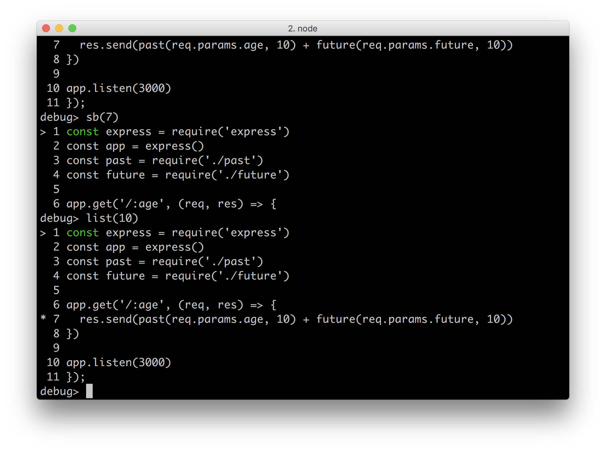

Since our app began in paused mode, we need to tell the process
to begin running as normal so we can send a request to it. 

We use the `c` command to tell the process to continue, like so:

```sh
debug> c
```

Now let's make a request to our server, we could use a browser to do this,
or if we have `curl` on our system, in another terminal we could
run the following:

```sh
$ curl http://localhost:3000/31
```

This will cause the process to hit our breakpoint and the debugger console
should print out "break in index.js:7" along with the line our code is 
currently paused on, with 2 lines of context before and after. We can see
a right caret (`>`) indicating the current line.  


Now let's step in to the first function, to step in we use
the `step` command:

```sh
debug> step
```


This enters our `past.js` file, with the current break on line 2.

We can print out references in the current debug scope using the
`exec` command, let's print out the values of the `gap` and `age`
arguments: 

```sh
debug> exec gap
```

```sh
debug> exec age
```

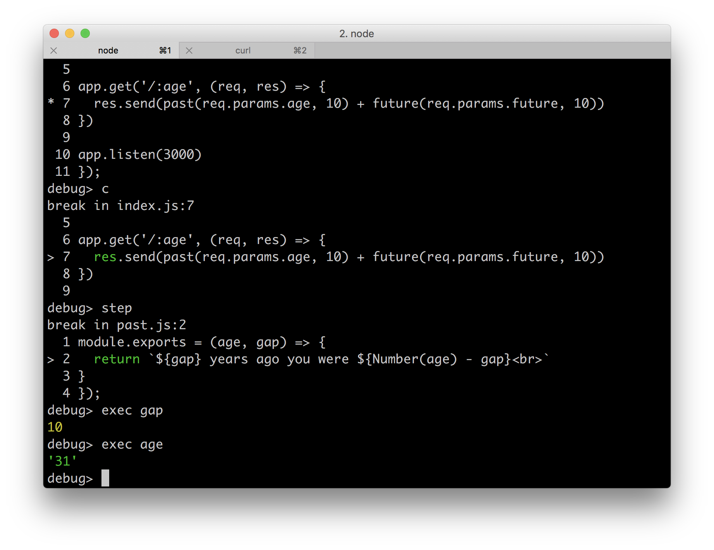

Everything seems to be in order here. 

Now let's step back out of the `past` function, we use the `out`
command to do this, like so: 

```sh
debug> out
```
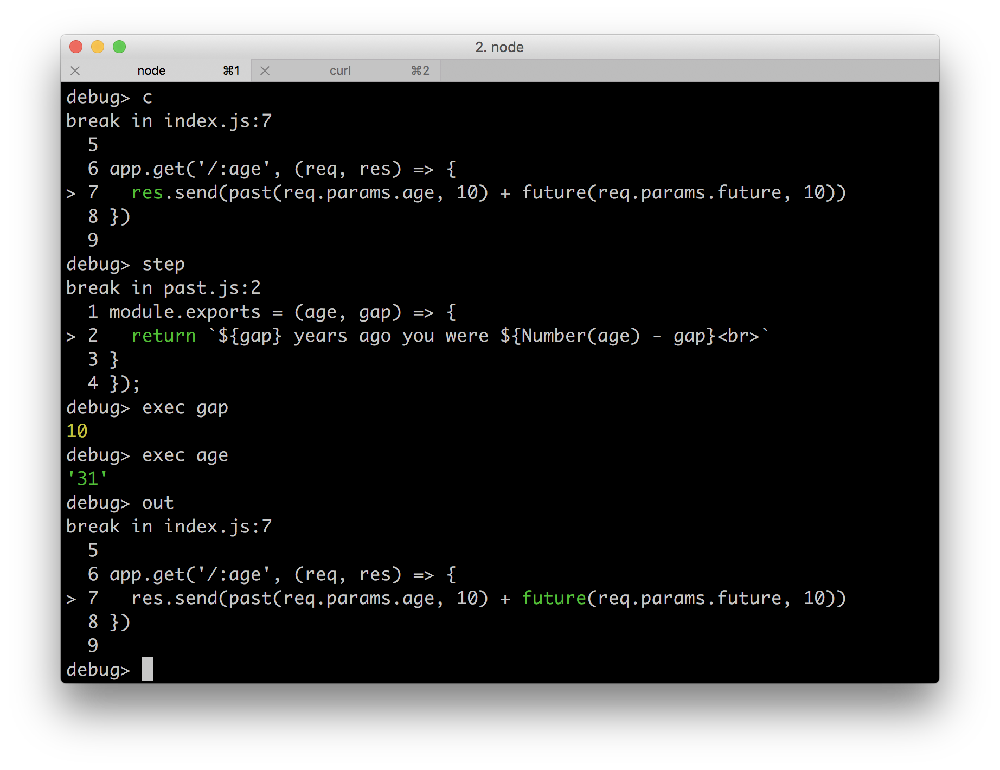

We should now see that the `future` function is a different color, 
indicating that this is the next function to be called. Let's 
step into the `future` function.

```sh
debug> step
```


Now we're in out `future.js` file, again we can print out the `gap`
and `age` arguments using `exec`: 

```sh
debug> exec gap
```

```sh
debug> exec age
```


Aha, we can see that `age` is `undefined`, let's step back up into the
router function using the `out` command:

```sh
debug> out
```

Let's inspect `req.params.future` and `req.params`:

```sh
debug> req.params.future
```

```sh
debug> req.params
```


It's now (again) obvious where the mistake lies, there is no
`req.params.future`, that input should be `req.params.age`.

### See also


## Enhancing Stack Trace Output

[cute stack]

### Getting Ready

### How to do it

### How it works

### There's more

#### Increasing Stacksize

#### Asynchronous Stack Traces

#### Error.prepareStackTrace

### See also

## Enabling Debug Logs

More 13450 modules directly depend on the third party `debug` module
(at time of writing). Many other modules indirectly use the `debug` module
by there use of those 13450. Some highly notable libraries, like
Express, Koa and Socket.io also use the `debug` module. 

In many code bases there's a wealth of often uptapped 
tracing and debugging logs that we can use to infer and understand how
our application is behaving. 

In this recipe we'll discover how to enable and effectively 
analyse these log messages

### Getting Ready

Let's create a small Express app which we'll be debugging.

On the command line we execute the following commands: 

```sh
$ mkdir app
$ cd app
$ npm init -y
$ npm install --save express
$ touch index.js
``` 

Our `index.js` file should contain the following:

```js
const express = require('express')
const app = express()
const stylus = require('stylus')

app.get('/some.css', (req, res) => {
  const css = stylus(`
    body
      color:black
  `).render()
  res.send(css)
})

app.listen(3000)
```

> #### Web Frameworks 
> We're only using express here as an example,
> to learn more about Express and other Frameworks
> see **Chapter 7 Working With Web Frameworks** 

### How to do it

Let's turn on all debug logging:

```sh
DEBUG=* node index.js
```

As soon as we start the server, we see some debug
output that should be something like the following image.


The first message is 

```sh
  express:application set "x-powered-by" to true +0ms
```

Let's make a mental note to add `app.disable('x-powered-by')`
since it's much better for security to not publicly announce
the software a server is using.

> #### Security 
> For more on Security and server hardening
> see **Chapter 8 Dealing with Security**

This debug log line has helped us to understand how our chosen framework 
actually behaves, and allows us to mitigate any undesired behavior 
in an informed manner.

Now let's make a request to the server, if we have 
`curl` installed we can do:

```sh
$ curl http://localhost:3000/some.css
```

(Or otherwise we can simply use a browser to access the same route).

This results in more debug output, mostly a very large amount of `stylus`
debug logs.

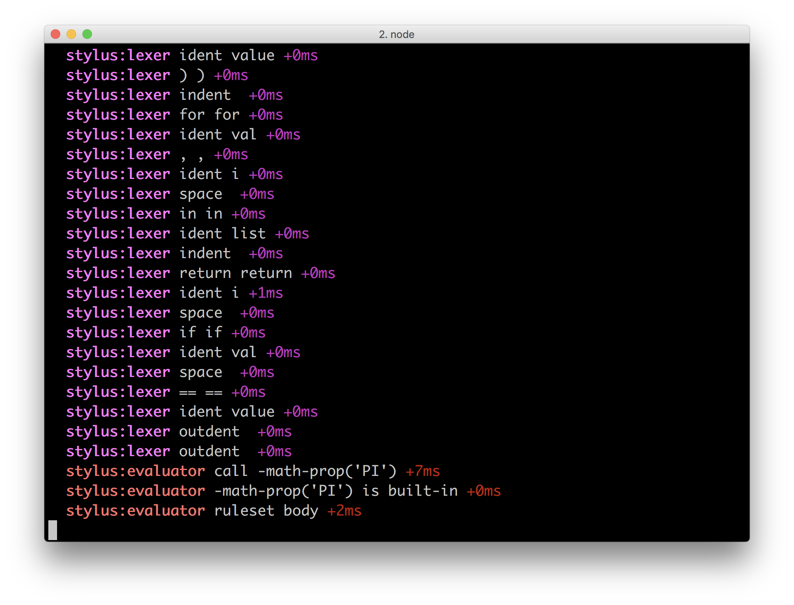

While it's interesting to see the Stylus parser at work, it's a 
little overwhelming, so let's try just looking at `express` logs:

```sh
$ DEBUG=express:* node index.js
```

And we'll make a request again (we can use `curl` or a browser as appropriate):

```sh
$ curl http://localhost:3000/some.css
```

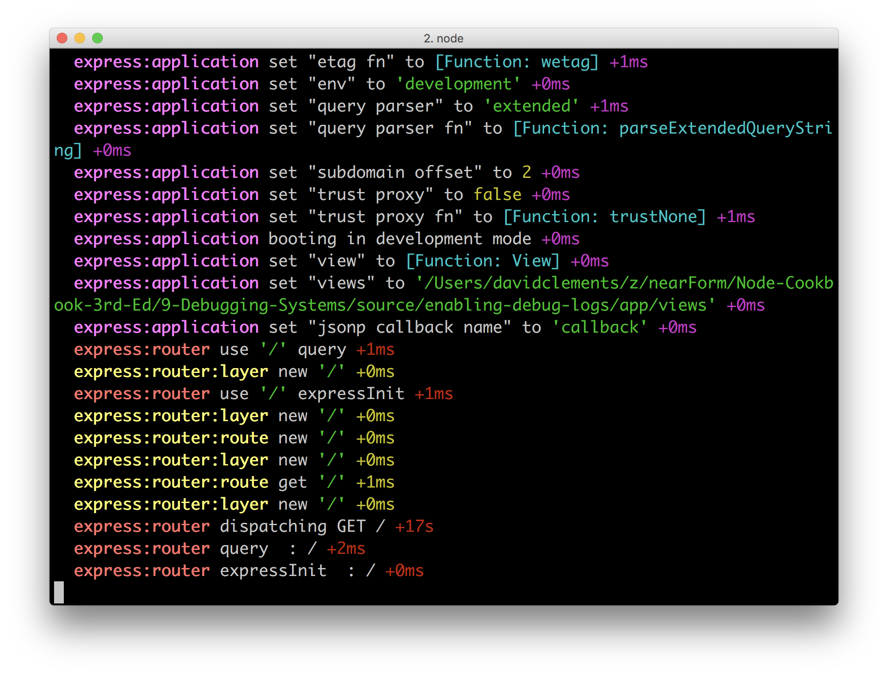

This time our log filtering enabled us to easily see the debug 
messages for an incoming request.


### How it works

In our recipe, we initially set `DEBUG` to `*`, which means enable
all logs. Then we wanted to zoom in explicitly on express related
log messages. So we set `DEBUG` to `express:*`, which means enable
all logs that begin with the characters `express:`. By convention,
modules and frameworks delimit sub-namespaces with the `:` colon.   

At an internal level, the `debug` module reads from the `process.env.DEBUG`,
splits the string by whitespace or commas, and then converts each 
item into a regular expression.

When a module uses the `debug` module, if will require `debug`
and call it with a namespace representing that module to 
create a logging function that it then uses to output messages
when debug logs are enabled for that module. 

> #### Using the `debug` module 
> For more on using `debug` module in our own code
> see **Instrumenting code with `debug`** in the *There's More* section

Each time a module registers itself with the `debug` module 
the list of regular expressions (as generated from the `DEBUG`
environment variable) are tested against the namespace 
provided by the registering module. 

If there's no match the resulting logger function is a no-op
(that is, an empty function). So the cost of the debug logs in
production is minimal. 

If there is a match, the returned logging function will accept input,
decorate it with ANSI codes (for terminal coloring), and create a time
stamp on each call to the logger.

> #### A development tool 
> The `debug` module is primarily a development tool,
> it's output is not really suited to production log messages
> and performance could be better. However,
> see **Converting debug logs into high-performance production logs**
> in the *There's More* section to learn how to avail of the 
> in depth and highly useful information that percolates through
> the `debug` module in a production situation.

### There's more

#### Instrumenting code with `debug`

#### Converting debug logs into high-performance production logs


### See also

* TBD

## Enabling Core Debug Logs

It can be highly useful to understand what's going on in Node's 
core, there's a very easy way to get this information.

In this recipe we're going to use a special environment variable
to enable various debugging flags that cause Node Core debug logging 
mechanisms to print to STDOUT. 

### Getting Ready

We're going to debug a small web server, 
so let's create that real quick.

On the command line we execute the following commands: 

```sh
$ mkdir app
$ cd app
$ npm init -y
$ npm install --save express
$ touch index.js
``` 

Our `index.js` file should contain the following:

```js
const express = require('express')
const app = express()

app.get('/', (req, res) => res.send('hey'))

setTimeout(function myTimeout() { 
   console.log('I waited for you.')
}, 100)

app.listen(3000)
```

> #### Web Frameworks 
> We're only using express here as an example,
> to learn more about Express and other Frameworks
> see **Chapter 7 Working With Web Frameworks** 

### How to do it

We simply have to set the `NODE_DEBUG` environment
variable to one or more of the supported flags.

Let's start with the `timer` flag by running our app like so:

```sh
$ NODE_DEBUG=timer node index.js
```

This should show something like the following figure:


*Core timer debug output*

Let's try running the process again with both `timer` and `http`
flags enabled: 

```sh
$ NODE_DEBUG=timer,http node index.js
```

Now we need to trigger some HTTP operations to get any meaningful 
output, so let's send a request to the HTTP server using `curl`
(our an alternative favoured method, such as navigating 
to `http://localhost:3000` in the browser).

```sh
$ curl http://localhost:3000
```

This should give output similar to the following image:


*Core timer and http debug output*

### How it works

The `NODE_DEBUG` environment variable can be set to any 
combination of the following flags:

* `http`
* `net`
* `tls`
* `stream`
* `module`
* `timer`
* `cluster`
* `child_process` 
* `fs`

> #### The `fs` debug flag
> The quality of output varies for each flag. At time of writing, the `fs` flag 
> in particular doesn't actually supply any debug log output,
> but when enabled will cause a useful stack trace to be added to any unhandled 
> error events for asynchronous I/O calls. 
> See <https://github.com/nodejs/node/blob/cccc6d8545c0ebd83f934b9734f5605aaeb000f2/lib/fs.js#L76-L94> for context. 

In our recipe we were able to enable core timer and HTTP debug 
logs, by setting the `NODE_DEBUG` environment variable to `timers`
in the first instance and then `timers,http` in the second. 

We use a comma to delimit the debug flags, however the delimiter
can be any character. 

Each line of output consists of the namespace, the process ID (PID), 
and the log message.

When we set `NODE_DEBUG` to `timer`, the first log message 
indicates that it's creating a list for `100`. Our code passes
`100` as the second argument passed to `setTimeout`, internally
the first argument (the timeout callback) is added to a queue of
callbacks that should run after `100` millisecond. Next we see
a message "timeout callback 100" which means every 100ms timeout
callback will now be called. The following message (the "now" message) \
indicates the current "time" as the internal  `timers` module sees it, 
this is milliseconds since the `timers` module was initialized.
The "now" message can be useful to see the time drift between 
timeouts and intervals, because a timeout of 10ms will rarely (if ever)
be exactly 10 ms. More like 14ms, because of 4ms of execution time for
other code in a given tick (time around the event loop). While 4ms 
drift is acceptable, a 20ms drift would indicate potential
performance problems - a simple `NODE_DEBUG=timer` prefix could be used
for a quick check. The final debug message shows that the `100` list
is now empty, meaning all callback functions set for that particular interval 
have now been called. 

Most of the HTTP output is self explanatory, we can see when 
a new connection has been made to the server, when a message has
ended and when a socket has closed. The remaining two cryptic messages
are `write ret = true` and `SERVER socketOnParserExecute 78`. 
The `write ret = true` relates to when the server attempted to write 
to a socket, if the value was false it would mean the socket had closed
and the (again internally) the server would begin to handle that scenario.
As for the `socketOnParserExecute` message, this has to do with Nodes internal
HTTP parser (written in C), the number (78) is the string length of the headers
sent from the client to the server.

Combining multiple flags can be useful, we set `NODE_DEBUG` to `timer,http`
we were able to how the `http` module interacts with the internal `timer`
module. We can see after a the "SERVER new http connection" message, 
that two timers are set (based on the timeout lists being created),
one for 120000 milliseconds (two minutes, the default socket timeout) 
and one (in the example case) for 819 milliseconds. 

This second interval (819) is to do with an internal caching mechanism 
for the HTTP `Date` header. Since the smallest unit in the `Date` header
is seconds, a timeout is set for the amount of milliseconds left before
the next second and the `Date` header is provided the same string for
the remainder of that second.

> #### Core Mechanics 
> For a deeper understanding of our discussion here, see the
> There's More section where we use debugging tools to step
> through code in Node core to show how to fully pick apart
> the log messages in this recipe.


### There's more

Let's look at the way Node Core triggers the debug log messages,
and see if we can use this knowledge to gain greater understanding
of Node's internal workings.

#### Creating our own NODE_DEBUG flags

Core modules tend to use the `util` modules `debuglog` method to 
generate a logging function that defaults to a no-op (an empty
function) but writes log messages to STDOUT when the relevant
flag appears in the `NODE_DEBUG` environment variable.

We can use `util.debuglog` to create our own core like log messages.

Let's take our `app` folder we created in the main recipe and
copy it to `instrumented-app`,

```sh
$ cp -fr app instrumented-app
```

Now let's make `index.js` look like so:

```js
const util = require('util')
const express = require('express')
const debug = util.debuglog('my-app')
const app = express()

app.get('/', (req, res) => {
  debug('incoming request on /', req.route)
  res.send('hey')
})

setTimeout(function myTimeout() { 
   debug('timeout complete')
   console.log('I waited for you.')
}, 100)

app.listen(3000)
```

Now we can turn on our custom debug logs like so:

```sh
$  NODE_DEBUG=my-app node index.js
```

If we make a request to http://localhost:3000 the output of our process 
should like something like this:

```
MY-APP 30843: timeout complete
I waited for you.
MY-APP 30843: incoming request on / Route {
  path: '/',
  stack:
   [ Layer {
       handle: [Function],
       name: '<anonymous>',
       params: undefined,
       path: undefined,
       keys: [],
       regexp: /^\/?$/i,
       method: 'get' } ],
  methods: { get: true } }
```

> #### Prefer the `debug` module  
> In many cases, using the third party `debug` module
> instead of `util.debuglog` is preferable. The `debug`
> modules supports wildcards, and the output is 
> time stamped and color coded, while the production cost of 
> using it is negligible.
> See the **Enabling Debug Logs** recipe in this chapter for more.

#### Debugging Node Core Libraries

The core libraries that come bundled with the Node binary
are written in JavaScript. Which means we can debug them 
the same way we debug our own code. This level of introspection
means we can understand internal mechanics to a fine level of 
detail.

Let's use the Devtools to pick apart how `util.debuglog` works.

> #### Devtools 
> To understand how to use Devtools, see the first recipe
> in this chapter **Debugging Node with Chrome Devtools** 

We'll run our code we prepared in the **Getting Ready** section
like so (Node 8+):

```sh
$ NODE_DEBUG=timer node --inspect-brk index.js
```

Or if we're using Node 6.3.0+

```sh
$ NODE_DEBUG=timer node --debug-brk --inspect index.js
```

Next we copy and paste the `chrome-devtools://` URI
into Chrome, and we should see something like the following:

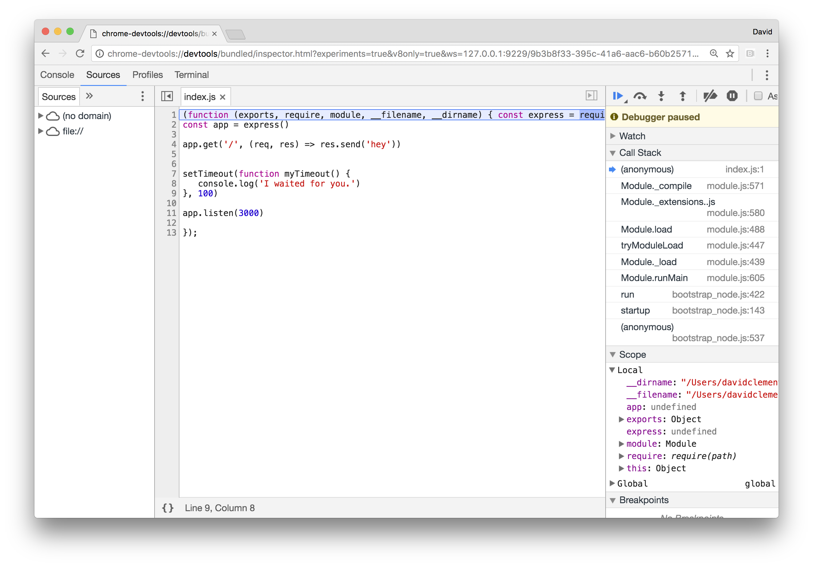

Now in left hand pane (the Navigation pane), we should see 
two drop down tree, `(no domain)` and `file://`. The `(no domain)`
files are files that came compiled into Node. 

Let's click the small right facing triangle next to `(no domain)`,
to expand the list. Then locate the `util.js` file and double click
to open. At this point we should see something like the following:

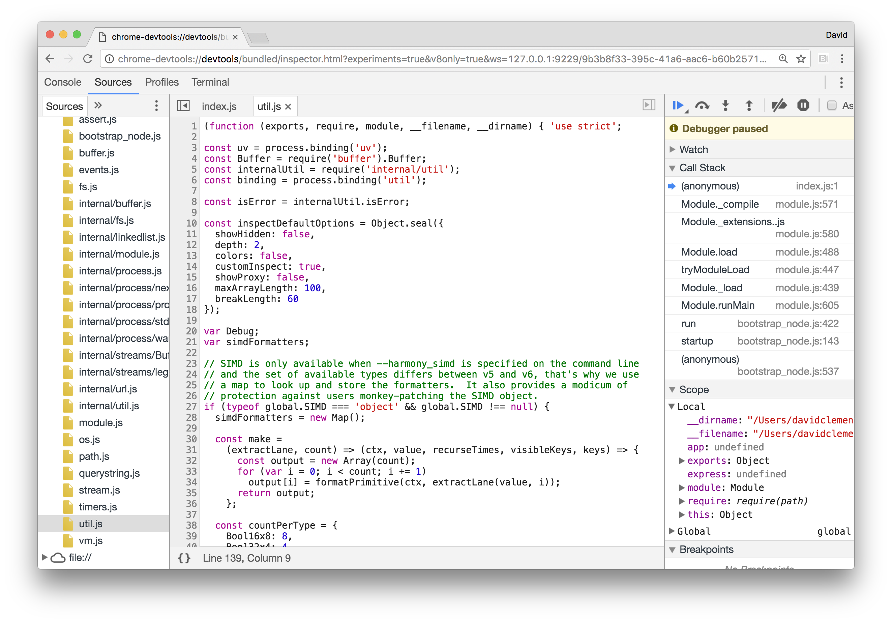

Next we want to find the `debuglog` function, an easy way to do this
is to press Cmd+F on macOs or Ctrl+F on Linux and Windows, to bring
up the small find dialog, then type "debuglog", this should highlight
the exported `debuglog` method.


If we read the exported function, we should be able to ascertain
that given the right conditions (e.g. if the flag is set on `NODE_DEBUG`),
a function is created and associated to a namespace. Different Node versions
could have differences in their `util.js`, in our case the first line
of this generated function is line 147, so we set a breakpoint on line 
147 (or wherever the first line of the generated function may be).

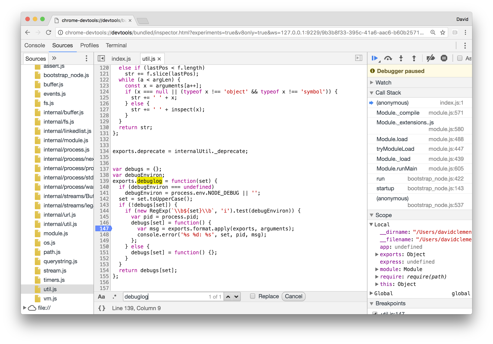

Now if we press run, our breakpoint should be triggered almost
immediately. Let's hover over the `arguments` object referenced
in the generated function 


We should see that the second argument passed to the
generated debug function is `100` this relates to the millisecond
parameter we pass to `setTimeout` in our `index.js` and is part of
the first debug message ("no 100 list was found..."). 

Now let's hit the play button three more times, until the blue
play button no longer shows (and there's a pause button) in it's place
and there's a "error" count in the top right corner of 4, as 
demonstrated in the following:

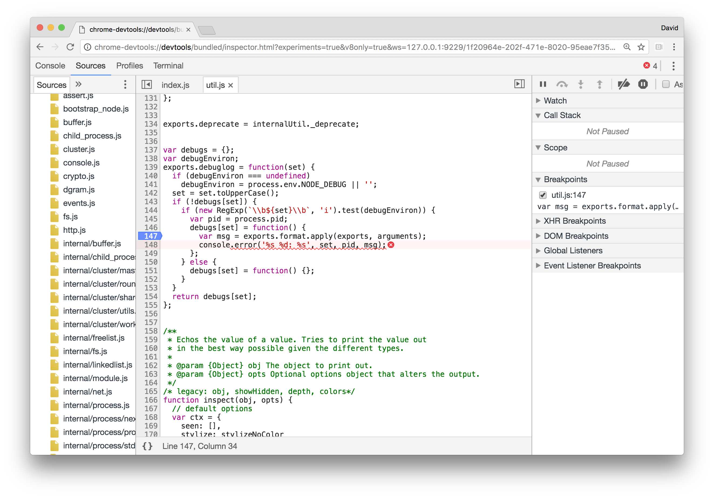

Devtools perceives each log errors because the debug messages 
are written to STDERR, this is why the error count in the top right
corner is 4.

Now let's open a new browser tab and navigate to http://localhost:3000.

Devtools should have paused again at our breakpoint, if we hover over
the `arguments` object in the generated function we should see that
the second argument is `12000`, this relates to the default 2 minute 
timeout on sockets (as discussed in the main recipe).


If we hit the play button again, and inspect the `arguments` object
we should see the second argument is a number that's less than 1000.


Over on the right hand side, in the Call Stack there's a frame called
`utcDate`, let's select that frame to view the function.

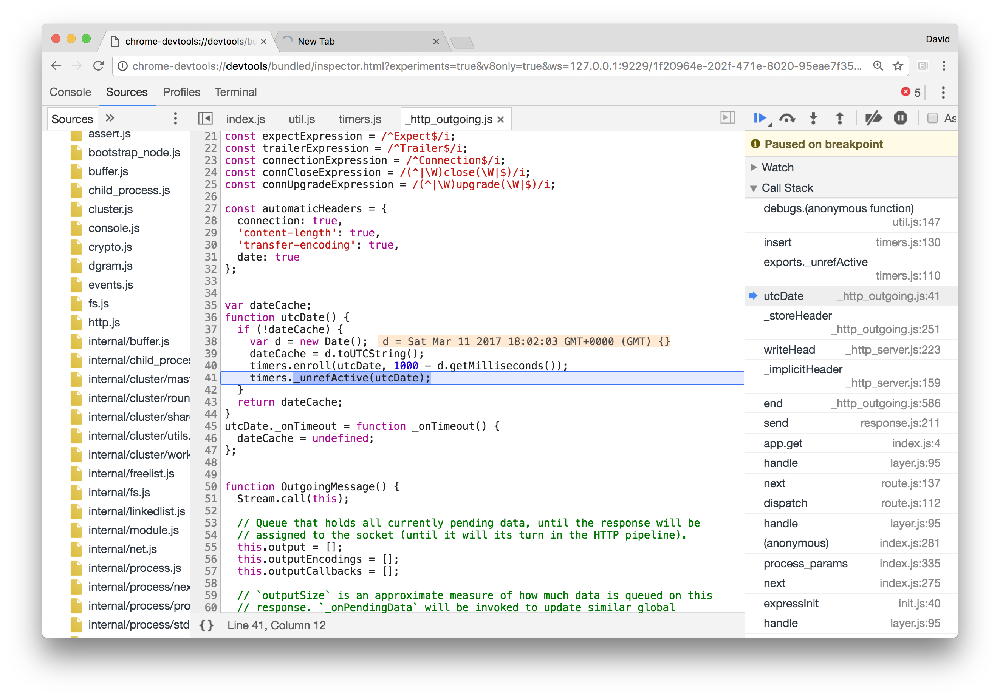

This function is in a library that's only for internal core use
called `_http_outgoing.js`. 

We can see that it's currently within the an `if` block that 
checks whether `dateCache` is falsey. If `dateCache` is falsey,
it creates a new date, and assigns the output of `toUTCString`
to `dateCache`. Then it uses `timers.enroll`,
this is a way of creating a `setTimeout`, where the provided object
represents the timeout reference. It sets the time to `1000` minus
the millisecond unit in the date object which effectively measures
how long there's is left of the current second. Then it calls
`timers._unrefActive` which activates the timer without allowing
the timer to keep the event loop open. The `utcDate._onTimeout` method
sets `dateCache` to `undefined`, so at the end of the timeout, 
`dateCache` is cleared. 

If we look down the Call Stack, we should be able to infer that the `utcDate` function is called when a request
is made, and is to do with HTTP header generation (specifically the `Date`
HTTP header). 

The net effect is that a process may receive, say, 10000 requests in a second,
and only the first of those 10000 has to perform the relatively expensive
Date generation, while the following 9999 requests all use the cached date.

And that's the sort of things we can learn by debugging core.

### See also

* TBD


## Tracing Asynchronous Operations

### Getting Ready

### How to do it

### How it works

### There's more

### See also


## Postmortem Debugging

### Getting Ready

### How to do it

### How it works

### There's more

### See also